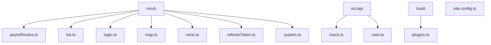
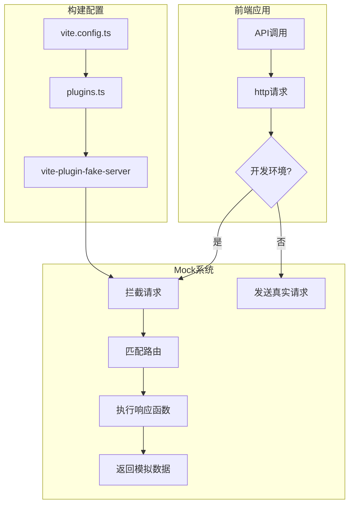
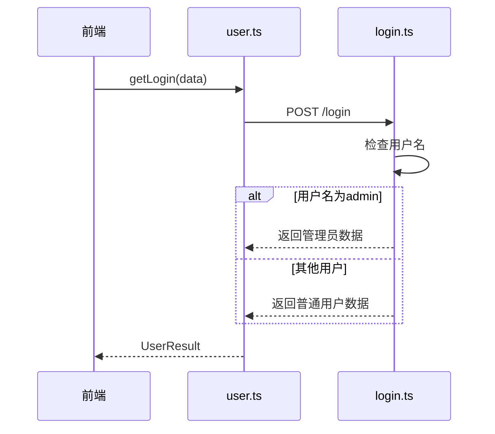
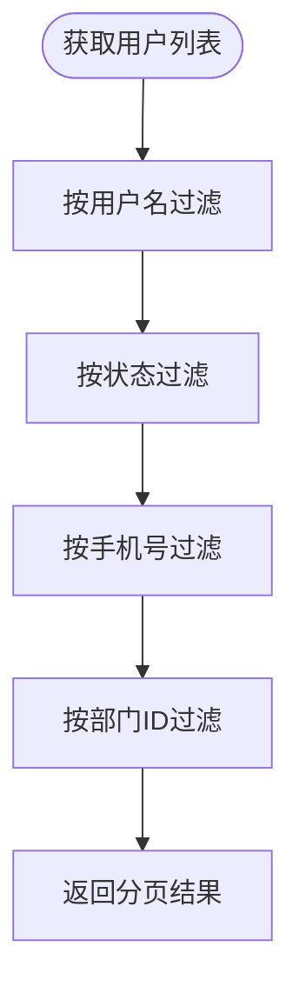
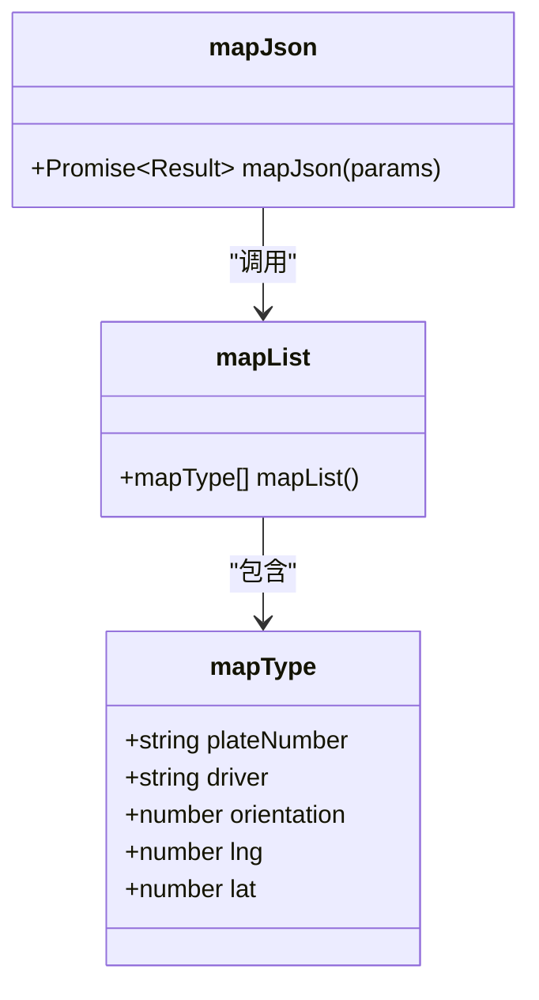

# Mock系统

<cite>
**本文档引用文件**  
- [asyncRoutes.ts](file://web/mock/asyncRoutes.ts)
- [list.ts](file://web/mock/list.ts)
- [login.ts](file://web/mock/login.ts)
- [map.ts](file://web/mock/map.ts)
- [mine.ts](file://web/mock/mine.ts)
- [refreshToken.ts](file://web/mock/refreshToken.ts)
- [system.ts](file://web/mock/system.ts)
- [mock.ts](file://web/src/api/mock.ts)
- [user.ts](file://web/src/api/user.ts)
- [plugins.ts](file://web/build/plugins.ts)
- [vite.config.ts](file://web/vite.config.ts)
</cite>

## 目录
1. [简介](#简介)
2. [项目结构](#项目结构)
3. [核心组件](#核心组件)
4. [架构概述](#架构概述)
5. [详细组件分析](#详细组件分析)
6. [依赖分析](#依赖分析)
7. [性能考虑](#性能考虑)
8. [故障排除指南](#故障排除指南)
9. [结论](#结论)

## 简介
本项目通过`mock`目录下的文件实现API模拟，支持前端独立开发。系统基于`vite-plugin-fake-server`插件，将本地定义的模拟数据映射到指定API路由，使前端在无需后端服务的情况下进行完整功能开发和测试。该机制允许开发者添加新的模拟接口和数据，通过配置即可启用或禁用模拟系统，为前后端并行开发提供了高效支持。

## 项目结构

**图示来源**  
- [asyncRoutes.ts](file://web/mock/asyncRoutes.ts#L1-L341)
- [list.ts](file://web/mock/list.ts#L1-L456)
- [login.ts](file://web/mock/login.ts#L1-L43)
- [map.ts](file://web/mock/map.ts#L1-L42)
- [mine.ts](file://web/mock/mine.ts#L1-L60)
- [refreshToken.ts](file://web/mock/refreshToken.ts#L1-L28)
- [system.ts](file://web/mock/system.ts#L1-L1800)
- [mock.ts](file://web/src/api/mock.ts#L1-L26)
- [user.ts](file://web/src/api/user.ts#L1-L90)
- [plugins.ts](file://web/build/plugins.ts#L1-L36)
- [vite.config.ts](file://web/vite.config.ts#L1-L63)

**本节来源**  
- [web/mock](file://web/mock)
- [web/src/api](file://web/src/api)

## 核心组件

Mock系统的核心由`vite-plugin-fake-server`插件驱动，通过在`mock`目录下定义模拟路由和响应数据，实现对真实API的拦截和模拟。每个`.ts`文件导出使用`defineFakeRoute`函数定义的路由配置数组，包含URL、HTTP方法和响应生成逻辑。前端API调用通过`src/api`目录下的模块进行封装，这些模块在开发环境中自动指向模拟接口。系统支持基于请求参数的条件性数据过滤和动态响应生成，如用户管理接口根据查询条件返回匹配结果。

**本节来源**  
- [login.ts](file://web/mock/login.ts#L1-L43)
- [system.ts](file://web/mock/system.ts#L1-L1800)
- [mock.ts](file://web/src/api/mock.ts#L1-L26)

## 架构概述

**图示来源**  
- [vite.config.ts](file://web/vite.config.ts#L1-L63)
- [plugins.ts](file://web/build/plugins.ts#L1-L36)
- [login.ts](file://web/mock/login.ts#L1-L43)
- [mock.ts](file://web/src/api/mock.ts#L1-L26)

## 详细组件分析

### 登录接口分析

**图示来源**  
- [user.ts](file://web/src/api/user.ts#L1-L90)
- [login.ts](file://web/mock/login.ts#L1-L43)

### 系统管理接口分析

**图示来源**  
- [system.ts](file://web/mock/system.ts#L1-L1800)

### 地图数据接口分析

**图示来源**  
- [map.ts](file://web/mock/map.ts#L1-L42)
- [mock.ts](file://web/src/api/mock.ts#L1-L26)

**本节来源**  
- [login.ts](file://web/mock/login.ts#L1-L43)
- [system.ts](file://web/mock/system.ts#L1-L1800)
- [map.ts](file://web/mock/map.ts#L1-L42)
- [mock.ts](file://web/src/api/mock.ts#L1-L26)

## 依赖分析

**图示来源**  
- [plugins.ts](file://web/build/plugins.ts#L1-L36)
- [vite.config.ts](file://web/vite.config.ts#L1-L63)
- [mock](file://web/mock)
- [src/api](file://web/src/api)

**本节来源**  
- [plugins.ts](file://web/build/plugins.ts#L1-L36)
- [vite.config.ts](file://web/vite.config.ts#L1-L63)

## 性能考虑
Mock系统在开发环境中运行，不涉及网络延迟，响应速度极快。数据生成使用内存数组和简单过滤操作，时间复杂度为O(n)。对于大数据集（如地图信息生成200条记录），建议在实际开发中根据需要调整数据量以保持开发服务器性能。系统利用Vite的热重载特性，修改mock文件后可立即生效，无需重启开发服务器。

## 故障排除指南

当Mock系统未按预期工作时，请检查以下方面：确认`vite-plugin-fake-server`已正确配置在`plugins.ts`中；验证mock文件的路由URL与API调用的URL完全匹配；检查HTTP方法是否一致；确保开发环境变量正确启用mock功能；查看浏览器开发者工具的网络面板，确认请求是否被拦截；检查mock文件导出格式是否符合`defineFakeRoute`要求。

**本节来源**  
- [plugins.ts](file://web/build/plugins.ts#L1-L36)
- [login.ts](file://web/mock/login.ts#L1-L43)
- [mock.ts](file://web/src/api/mock.ts#L1-L26)

## 结论
该项目的Mock系统通过清晰的文件组织和标准化的接口定义，为前端独立开发提供了强大支持。开发者可以轻松添加新的模拟接口，通过修改或创建`mock`目录下的文件即可实现。系统与Vite构建流程深度集成，启用和管理简便。这种设计促进了前后端并行开发，提高了开发效率，是现代前端工程化实践的优秀范例。