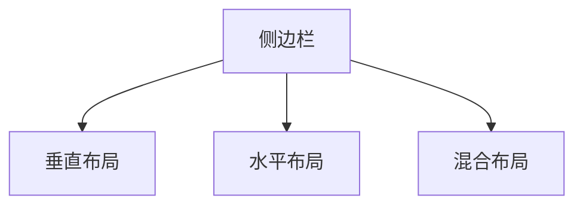
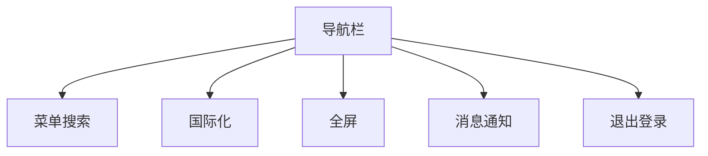
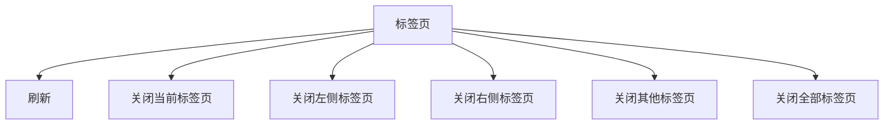
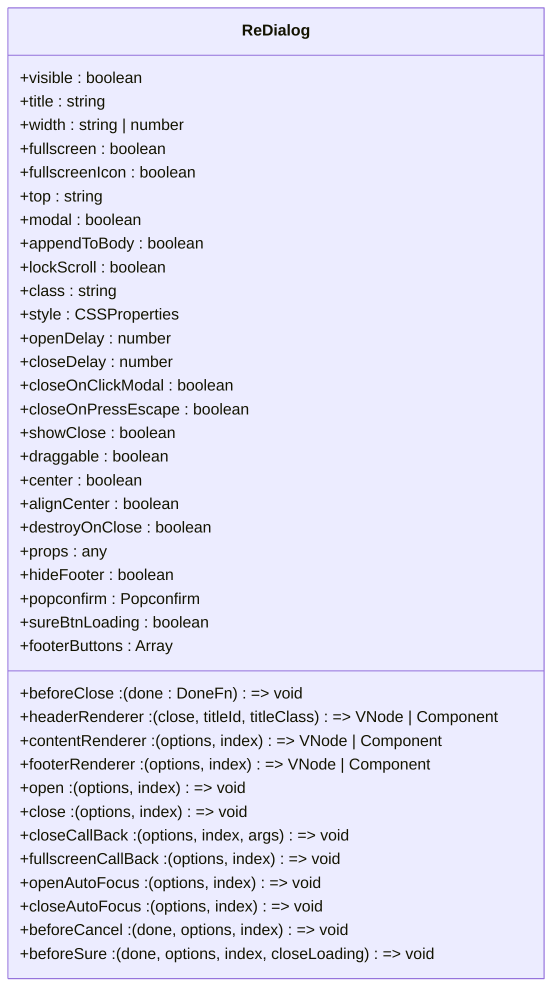
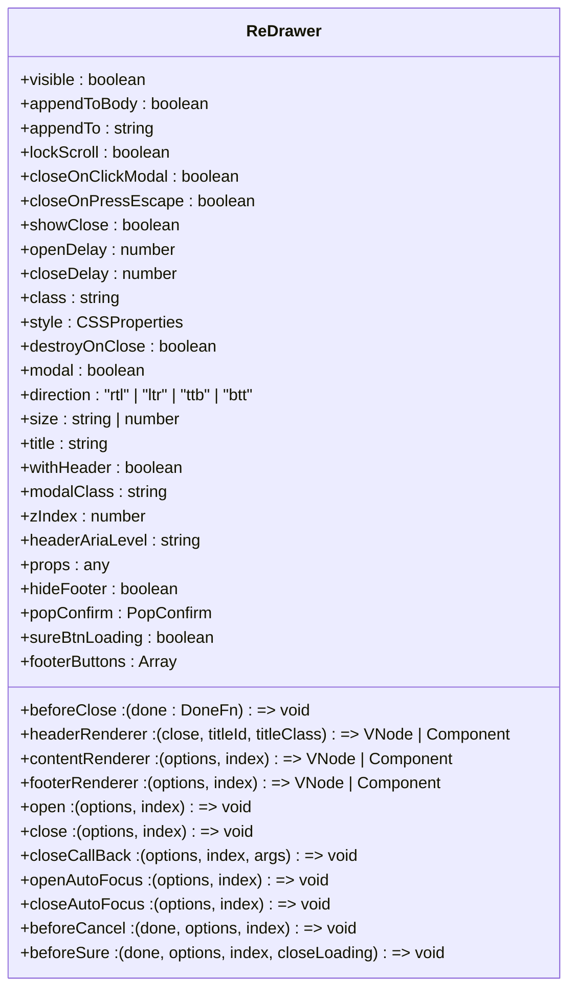

# UI组件

<cite>
**本文档中引用的文件**  
- [ReDialog\index.vue](file://web\src\components\ReDialog\index.vue)
- [ReDialog\type.ts](file://web\src\components\ReDialog\type.ts)
- [ReDrawer\index.vue](file://web\src\components\ReDrawer\index.vue)
- [ReDrawer\type.ts](file://web\src\components\ReDrawer\type.ts)
- [RePureTableBar\src\bar.tsx](file://web\src\components\RePureTableBar\src\bar.tsx)
- [lay-sidebar\NavVertical.vue](file://web\src\layout\components\lay-sidebar\NavVertical.vue)
- [lay-sidebar\NavHorizontal.vue](file://web\src\layout\components\lay-sidebar\NavHorizontal.vue)
- [lay-sidebar\NavMix.vue](file://web\src\layout\components\lay-sidebar\NavMix.vue)
- [lay-sidebar\components\SidebarLogo.vue](file://web\src\layout\components\lay-sidebar\components\SidebarLogo.vue)
- [lay-sidebar\components\SidebarItem.vue](file://web\src\layout\components\lay-sidebar\components\SidebarItem.vue)
- [lay-navbar\index.vue](file://web\src\layout\components\lay-navbar\index.vue)
- [lay-tag\index.vue](file://web\src\layout\components\lay-tag\index.vue)
</cite>

## 目录
1. [简介](#简介)
2. [布局组件](#布局组件)
3. [通用组件](#通用组件)
4. [样式定制与主题集成](#样式定制与主题集成)
5. [使用指南](#使用指南)
6. [附录](#附录)

## 简介
本文档旨在为前端开发者提供一个全面的UI组件使用指南，涵盖项目中所有可复用的界面组件。文档详细描述了布局组件（如侧边栏、导航栏、标签页）的设计和实现，以及通用组件（如对话框、抽屉、表格工具栏）的使用方法。通过引用项目中的实际组件代码，文档解释了组件的props、events、slots等API接口，并提供了实际使用示例，帮助开发者高效地构建用户界面。

## 布局组件

### 侧边栏
侧边栏组件提供了垂直、水平和混合布局模式，支持响应式设计，能够适应不同设备的屏幕尺寸。组件通过`NavVertical.vue`、`NavHorizontal.vue`和`NavMix.vue`实现，分别对应垂直、水平和混合布局。



**Diagram sources**
- [NavVertical.vue](file://web\src\layout\components\lay-sidebar\NavVertical.vue)
- [NavHorizontal.vue](file://web\src\layout\components\lay-sidebar\NavHorizontal.vue)
- [NavMix.vue](file://web\src\layout\components\lay-sidebar\NavMix.vue)

**Section sources**
- [NavVertical.vue](file://web\src\layout\components\lay-sidebar\NavVertical.vue)
- [NavHorizontal.vue](file://web\src\layout\components\lay-sidebar\NavHorizontal.vue)
- [NavMix.vue](file://web\src\layout\components\lay-sidebar\NavMix.vue)

### 导航栏
导航栏组件位于页面顶部，提供全局导航功能，包括菜单搜索、国际化、全屏、消息通知、退出登录等。组件通过`lay-navbar\index.vue`实现，支持响应式设计，能够适应不同设备的屏幕尺寸。



**Diagram sources**
- [index.vue](file://web\src\layout\components\lay-navbar\index.vue)

**Section sources**
- [index.vue](file://web\src\layout\components\lay-navbar\index.vue)

### 标签页
标签页组件用于管理多个页面的切换，支持右键菜单操作，如刷新、关闭当前标签页、关闭左侧标签页、关闭右侧标签页、关闭其他标签页、关闭全部标签页等。组件通过`lay-tag\index.vue`实现，支持响应式设计，能够适应不同设备的屏幕尺寸。



**Diagram sources**
- [index.vue](file://web\src\layout\components\lay-tag\index.vue)

**Section sources**
- [index.vue](file://web\src\layout\components\lay-tag\index.vue)

## 通用组件

### 对话框
对话框组件提供了一个可复用的模态对话框，支持自定义标题、内容、按钮等。组件通过`ReDialog\index.vue`实现，支持响应式设计，能够适应不同设备的屏幕尺寸。



**Diagram sources**
- [index.vue](file://web\src\components\ReDialog\index.vue)
- [type.ts](file://web\src\components\ReDialog\type.ts)

**Section sources**
- [index.vue](file://web\src\components\ReDialog\index.vue)
- [type.ts](file://web\src\components\ReDialog\type.ts)

### 抽屉
抽屉组件提供了一个可复用的侧边抽屉，支持自定义标题、内容、按钮等。组件通过`ReDrawer\index.vue`实现，支持响应式设计，能够适应不同设备的屏幕尺寸。



**Diagram sources**
- [index.vue](file://web\src\components\ReDrawer\index.vue)
- [type.ts](file://web\src\components\ReDrawer\type.ts)

**Section sources**
- [index.vue](file://web\src\components\ReDrawer\index.vue)
- [type.ts](file://web\src\components\ReDrawer\type.ts)

### 表格工具栏
表格工具栏组件提供了一个可复用的表格工具栏，支持自定义标题、刷新、全屏、列设置等。组件通过`RePureTableBar\src\bar.tsx`实现，支持响应式设计，能够适应不同设备的屏幕尺寸。

```mermaid
classDiagram
class PureTableBar {
+title : string
+tableRef : any
+columns : TableColumnList
+isExpandAll : boolean
+tableKey : string | number
+size : "large" | "default" | "small"
+loading : boolean
+checkAll : boolean
+isFullscreen : boolean
+isIndeterminate : boolean
+isExpandAll : boolean
+filterColumns : TableColumnList
+checkColumnList : string[]
+checkedColumns : string[]
+dynamicColumns : TableColumnList
+getDropdownItemStyle : () => (s : string) => { background : string, color : string }
+iconClass : string[]
+topClass : string[]
+onReFresh : () => void
+onExpand : () => void
+onFullscreen : () => void
+toggleRowExpansionAll : (data : any[], isExpansion : boolean) => void
+handleCheckAllChange : (val : boolean) => void
+handleCheckedColumnsChange : (value : string[]) => void
+handleCheckColumnListChange : (val : boolean, label : string) => void
+onReset : () => void
+dropdown : () => VNode
+rowDrop : (event : { preventDefault : () => void }) => void
+isFixedColumn : (label : string) => boolean
+rendTippyProps : (content : string) => { content : string, offset : [number, number], duration : [number, number], followCursor : boolean, hideOnClick : "toggle" }
+reference : () => VNode
}
```

**Diagram sources**
- [bar.tsx](file://web\src\components\RePureTableBar\src\bar.tsx)

**Section sources**
- [bar.tsx](file://web\src\components\RePureTableBar\src\bar.tsx)

## 样式定制与主题集成
项目中的UI组件支持样式定制和主题集成，开发者可以通过修改组件的props、events、slots等API接口来实现自定义样式。此外，项目还提供了主题配置文件，开发者可以通过修改配置文件来实现主题的切换。

## 使用指南
本节提供了一些实际使用示例，帮助开发者更好地理解和使用UI组件。

### 对话框使用示例
```vue
<template>
  <ReDialog
    v-model="dialogVisible"
    title="对话框标题"
    width="50%"
    :fullscreen="false"
    :fullscreenIcon="true"
    :modal="true"
    :appendToBody="false"
    :lockScroll="true"
    :showClose="true"
    :draggable="true"
    :center="false"
    :alignCenter="false"
    :destroyOnClose="false"
    :hideFooter="false"
    :sureBtnLoading="false"
    :headerRenderer="headerRenderer"
    :contentRenderer="contentRenderer"
    :footerRenderer="footerRenderer"
    :footerButtons="footerButtons"
    @open="onOpen"
    @close="onClose"
    @closeCallBack="onCloseCallBack"
    @fullscreenCallBack="onFullscreenCallBack"
    @openAutoFocus="onOpenAutoFocus"
    @closeAutoFocus="onCloseAutoFocus"
    @beforeCancel="onBeforeCancel"
    @beforeSure="onBeforeSure"
  />
</template>

<script setup lang="ts">
import { ref } from 'vue';
import { ReDialog } from '@/components/ReDialog';

const dialogVisible = ref(false);

const headerRenderer = ({ close, titleId, titleClass }) => {
  return <div>{titleId}</div>;
};

const contentRenderer = ({ options, index }) => {
  return <div>对话框内容</div>;
};

const footerRenderer = ({ options, index }) => {
  return <div>对话框底部</div>;
};

const footerButtons = [
  {
    label: '取消',
    text: true,
    bg: true,
    btnClick: ({ dialog, button }) => {
      dialog.options.visible = false;
    }
  },
  {
    label: '确定',
    type: 'primary',
    text: true,
    bg: true,
    btnClick: ({ dialog, button }) => {
      dialog.options.visible = false;
    }
  }
];

const onOpen = ({ options, index }) => {
  console.log('对话框打开');
};

const onClose = ({ options, index }) => {
  console.log('对话框关闭');
};

const onCloseCallBack = ({ options, index, args }) => {
  console.log('对话框关闭回调');
};

const onFullscreenCallBack = ({ options, index }) => {
  console.log('全屏回调');
};

const onOpenAutoFocus = ({ options, index }) => {
  console.log('输入焦点聚焦');
};

const onCloseAutoFocus = ({ options, index }) => {
  console.log('输入焦点失焦');
};

const onBeforeCancel = (done, { options, index }) => {
  console.log('取消前回调');
  done();
};

const onBeforeSure = (done, { options, index, closeLoading }) => {
  console.log('确定前回调');
  done();
};
</script>
```

### 抽屉使用示例
```vue
<template>
  <ReDrawer
    v-model="drawerVisible"
    title="抽屉标题"
    :appendToBody="false"
    :appendTo="'body'"
    :lockScroll="true"
    :showClose="true"
    :closeOnClickModal="true"
    :closeOnPressEscape="true"
    :destroyOnClose="false"
    :modal="true"
    :direction="'rtl'"
    :size="'30%'"
    :withHeader="true"
    :modalClass="'custom-modal-class'"
    :zIndex="1000"
    :headerAriaLevel="'2'"
    :hideFooter="false"
    :sureBtnLoading="false"
    :headerRenderer="headerRenderer"
    :contentRenderer="contentRenderer"
    :footerRenderer="footerRenderer"
    :footerButtons="footerButtons"
    @open="onOpen"
    @close="onClose"
    @closeCallBack="onCloseCallBack"
    @openAutoFocus="onOpenAutoFocus"
    @closeAutoFocus="onCloseAutoFocus"
    @beforeCancel="onBeforeCancel"
    @beforeSure="onBeforeSure"
  />
</template>

<script setup lang="ts">
import { ref } from 'vue';
import { ReDrawer } from '@/components/ReDrawer';

const drawerVisible = ref(false);

const headerRenderer = ({ close, titleId, titleClass }) => {
  return <div>{titleId}</div>;
};

const contentRenderer = ({ options, index }) => {
  return <div>抽屉内容</div>;
};

const footerRenderer = ({ options, index }) => {
  return <div>抽屉底部</div>;
};

const footerButtons = [
  {
    label: '取消',
    text: true,
    bg: true,
    btnClick: ({ drawer, button }) => {
      drawer.options.visible = false;
    }
  },
  {
    label: '确定',
    type: 'primary',
    text: true,
    bg: true,
    btnClick: ({ drawer, button }) => {
      drawer.options.visible = false;
    }
  }
];

const onOpen = ({ options, index }) => {
  console.log('抽屉打开');
};

const onClose = ({ options, index }) => {
  console.log('抽屉关闭');
};

const onCloseCallBack = ({ options, index, args }) => {
  console.log('抽屉关闭回调');
};

const onOpenAutoFocus = ({ options, index }) => {
  console.log('输入焦点聚焦');
};

const onCloseAutoFocus = ({ options, index }) => {
  console.log('输入焦点失焦');
};

const onBeforeCancel = (done, { options, index }) => {
  console.log('取消前回调');
  done();
};

const onBeforeSure = (done, { options, index, closeLoading }) => {
  console.log('确定前回调');
  done();
};
</script>
```

### 表格工具栏使用示例
```vue
<template>
  <PureTableBar
    title="表格标题"
    :tableRef="tableRef"
    :columns="columns"
    :isExpandAll="true"
    :tableKey="0"
    @refresh="onRefresh"
    @fullscreen="onFullscreen"
  >
    <template #title>
      <p>自定义标题</p>
    </template>
    <template #buttons>
      <el-button type="primary">自定义按钮</el-button>
    </template>
    <template #default="{ size, dynamicColumns }">
      <el-table
        :data="tableData"
        :size="size"
        :columns="dynamicColumns"
      />
    </template>
  </PureTableBar>
</template>

<script setup lang="ts">
import { ref } from 'vue';
import { PureTableBar } from '@/components/RePureTableBar';

const tableRef = ref(null);
const columns = ref([
  { label: '列1', prop: 'col1' },
  { label: '列2', prop: 'col2' },
  { label: '列3', prop: 'col3' }
]);
const tableData = ref([
  { col1: '数据1', col2: '数据2', col3: '数据3' },
  { col1: '数据4', col2: '数据5', col3: '数据6' }
]);

const onRefresh = () => {
  console.log('刷新');
};

const onFullscreen = (isFullscreen) => {
  console.log('全屏', isFullscreen);
};
</script>
```

## 附录
本节提供了一些额外的信息，帮助开发者更好地理解和使用UI组件。

### 组件API接口
| 组件 | API接口 | 描述 |
| --- | --- | --- |
| ReDialog | visible | 对话框的显示与隐藏 |
| ReDialog | title | 对话框的标题 |
| ReDialog | width | 对话框的宽度 |
| ReDialog | fullscreen | 是否为全屏对话框 |
| ReDialog | fullscreenIcon | 是否显示全屏操作图标 |
| ReDialog | top | 对话框CSS中的margin-top值 |
| ReDialog | modal | 是否需要遮罩层 |
| ReDialog | appendToBody | 对话框自身是否插入至body元素上 |
| ReDialog | lockScroll | 是否在对话框出现时将body滚动锁定 |
| ReDialog | class | 对话框的自定义类名 |
| ReDialog | style | 对话框的自定义样式 |
| ReDialog | openDelay | 对话框打开的延时时间 |
| ReDialog | closeDelay | 对话框关闭的延时时间 |
| ReDialog | closeOnClickModal | 是否可以通过点击modal关闭对话框 |
| ReDialog | closeOnPressEscape | 是否可以通过按下ESC关闭对话框 |
| ReDialog | showClose | 是否显示关闭按钮 |
| ReDialog | beforeClose | 关闭前的回调 |
| ReDialog | draggable | 是否为可拖拽对话框 |
| ReDialog | center | 是否让对话框的header和footer部分居中排列 |
| ReDialog | alignCenter | 是否水平垂直对齐对话框 |
| ReDialog | destroyOnClose | 当关闭对话框时，销毁其中的元素 |
| ReDialog | props | 内容区组件的props |
| ReDialog | hideFooter | 是否隐藏对话框按钮操作区的内容 |
| ReDialog | popconfirm | 确定按钮的Popconfirm气泡确认框相关配置 |
| ReDialog | sureBtnLoading | 点击确定按钮后是否开启loading加载动画 |
| ReDialog | headerRenderer | 自定义对话框标题的内容渲染器 |
| ReDialog | contentRenderer | 自定义内容渲染器 |
| ReDialog | footerRenderer | 自定义按钮操作区的内容渲染器 |
| ReDialog | footerButtons | 自定义底部按钮操作 |
| ReDialog | open | 对话框打开后的回调 |
| ReDialog | close | 对话框关闭后的回调 |
| ReDialog | closeCallBack | 对话框关闭后的回调 |
| ReDialog | fullscreenCallBack | 点击全屏按钮时的回调 |
| ReDialog | openAutoFocus | 输入焦点聚焦在对话框内容时的回调 |
| ReDialog | closeAutoFocus | 输入焦点从对话框内容失焦时的回调 |
| ReDialog | beforeCancel | 点击底部取消按钮的回调 |
| ReDialog | beforeSure | 点击底部确定按钮的回调 |
| ReDrawer | visible | 抽屉的显示与隐藏 |
| ReDrawer | appendToBody | 抽屉自身是否插入至body元素上 |
| ReDrawer | appendTo | 挂载到哪个DOM元素 |
| ReDrawer | lockScroll | 是否在抽屉出现时将body滚动锁定 |
| ReDrawer | beforeClose | 关闭前的回调 |
| ReDrawer | closeOnClickModal | 是否可以通过点击modal关闭抽屉 |
| ReDrawer | closeOnPressEscape | 是否可以通过按下ESC关闭抽屉 |
| ReDrawer | showClose | 是否显示关闭按钮 |
| ReDrawer | openDelay | 抽屉打开的延时时间 |
| ReDrawer | closeDelay | 抽屉关闭的延时时间 |
| ReDrawer | class | 抽屉的自定义类名 |
| ReDrawer | style | 抽屉的自定义样式 |
| ReDrawer | destroyOnClose | 控制是否在关闭抽屉之后将子元素全部销毁 |
| ReDrawer | modal | 是否需要遮罩层 |
| ReDrawer | direction | 抽屉打开的方向 |
| ReDrawer | size | 抽屉窗体的大小 |
| ReDrawer | title | 抽屉的标题 |
| ReDrawer | withHeader | 控制是否显示header栏 |
| ReDrawer | modalClass | 遮罩层的自定义类名 |
| ReDrawer | zIndex | 设置z-index |
| ReDrawer | headerAriaLevel | header的aria-level属性 |
| ReDrawer | props | 内容区组件的props |
| ReDrawer | hideFooter | 是否隐藏抽屉按钮操作区的内容 |
| ReDrawer | popConfirm | 确认按钮的PopConfirm气泡确认框相关配置 |
| ReDrawer | sureBtnLoading | 点击确定按钮后是否开启loading加载动画 |
| ReDrawer | headerRenderer | 自定义抽屉标题的内容渲染器 |
| ReDrawer | contentRenderer | 自定义内容渲染器 |
| ReDrawer | footerRenderer | 自定义按钮操作区的内容渲染器 |
| ReDrawer | footerButtons | 自定义底部按钮操作 |
| ReDrawer | open | 抽屉打开后的回调 |
| ReDrawer | close | 抽屉关闭后的回调 |
| ReDrawer | closeCallBack | 抽屉关闭后的回调 |
| ReDrawer | openAutoFocus | 输入焦点聚焦在抽屉内容时的回调 |
| ReDrawer | closeAutoFocus | 输入焦点从抽屉内容失焦时的回调 |
| ReDrawer | beforeCancel | 点击底部取消按钮的回调 |
| ReDrawer | beforeSure | 点击底部确定按钮的回调 |
| PureTableBar | title | 头部最左边的标题 |
| PureTableBar | tableRef | 对于树形表格，如果想启用展开和折叠功能，传入当前表格的ref即可 |
| PureTableBar | columns | 需要展示的列 |
| PureTableBar | isExpandAll | 是否展开所有行 |
| PureTableBar | tableKey | 表格的唯一标识符 |
| PureTableBar | size | 表格的尺寸 |
| PureTableBar | loading | 是否显示加载动画 |
| PureTableBar | checkAll | 是否全选 |
| PureTableBar | isFullscreen | 是否全屏 |
| PureTableBar | isIndeterminate | 是否半选 |
| PureTableBar | isExpandAll | 是否展开所有行 |
| PureTableBar | filterColumns | 过滤后的列 |
| PureTableBar | checkColumnList | 可选列的列表 |
| PureTableBar | checkedColumns | 已选列的列表 |
| PureTableBar | dynamicColumns | 动态列 |
| PureTableBar | getDropdownItemStyle | 获取下拉菜单项的样式 |
| PureTableBar | iconClass | 图标的类名 |
| PureTableBar | topClass | 顶部的类名 |
| PureTableBar | onReFresh | 刷新表格 |
| PureTableBar | onExpand | 展开或折叠所有行 |
| PureTableBar | onFullscreen | 全屏