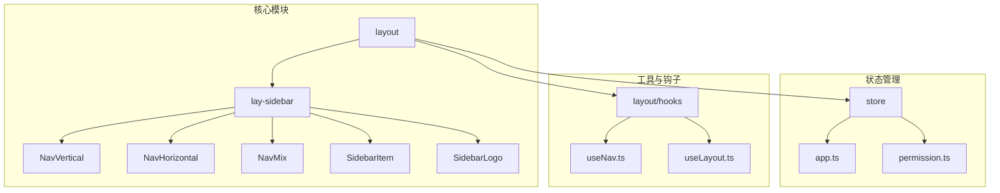
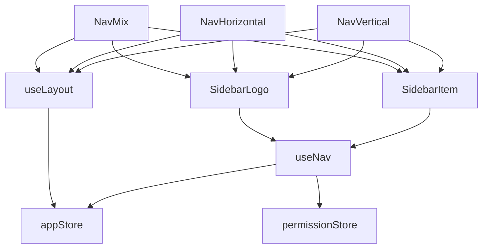
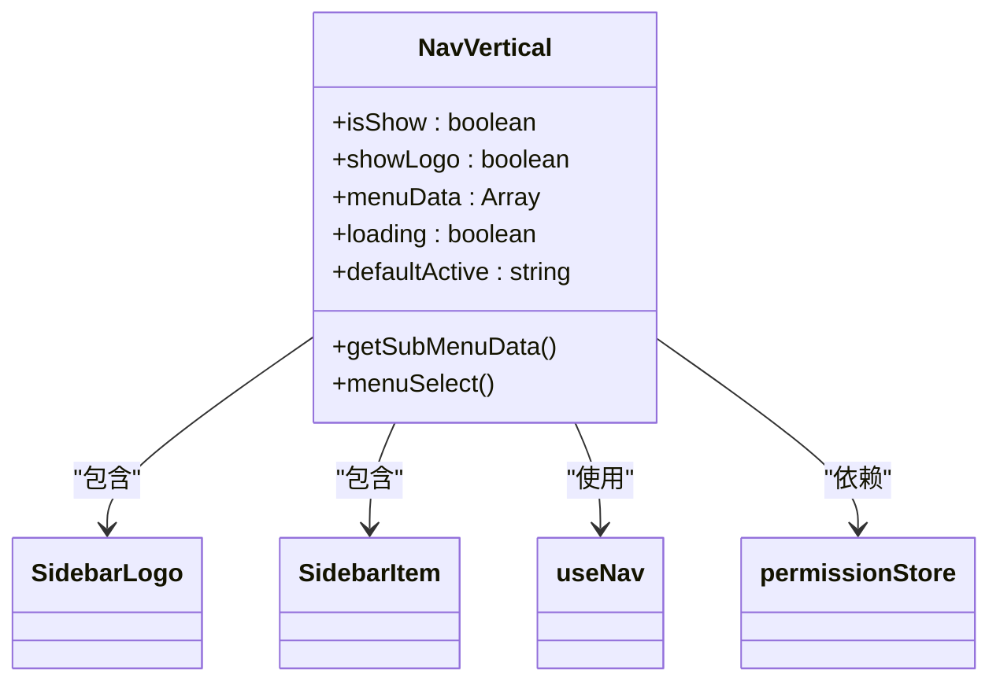
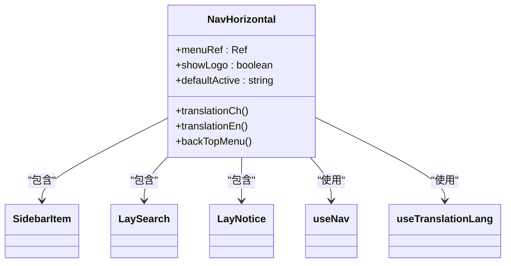
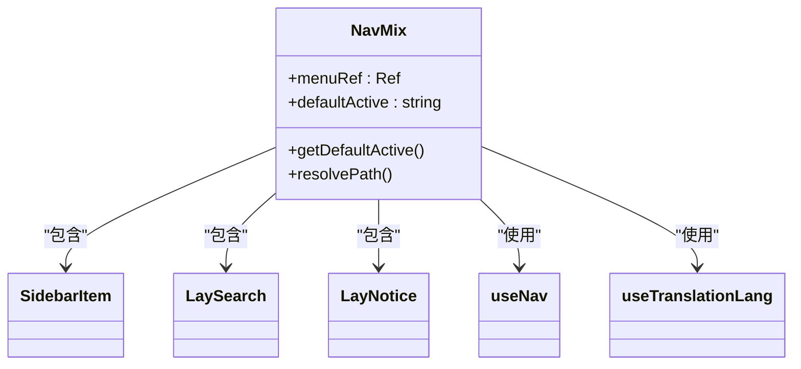
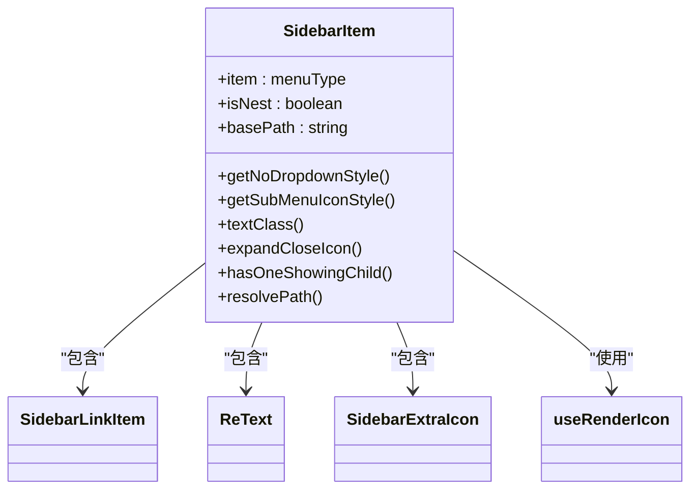
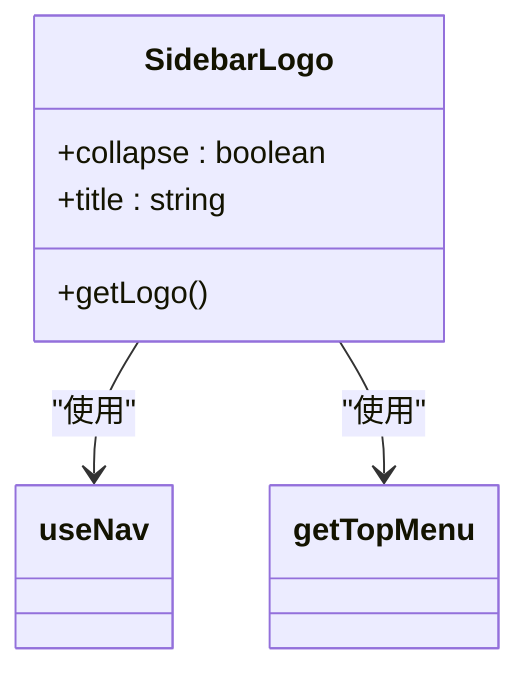
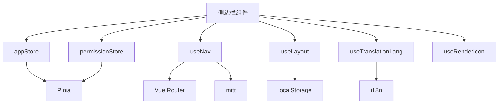

# 侧边栏组件

<cite>
**本文档中引用的文件**  
- [NavVertical.vue](file://web/src/layout/components/lay-sidebar/NavVertical.vue)
- [NavHorizontal.vue](file://web/src/layout/components/lay-sidebar/NavHorizontal.vue)
- [NavMix.vue](file://web/src/layout/components/lay-sidebar/NavMix.vue)
- [SidebarItem.vue](file://web/src/layout/components/lay-sidebar/components/SidebarItem.vue)
- [SidebarLogo.vue](file://web/src/layout/components/lay-sidebar/components/SidebarLogo.vue)
- [useNav.ts](file://web/src/layout/hooks/useNav.ts)
- [useLayout.ts](file://web/src/layout/hooks/useLayout.ts)
- [app.ts](file://web/src/store/modules/app.ts)
- [permission.ts](file://web/src/store/modules/permission.ts)
</cite>

## 目录
1. [简介](#简介)
2. [项目结构](#项目结构)
3. [核心组件](#核心组件)
4. [架构概述](#架构概述)
5. [详细组件分析](#详细组件分析)
6. [依赖分析](#依赖分析)
7. [性能考虑](#性能考虑)
8. [故障排除指南](#故障排除指南)
9. [结论](#结论)

## 简介
本项目是一个基于 Vue 3 的现代化管理后台系统，采用模块化设计和响应式架构。侧边栏组件是系统导航的核心部分，支持多种布局模式，包括垂直、水平和混合导航。组件通过 Pinia 状态管理实现动态状态控制，并结合路由系统实现菜单的权限控制和动态渲染。整体设计注重可维护性和扩展性，适用于企业级应用开发。

## 项目结构
项目采用典型的 Vue 3 + Vite 架构，主要目录包括 `src`、`public`、`mock` 等。核心功能集中在 `src` 目录下，包含 `api`、`components`、`layout`、`router`、`store` 和 `views` 等子目录。侧边栏相关组件位于 `src/layout/components/lay-sidebar` 目录中，通过模块化设计实现了高内聚低耦合的架构。

**图示来源**  
- [NavVertical.vue](file://web/src/layout/components/lay-sidebar/NavVertical.vue)
- [NavHorizontal.vue](file://web/src/layout/components/lay-sidebar/NavHorizontal.vue)
- [NavMix.vue](file://web/src/layout/components/lay-sidebar/NavMix.vue)
- [useNav.ts](file://web/src/layout/hooks/useNav.ts)
- [useLayout.ts](file://web/src/layout/hooks/useLayout.ts)

**本节来源**  
- [NavVertical.vue](file://web/src/layout/components/lay-sidebar/NavVertical.vue)
- [NavHorizontal.vue](file://web/src/layout/components/lay-sidebar/NavHorizontal.vue)
- [NavMix.vue](file://web/src/layout/components/lay-sidebar/NavMix.vue)

## 核心组件
侧边栏组件包含三个主要导航模式：垂直导航（NavVertical）、水平导航（NavHorizontal）和混合导航（NavMix）。每个模式都通过独立的 Vue 组件实现，共享基础的 SidebarItem 和 SidebarLogo 子组件。组件通过 useNav 和 useLayout 钩子与应用状态进行交互，实现响应式布局和动态行为控制。

**本节来源**  
- [NavVertical.vue](file://web/src/layout/components/lay-sidebar/NavVertical.vue#L1-L137)
- [NavHorizontal.vue](file://web/src/layout/components/lay-sidebar/NavHorizontal.vue#L1-L184)
- [NavMix.vue](file://web/src/layout/components/lay-sidebar/NavMix.vue#L1-L205)

## 架构概述
侧边栏组件采用分层架构设计，上层为三种导航模式组件，中层为通用子组件（SidebarItem、SidebarLogo），底层为状态管理和工具钩子。组件通过 Pinia store 管理应用状态，使用 useNav 钩子提供导航相关功能，useLayout 钩子处理布局逻辑。整个架构实现了关注点分离，便于维护和扩展。

**图示来源**  
- [NavVertical.vue](file://web/src/layout/components/lay-sidebar/NavVertical.vue)
- [NavHorizontal.vue](file://web/src/layout/components/lay-sidebar/NavHorizontal.vue)
- [NavMix.vue](file://web/src/layout/components/lay-sidebar/NavMix.vue)
- [useNav.ts](file://web/src/layout/hooks/useNav.ts)
- [useLayout.ts](file://web/src/layout/hooks/useLayout.ts)

## 详细组件分析

### 垂直导航模式分析
垂直导航模式（NavVertical）是默认的侧边栏布局，适用于大多数桌面应用场景。组件通过 el-menu 实现垂直菜单，支持多级嵌套和动态折叠。在移动端自动切换为隐藏模式，通过汉堡按钮控制显示状态。

**图示来源**  
- [NavVertical.vue](file://web/src/layout/components/lay-sidebar/NavVertical.vue#L1-L137)

**本节来源**  
- [NavVertical.vue](file://web/src/layout/components/lay-sidebar/NavVertical.vue#L1-L137)

### 水平导航模式分析
水平导航模式（NavHorizontal）将菜单放置在页面顶部，适用于需要最大化内容区域的场景。组件在顶部显示主菜单项，右侧集成搜索、国际化、全屏、通知和用户信息等常用功能。

**图示来源**  
- [NavHorizontal.vue](file://web/src/layout/components/lay-sidebar/NavHorizontal.vue#L1-L184)

**本节来源**  
- [NavHorizontal.vue](file://web/src/layout/components/lay-sidebar/NavHorizontal.vue#L1-L184)

### 混合导航模式分析
混合导航模式（NavMix）结合了垂直和水平导航的特点，在顶部显示一级菜单，在左侧显示对应的二级菜单。这种模式适合具有大量菜单项的复杂应用，能够有效组织导航结构。

**图示来源**  
- [NavMix.vue](file://web/src/layout/components/lay-sidebar/NavMix.vue#L1-L205)

**本节来源**  
- [NavMix.vue](file://web/src/layout/components/lay-sidebar/NavMix.vue#L1-L205)

### SidebarItem 组件分析
SidebarItem 组件是菜单项的基础单元，负责渲染单个菜单项或子菜单。组件根据菜单配置动态决定是否显示为普通菜单项或下拉子菜单，支持图标、标题和额外图标等元素。

**图示来源**  
- [SidebarItem.vue](file://web/src/layout/components/lay-sidebar/components/SidebarItem.vue#L1-L229)

**本节来源**  
- [SidebarItem.vue](file://web/src/layout/components/lay-sidebar/components/SidebarItem.vue#L1-L229)

### SidebarLogo 组件分析
SidebarLogo 组件负责渲染侧边栏的 logo 区域，根据折叠状态显示不同的布局。组件包含应用 logo 和标题，点击可返回首页，支持响应式设计。

**图示来源**  
- [SidebarLogo.vue](file://web/src/layout/components/lay-sidebar/components/SidebarLogo.vue#L1-L72)

**本节来源**  
- [SidebarLogo.vue](file://web/src/layout/components/lay-sidebar/components/SidebarLogo.vue#L1-L72)

## 依赖分析
侧边栏组件依赖多个核心模块和工具，形成完整的功能闭环。主要依赖包括状态管理模块（appStore、permissionStore）、导航钩子（useNav）、布局钩子（useLayout）以及各种 UI 组件和工具函数。

**图示来源**  
- [useNav.ts](file://web/src/layout/hooks/useNav.ts#L22-L179)
- [useLayout.ts](file://web/src/layout/hooks/useLayout.ts#L6-L63)
- [app.ts](file://web/src/store/modules/app.ts#L1-L90)
- [permission.ts](file://web/src/store/modules/permission.ts#L1-L74)

**本节来源**  
- [useNav.ts](file://web/src/layout/hooks/useNav.ts#L22-L179)
- [useLayout.ts](file://web/src/layout/hooks/useLayout.ts#L6-L63)
- [app.ts](file://web/src/store/modules/app.ts#L1-L90)
- [permission.ts](file://web/src/store/modules/permission.ts#L1-L74)

## 性能考虑
侧边栏组件在性能方面进行了多项优化。通过 Pinia store 的响应式系统实现高效的状态更新，避免不必要的重新渲染。使用 computed 属性缓存计算结果，减少重复计算开销。在菜单渲染方面，采用懒加载和条件渲染策略，仅在需要时加载和显示相关内容。

## 故障排除指南
常见问题包括菜单不显示、折叠状态异常、国际化失效等。这些问题通常与状态管理、路由配置或存储数据损坏有关。建议检查 localStorage 中的布局配置，确认路由权限设置正确，以及确保相关 store 模块正常初始化。

**本节来源**  
- [app.ts](file://web/src/store/modules/app.ts#L1-L90)
- [permission.ts](file://web/src/store/modules/permission.ts#L1-L74)
- [useNav.ts](file://web/src/layout/hooks/useNav.ts#L22-L179)

## 结论
侧边栏组件通过模块化设计和响应式架构，实现了灵活多样的导航模式。组件结构清晰，职责分明，易于维护和扩展。通过与状态管理系统的深度集成，实现了动态布局和权限控制功能。整体设计符合现代前端开发的最佳实践，为构建复杂的企业级应用提供了坚实的基础。