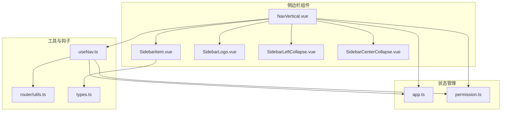
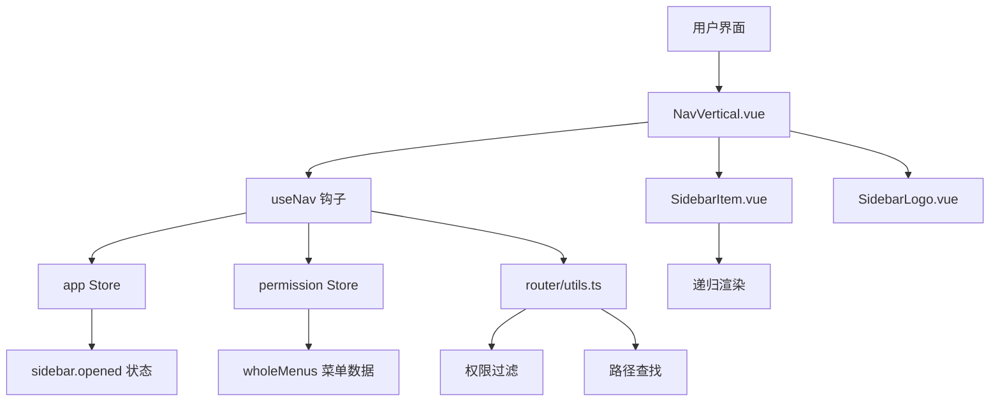
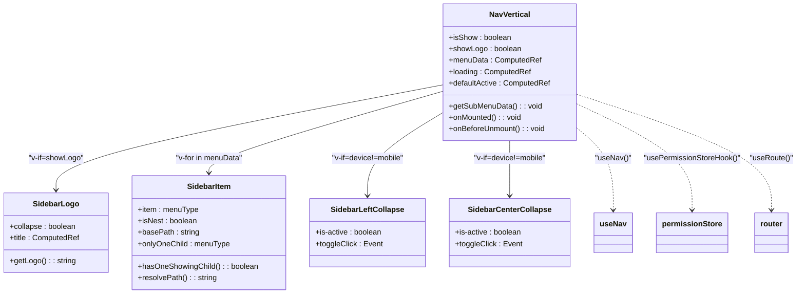
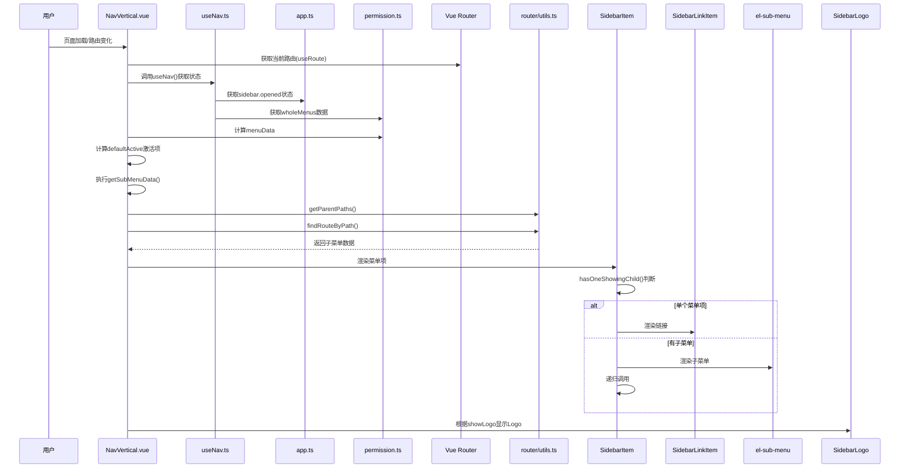
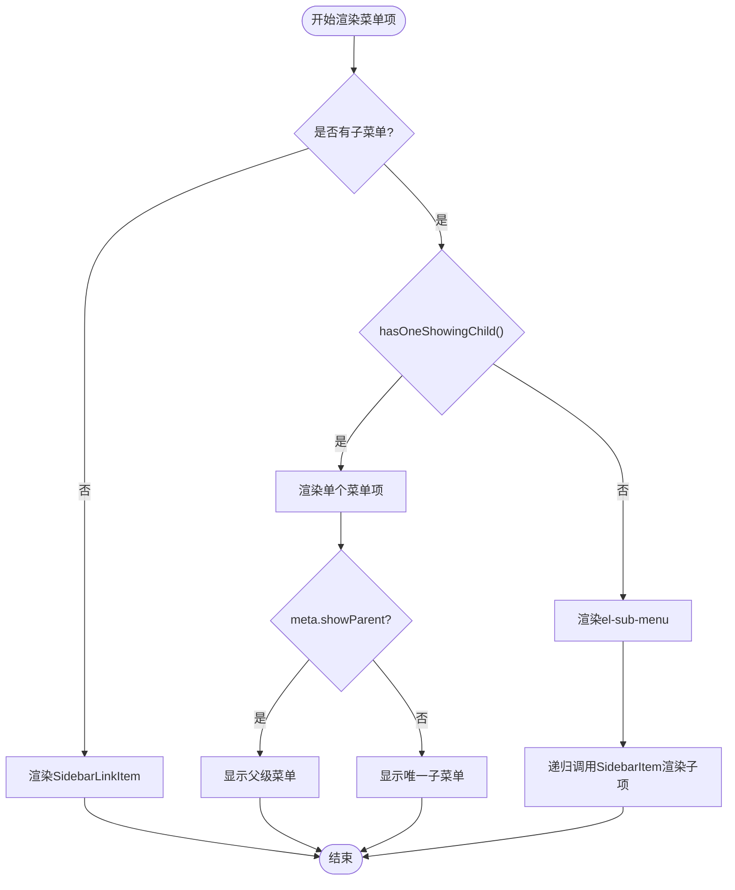
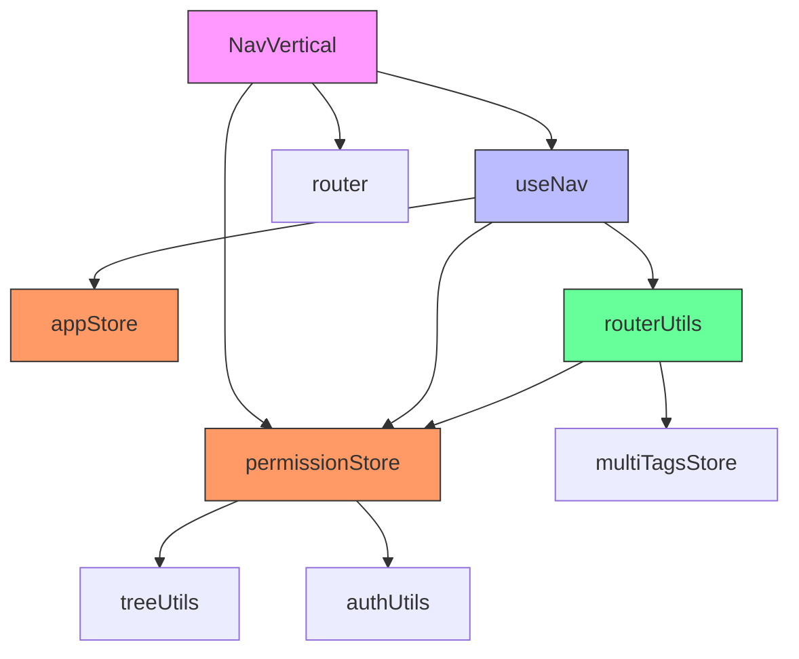

# 垂直导航模式

<cite>
**本文档引用文件**  
- [NavVertical.vue](file://web/src/layout/components/lay-sidebar/NavVertical.vue)
- [SidebarItem.vue](file://web/src/layout/components/lay-sidebar/components/SidebarItem.vue)
- [SidebarLogo.vue](file://web/src/layout/components/lay-sidebar/components/SidebarLogo.vue)
- [app.ts](file://web/src/store/modules/app.ts)
- [permission.ts](file://web/src/store/modules/permission.ts)
- [useNav.ts](file://web/src/layout/hooks/useNav.ts)
- [types.ts](file://web/src/layout/types.ts)
- [router/utils.ts](file://web/src/router/utils.ts)
</cite>

## 目录
1. [简介](#简介)
2. [项目结构](#项目结构)
3. [核心组件](#核心组件)
4. [架构概述](#架构概述)
5. [详细组件分析](#详细组件分析)
6. [依赖分析](#依赖分析)
7. [性能考虑](#性能考虑)
8. [故障排除指南](#故障排除指南)
9. [结论](#结论)

## 简介
垂直导航模式是Vue Pure Admin管理系统中的核心布局组件之一，主要用于侧边栏菜单的展示与交互。该模式通过`NavVertical.vue`组件实现，支持多级菜单递归渲染、权限控制、国际化及响应式适配。它与`SidebarItem`、`SidebarLogo`等子组件协同工作，构成完整的侧边栏导航体系。本文档将深入解析其内部实现机制、使用场景及最佳实践。

## 项目结构
垂直导航相关组件位于`web/src/layout/components/lay-sidebar/`目录下，采用模块化设计，各组件职责清晰，便于维护和扩展。

**图示来源**  
- [NavVertical.vue](file://web/src/layout/components/lay-sidebar/NavVertical.vue)
- [SidebarItem.vue](file://web/src/layout/components/lay-sidebar/components/SidebarItem.vue)
- [SidebarLogo.vue](file://web/src/layout/components/lay-sidebar/components/SidebarLogo.vue)
- [app.ts](file://web/src/store/modules/app.ts)
- [permission.ts](file://web/src/store/modules/permission.ts)
- [useNav.ts](file://web/src/layout/hooks/useNav.ts)
- [types.ts](file://web/src/layout/types.ts)
- [router/utils.ts](file://web/src/router/utils.ts)

**本节来源**  
- [web/src/layout/components/lay-sidebar/](file://web/src/layout/components/lay-sidebar/)

## 核心组件
垂直导航模式的核心由`NavVertical.vue`驱动，它负责整合菜单数据、控制显示逻辑，并与应用状态(store)进行交互。`SidebarItem.vue`实现菜单项的递归渲染，支持单个菜单和子菜单的差异化展示。`SidebarLogo.vue`则负责顶部Logo区域的显示与跳转逻辑。这些组件共同构成了一个功能完整、交互流畅的侧边栏导航系统。

**本节来源**  
- [NavVertical.vue](file://web/src/layout/components/lay-sidebar/NavVertical.vue#L1-L137)
- [SidebarItem.vue](file://web/src/layout/components/lay-sidebar/components/SidebarItem.vue#L1-L230)
- [SidebarLogo.vue](file://web/src/layout/components/lay-sidebar/components/SidebarLogo.vue#L1-L73)

## 架构概述
垂直导航的架构设计遵循了清晰的分层原则，将UI展示、状态管理、路由逻辑和权限控制分离。

**图示来源**  
- [NavVertical.vue](file://web/src/layout/components/lay-sidebar/NavVertical.vue#L1-L137)
- [useNav.ts](file://web/src/layout/hooks/useNav.ts#L22-L179)
- [app.ts](file://web/src/store/modules/app.ts#L1-L91)
- [permission.ts](file://web/src/store/modules/permission.ts#L1-L75)
- [router/utils.ts](file://web/src/router/utils.ts#L1-L416)

## 详细组件分析

### NavVertical.vue 分析
`NavVertical.vue`是垂直导航的主容器组件，负责协调子组件并管理整体状态。

#### 组件交互关系

**图示来源**  
- [NavVertical.vue](file://web/src/layout/components/lay-sidebar/NavVertical.vue#L1-L137)
- [SidebarLogo.vue](file://web/src/layout/components/lay-sidebar/components/SidebarLogo.vue#L1-L73)
- [SidebarItem.vue](file://web/src/layout/components/lay-sidebar/components/SidebarItem.vue#L1-L230)

#### 菜单渲染与状态管理流程

**图示来源**  
- [NavVertical.vue](file://web/src/layout/components/lay-sidebar/NavVertical.vue#L1-L137)
- [useNav.ts](file://web/src/layout/hooks/useNav.ts#L22-L179)
- [app.ts](file://web/src/store/modules/app.ts#L1-L91)
- [permission.ts](file://web/src/store/modules/permission.ts#L1-L75)
- [router/utils.ts](file://web/src/router/utils.ts#L1-L416)

**本节来源**  
- [NavVertical.vue](file://web/src/layout/components/lay-sidebar/NavVertical.vue#L1-L137)
- [useNav.ts](file://web/src/layout/hooks/useNav.ts#L22-L179)
- [app.ts](file://web/src/store/modules/app.ts#L1-L91)
- [permission.ts](file://web/src/store/modules/permission.ts#L1-L75)
- [router/utils.ts](file://web/src/router/utils.ts#L1-L416)

### SidebarItem.vue 分析
`SidebarItem.vue`是菜单项的渲染核心，负责处理单个菜单和多级子菜单的展示逻辑。

#### 菜单层级渲染逻辑

**图示来源**  
- [SidebarItem.vue](file://web/src/layout/components/lay-sidebar/components/SidebarItem.vue#L1-L230)

**本节来源**  
- [SidebarItem.vue](file://web/src/layout/components/lay-sidebar/components/SidebarItem.vue#L1-L230)

### SidebarLogo.vue 分析
`SidebarLogo.vue`组件负责顶部Logo区域的展示，其显示状态受应用配置控制。

**本节来源**  
- [SidebarLogo.vue](file://web/src/layout/components/lay-sidebar/components/SidebarLogo.vue#L1-L73)

## 依赖分析
垂直导航组件依赖于多个核心模块，形成了一个紧密耦合但职责分明的系统。

**图示来源**  
- [NavVertical.vue](file://web/src/layout/components/lay-sidebar/NavVertical.vue#L1-L137)
- [useNav.ts](file://web/src/layout/hooks/useNav.ts#L22-L179)
- [app.ts](file://web/src/store/modules/app.ts#L1-L91)
- [permission.ts](file://web/src/store/modules/permission.ts#L1-L75)
- [router/utils.ts](file://web/src/router/utils.ts#L1-L416)

**本节来源**  
- [NavVertical.vue](file://web/src/layout/components/lay-sidebar/NavVertical.vue#L1-L137)
- [useNav.ts](file://web/src/layout/hooks/useNav.ts#L22-L179)
- [app.ts](file://web/src/store/modules/app.ts#L1-L91)
- [permission.ts](file://web/src/store/modules/permission.ts#L1-L75)
- [router/utils.ts](file://web/src/router/utils.ts#L1-L416)

## 性能考虑
垂直导航在性能方面做了多项优化：
1. **计算属性缓存**：`menuData`、`loading`、`defaultActive`等使用`computed`，避免重复计算。
2. **防抖与节流**：在`permission.ts`中使用`debounce`函数防止频繁操作。
3. **路由懒加载**：通过`import.meta.glob`实现视图组件的动态导入。
4. **状态持久化**：使用`storageLocal`将侧边栏展开状态保存至localStorage，避免页面刷新后状态丢失。
5. **事件解绑**：在`onBeforeUnmount`中解绑`emitter`事件，防止内存泄漏。

## 故障排除指南
当垂直导航出现问题时，可按以下步骤排查：

**本节来源**  
- [NavVertical.vue](file://web/src/layout/components/lay-sidebar/NavVertical.vue#L1-L137)
- [useNav.ts](file://web/src/layout/hooks/useNav.ts#L22-L179)
- [app.ts](file://web/src/store/modules/app.ts#L1-L91)

## 结论
垂直导航模式通过`NavVertical.vue`组件实现了功能强大且灵活的侧边栏菜单系统。它利用Vue 3的组合式API和Pinia状态管理，实现了响应式的数据绑定和高效的组件通信。通过与`SidebarItem`、`SidebarLogo`等组件的协作，支持多级菜单递归渲染、权限过滤、国际化和响应式布局。其设计充分考虑了性能和可维护性，是Vue Pure Admin项目中不可或缺的核心组件之一。