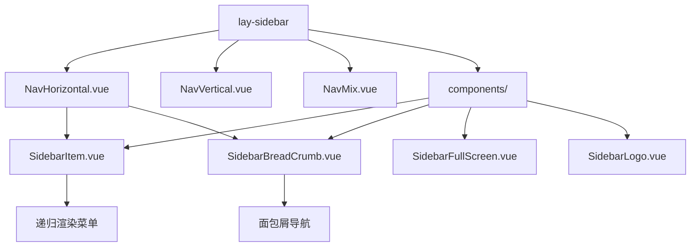
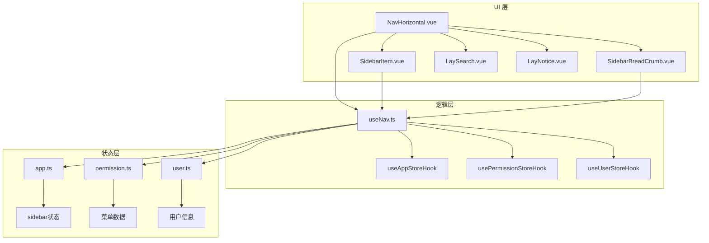
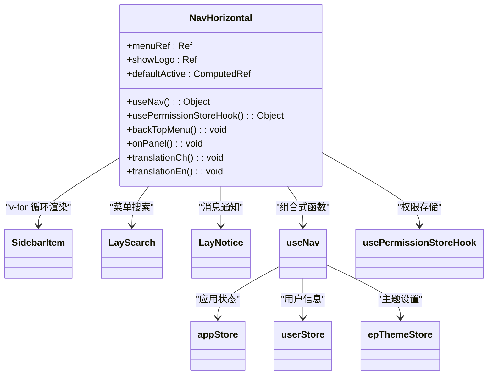
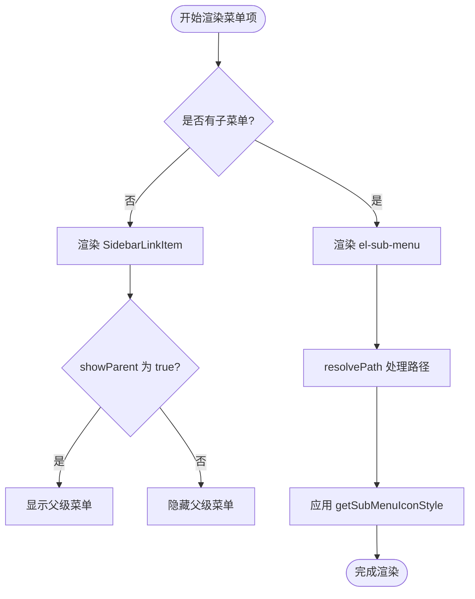
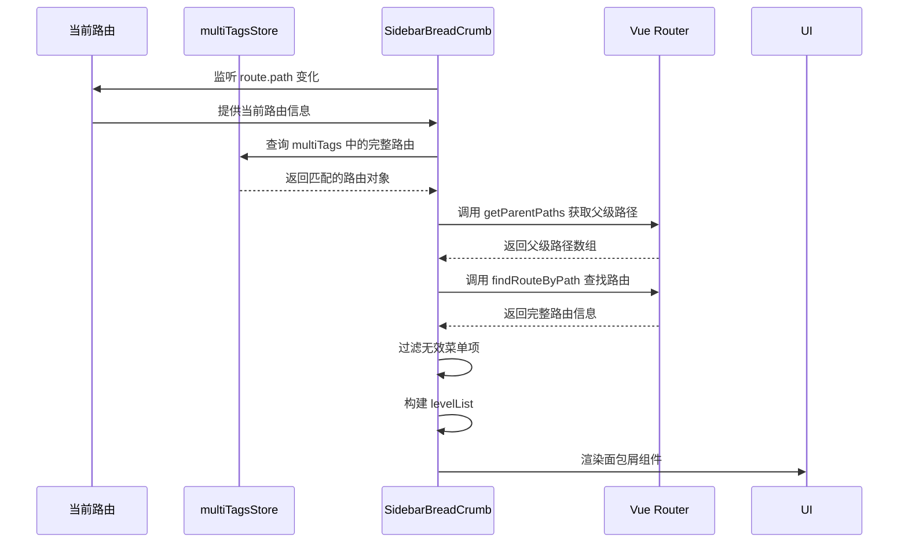

# 水平导航模式

<cite>
**本文档引用文件**  
- [NavHorizontal.vue](file://web/src/layout/components/lay-sidebar/NavHorizontal.vue)
- [SidebarItem.vue](file://web/src/layout/components/lay-sidebar/components/SidebarItem.vue)
- [SidebarBreadCrumb.vue](file://web/src/layout/components/lay-sidebar/components/SidebarBreadCrumb.vue)
- [app.ts](file://web/src/store/modules/app.ts)
- [useNav.ts](file://web/src/layout/hooks/useNav.ts)
- [index.ts](file://web/src/config/index.ts)
- [sidebar.scss](file://web/src/style/sidebar.scss)
</cite>

## 目录
1. [简介](#简介)
2. [项目结构](#项目结构)
3. [核心组件](#核心组件)
4. [架构概述](#架构概述)
5. [详细组件分析](#详细组件分析)
6. [依赖分析](#依赖分析)
7. [性能考虑](#性能考虑)
8. [故障排除指南](#故障排除指南)
9. [结论](#结论)

## 简介
本文档深入解析 Vue Pure Admin 项目中的水平导航模式实现，重点分析 `NavHorizontal.vue` 组件的技术细节。该导航模式适用于顶部主导航布局，支持多级菜单下拉展示、面包屑集成、响应式适配等功能。文档将详细说明其与 `SidebarItem` 组件的协同工作方式，以及如何通过 Vuex store 控制菜单状态。

## 项目结构
水平导航相关组件位于 `web/src/layout/components/lay-sidebar/` 目录下，形成清晰的组件层级结构。



**Diagram sources**
- [NavHorizontal.vue](file://web/src/layout/components/lay-sidebar/NavHorizontal.vue)
- [SidebarItem.vue](file://web/src/layout/components/lay-sidebar/components/SidebarItem.vue)
- [SidebarBreadCrumb.vue](file://web/src/layout/components/lay-sidebar/components/SidebarBreadCrumb.vue)

**Section sources**
- [NavHorizontal.vue](file://web/src/layout/components/lay-sidebar/NavHorizontal.vue)
- [SidebarItem.vue](file://web/src/layout/components/lay-sidebar/components/SidebarItem.vue)

## 核心组件
`NavHorizontal.vue` 是水平导航的核心组件，负责渲染顶部主导航栏。它通过 `usePermissionStoreHook().wholeMenus` 获取完整的菜单数据，并使用 `LaySidebarItem` 组件进行递归渲染。组件还集成了搜索、国际化、全屏、通知和用户操作等右侧功能模块。

**Section sources**
- [NavHorizontal.vue](file://web/src/layout/components/lay-sidebar/NavHorizontal.vue#L1-L185)

## 架构概述
水平导航采用分层架构设计，各组件职责分明，通过 Vuex store 进行状态管理。



**Diagram sources**
- [NavHorizontal.vue](file://web/src/layout/components/lay-sidebar/NavHorizontal.vue)
- [useNav.ts](file://web/src/layout/hooks/useNav.ts)
- [app.ts](file://web/src/store/modules/app.ts)

## 详细组件分析

### NavHorizontal.vue 分析
`NavHorizontal.vue` 组件实现了顶部水平导航栏的完整功能，包括 logo 显示、菜单渲染和右侧工具栏。

#### 组件结构


**Diagram sources**
- [NavHorizontal.vue](file://web/src/layout/components/lay-sidebar/NavHorizontal.vue#L1-L185)
- [useNav.ts](file://web/src/layout/hooks/useNav.ts#L1-L181)

**Section sources**
- [NavHorizontal.vue](file://web/src/layout/components/lay-sidebar/NavHorizontal.vue#L1-L185)

### SidebarItem.vue 分析
`SidebarItem.vue` 组件负责递归渲染菜单项，支持单级和多级菜单的展示。

#### 菜单渲染逻辑


**Diagram sources**
- [SidebarItem.vue](file://web/src/layout/components/lay-sidebar/components/SidebarItem.vue#L1-L230)
- [useNav.ts](file://web/src/layout/hooks/useNav.ts#L1-L181)

**Section sources**
- [SidebarItem.vue](file://web/src/layout/components/lay-sidebar/components/SidebarItem.vue#L1-L230)

### 面包屑导航集成
`SidebarBreadCrumb.vue` 组件实现了面包屑导航功能，与水平导航模式无缝集成。

#### 面包屑生成流程


**Diagram sources**
- [SidebarBreadCrumb.vue](file://web/src/layout/components/lay-sidebar/components/SidebarBreadCrumb.vue#L1-L122)
- [useMultiTagsStoreHook.ts](file://web/src/store/modules/multiTags.ts)

**Section sources**
- [SidebarBreadCrumb.vue](file://web/src/layout/components/lay-sidebar/components/SidebarBreadCrumb.vue#L1-L122)

## 依赖分析
水平导航模式涉及多个组件和模块之间的复杂依赖关系。

```mermaid
dependencyDiagram
NavHorizontal --> SidebarItem
NavHorizontal --> LaySearch
NavHorizontal --> LayNotice
NavHorizontal --> useNav
NavHorizontal --> usePermissionStoreHook
SidebarItem --> useNav
SidebarItem --> useRenderIcon
SidebarBreadCrumb --> useMultiTagsStoreHook
useNav --> useAppStoreHook
useNav --> useUserStoreHook
useNav --> useEpThemeStoreHook
useNav --> usePermissionStoreHook
appStore --> storageLocal
permissionStore --> router
```

**Diagram sources**
- [NavHorizontal.vue](file://web/src/layout/components/lay-sidebar/NavHorizontal.vue)
- [SidebarItem.vue](file://web/src/layout/components/lay-sidebar/components/SidebarItem.vue)
- [useNav.ts](file://web/src/layout/hooks/useNav.ts)
- [app.ts](file://web/src/store/modules/app.ts)

**Section sources**
- [NavHorizontal.vue](file://web/src/layout/components/lay-sidebar/NavHorizontal.vue#L1-L185)
- [useNav.ts](file://web/src/layout/hooks/useNav.ts#L1-L181)

## 性能考虑
水平导航模式在性能方面进行了多项优化：

1. **计算属性优化**：使用 `computed` 缓存计算结果，避免重复计算
2. **响应式更新**：通过 `watch` 监听关键状态变化，精确控制更新时机
3. **懒加载机制**：菜单数据通过 store 管理，按需加载
4. **事件总线**：使用 mitt 实现组件间通信，减少直接依赖
5. **样式优化**：CSS 变量和预定义类名减少样式计算开销

**Section sources**
- [NavHorizontal.vue](file://web/src/layout/components/lay-sidebar/NavHorizontal.vue#L1-L185)
- [useNav.ts](file://web/src/layout/hooks/useNav.ts#L1-L181)

## 故障排除指南
### 常见问题及解决方案

| 问题现象 | 可能原因 | 解决方案 |
|---------|--------|---------|
| 菜单不显示 | 权限数据未加载完成 | 检查 `usePermissionStoreHook().wholeMenus` 是否为空 |
| 面包屑不更新 | 路由变化未被监听 | 确认 `watch` 正确监听 `route.path` 变化 |
| 下拉菜单不工作 | 子菜单数据结构错误 | 检查路由配置中的 `children` 属性 |
| 响应式失效 | viewportSize 未更新 | 检查 `useAppStoreHook().setViewportSize` 调用 |
| 国际化不生效 | locale 状态未同步 | 确认 `useTranslationLang` 正确设置 locale |

**Section sources**
- [NavHorizontal.vue](file://web/src/layout/components/lay-sidebar/NavHorizontal.vue#L1-L185)
- [SidebarBreadCrumb.vue](file://web/src/layout/components/lay-sidebar/components/SidebarBreadCrumb.vue#L1-L122)
- [app.ts](file://web/src/store/modules/app.ts#L1-L91)

## 结论
水平导航模式通过 `NavHorizontal.vue` 组件实现了功能完整、结构清晰的顶部主导航系统。该模式充分利用 Vue 3 的组合式 API 和 Pinia 状态管理，实现了组件间的高效协作。通过 `SidebarItem.vue` 的递归渲染机制，支持任意层级的菜单结构；通过 `SidebarBreadCrumb.vue` 实现了导航路径的可视化。状态管理通过 `app` 模块集中控制，确保了应用状态的一致性和可维护性。整体设计充分考虑了性能优化和响应式适配，为开发者提供了灵活的配置选项和良好的扩展性。