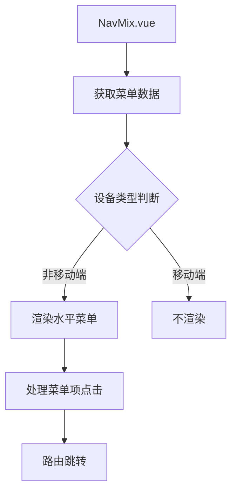
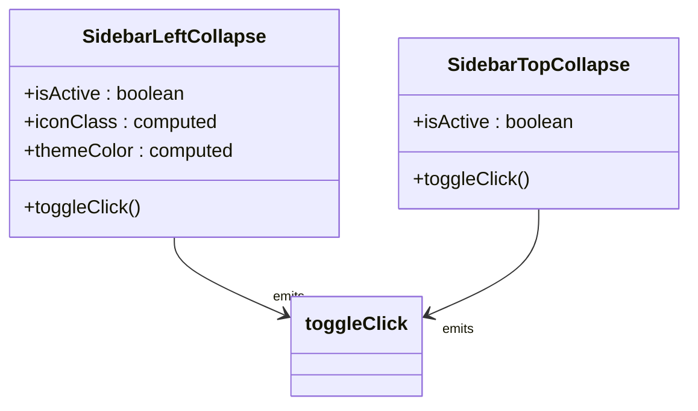

<cite>
**本文档中引用的文件**
- [NavMix.vue](file://web/src/layout/components/lay-sidebar/NavMix.vue)
- [SidebarLeftCollapse.vue](file://web/src/layout/components/lay-sidebar/components/SidebarLeftCollapse.vue)
- [SidebarTopCollapse.vue](file://web/src/layout/components/lay-sidebar/components/SidebarTopCollapse.vue)
- [app.ts](file://web/src/store/modules/app.ts)
- [useNav.ts](file://web/src/layout/hooks/useNav.ts)
- [permission.ts](file://web/src/store/modules/permission.ts)
</cite>

## 目录
1. [混合导航模式](#混合导航模式)
2. [核心组件分析](#核心组件分析)
3. [状态管理机制](#状态管理机制)
4. [权限控制实现](#权限控制实现)
5. [配置指南](#配置指南)

## 混合导航模式

混合导航模式是一种结合了侧边栏和顶部导航优点的高级布局方案，专为复杂管理系统设计。该模式通过将主菜单置于左侧，子菜单显示在顶部，实现了高效的空间利用和直观的用户导航体验。这种设计特别适用于具有多层级、多模块的大型应用，能够有效组织大量功能入口，同时保持界面的整洁性。

**Section sources**
- [NavMix.vue](file://web/src/layout/components/lay-sidebar/NavMix.vue#L1-L205)

## 核心组件分析

### NavMix.vue 组件架构

`NavMix.vue` 是混合导航模式的核心实现组件，负责渲染顶部水平菜单栏。该组件通过 `usePermissionStoreHook().wholeMenus` 获取完整的菜单数据，并使用 `el-menu` 组件以水平模式（`mode="horizontal"`）进行渲染。每个菜单项的图标和标题通过 `route.meta` 中的配置动态生成，支持国际化处理。



**Diagram sources**
- [NavMix.vue](file://web/src/layout/components/lay-sidebar/NavMix.vue#L1-L205)

**Section sources**
- [NavMix.vue](file://web/src/layout/components/lay-sidebar/NavMix.vue#L1-L205)

### 侧边栏折叠组件

混合导航模式依赖两个关键的折叠组件来实现状态同步：`SidebarLeftCollapse` 和 `SidebarTopCollapse`。

`SidebarLeftCollapse` 组件位于侧边栏底部，提供一个可点击的折叠/展开图标。它通过 `v-tippy` 指令显示提示信息，并根据 `isActive` 状态改变图标的旋转角度，提供直观的视觉反馈。

`SidebarTopCollapse` 组件则集成在顶部导航栏中，提供更紧凑的折叠控制。其逻辑更为简洁，直接根据 `isActive` 状态切换不同的图标（`MenuFold` 和 `MenuUnfold`），并绑定点击事件。



**Diagram sources**
- [SidebarLeftCollapse.vue](file://web/src/layout/components/lay-sidebar/components/SidebarLeftCollapse.vue#L1-L73)
- [SidebarTopCollapse.vue](file://web/src/layout/components/lay-sidebar/components/SidebarTopCollapse.vue#L1-L38)

**Section sources**
- [SidebarLeftCollapse.vue](file://web/src/layout/components/lay-sidebar/components/SidebarLeftCollapse.vue#L1-L73)
- [SidebarTopCollapse.vue](file://web/src/layout/components/lay-sidebar/components/SidebarTopCollapse.vue#L1-L38)

## 状态管理机制

### App Store 状态管理

混合导航模式的状态由 `app store` 统一管理，核心状态存储在 `useAppStore` 中。`sidebar` 对象包含 `opened`（侧边栏展开状态）、`withoutAnimation`（是否禁用动画）和 `isClickCollapse`（是否由用户点击触发折叠）三个关键属性。这些状态通过 `localStorage` 持久化，确保用户刷新页面后仍能保持之前的布局偏好。

```mermaid
stateDiagram-v2
[*] --> 初始化
初始化 --> 从localStorage读取状态
从localStorage读取状态 --> 展开状态
从localStorage读取状态 --> 折叠状态
展开状态 --> 用户点击折叠按钮 --> 折叠状态
折叠状态 --> 用户点击展开按钮 --> 展开状态
折叠状态 --> 响应式调整 --> 展开状态
展开状态 --> 响应式调整 --> 折叠状态
```

**Diagram sources**
- [app.ts](file://web/src/store/modules/app.ts#L1-L85)

**Section sources**
- [app.ts](file://web/src/store/modules/app.ts#L1-L85)

### 菜单数据分层处理

菜单数据的处理遵循清晰的分层逻辑。`permission.ts` 模块负责管理菜单数据，`constantMenus` 存储静态路由生成的菜单，`wholeMenus` 则存储由静态和动态路由共同组成的完整菜单。`handleWholeMenus` 方法负责组装和过滤菜单，确保只有用户有权限访问的菜单项才会被显示。

**Section sources**
- [permission.ts](file://web/src/store/modules/permission.ts#L1-L74)

## 权限控制实现

混合导航模式的权限控制通过 `filterNoPermissionTree` 函数实现。该函数在 `handleWholeMenus` 方法中被调用，对合并后的菜单树进行过滤。系统会根据用户的角色和权限信息，动态决定哪些菜单项应该显示或隐藏。这种机制确保了不同权限的用户在访问同一系统时，只能看到其被授权的功能模块，从而实现了细粒度的安全控制。

**Section sources**
- [permission.ts](file://web/src/store/modules/permission.ts#L1-L74)

## 配置指南

### 布局与响应式

混合导航模式的布局和响应式行为主要通过 `useNav` 钩子进行管理。`device` 计算属性根据屏幕尺寸判断当前设备类型（桌面端或移动端），从而决定是否渲染 `NavMix.vue` 组件。`layout` 计算属性则从 `$storage` 中读取当前的布局配置，支持在不同导航模式间切换。

### 图标与交互

图标显示由 `route.meta.icon` 配置驱动。组件通过 `useRenderIcon` 工具函数动态解析图标配置，并将其渲染为实际的图标组件。折叠按钮的交互逻辑由 `toggleSideBar` 方法处理，该方法最终调用 `pureApp.toggleSideBar()` 来切换侧边栏状态。

### 关键参数

- **`SidebarStatus`**: 控制侧边栏的默认展开/折叠状态。
- **`TooltipEffect`**: 设置所有提示框（tooltip）的视觉效果。
- **`Layout`**: 定义默认的导航布局模式。
- **`responsiveStorageNameSpace`**: 定义本地存储的命名空间前缀，用于区分不同环境或应用的存储数据。

**Section sources**
- [useNav.ts](file://web/src/layout/hooks/useNav.ts#L1-L180)