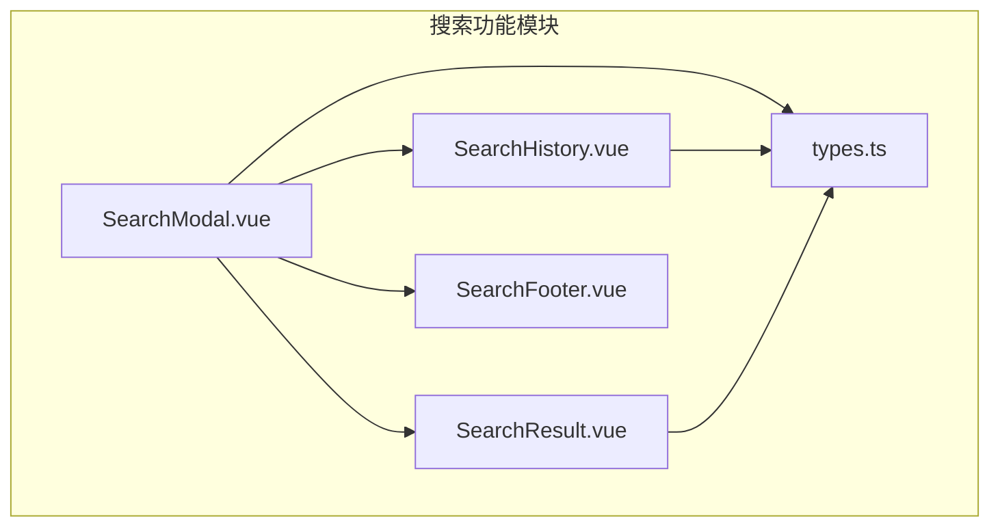
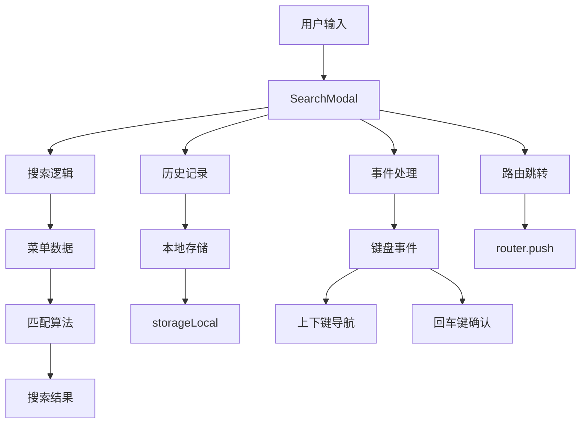
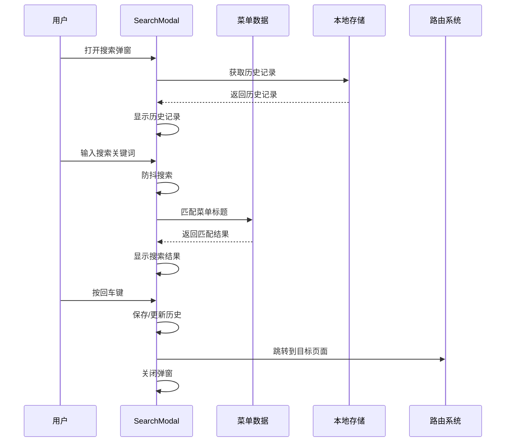
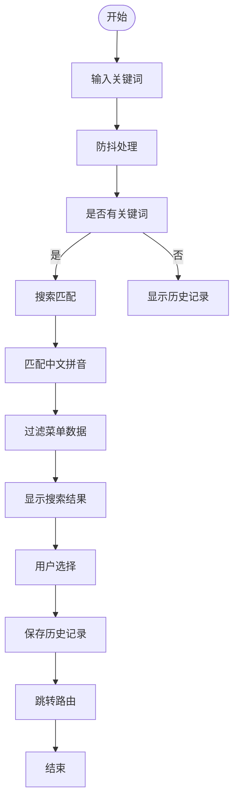
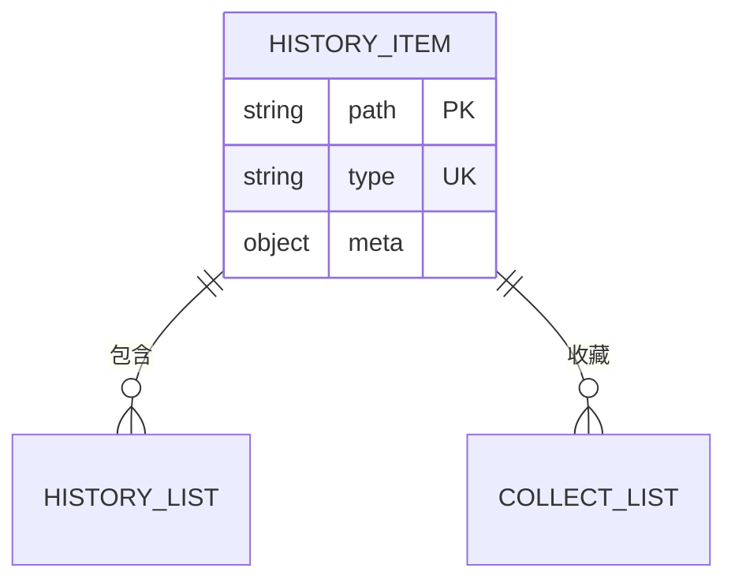
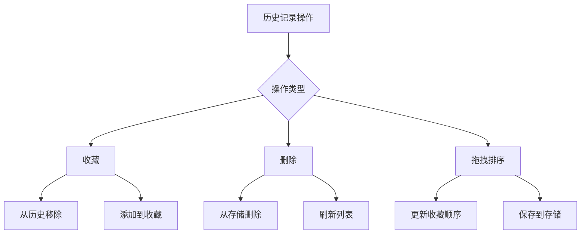
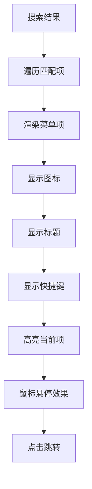
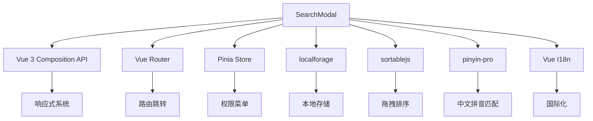

# 全局搜索功能

<cite>
**本文档引用文件**  
- [SearchModal.vue](file://web/src/layout/components/lay-search/components/SearchModal.vue)
- [SearchHistory.vue](file://web/src/layout/components/lay-search/components/SearchHistory.vue)
- [SearchResult.vue](file://web/src/layout/components/lay-search/components/SearchResult.vue)
- [types.ts](file://web/src/layout/components/lay-search/types.ts)
- [mitt.ts](file://web/src/utils/mitt.ts)
</cite>

## 目录
1. [项目结构](#项目结构)
2. [核心组件](#核心组件)
3. [架构概述](#架构概述)
4. [详细组件分析](#详细组件分析)
5. [依赖分析](#依赖分析)
6. [性能考虑](#性能考虑)
7. [故障排除指南](#故障排除指南)
8. [结论](#结论)

## 项目结构

全局搜索功能的实现主要集中在 `web/src/layout/components/lay-search` 目录下，包含搜索弹窗、历史记录、搜索结果等核心组件。

**Diagram sources**
- [SearchModal.vue](file://web/src/layout/components/lay-search/components/SearchModal.vue#L1-L338)
- [SearchHistory.vue](file://web/src/layout/components/lay-search/components/SearchHistory.vue#L1-L204)
- [SearchResult.vue](file://web/src/layout/components/lay-search/components/SearchResult.vue#L1-L114)
- [types.ts](file://web/src/layout/components/lay-search/types.ts#L1-L20)

**Section sources**
- [SearchModal.vue](file://web/src/layout/components/lay-search/components/SearchModal.vue#L1-L338)
- [types.ts](file://web/src/layout/components/lay-search/types.ts#L1-L20)

## 核心组件

全局搜索功能由多个组件协同工作，主要包括搜索模态框、历史记录展示、搜索结果列表和搜索页脚。这些组件通过响应式数据和事件机制实现交互。

**Section sources**
- [SearchModal.vue](file://web/src/layout/components/lay-search/components/SearchModal.vue#L1-L338)
- [SearchHistory.vue](file://web/src/layout/components/lay-search/components/SearchHistory.vue#L1-L204)
- [SearchResult.vue](file://web/src/layout/components/lay-search/components/SearchResult.vue#L1-L114)

## 架构概述

全局搜索功能采用模块化设计，通过 Vue 3 的组合式 API 实现响应式数据管理。搜索功能的核心是 SearchModal 组件，它负责协调用户输入、搜索逻辑、历史记录管理和结果展示。

**Diagram sources**
- [SearchModal.vue](file://web/src/layout/components/lay-search/components/SearchModal.vue#L1-L338)
- [utils.ts](file://web/src/utils/localforage.ts#L1-L20)

## 详细组件分析

### SearchModal 组件分析

SearchModal 组件是全局搜索功能的核心，负责处理用户交互、搜索逻辑和状态管理。

#### 组件交互流程

**Diagram sources**
- [SearchModal.vue](file://web/src/layout/components/lay-search/components/SearchModal.vue#L1-L338)

#### 搜索逻辑流程图

**Diagram sources**
- [SearchModal.vue](file://web/src/layout/components/lay-search/components/SearchModal.vue#L1-L338)

**Section sources**
- [SearchModal.vue](file://web/src/layout/components/lay-search/components/SearchModal.vue#L1-L338)

### SearchHistory 组件分析

SearchHistory 组件负责展示和管理搜索历史记录，支持收藏、删除和拖拽排序功能。

#### 历史记录数据结构

**Diagram sources**
- [types.ts](file://web/src/layout/components/lay-search/types.ts#L1-L20)

#### 历史记录操作流程

**Diagram sources**
- [SearchHistory.vue](file://web/src/layout/components/lay-search/components/SearchHistory.vue#L1-L204)
- [SearchModal.vue](file://web/src/layout/components/lay-search/components/SearchModal.vue#L1-L338)

**Section sources**
- [SearchHistory.vue](file://web/src/layout/components/lay-search/components/SearchHistory.vue#L1-L204)
- [SearchModal.vue](file://web/src/layout/components/lay-search/components/SearchModal.vue#L1-L338)

### SearchResult 组件分析

SearchResult 组件负责展示搜索匹配的结果，提供直观的菜单导航。

#### 搜索结果展示逻辑

**Diagram sources**
- [SearchResult.vue](file://web/src/layout/components/lay-search/components/SearchResult.vue#L1-L114)

**Section sources**
- [SearchResult.vue](file://web/src/layout/components/lay-search/components/SearchResult.vue#L1-L114)

## 依赖分析

全局搜索功能依赖多个核心模块和第三方库，形成完整的功能链路。

**Diagram sources**
- [SearchModal.vue](file://web/src/layout/components/lay-search/components/SearchModal.vue#L1-L338)
- [package.json](file://web/package.json#L1-L20)

**Section sources**
- [SearchModal.vue](file://web/src/layout/components/lay-search/components/SearchModal.vue#L1-L338)
- [package.json](file://web/package.json#L1-L20)

## 性能考虑

全局搜索功能在设计时考虑了多项性能优化策略，确保快速响应和流畅体验。

1. **防抖搜索**：使用 `useDebounceFn` 对搜索输入进行防抖处理，避免频繁搜索
2. **扁平化菜单**：将树形菜单结构扁平化，提高搜索效率
3. **本地存储**：使用 `storageLocal` 实现历史记录的持久化存储
4. **虚拟滚动**：通过 `el-scrollbar` 实现长列表的滚动优化
5. **懒加载**：仅在需要时加载历史记录，减少初始加载时间

这些优化措施确保了即使在菜单项较多的情况下，搜索功能也能保持良好的响应性能。

## 故障排除指南

### 常见问题及解决方案

| 问题现象 | 可能原因 | 解决方案 |
|---------|---------|---------|
| 搜索无结果 | 搜索关键词不匹配 | 检查关键词拼写，尝试拼音搜索 |
| 历史记录不显示 | 本地存储问题 | 清除浏览器缓存或检查 storage 权限 |
| 收藏功能失效 | 存储键名冲突 | 检查 LOCALECOLLECTKEY 常量定义 |
| 拖拽排序无效 | sortablejs 未正确初始化 | 检查 collectList 长度是否大于1 |
| 键盘导航失灵 | 事件监听器问题 | 检查 onKeyStroke 的使用和依赖 |

### 调试建议

1. 使用浏览器开发者工具检查 `storageLocal` 中的 `menu-search-history` 和 `menu-search-collect` 数据
2. 在 `handleSearch` 函数中添加调试日志，观察搜索流程
3. 检查 `flatTree` 函数的输出，确保菜单数据正确扁平化
4. 验证 `transformI18n` 函数是否正确处理国际化标题

**Section sources**
- [SearchModal.vue](file://web/src/layout/components/lay-search/components/SearchModal.vue#L1-L338)
- [SearchHistory.vue](file://web/src/layout/components/lay-search/components/SearchHistory.vue#L1-L204)

## 结论

全局搜索功能通过模块化设计和高效的算法实现，为用户提供快速、便捷的菜单导航体验。功能特点包括：

- 支持中文、拼音混合搜索
- 完善的历史记录管理（查看、收藏、删除、排序）
- 键盘快捷操作（上下键导航、回车确认）
- 响应式设计，适配移动设备
- 数据持久化，跨会话保存用户偏好

开发者可以根据需要扩展搜索数据源、修改匹配算法或自定义结果模板，满足特定业务需求。