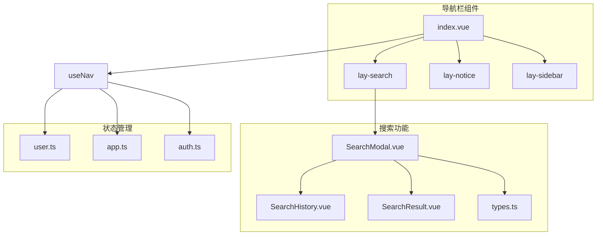
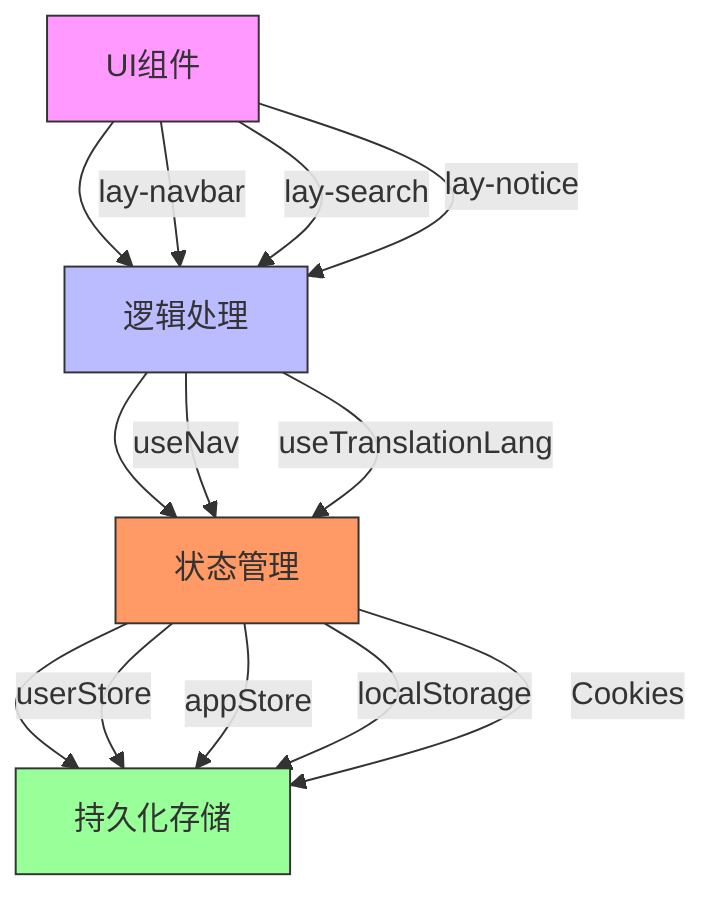
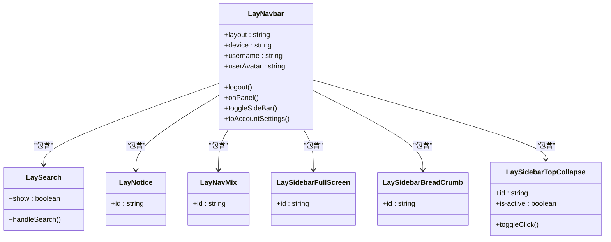
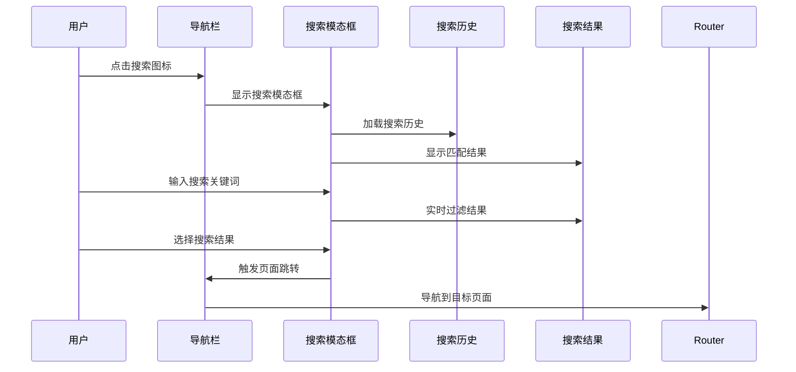
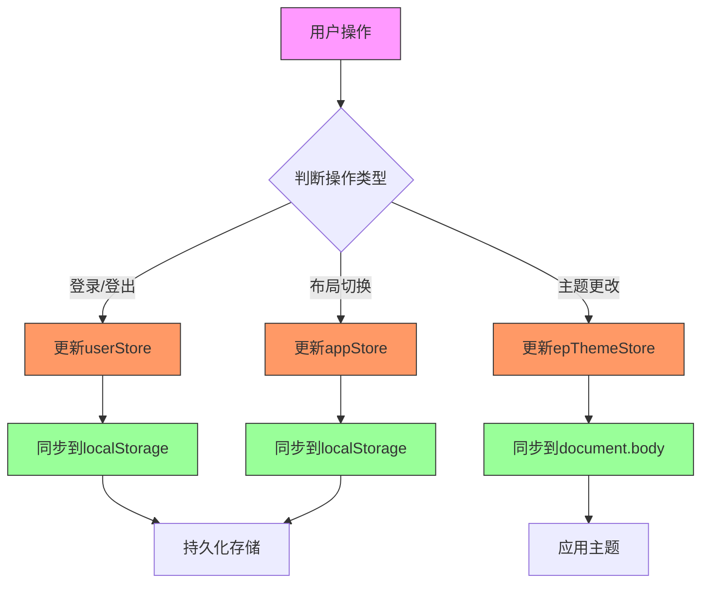
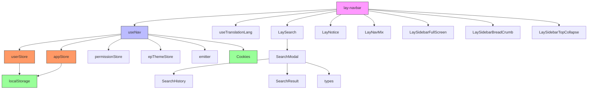

# 导航栏组件

<cite>
**本文档引用的文件**   
- [index.vue](file://web/src/layout/components/lay-navbar/index.vue)
- [useNav.ts](file://web/src/layout/hooks/useNav.ts)
- [user.ts](file://web/src/store/modules/user.ts)
- [app.ts](file://web/src/store/modules/app.ts)
- [auth.ts](file://web/src/utils/auth.ts)
- [SearchModal.vue](file://web/src/layout/components/lay-search/components/SearchModal.vue)
- [SearchHistory.vue](file://web/src/layout/components/lay-search/components/SearchHistory.vue)
- [SearchResult.vue](file://web/src/layout/components/lay-search/components/SearchResult.vue)
- [types.ts](file://web/src/layout/components/lay-search/types.ts)
</cite>

## 目录
1. [简介](#简介)
2. [项目结构](#项目结构)
3. [核心组件](#核心组件)
4. [架构概述](#架构概述)
5. [详细组件分析](#详细组件分析)
6. [依赖分析](#依赖分析)
7. [性能考虑](#性能考虑)
8. [故障排除指南](#故障排除指南)
9. [结论](#结论)

## 简介
本项目是一个基于Vue 3和Pinia的现代化管理后台系统，其导航栏组件是整个系统的核心交互入口。导航栏采用模块化设计，包含左侧Logo区域、中间搜索框和右侧用户信息区三大功能模块。通过useNav组合式API统一管理导航状态，利用Pinia进行全局状态管理，并通过auth工具实现用户认证。该组件支持响应式布局，在不同设备上呈现最佳用户体验。

## 项目结构
导航栏相关组件位于`web/src/layout/components/`目录下，采用清晰的模块化组织方式。

**Diagram sources**
- [index.vue](file://web/src/layout/components/lay-navbar/index.vue)
- [SearchModal.vue](file://web/src/layout/components/lay-search/components/SearchModal.vue)
- [user.ts](file://web/src/store/modules/user.ts)
- [app.ts](file://web/src/store/modules/app.ts)

**Section sources**
- [index.vue](file://web/src/layout/components/lay-navbar/index.vue)
- [useNav.ts](file://web/src/layout/hooks/useNav.ts)

## 核心组件
导航栏组件由多个子组件构成，主要包括顶部导航栏(lay-navbar)、搜索组件(lay-search)和通知组件(lay-notice)。这些组件通过组合式API(useNav)进行状态管理和交互控制，实现了响应式布局和多设备适配。用户信息区域集成了头像显示、下拉菜单、语言切换和系统设置等功能，提供了完整的用户交互体验。

**Section sources**
- [index.vue](file://web/src/layout/components/lay-navbar/index.vue)
- [useNav.ts](file://web/src/layout/hooks/useNav.ts)

## 架构概述
导航栏采用分层架构设计，上层为UI组件，中层为逻辑处理，底层为状态管理。通过emitter事件总线实现组件间通信，使用Pinia进行全局状态管理，并通过useNav组合式API封装通用逻辑。

**Diagram sources**
- [index.vue](file://web/src/layout/components/lay-navbar/index.vue)
- [useNav.ts](file://web/src/layout/hooks/useNav.ts)
- [user.ts](file://web/src/store/modules/user.ts)
- [app.ts](file://web/src/store/modules/app.ts)

## 详细组件分析

### 导航栏组件分析
导航栏组件(index.vue)是整个系统的顶部导航入口，包含多个功能区域。

#### 组件结构

**Diagram sources**
- [index.vue](file://web/src/layout/components/lay-navbar/index.vue)

**Section sources**
- [index.vue](file://web/src/layout/components/lay-navbar/index.vue)

### 搜索功能分析
搜索功能是导航栏的重要组成部分，提供全局搜索能力。

#### 搜索流程

**Diagram sources**
- [index.vue](file://web/src/layout/components/lay-search/index.vue)
- [SearchModal.vue](file://web/src/layout/components/lay-search/components/SearchModal.vue)
- [SearchHistory.vue](file://web/src/layout/components/lay-search/components/SearchHistory.vue)
- [SearchResult.vue](file://web/src/layout/components/lay-search/components/SearchResult.vue)

### 状态管理分析
导航栏的状态管理通过Pinia store实现，确保状态的一致性和可预测性。

#### 状态同步机制

**Diagram sources**
- [user.ts](file://web/src/store/modules/user.ts)
- [app.ts](file://web/src/store/modules/app.ts)
- [auth.ts](file://web/src/utils/auth.ts)

**Section sources**
- [user.ts](file://web/src/store/modules/user.ts)
- [app.ts](file://web/src/store/modules/app.ts)
- [auth.ts](file://web/src/utils/auth.ts)

## 依赖分析
导航栏组件依赖多个核心模块，形成完整的功能体系。

**Diagram sources**
- [index.vue](file://web/src/layout/components/lay-navbar/index.vue)
- [useNav.ts](file://web/src/layout/hooks/useNav.ts)
- [user.ts](file://web/src/store/modules/user.ts)
- [app.ts](file://web/src/store/modules/app.ts)

**Section sources**
- [index.vue](file://web/src/layout/components/lay-navbar/index.vue)
- [useNav.ts](file://web/src/layout/hooks/useNav.ts)
- [user.ts](file://web/src/store/modules/user.ts)
- [app.ts](file://web/src/store/modules/app.ts)

## 性能考虑
导航栏组件在设计时充分考虑了性能优化，通过多种技术手段确保流畅的用户体验。使用computed属性缓存计算结果，避免重复计算；采用debounce技术处理搜索输入，减少不必要的渲染；通过keep-alive缓存组件实例，提升切换效率；利用useResizeObserver监听窗口变化，实现高效的响应式布局。

## 故障排除指南
当导航栏出现异常时，可按照以下步骤进行排查：检查用户登录状态是否正常，验证token是否有效；确认localStorage中的布局配置是否正确；检查网络请求是否正常，特别是权限相关的API调用；验证Pinia store中的状态是否同步；查看浏览器控制台是否有JavaScript错误；确认CSS样式是否正确加载，特别是主题相关的样式。

**Section sources**
- [auth.ts](file://web/src/utils/auth.ts)
- [user.ts](file://web/src/store/modules/user.ts)
- [app.ts](file://web/src/store/modules/app.ts)

## 结论
导航栏组件作为系统的核心交互入口，通过模块化设计和组合式API实现了高度的可维护性和扩展性。其清晰的架构设计、完善的状态管理和丰富的功能特性，为用户提供了流畅的交互体验。通过Pinia进行全局状态管理，结合localStorage和Cookies实现数据持久化，确保了用户体验的一致性。该组件的设计模式可作为其他复杂UI组件的参考范例。