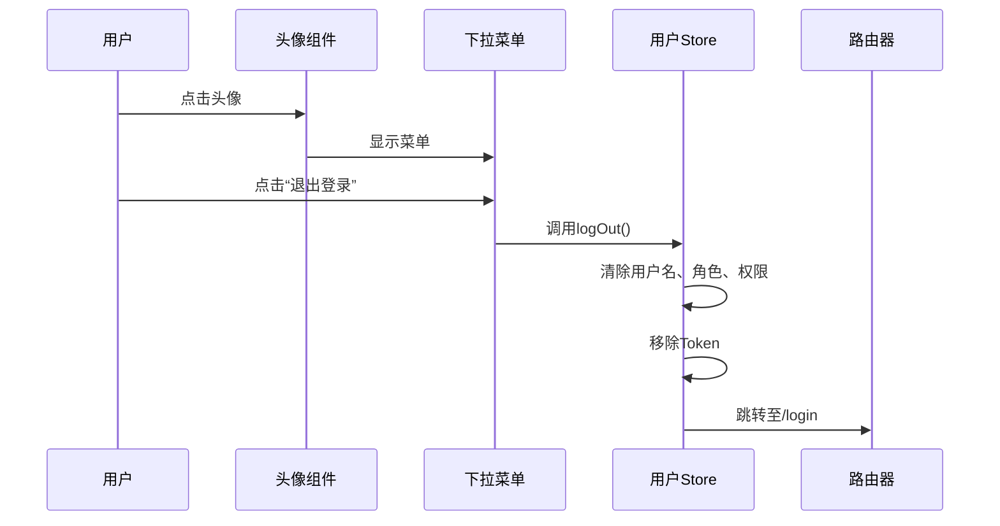
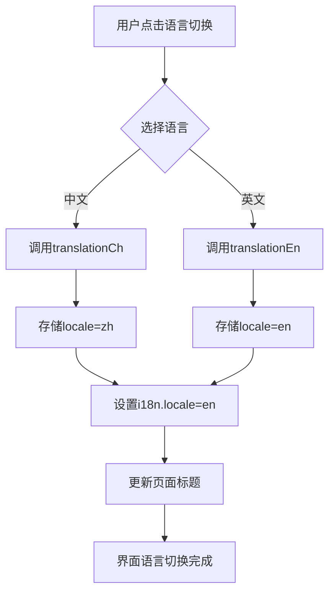
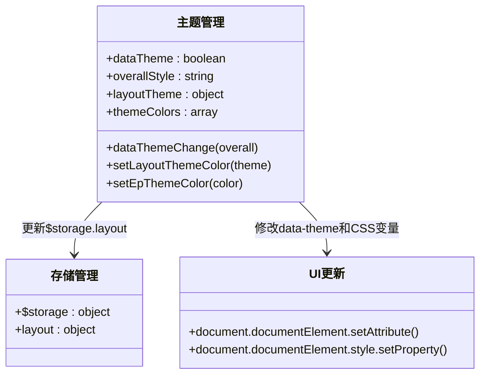
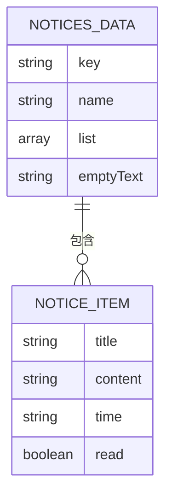

# 用户信息区域

<cite>
**本文档引用文件**  
- [lay-navbar/index.vue](file://web/src/layout/components/lay-navbar/index.vue)
- [useNav.ts](file://web/src/layout/hooks/useNav.ts)
- [user.ts](file://web/src/store/modules/user.ts)
- [i18n.ts](file://web/src/plugins/i18n.ts)
- [useTranslationLang.ts](file://web/src/layout/hooks/useTranslationLang.ts)
- [lay-notice/index.vue](file://web/src/layout/components/lay-notice/index.vue)
- [data.ts](file://web/src/layout/components/lay-notice/data.ts)
- [lay-setting/index.vue](file://web/src/layout/components/lay-setting/index.vue)
- [useDataThemeChange.ts](file://web/src/layout/hooks/useDataThemeChange.ts)
</cite>

## 目录
1. [简介](#简介)
2. [用户头像与下拉菜单](#用户头像与下拉菜单)
3. [语言切换功能](#语言切换功能)
4. [主题切换机制](#主题切换机制)
5. [通知中心集成](#通知中心集成)
6. [扩展指南](#扩展指南)
7. [结论](#结论)

## 简介
用户信息区域是系统右上角的核心交互模块，集成用户头像、语言切换、通知中心、主题设置和退出登录等功能。该区域通过响应式设计适配不同设备，并结合状态管理、国际化插件和本地存储实现动态交互与持久化配置。本文档详细解析其功能实现与技术架构。

**Section sources**
- [lay-navbar/index.vue](file://web/src/layout/components/lay-navbar/index.vue#L1-L200)

## 用户头像与下拉菜单

用户信息区域的头像显示逻辑基于Pinia状态管理，从`user`模块中获取用户数据。当用户登录后，系统会将用户名、昵称和头像信息存储在本地，并通过计算属性动态渲染。

头像点击后触发下拉菜单，包含“个人设置”和“退出登录”两个操作项。点击“个人设置”跳转至账户设置页面，点击“退出登录”则调用`logOut`方法清除用户状态并重定向至登录页。

下拉菜单的样式通过`getDropdownItemStyle`和`getDropdownItemClass`计算属性动态控制，确保当前选中项具有高亮背景和合适的文字颜色。

**Diagram sources**
- [lay-navbar/index.vue](file://web/src/layout/components/lay-navbar/index.vue#L1-L200)
- [useNav.ts](file://web/src/layout/hooks/useNav.ts#L22-L179)
- [user.ts](file://web/src/store/modules/user.ts#L1-L122)

**Section sources**
- [lay-navbar/index.vue](file://web/src/layout/components/lay-navbar/index.vue#L1-L200)
- [useNav.ts](file://web/src/layout/hooks/useNav.ts#L22-L179)
- [user.ts](file://web/src/store/modules/user.ts#L1-L122)

## 语言切换功能

语言切换功能通过Vue I18n插件实现多语言动态切换。系统预设中文（zh）和英文（en）两种语言，对应`locales/zh-CN.yaml`和`locales/en.yaml`文件。

切换逻辑由`useTranslationLang`组合式函数管理，调用`translationCh`或`translationEn`方法时，会执行以下操作：
1. 更新本地存储中的`locale`配置
2. 设置i18n实例的当前语言
3. 触发页面标题更新

语言状态持久化通过`storageLocal`实现，确保用户刷新页面后仍保持上次选择的语言。

**Diagram sources**
- [useTranslationLang.ts](file://web/src/layout/hooks/useTranslationLang.ts#L5-L40)
- [i18n.ts](file://web/src/plugins/i18n.ts#L1-L117)

**Section sources**
- [useTranslationLang.ts](file://web/src/layout/hooks/useTranslationLang.ts#L5-L40)
- [i18n.ts](file://web/src/plugins/i18n.ts#L1-L117)

## 主题切换机制

主题切换功能支持明暗模式切换和主题颜色配置，其实现机制分为三个层次：

1. **整体风格切换**：支持“亮色”、“暗色”和“跟随系统”三种模式，通过`dataThemeChange`方法控制HTML元素的`data-theme`属性和CSS类。
2. **主题颜色配置**：提供8种预设主题色，用户选择后通过`setLayoutThemeColor`更新布局主题，并持久化存储。
3. **持久化存储**：所有主题配置通过`$storage.layout`对象保存在浏览器本地，确保刷新后配置不丢失。

主题切换还集成Element Plus组件库的主题色同步，通过`setEpThemeColor`方法动态修改CSS变量，实现组件库颜色的实时更新。

**Diagram sources**
- [useDataThemeChange.ts](file://web/src/layout/hooks/useDataThemeChange.ts#L12-L137)
- [lay-setting/index.vue](file://web/src/layout/components/lay-setting/index.vue#L1-L638)

**Section sources**
- [useDataThemeChange.ts](file://web/src/layout/hooks/useDataThemeChange.ts#L12-L137)
- [lay-setting/index.vue](file://web/src/layout/components/lay-setting/index.vue#L1-L638)

## 通知中心集成

通知中心通过`lay-notice`组件实现，集成在用户信息区域右侧。其核心功能包括：

- 消息数量徽标显示
- 多标签页消息分类
- 滚动区域内容展示
- 国际化消息标题

通知数据来源于`data.ts`文件中的`noticesData`，通过Pinia或直接导入方式提供。组件使用`el-badge`显示未读消息总数，并通过`el-tabs`实现不同类型通知的分类展示。

消息标题通过`getLabel`计算属性进行国际化处理，确保在不同语言环境下正确显示。

**Diagram sources**
- [lay-notice/index.vue](file://web/src/layout/components/lay-notice/index.vue#L1-L99)
- [data.ts](file://web/src/layout/components/lay-notice/data.ts#L1-L50)

**Section sources**
- [lay-notice/index.vue](file://web/src/layout/components/lay-notice/index.vue#L1-L99)
- [data.ts](file://web/src/layout/components/lay-notice/data.ts#L1-L50)

## 扩展指南

### 添加新的用户操作项
在`lay-navbar/index.vue`的用户下拉菜单中添加新的`el-dropdown-item`，绑定相应的点击事件处理函数。

### 自定义下拉菜单内容
可通过修改`useNav.ts`中的`toAccountSettings`等方法，或直接在模板中扩展下拉菜单的`template#dropdown`内容。

### 集成第三方用户服务
1. 在`user.ts`的`userType`状态中添加新的用户字段
2. 在登录流程中获取第三方服务数据并存储
3. 在用户信息区域通过计算属性展示相关数据

### 扩展语言包
在`locales/`目录下添加新的语言文件（如`fr.yaml`），并在`i18n.ts`的`localesConfigs`中注册。

### 添加新主题色
在`useDataThemeChange.ts`的`themeColors`数组中添加新的颜色配置对象，包含`color`和`themeColor`字段。

**Section sources**
- [lay-navbar/index.vue](file://web/src/layout/components/lay-navbar/index.vue#L1-L200)
- [useNav.ts](file://web/src/layout/hooks/useNav.ts#L22-L179)
- [user.ts](file://web/src/store/modules/user.ts#L1-L122)
- [i18n.ts](file://web/src/plugins/i18n.ts#L1-L117)
- [useDataThemeChange.ts](file://web/src/layout/hooks/useDataThemeChange.ts#L12-L137)

## 结论
用户信息区域通过模块化设计实现了头像显示、语言切换、主题配置、通知中心和退出登录等核心功能。其技术实现结合了Vue 3组合式API、Pinia状态管理、Vue I18n国际化和本地存储，具有良好的可扩展性和维护性。开发者可基于现有架构轻松添加新功能或集成第三方服务。