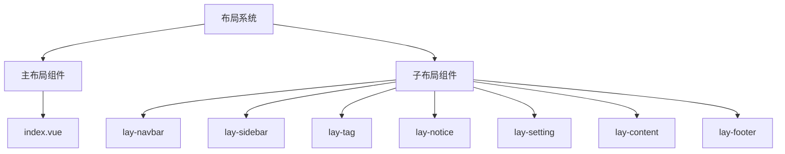
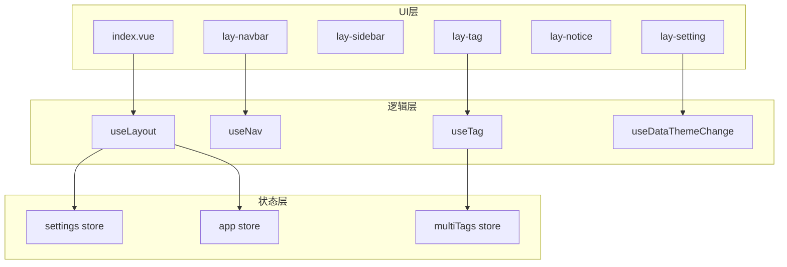
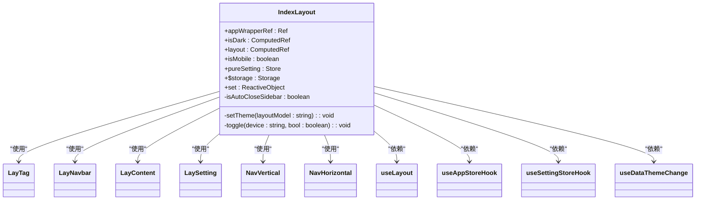
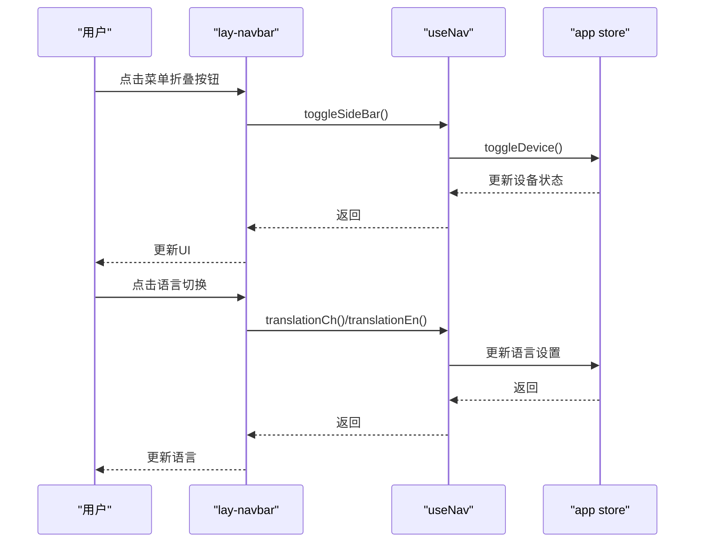
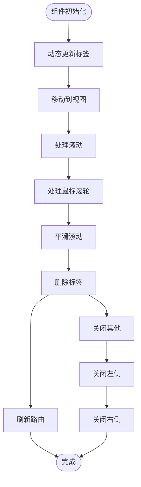
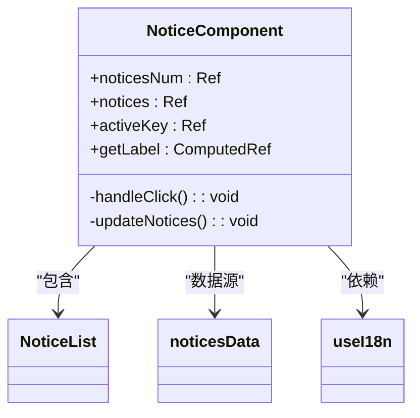
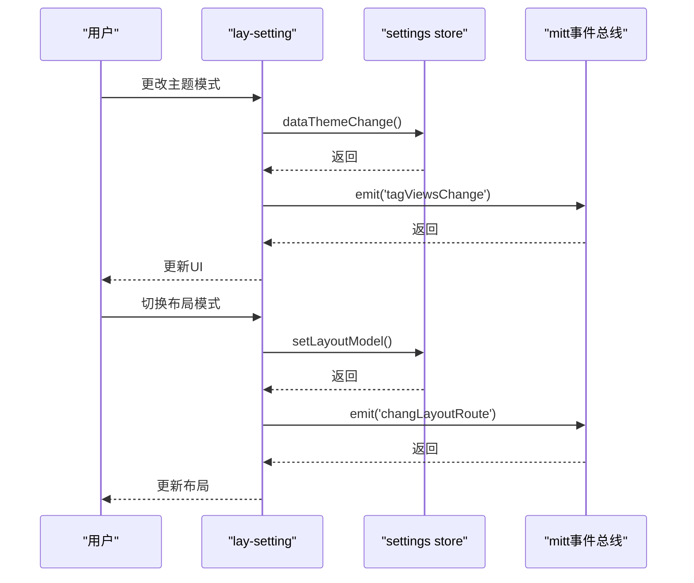
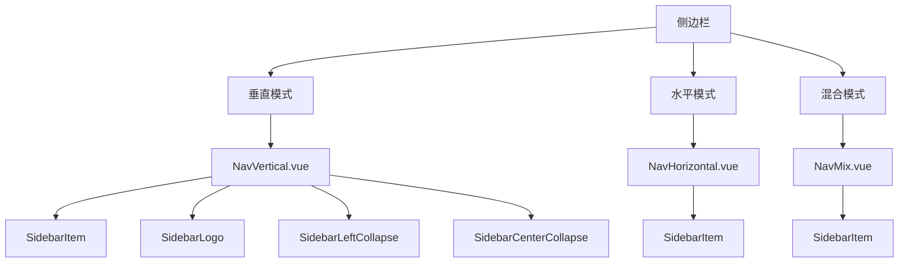
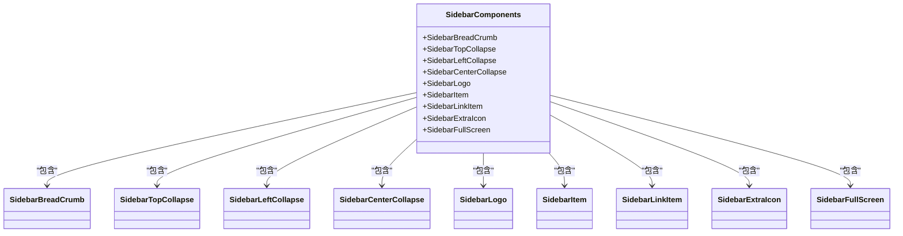
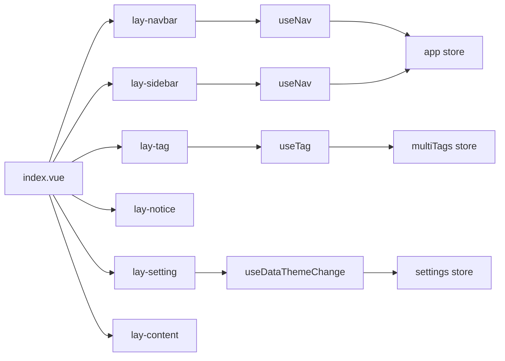

# 布局组件

<cite>
**本文档引用文件**  
- [index.vue](file://web/src/layout/index.vue)
- [lay-navbar/index.vue](file://web/src/layout/components/lay-navbar/index.vue)
- [lay-tag/index.vue](file://web/src/layout/components/lay-tag/index.vue)
- [lay-notice/index.vue](file://web/src/layout/components/lay-notice/index.vue)
- [lay-setting/index.vue](file://web/src/layout/components/lay-setting/index.vue)
- [useLayout.ts](file://web/src/layout/hooks/useLayout.ts)
- [settings.ts](file://web/src/store/modules/settings.ts)
- [NavVertical.vue](file://web/src/layout/components/lay-sidebar/NavVertical.vue)
- [NavHorizontal.vue](file://web/src/layout/components/lay-sidebar/NavHorizontal.vue)
- [NavMix.vue](file://web/src/layout/components/lay-sidebar/NavMix.vue)
- [SidebarBreadCrumb.vue](file://web/src/layout/components/lay-sidebar/components/SidebarBreadCrumb.vue)
- [SidebarTopCollapse.vue](file://web/src/layout/components/lay-sidebar/components/SidebarTopCollapse.vue)
- [SidebarLeftCollapse.vue](file://web/src/layout/components/lay-sidebar/components/SidebarLeftCollapse.vue)
- [SidebarCenterCollapse.vue](file://web/src/layout/components/lay-sidebar/components/SidebarCenterCollapse.vue)
- [SidebarLogo.vue](file://web/src/layout/components/lay-sidebar/components/SidebarLogo.vue)
</cite>

## 目录
1. [简介](#简介)
2. [项目结构](#项目结构)
3. [核心组件](#核心组件)
4. [架构概述](#架构概述)
5. [详细组件分析](#详细组件分析)
6. [依赖分析](#依赖分析)
7. [性能考虑](#性能考虑)
8. [故障排除指南](#故障排除指南)
9. [结论](#结论)

## 简介
本文档详细描述了Vue Pure Admin项目中的布局系统设计与实现。重点介绍主布局组件（index.vue）的架构设计，以及侧边栏（lay-sidebar）、导航栏（lay-navbar）、标签页（lay-tag）、通知中心（lay-notice）、设置面板（lay-setting）等子布局组件的功能和交互逻辑。文档详细说明了各组件的props、events、slots等API接口，并提供实际使用示例。同时，解释了响应式布局的实现机制，包括移动端适配和桌面端的多模式切换（水平/垂直/混合模式）。文档还说明了布局状态管理与store模块的集成方式，以及如何通过useLayout等hooks进行布局控制，为开发者提供完整的布局定制指南。

## 项目结构
Vue Pure Admin项目的布局组件位于`src/layout`目录下，采用模块化设计，将不同功能的布局组件分离到独立的文件和目录中。主布局组件index.vue负责整体布局的协调和控制，而各个子组件则负责特定区域的展示和交互。

**图示来源**
- [index.vue](file://web/src/layout/index.vue)
- [lay-navbar/index.vue](file://web/src/layout/components/lay-navbar/index.vue)
- [lay-sidebar/NavVertical.vue](file://web/src/layout/components/lay-sidebar/NavVertical.vue)

## 核心组件
布局系统的核心组件是index.vue，它作为整个应用的布局容器，负责协调各个子组件的显示和交互。该组件通过响应式数据绑定和计算属性来管理布局状态，并根据设备类型和用户设置动态调整布局模式。

**组件来源**
- [index.vue](file://web/src/layout/index.vue)

## 架构概述
Vue Pure Admin的布局系统采用分层架构设计，将UI展示、状态管理和业务逻辑分离。主布局组件通过Vue的响应式系统与store模块进行数据同步，同时利用hooks封装可复用的逻辑。

**图示来源**
- [index.vue](file://web/src/layout/index.vue)
- [useLayout.ts](file://web/src/layout/hooks/useLayout.ts)
- [settings.ts](file://web/src/store/modules/settings.ts)

## 详细组件分析

### 主布局组件分析
主布局组件index.vue是整个布局系统的核心，负责协调各个子组件的显示和交互。该组件通过计算属性和响应式数据来管理布局状态，并根据设备类型和用户设置动态调整布局模式。

**图示来源**
- [index.vue](file://web/src/layout/index.vue)

**组件来源**
- [index.vue](file://web/src/layout/index.vue)

### 导航栏组件分析
导航栏组件lay-navbar提供顶部导航功能，包含面包屑、搜索、国际化、全屏、通知和用户信息等功能。该组件根据布局模式和设备类型动态调整显示内容。

**图示来源**
- [lay-navbar/index.vue](file://web/src/layout/components/lay-navbar/index.vue)
- [useNav.ts](file://web/src/layout/hooks/useNav.ts)

**组件来源**
- [lay-navbar/index.vue](file://web/src/layout/components/lay-navbar/index.vue)

### 标签页组件分析
标签页组件lay-tag管理多标签页的显示和交互，支持标签的添加、删除、切换和右键菜单操作。该组件通过mitt事件总线与其他组件进行通信。

**图示来源**
- [lay-tag/index.vue](file://web/src/layout/components/lay-tag/index.vue)
- [useTag.ts](file://web/src/layout/hooks/useTag.ts)

**组件来源**
- [lay-tag/index.vue](file://web/src/layout/components/lay-tag/index.vue)

### 通知中心组件分析
通知中心组件lay-notice提供消息通知功能，通过下拉菜单显示不同类型的通知消息。该组件支持消息分类和未读消息计数。

**图示来源**
- [lay-notice/index.vue](file://web/src/layout/components/lay-notice/index.vue)
- [data.ts](file://web/src/layout/components/lay-notice/data.ts)

**组件来源**
- [lay-notice/index.vue](file://web/src/layout/components/lay-notice/index.vue)

### 设置面板组件分析
设置面板组件lay-setting提供系统设置功能，包括主题切换、布局模式选择、标签样式设置等。该组件通过store管理全局设置状态。

**图示来源**
- [lay-setting/index.vue](file://web/src/layout/components/lay-setting/index.vue)
- [useDataThemeChange.ts](file://web/src/layout/hooks/useDataThemeChange.ts)

**组件来源**
- [lay-setting/index.vue](file://web/src/layout/components/lay-setting/index.vue)

### 侧边栏组件分析
侧边栏组件包含多种布局模式，支持垂直、水平和混合模式。该组件通过NavVertical、NavHorizontal和NavMix三个子组件实现不同的导航布局。

**图示来源**
- [NavVertical.vue](file://web/src/layout/components/lay-sidebar/NavVertical.vue)
- [NavHorizontal.vue](file://web/src/layout/components/lay-sidebar/NavHorizontal.vue)
- [NavMix.vue](file://web/src/layout/components/lay-sidebar/NavMix.vue)

**组件来源**
- [NavVertical.vue](file://web/src/layout/components/lay-sidebar/NavVertical.vue)
- [NavHorizontal.vue](file://web/src/layout/components/lay-sidebar/NavHorizontal.vue)
- [NavMix.vue](file://web/src/layout/components/lay-sidebar/NavMix.vue)

### 侧边栏子组件分析
侧边栏包含多个功能子组件，如面包屑、折叠按钮和Logo显示等，这些组件共同构成了完整的侧边栏功能。

**图示来源**
- [SidebarBreadCrumb.vue](file://web/src/layout/components/lay-sidebar/components/SidebarBreadCrumb.vue)
- [SidebarTopCollapse.vue](file://web/src/layout/components/lay-sidebar/components/SidebarTopCollapse.vue)
- [SidebarLeftCollapse.vue](file://web/src/layout/components/lay-sidebar/components/SidebarLeftCollapse.vue)
- [SidebarCenterCollapse.vue](file://web/src/layout/components/lay-sidebar/components/SidebarCenterCollapse.vue)
- [SidebarLogo.vue](file://web/src/layout/components/lay-sidebar/components/SidebarLogo.vue)

**组件来源**
- [SidebarBreadCrumb.vue](file://web/src/layout/components/lay-sidebar/components/SidebarBreadCrumb.vue)
- [SidebarTopCollapse.vue](file://web/src/layout/components/lay-sidebar/components/SidebarTopCollapse.vue)
- [SidebarLeftCollapse.vue](file://web/src/layout/components/lay-sidebar/components/SidebarLeftCollapse.vue)
- [SidebarCenterCollapse.vue](file://web/src/layout/components/lay-sidebar/components/SidebarCenterCollapse.vue)
- [SidebarLogo.vue](file://web/src/layout/components/lay-sidebar/components/SidebarLogo.vue)

## 依赖分析
布局系统的各个组件之间存在明确的依赖关系，主组件依赖于子组件，同时通过hooks和store进行状态管理。

**图示来源**
- [index.vue](file://web/src/layout/index.vue)
- [useLayout.ts](file://web/src/layout/hooks/useLayout.ts)
- [settings.ts](file://web/src/store/modules/settings.ts)

**组件来源**
- [index.vue](file://web/src/layout/index.vue)
- [useLayout.ts](file://web/src/layout/hooks/useLayout.ts)
- [settings.ts](file://web/src/store/modules/settings.ts)

## 性能考虑
布局系统在性能方面进行了多项优化，包括使用计算属性减少重复计算、通过响应式系统避免不必要的DOM更新、使用虚拟滚动提高长列表性能等。同时，组件采用了懒加载和按需加载策略，减少初始加载时间。

## 故障排除指南
当布局系统出现问题时，可以按照以下步骤进行排查：
1. 检查store中的布局设置是否正确
2. 确认hooks的依赖项是否正确注入
3. 验证事件总线的通信是否正常
4. 检查响应式数据的更新是否及时
5. 确认组件间的依赖关系是否正确

**组件来源**
- [index.vue](file://web/src/layout/index.vue)
- [useLayout.ts](file://web/src/layout/hooks/useLayout.ts)
- [settings.ts](file://web/src/store/modules/settings.ts)

## 结论
Vue Pure Admin的布局系统采用模块化设计，通过清晰的组件划分和合理的依赖管理，实现了灵活可配置的布局功能。系统支持多种布局模式和响应式设计，能够适应不同设备和用户需求。通过使用Vue的响应式系统和Pinia状态管理，确保了数据的一致性和界面的实时更新。整体架构设计合理，易于维护和扩展。