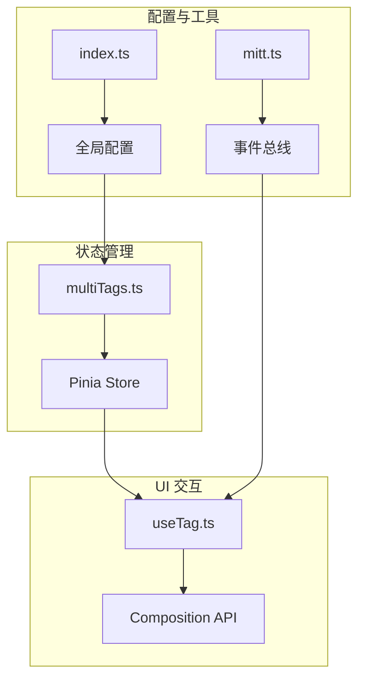
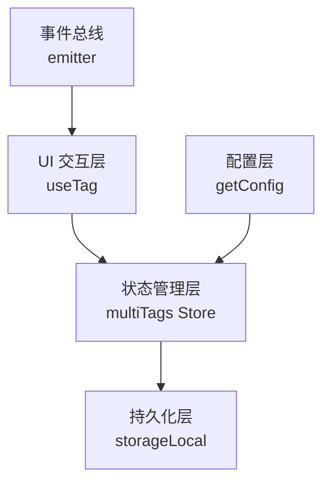
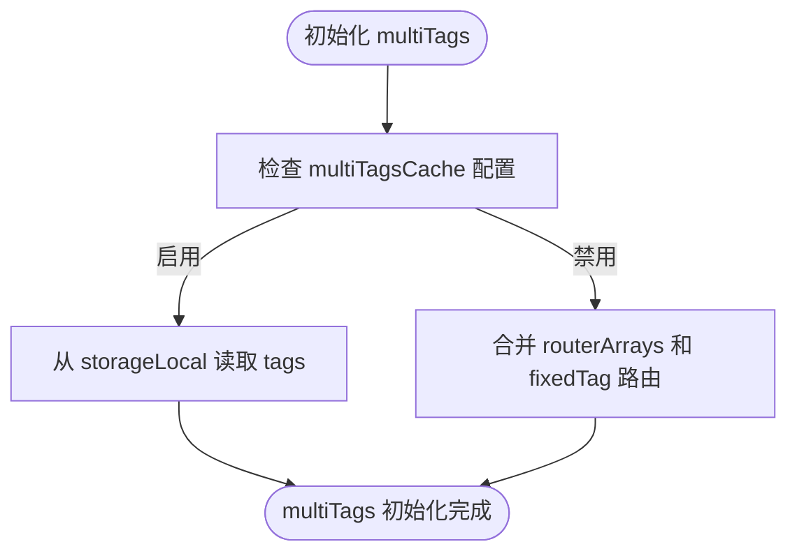
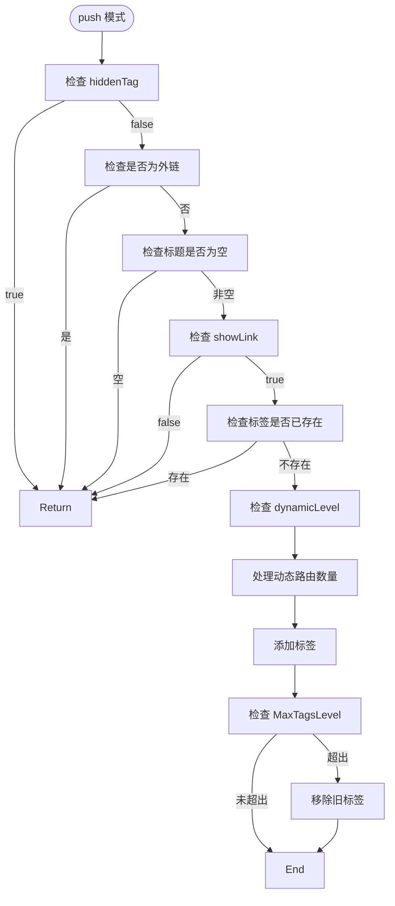
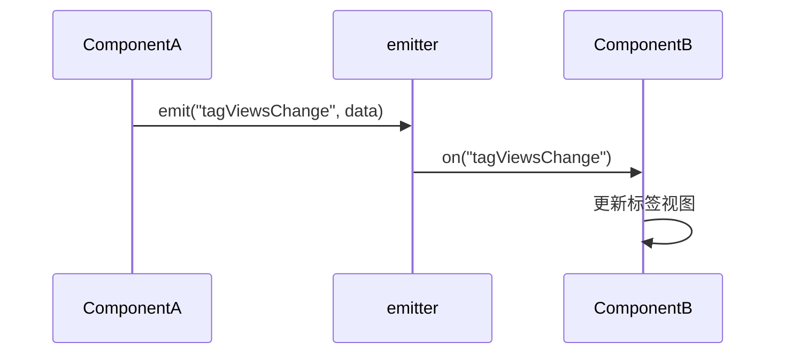

# 标签管理机制

<cite>
**本文档中引用的文件**  
- [multiTags.ts](file://web/src/store/modules/multiTags.ts)
- [useTag.ts](file://web/src/layout/hooks/useTag.ts)
- [index.ts](file://web/src/config/index.ts)
- [mitt.ts](file://web/src/utils/mitt.ts)
</cite>

## 目录
1. [简介](#简介)
2. [项目结构](#项目结构)
3. [核心组件](#核心组件)
4. [架构概述](#架构概述)
5. [详细组件分析](#详细组件分析)
6. [依赖分析](#依赖分析)
7. [性能考虑](#性能考虑)
8. [故障排除指南](#故障排除指南)
9. [结论](#结论)

## 简介
本文档深入解析 Vue Pure Admin 项目中 multiTags Store 模块的设计与实现，重点阐述标签状态的存储、同步和持久化机制。涵盖 multiTags 数组的初始化逻辑、标签缓存策略、本地存储集成、handleTags 方法的四种操作模式及其业务场景，以及动态路由层级限制和最大标签数控制的实现细节。同时解释标签去重机制，并提供通过事件总线和 store hook 进行跨组件状态同步的实际代码示例，为开发者提供完整的状态管理扩展指南。

## 项目结构
标签管理机制主要涉及以下目录和文件：
- `src/store/modules/multiTags.ts`：标签状态的核心存储模块
- `src/layout/hooks/useTag.ts`：标签页的 UI 交互与行为逻辑
- `src/config/index.ts`：全局配置获取与响应式命名空间
- `src/utils/mitt.ts`：全局事件总线定义



**Diagram sources**
- [multiTags.ts](file://web/src/store/modules/multiTags.ts#L1-L145)
- [useTag.ts](file://web/src/layout/hooks/useTag.ts#L1-L248)
- [index.ts](file://web/src/config/index.ts#L1-L55)
- [mitt.ts](file://web/src/utils/mitt.ts#L1-L21)

**Section sources**
- [multiTags.ts](file://web/src/store/modules/multiTags.ts#L1-L145)
- [useTag.ts](file://web/src/layout/hooks/useTag.ts#L1-L248)

## 核心组件
multiTags Store 模块是标签管理的核心，负责维护标签页的状态，包括标签的增删改查、缓存策略和持久化。该模块利用 Pinia 实现状态管理，并结合本地存储实现数据持久化。

**Section sources**
- [multiTags.ts](file://web/src/store/modules/multiTags.ts#L16-L140)

## 架构概述
标签管理机制采用分层架构设计，上层为 UI 交互层（useTag），中层为状态管理层（multiTags Store），底层为配置与工具支持层（config、utils）。各层通过明确的接口进行通信，确保系统的可维护性和可扩展性。



**Diagram sources**
- [multiTags.ts](file://web/src/store/modules/multiTags.ts#L16-L140)
- [useTag.ts](file://web/src/layout/hooks/useTag.ts#L31-L247)

## 详细组件分析

### multiTags Store 分析
multiTags Store 是基于 Pinia 的状态管理模块，负责维护标签页信息（multiTags）和标签缓存开关（multiTagsCache）。

#### 初始化逻辑
multiTags 的初始化逻辑如下：
- 若启用标签缓存（multiTagsCache），则从本地存储读取标签数据
- 否则，初始化为固定标签（fixedTag）和初始路由数组的合并结果



**Diagram sources**
- [multiTags.ts](file://web/src/store/modules/multiTags.ts#L16-L37)

#### 标签缓存策略
通过 `multiTagsCacheChange` 方法控制标签缓存的开启与关闭：
- 开启时，将当前标签数据写入本地存储
- 关闭时，从本地存储移除标签数据

**Section sources**
- [multiTags.ts](file://web/src/store/modules/multiTags.ts#L39-L48)

#### handleTags 方法分析
`handleTags` 方法支持四种操作模式：

```mermaid
classDiagram
class handleTags {
+equal(value) : void
+push(value) : void
+splice(value, position) : Array
+slice() : Array
}
handleTags --> "1" Mode : supports
Mode --> "equal"
Mode --> "push"
Mode --> "splice"
Mode --> "slice"
```

**Diagram sources**
- [multiTags.ts](file://web/src/store/modules/multiTags.ts#L49-L139)

##### push 模式实现细节
在 `push` 模式下，系统会进行多重判断以决定是否添加新标签：
- 检查 `hiddenTag` 元信息
- 排除外链路由
- 验证标题非空
- 检查 `showLink` 设置



**Diagram sources**
- [multiTags.ts](file://web/src/store/modules/multiTags.ts#L61-L120)

##### 动态路由限制
通过 `dynamicLevel` 元信息控制同一动态路由可打开的最大数量，超出时替换最早打开的标签。

##### 最大标签数控制
通过全局配置 `MaxTagsLevel` 限制标签总数，超出时移除索引为 1 的标签（保留首页）。

#### 标签去重机制
系统通过精确匹配路径、查询参数和路由参数来判断标签是否重复：
- 路径相等
- 查询参数对象深度相等
- 路由参数对象深度相等

**Section sources**
- [multiTags.ts](file://web/src/store/modules/multiTags.ts#L78-L95)

### useTag Hook 分析
useTag 是一个组合式函数，提供标签页的 UI 交互逻辑，包括右键菜单、标签激活状态管理、滚动控制等。

#### 事件总线集成
通过 `emitter` 事件总线实现跨组件通信：
- `tagViewsChange`：标签视图变更事件
- `tagOnClick`：标签点击事件



**Diagram sources**
- [mitt.ts](file://web/src/utils/mitt.ts#L20-L20)
- [useTag.ts](file://web/src/layout/hooks/useTag.ts#L59-L61)

**Section sources**
- [useTag.ts](file://web/src/layout/hooks/useTag.ts#L31-L247)

## 依赖分析
标签管理机制依赖以下核心模块：

```mermaid
dependency-graph
multiTags --> pinia : "state management"
multiTags --> storageLocal : "persistence"
multiTags --> getConfig : "configuration"
useTag --> multiTags : "state access"
useTag --> emitter : "event communication"
useTag --> router : "navigation"
```

**Diagram sources**
- [multiTags.ts](file://web/src/store/modules/multiTags.ts#L1-L145)
- [useTag.ts](file://web/src/layout/hooks/useTag.ts#L1-L248)

**Section sources**
- [multiTags.ts](file://web/src/store/modules/multiTags.ts#L1-L145)
- [useTag.ts](file://web/src/layout/hooks/useTag.ts#L1-L248)

## 性能考虑
- 标签缓存减少页面刷新时的初始化开销
- 深度相等比较（isEqual）确保精确去重
- 本地存储操作异步执行，避免阻塞主线程
- 动态路由数量限制防止内存过度占用

## 故障排除指南
常见问题及解决方案：
- **标签未持久化**：检查 `multiTagsCache` 配置是否启用
- **标签重复添加**：确认路由的 `meta` 信息配置正确
- **动态路由限制失效**：检查 `dynamicLevel` 元信息设置
- **最大标签数无效**：验证 `MaxTagsLevel` 全局配置是否存在

**Section sources**
- [multiTags.ts](file://web/src/store/modules/multiTags.ts#L39-L48)
- [index.ts](file://web/src/config/index.ts#L10-L26)

## 结论
multiTags Store 模块提供了一套完整的标签管理解决方案，通过合理的状态设计、缓存策略和去重机制，实现了高效、可靠的标签页管理功能。开发者可基于此机制进行扩展，如自定义缓存策略、修改标签生命周期或集成业务数据，以满足特定业务需求。