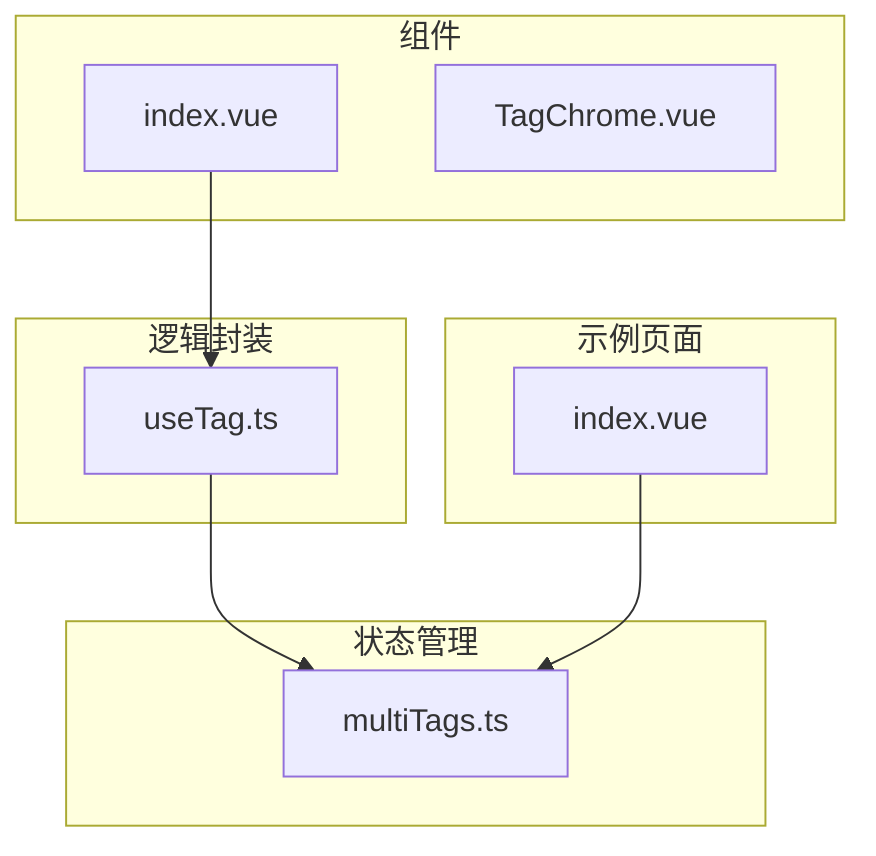
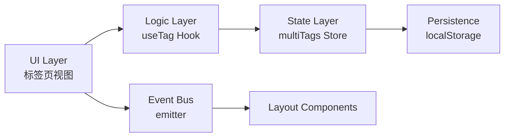
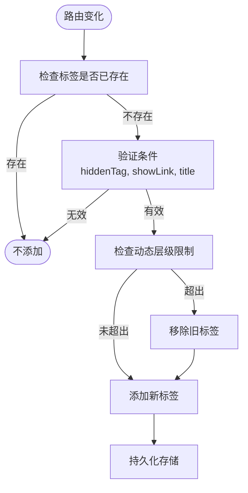
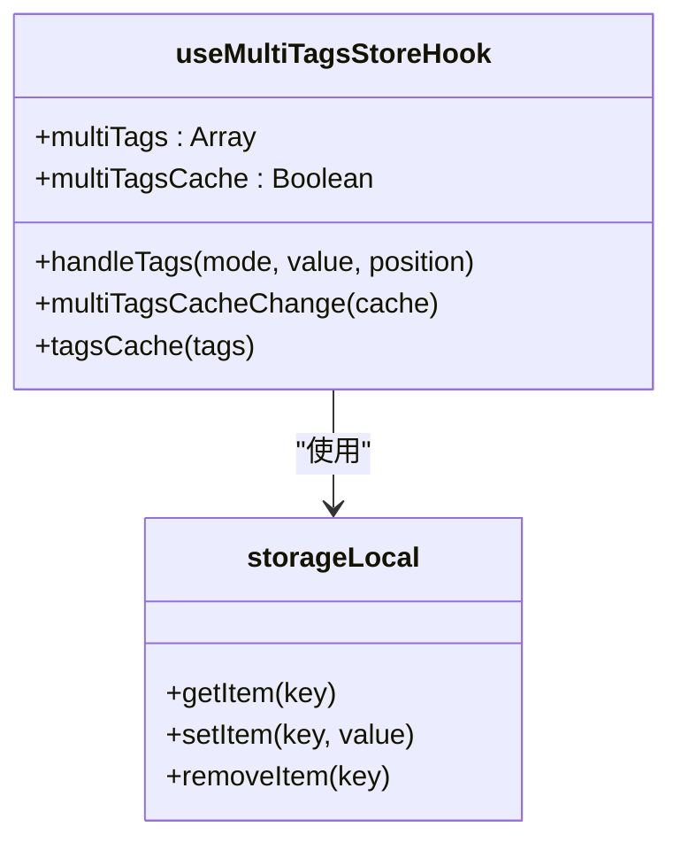
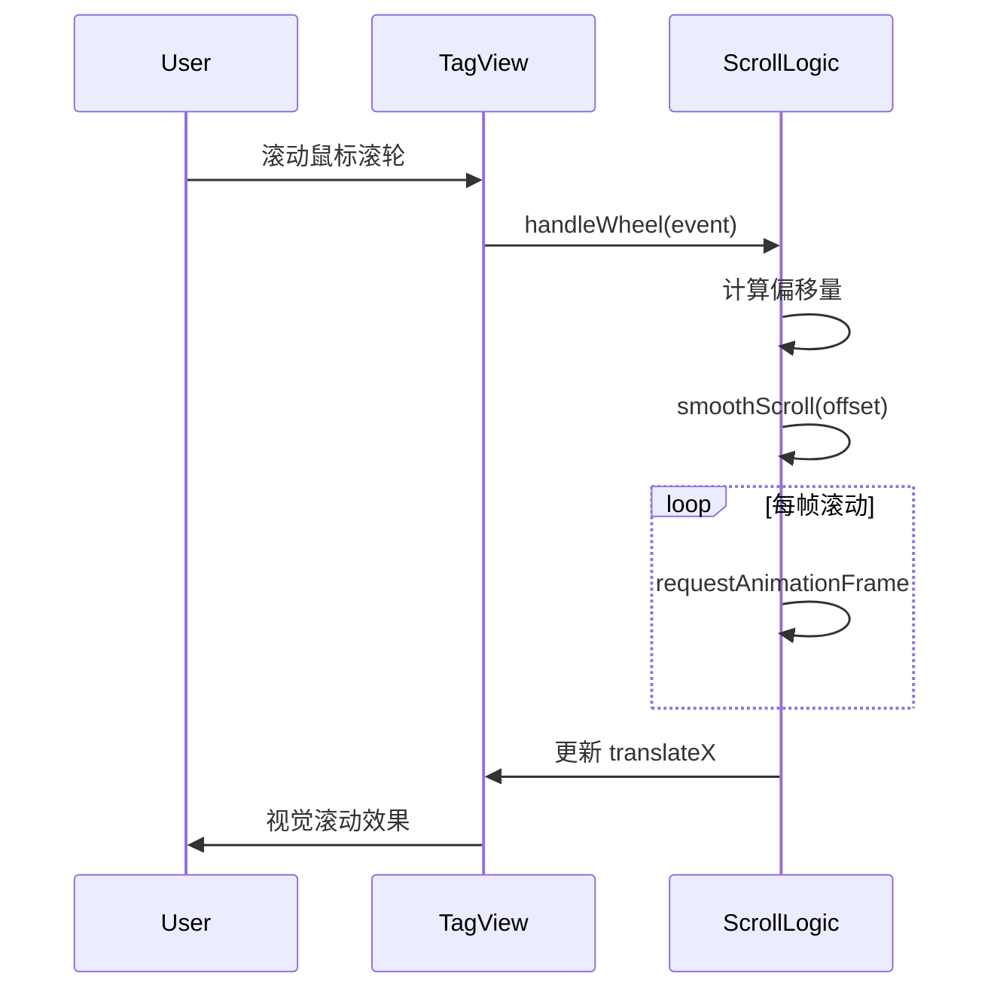
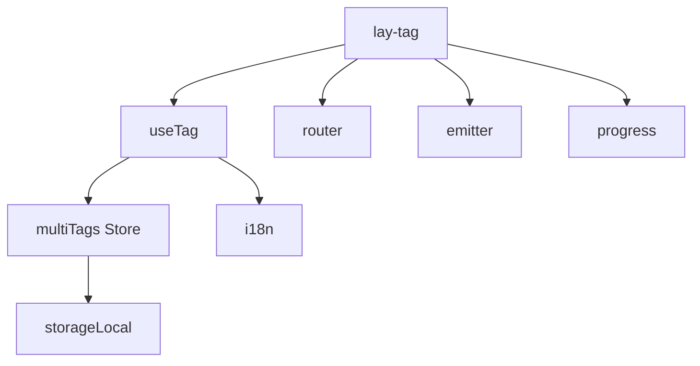

# 标签页组件

<cite>
**本文档中引用的文件**  
- [index.vue](file://web/src/layout/components/lay-tag/index.vue)
- [multiTags.ts](file://web/src/store/modules/multiTags.ts)
- [useTag.ts](file://web/src/layout/hooks/useTag.ts)
- [index.vue](file://web/src/views/tabs/index.vue)
</cite>

## 目录
1. [简介](#简介)
2. [项目结构](#项目结构)
3. [核心组件](#核心组件)
4. [架构概述](#架构概述)
5. [详细组件分析](#详细组件分析)
6. [依赖分析](#依赖分析)
7. [性能考虑](#性能考虑)
8. [故障排除指南](#故障排除指南)
9. [结论](#结论)

## 简介
本文件详细描述了 Vue Pure Admin 项目中标签页组件的设计与实现。重点涵盖标签页的生命周期管理、状态持久化、用户交互行为以及与多标签存储模块的集成机制。文档旨在为开发者提供完整的扩展与定制指南。

## 项目结构
标签页功能主要分布在 `layout/components/lay-tag` 和 `store/modules/multiTags` 目录中，通过 `useTag` 组合式函数进行逻辑封装，并在视图层通过 `views/tabs` 提供使用示例。

**图示来源**  
- [index.vue](file://web/src/layout/components/lay-tag/index.vue)
- [multiTags.ts](file://web/src/store/modules/multiTags.ts)
- [useTag.ts](file://web/src/layout/hooks/useTag.ts)
- [index.vue](file://web/src/views/tabs/index.vue)

## 核心组件
标签页组件由 `lay-tag/index.vue` 实现，采用组合式 API 封装核心逻辑于 `useTag.ts` 中，通过 Pinia 管理全局标签状态。支持多种显示模式（灵动、卡片、Chrome 风格），具备滚动、折叠、右键菜单等交互功能。

**本节来源**  
- [index.vue](file://web/src/layout/components/lay-tag/index.vue)
- [useTag.ts](file://web/src/layout/hooks/useTag.ts)

## 架构概述
系统采用分层架构设计，将 UI 层、逻辑层与状态层分离。标签页组件通过事件总线（mitt）与其他模块通信，利用 Pinia 实现标签状态的集中管理与持久化。

**图示来源**  
- [index.vue](file://web/src/layout/components/lay-tag/index.vue)
- [useTag.ts](file://web/src/layout/hooks/useTag.ts)
- [multiTags.ts](file://web/src/store/modules/multiTags.ts)

## 详细组件分析

### 标签页生命周期管理
组件通过监听路由变化自动更新标签状态，支持动态添加、关闭、切换和刷新操作。标签的唯一性由路径、查询参数和动态参数共同决定。

#### 标签添加流程

**图示来源**  
- [multiTags.ts](file://web/src/store/modules/multiTags.ts#L50-L100)

#### 标签关闭逻辑
支持关闭当前、左侧、右侧、其他及全部标签页。对于固定标签（fixedTag）或隐藏标签（hiddenTag）提供特殊处理策略。

**本节来源**  
- [index.vue](file://web/src/layout/components/lay-tag/index.vue#L200-L400)
- [multiTags.ts](file://web/src/store/modules/multiTags.ts#L100-L130)

### 状态管理与持久化
`multiTags` Store 模块负责标签状态的集中管理，支持通过 `localStorage` 进行持久化存储，配置项 `multiTagsCache` 控制是否启用缓存。

**图示来源**  
- [multiTags.ts](file://web/src/store/modules/multiTags.ts)

### 自定义事件与交互
组件通过 mitt 事件总线暴露 `tagOnClick` 事件，支持外部监听标签切换行为。右键菜单提供丰富的操作选项，包括刷新、关闭、全屏等。

**本节来源**  
- [index.vue](file://web/src/layout/components/lay-tag/index.vue#L500-L600)

### 响应式设计实现
标签页容器支持鼠标滚轮滚动，提供左右箭头导航。当标签数量超出可视区域时自动显示滚动箭头，并通过 `transformX` 实现平滑滚动动画。

**图示来源**  
- [index.vue](file://web/src/layout/components/lay-tag/index.vue#L150-L200)

## 依赖分析
组件依赖多个核心模块，形成清晰的依赖链。

**图示来源**  
- [index.vue](file://web/src/layout/components/lay-tag/index.vue)
- [useTag.ts](file://web/src/layout/hooks/useTag.ts)
- [multiTags.ts](file://web/src/store/modules/multiTags.ts)

## 性能考虑
- 使用 `useResizeObserver` 监听容器尺寸变化，避免频繁重绘
- 滚动采用 `requestAnimationFrame` 实现平滑动画
- 标签数量限制通过 `MaxTagsLevel` 配置控制，防止内存泄漏
- 路由匹配采用 `isEqual` 深度比较，确保准确性

## 故障排除指南
- **标签未添加**：检查路由 meta 中 `hiddenTag` 或 `showLink` 是否为 false
- **无法关闭标签**：确认标签是否为固定标签（fixedTag）
- **滚动失效**：检查 `scrollbarDom` 引用是否正确获取
- **状态未持久化**：确认 `multiTagsCache` 配置是否启用
- **右键菜单不显示**：检查 `visible` 状态和 `contextmenuRef` 绑定

**本节来源**  
- [index.vue](file://web/src/layout/components/lay-tag/index.vue)
- [multiTags.ts](file://web/src/store/modules/multiTags.ts)

## 结论
标签页组件实现了完整的生命周期管理、状态持久化和丰富的用户交互功能。通过合理的分层设计和模块化封装，提供了良好的可维护性和扩展性。开发者可根据业务需求自定义样式、行为和集成逻辑。