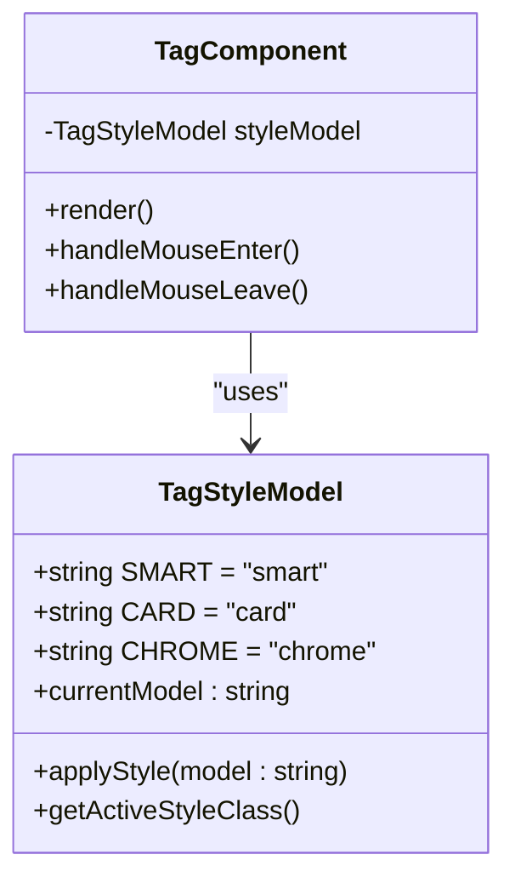
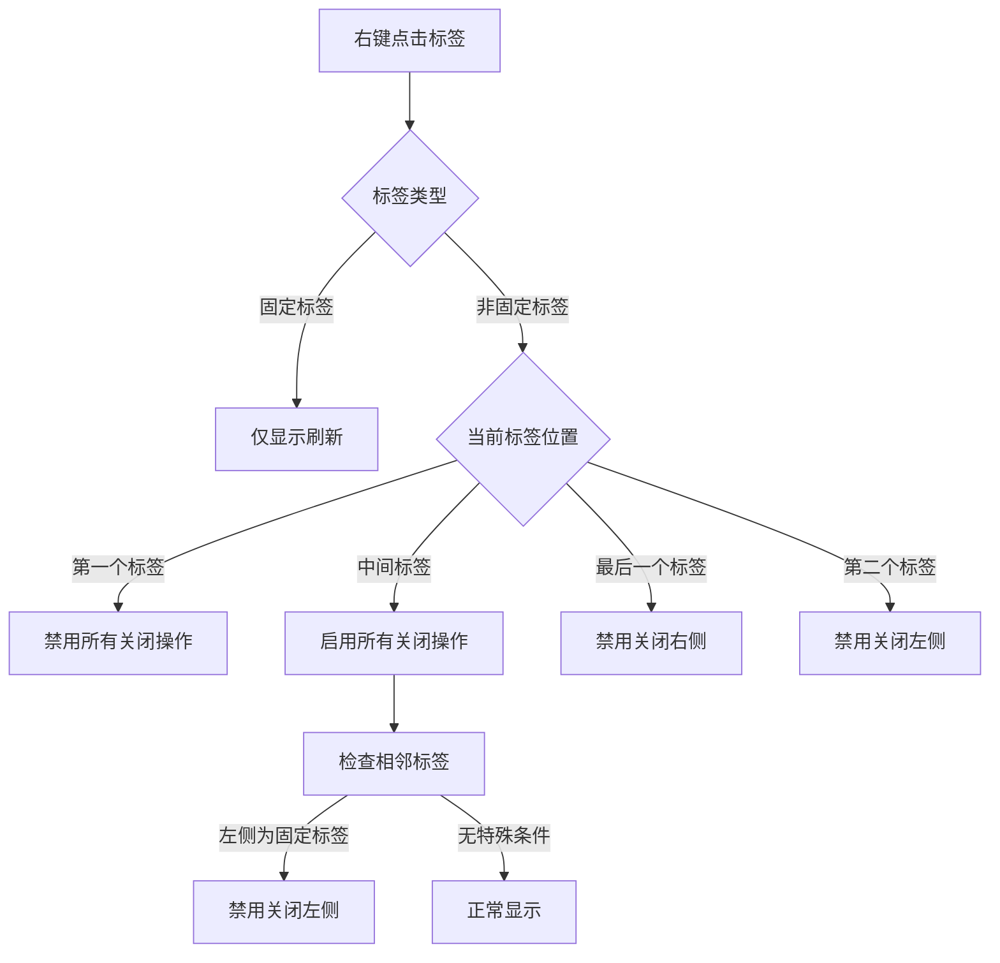
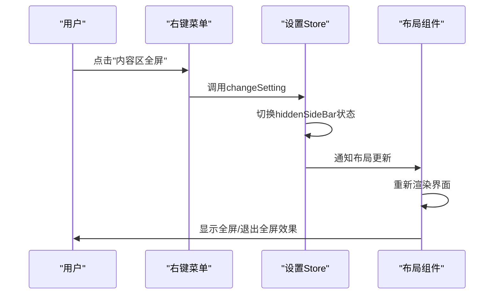
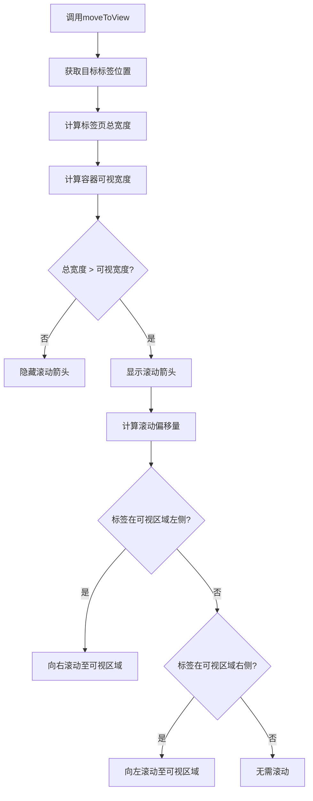

# 用户交互逻辑

<cite>
**Referenced Files in This Document**   
- [index.vue](file://web/src/layout/components/lay-tag/index.vue)
- [TagChrome.vue](file://web/src/layout/components/lay-tag/components/TagChrome.vue)
- [useTag.ts](file://web/src/layout/hooks/useTag.ts)
- [multiTags.ts](file://web/src/store/modules/multiTags.ts)
- [utils.ts](file://web/src/router/utils.ts)
- [types.ts](file://web/src/layout/types.ts)
- [mitt.ts](file://web/src/utils/mitt.ts)
</cite>

## Table of Contents
1. [核心交互机制](#核心交互机制)
2. [标签样式模式](#标签样式模式)
3. [右键菜单逻辑](#右键菜单逻辑)
4. [内容区全屏切换](#内容区全屏切换)
5. [跨组件通信](#跨组件通信)
6. [滚动与定位](#滚动与定位)
7. [开发者定制指南](#开发者定制指南)

## 核心交互机制

标签页组件实现了完整的用户交互体系，包括点击切换、鼠标悬停、滚轮导航和右键上下文菜单。点击标签通过`tagOnClick`方法触发路由跳转，并通过事件总线广播`tagOnClick`事件。鼠标悬停时，根据当前标签样式模式（灵动、卡片、Chrome）应用不同的视觉反馈动画。滚轮滚动通过`handleWheel`方法捕获并触发平滑滚动动画，支持水平方向的标签导航。

**Section sources**
- [index.vue](file://web/src/layout/components/lay-tag/index.vue#L510-L516)
- [useTag.ts](file://web/src/layout/hooks/useTag.ts#L200-L215)

## 标签样式模式

组件支持三种标签样式模式：默认（灵动）、卡片和Chrome风格。默认模式在标签下方显示动态进度条指示器，卡片模式提供立体卡片视觉效果，Chrome风格则完全模拟Chrome浏览器标签的外观。样式切换通过`showModel`状态控制，该状态存储在本地配置中并可通过事件总线全局更新。

### 样式模式对比

| 模式 | 视觉特征 | 交互反馈 | 适用场景 |
|------|--------|--------|--------|
| 默认（灵动） | 简洁扁平设计，底部进度条 | 悬停时进度条动画 | 通用场景，强调简洁性 |
| 卡片 | 立体卡片效果，阴影 | 悬停时卡片放大动画 | 需要突出层次感的界面 |
| Chrome风格 | 完全模拟Chrome标签外观 | 悬停时无特殊动画 | 追求浏览器原生体验 |



**Diagram sources**
- [index.vue](file://web/src/layout/components/lay-tag/index.vue#L561-L601)
- [useTag.ts](file://web/src/layout/hooks/useTag.ts#L100-L115)

## 右键菜单逻辑

右键菜单的显示策略基于当前上下文进行动态调整，包含"刷新"、"关闭"、"关闭左侧/右侧/其他/全部"等操作。菜单项的禁用与显示遵循严格的规则：固定标签（如首页）受到保护，无法被关闭；边界条件处理确保在标签数量不足时隐藏不适用的操作（如只有两个标签时不显示"关闭其他"）；通过`showMenuModel`函数计算当前标签位置并相应调整菜单项的可用状态。

### 右键菜单显示规则



**Diagram sources**
- [index.vue](file://web/src/layout/components/lay-tag/index.vue#L345-L393)
- [index.vue](file://web/src/layout/components/lay-tag/index.vue#L466-L516)

**Section sources**
- [index.vue](file://web/src/layout/components/lay-tag/index.vue#L345-L516)

## 内容区全屏切换

内容区全屏切换功能通过`onContentFullScreen`方法实现，该方法修改全局设置中的`hiddenSideBar`状态。当进入全屏模式时，侧边栏和标签栏被隐藏，最大化内容显示区域；退出全屏时恢复原有布局。右键菜单中的"内容区全屏"选项图标和文本会根据当前状态动态更新，提供清晰的视觉反馈。



**Diagram sources**
- [useTag.ts](file://web/src/layout/hooks/useTag.ts#L220-L230)
- [index.vue](file://web/src/layout/components/lay-tag/index.vue#L345-L393)

## 跨组件通信

组件间通信采用事件总线模式，通过`mitt`库实现的`emitter`实例进行消息传递。关键事件包括`tagOnClick`（标签点击）、`tagViewsChange`（标签显示状态变更）、`tagViewsShowModel`（标签样式模式变更）和`changLayoutRoute`（布局路由变更）。组件在挂载时订阅相关事件，在卸载时解绑，避免内存泄漏。

```mermaid
erDiagram
COMPONENT_A ||--o{ EVENT_BUS : "emits"
COMPONENT_B ||--o{ EVENT_BUS : "listens"
COMPONENT_C ||--o{ EVENT_BUS : "listens"
EVENT_BUS {
string tagOnClick
string tagViewsChange
string tagViewsShowModel
string changLayoutRoute
string imageInfo
}
COMPONENT_A {
string name: "标签组件"
string events: "tagOnClick, tagViewsChange"
}
COMPONENT_B {
string name: "布局组件"
string events: "tagViewsChange, changLayoutRoute"
}
COMPONENT_C {
string name: "设置面板"
string events: "tagViewsShowModel"
}
```

**Diagram sources**
- [mitt.ts](file://web/src/utils/mitt.ts#L4-L20)
- [index.vue](file://web/src/layout/components/lay-tag/index.vue#L510-L566)

## 滚动与定位

标签滚动定位通过`moveToView`方法实现，该方法计算目标标签在可视区域中的位置并调整滚动偏移量。平滑滚动动画由`smoothScroll`函数提供，采用`requestAnimationFrame`实现60fps的流畅动画效果。滚动控制还考虑了箭头显示逻辑，当标签总宽度超过容器宽度时显示左右滚动箭头。

### 滚动定位算法



**Diagram sources**
- [index.vue](file://web/src/layout/components/lay-tag/index.vue#L100-L200)
- [index.vue](file://web/src/layout/components/lay-tag/index.vue#L250-L300)

## 开发者定制指南

开发者可通过多种方式定制标签页交互行为。扩展右键菜单项需要修改`tagsViews`数组并相应调整事件处理逻辑。修改交互反馈可通过覆盖CSS类或调整`useTag`钩子中的动画逻辑实现。集成自定义操作建议通过事件总线模式，保持组件间的松耦合。所有标签操作最终通过`multiTagsStore`的状态管理进行，确保数据一致性。

**Section sources**
- [useTag.ts](file://web/src/layout/hooks/useTag.ts#L50-L250)
- [multiTags.ts](file://web/src/store/modules/multiTags.ts#L50-L150)