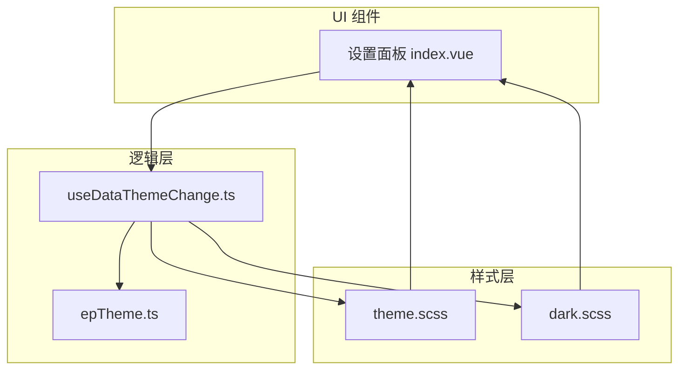
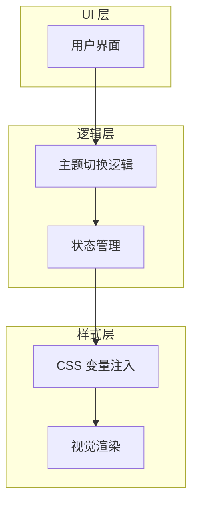
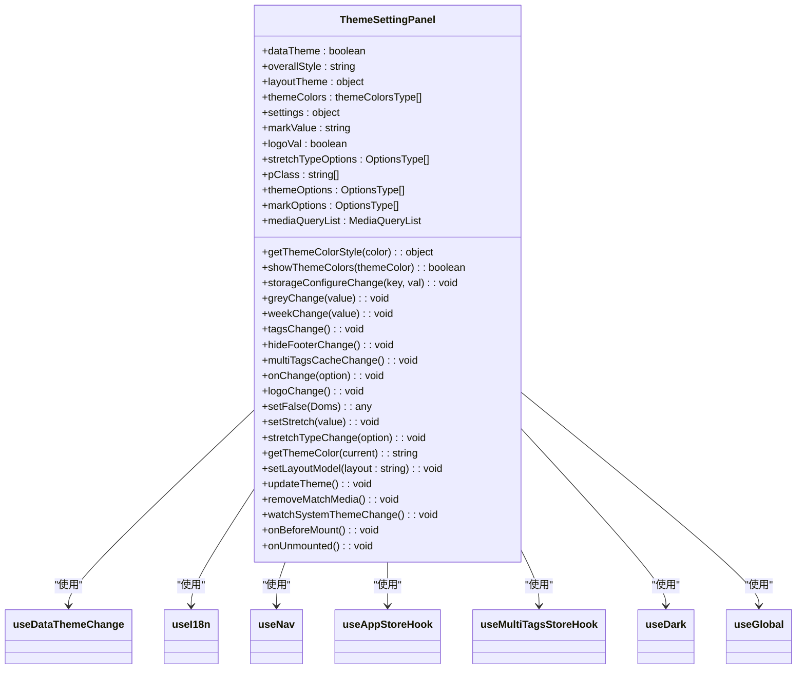
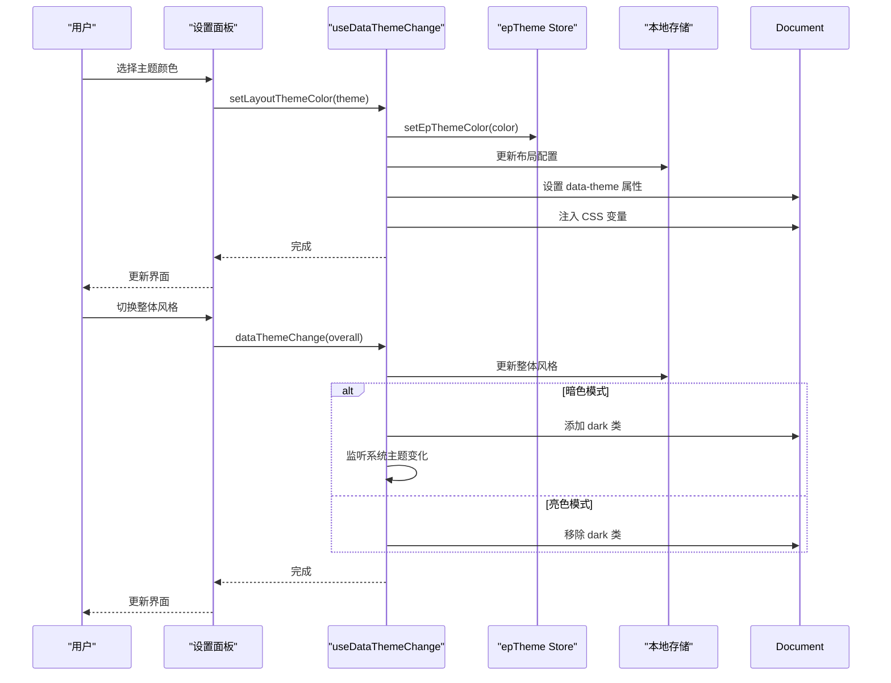
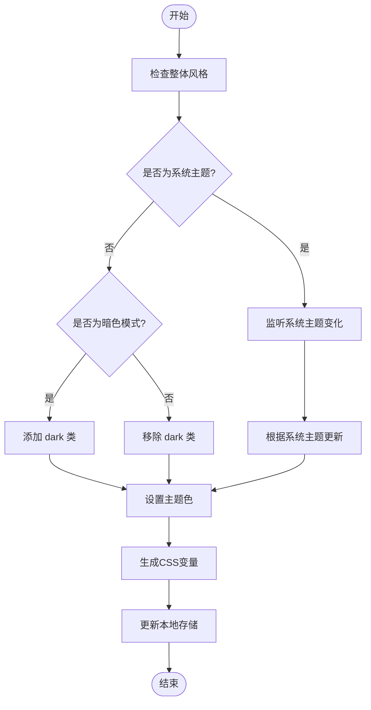

# 主题设置

<cite>
**本文档引用的文件**  
- [index.vue](file://web/src/layout/components/lay-setting/index.vue)
- [useDataThemeChange.ts](file://web/src/layout/hooks/useDataThemeChange.ts)
- [epTheme.ts](file://web/src/store/modules/epTheme.ts)
- [theme.scss](file://web/src/style/theme.scss)
- [dark.scss](file://web/src/style/dark.scss)
</cite>

## 目录
1. [简介](#简介)
2. [项目结构](#项目结构)
3. [核心组件](#核心组件)
4. [架构概览](#架构概览)
5. [详细组件分析](#详细组件分析)
6. [依赖分析](#依赖分析)
7. [性能考虑](#性能考虑)
8. [故障排除指南](#故障排除指南)
9. [结论](#结论)

## 简介
本文档深入解析 Vue Pure Admin 项目中设置面板的主题设置功能。重点描述主题颜色选择器的实现机制，包括亮白色、道奇蓝、深紫罗兰色等8种预设主题的配置与切换逻辑。详细说明 `dataTheme` 和 `overallStyle` 状态管理，以及如何通过 `useDataThemeChange` Hook 实现主题的动态切换。解释 CSS 变量在主题系统中的应用，特别是 `--el-color-primary` 系列变量的动态计算与注入。提供暗黑模式的完整实现方案，包括 HTML 类名控制、系统主题监听（mediaQuery）和动态样式加载。展示主题色与 Element Plus 组件库的深度集成，说明主色及其9级明度变体的生成算法。为开发者提供扩展指南，包括如何添加自定义主题、修改主题色盘和集成第三方 UI 框架主题。

## 项目结构
主题设置功能主要分布在以下几个目录中：
- `web/src/layout/components/lay-setting/`：包含设置面板的主组件 `index.vue`
- `web/src/layout/hooks/`：包含主题切换逻辑的自定义 Hook `useDataThemeChange.ts`
- `web/src/store/modules/`：包含主题状态管理的 Pinia Store `epTheme.ts`
- `web/src/style/`：包含主题相关的 SCSS 文件 `theme.scss` 和 `dark.scss`



**Diagram sources**
- [index.vue](file://web/src/layout/components/lay-setting/index.vue)
- [useDataThemeChange.ts](file://web/src/layout/hooks/useDataThemeChange.ts)
- [epTheme.ts](file://web/src/store/modules/epTheme.ts)
- [theme.scss](file://web/src/style/theme.scss)
- [dark.scss](file://web/src/style/dark.scss)

**Section sources**
- [index.vue](file://web/src/layout/components/lay-setting/index.vue)
- [useDataThemeChange.ts](file://web/src/layout/hooks/useDataThemeChange.ts)

## 核心组件
主题设置功能的核心组件是 `lay-setting/index.vue`，它使用了 `useDataThemeChange` Hook 来管理主题状态和切换逻辑。该组件提供了用户界面来选择不同的主题颜色、布局模式和界面显示选项。

**Section sources**
- [index.vue](file://web/src/layout/components/lay-setting/index.vue)
- [useDataThemeChange.ts](file://web/src/layout/hooks/useDataThemeChange.ts)

## 架构概览
主题系统采用分层架构，从上到下分为 UI 层、逻辑层和样式层。UI 层负责展示和用户交互，逻辑层负责状态管理和业务逻辑，样式层负责具体的视觉表现。



**Diagram sources**
- [index.vue](file://web/src/layout/components/lay-setting/index.vue)
- [useDataThemeChange.ts](file://web/src/layout/hooks/useDataThemeChange.ts)
- [epTheme.ts](file://web/src/store/modules/epTheme.ts)

## 详细组件分析

### 主题设置面板分析
主题设置面板组件 `index.vue` 提供了完整的用户界面来配置主题相关选项，包括整体风格、主题颜色、布局模式、页面拉伸、标签页样式和界面显示设置。

#### 对象导向组件


**Diagram sources**
- [index.vue](file://web/src/layout/components/lay-setting/index.vue)
- [useDataThemeChange.ts](file://web/src/layout/hooks/useDataThemeChange.ts)

#### API/服务组件


**Diagram sources**
- [index.vue](file://web/src/layout/components/lay-setting/index.vue)
- [useDataThemeChange.ts](file://web/src/layout/hooks/useDataThemeChange.ts)
- [epTheme.ts](file://web/src/store/modules/epTheme.ts)

#### 复杂逻辑组件


**Diagram sources**
- [useDataThemeChange.ts](file://web/src/layout/hooks/useDataThemeChange.ts)
- [dark.scss](file://web/src/style/dark.scss)

**Section sources**
- [index.vue](file://web/src/layout/components/lay-setting/index.vue)
- [useDataThemeChange.ts](file://web/src/layout/hooks/useDataThemeChange.ts)

## 依赖分析
主题设置功能依赖于多个模块和外部库，形成了复杂的依赖关系网络。

```mermaid
graph TD
SettingPanel --> useDataThemeChange
useDataThemeChange --> useLayout
useDataThemeChange --> useEpThemeStoreHook
useDataThemeChange --> useAppStoreHook
useDataThemeChange --> useMultiTagsStoreHook
useDataThemeChange --> @pureadmin/utils
useDataThemeChange --> getConfig
useEpThemeStoreHook --> pinia
useEpThemeStoreHook --> storageLocal
useLayout --> getConfig
@pureadmin/utils --> darken
@pureadmin/utils --> lighten
SettingPanel --> vue-i18n
SettingPanel --> mitt
SettingPanel --> ReSegmented
SettingPanel --> LayPanel
SettingPanel --> useNav
SettingPanel --> useAppStoreHook
SettingPanel --> useMultiTagsStoreHook
SettingPanel --> useDark
SettingPanel --> useGlobal
```

**Diagram sources**
- [index.vue](file://web/src/layout/components/lay-setting/index.vue)
- [useDataThemeChange.ts](file://web/src/layout/hooks/useDataThemeChange.ts)
- [epTheme.ts](file://web/src/store/modules/epTheme.ts)

**Section sources**
- [index.vue](file://web/src/layout/components/lay-setting/index.vue)
- [useDataThemeChange.ts](file://web/src/layout/hooks/useDataThemeChange.ts)
- [epTheme.ts](file://web/src/store/modules/epTheme.ts)

## 性能考虑
主题切换功能在设计时考虑了性能优化，主要体现在以下几个方面：
- 使用 CSS 变量而不是动态生成 CSS 样式表，减少重排和重绘
- 通过 `debounce` 函数防抖，避免频繁的状态更新
- 使用 `computed` 属性缓存计算结果，避免重复计算
- 仅在必要时监听系统主题变化，减少不必要的事件监听
- 使用 `ref` 和 `reactive` 进行精细的状态管理，避免不必要的响应式开销

## 故障排除指南
### 常见问题及解决方案

| 问题现象 | 可能原因 | 解决方案 |
|---------|--------|--------|
| 主题切换无效 | 本地存储未正确更新 | 检查 `$storage.layout` 的更新逻辑 |
| 暗色模式不生效 | `dark` 类未正确添加 | 检查 `dataThemeChange` 函数中的类名操作 |
| 主题色未应用 | CSS 变量未正确注入 | 检查 `setEpThemeColor` 函数中的 `setProperty` 调用 |
| 系统主题监听失效 | mediaQuery 事件未正确绑定 | 检查 `watchSystemThemeChange` 函数的实现 |
| 预设主题颜色丢失 | `themeColors` 数组被修改 | 检查 `useDataThemeChange` 中的 `themeColors` 定义 |

**Section sources**
- [useDataThemeChange.ts](file://web/src/layout/hooks/useDataThemeChange.ts)
- [dark.scss](file://web/src/style/dark.scss)

## 结论
Vue Pure Admin 的主题设置功能通过分层架构实现了灵活的主题管理。核心机制包括：
1. 使用 `dataTheme` 和 `overallStyle` 状态管理整体风格
2. 通过 `useDataThemeChange` Hook 封装主题切换逻辑
3. 利用 CSS 变量实现 `--el-color-primary` 系列变量的动态计算与注入
4. 通过 `dark` 类名控制暗黑模式，并监听系统主题变化
5. 与 Element Plus 组件库深度集成，生成主色的9级明度变体

该设计具有良好的扩展性，开发者可以通过添加新的主题配置、修改主题色盘或集成第三方 UI 框架主题来扩展功能。整体架构清晰，性能优化到位，为用户提供了流畅的主题切换体验。