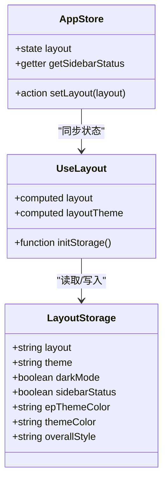
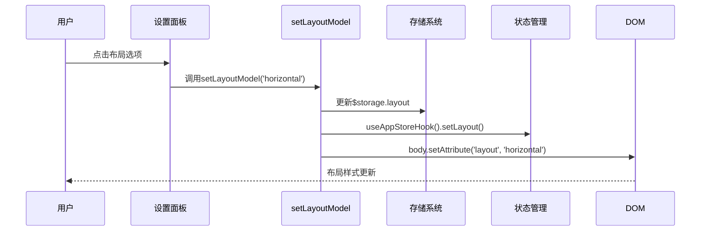
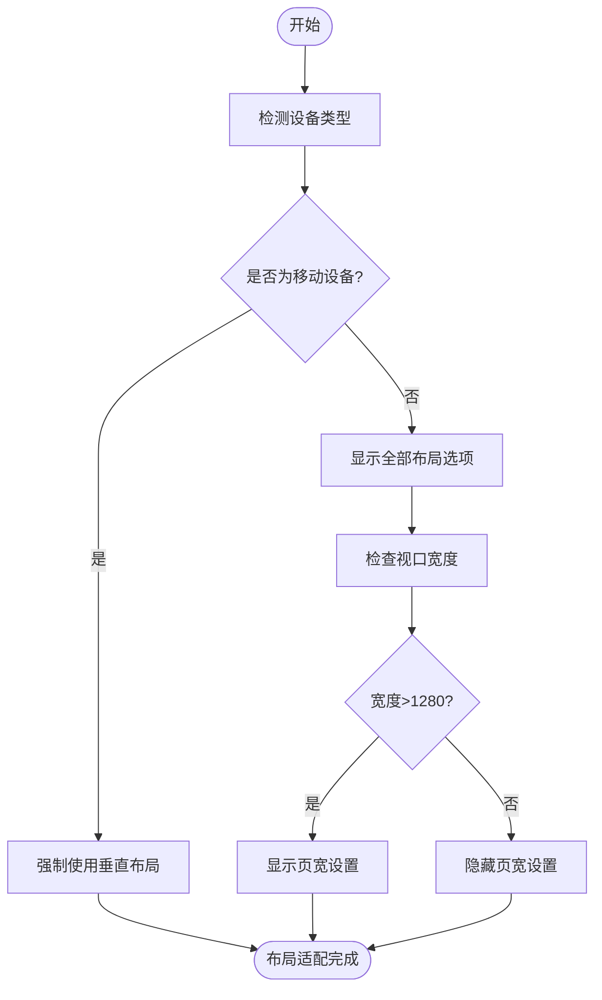

# 布局设置

<cite>
**本文档引用文件**  
- [useLayout.ts](file://web/src/layout/hooks/useLayout.ts)
- [useDataThemeChange.ts](file://web/src/layout/hooks/useDataThemeChange.ts)
- [index.vue](file://web/src/layout/components/lay-setting/index.vue)
- [app.ts](file://web/src/store/modules/app.ts)
- [theme.scss](file://web/src/style/theme.scss)
</cite>

## 目录
1. [简介](#简介)
2. [布局模式详解](#布局模式详解)
3. [布局状态管理](#布局状态管理)
4. [布局切换机制](#布局切换机制)
5. [响应式适配策略](#响应式适配策略)
6. [动画与过渡效果](#动画与过渡效果)
7. [扩展与自定义指南](#扩展与自定义指南)
8. [结论](#结论)

## 简介
本系统提供三种核心布局模式：垂直、水平和混合布局，支持灵活的UI配置与动态切换。通过集成状态管理、主题控制和响应式设计，系统能够适应不同设备与用户偏好。本文档全面阐述布局系统的配置机制、状态同步逻辑、设备适配策略及扩展方法，为开发者提供完整的布局控制方案。

## 布局模式详解

系统支持三种主要布局模式，每种模式具有独特的UI结构与适用场景：

- **垂直布局（vertical）**：侧边栏位于左侧，主导航区域垂直排列，适用于内容密集型管理后台，提供清晰的层级结构。
- **水平布局（horizontal）**：主导航位于顶部，侧边栏作为次级菜单，适合功能模块较少、强调横向浏览的界面。
- **混合布局（mix）**：结合顶部主菜单与左侧子菜单，实现功能分层，适用于复杂系统中多级导航的场景。

这些布局模式通过CSS类与HTML结构差异实现视觉区分，并在移动端自动隐藏非垂直布局以优化空间利用。

**Section sources**
- [index.vue](file://web/src/layout/components/lay-setting/index.vue#L241-L254)
- [useLayout.ts](file://web/src/layout/hooks/useLayout.ts#L6-L63)

## 布局状态管理

布局配置通过`$storage.layout`对象在浏览器本地存储中持久化管理，包含以下关键属性：

- `layout`：当前布局模式（vertical/horizontal/mix）
- `theme`：当前主题色方案
- `darkMode`：深色模式状态
- `sidebarStatus`：侧边栏展开状态
- `epThemeColor`：Element Plus组件库主题色
- `themeColor`：当前主题颜色标识
- `overallStyle`：整体风格（浅色/深色/跟随系统）

该状态对象由`useLayout` Hook初始化，并通过Pinia状态管理模块`app.ts`进行同步，确保应用层面的状态一致性。

**Diagram sources**
- [useLayout.ts](file://web/src/layout/hooks/useLayout.ts#L6-L63)
- [app.ts](file://web/src/store/modules/app.ts#L9-L90)

## 布局切换机制

布局切换由`setLayoutModel`函数驱动，其核心逻辑如下：

1. 更新`layoutTheme`计算属性中的`layout`值
2. 设置`body`元素的`layout`属性以触发CSS样式变化
3. 持久化更新`$storage.layout`对象
4. 调用`useAppStoreHook().setLayout()`同步全局状态

该函数通过响应式机制通知所有依赖组件重新渲染，确保UI一致性。主题色切换则通过`useDataThemeChange`中的`setLayoutThemeColor`实现，动态修改`document.documentElement`的`data-theme`属性，并更新CSS自定义变量。

**Diagram sources**
- [index.vue](file://web/src/layout/components/lay-setting/index.vue#L241-L254)
- [useDataThemeChange.ts](file://web/src/layout/hooks/useDataThemeChange.ts#L50-L80)

## 响应式适配策略

系统采用设备检测与断点控制相结合的响应式策略：

- 在移动端（device === 'mobile'），水平与混合布局选项被隐藏，强制使用垂直布局
- 通过`useNav` Hook检测设备类型，动态渲染可用布局选项
- 视口尺寸变化时，`app.ts`中的`viewportSize`状态自动更新
- 布局切换面板根据屏幕宽度条件渲染“页宽”设置项（>1280px时显示）

该策略确保在小屏幕设备上始终提供最佳用户体验，避免复杂布局导致的操作困难。

**Diagram sources**
- [index.vue](file://web/src/layout/components/lay-setting/index.vue#L200-L210)
- [app.ts](file://web/src/store/modules/app.ts#L15-L25)

## 动画与过渡效果

系统通过以下方式实现布局切换的平滑动画：

- 利用CSS过渡属性控制侧边栏展开/收起动画
- 使用Element Plus的`el-switch`组件内置过渡效果
- 在`transition.scss`中定义全局过渡类
- 通过`useLayout`的`withoutAnimation`标志控制动画启停

布局切换本身不包含复杂动画，但相关UI元素（如侧边栏、下拉菜单）均配置了`transition`属性，确保视觉流畅性。开发者可扩展`sidebar.scss`中的过渡规则以自定义动画效果。

**Section sources**
- [useLayout.ts](file://web/src/layout/hooks/useLayout.ts#L40-L50)
- [app.ts](file://web/src/store/modules/app.ts#L40-L50)

## 扩展与自定义指南

### 添加自定义布局模式
1. 在`useLayout.ts`的默认配置中添加新布局标识
2. 在`lay-setting/index.vue`的布局选择UI中添加新选项
3. 编写对应的SCSS样式规则，基于`body[layout="new-mode"]`选择器
4. 更新`theme.scss`中的主题变量以支持新布局

### 修改布局样式
- 编辑`style/sidebar.scss`中的布局相关CSS规则
- 使用`data-theme`属性配合SCSS变量实现主题适配
- 通过`--el-color-primary`等CSS变量统一组件色调

### 集成响应式断点
1. 修改`utils/responsive.ts`中的断点定义
2. 在`useNav`中更新设备检测逻辑
3. 调整`lay-setting.vue`中的条件渲染阈值
4. 测试不同屏幕尺寸下的布局表现

**Section sources**
- [useLayout.ts](file://web/src/layout/hooks/useLayout.ts#L20-L30)
- [index.vue](file://web/src/layout/components/lay-setting/index.vue#L241-L254)
- [theme.scss](file://web/src/style/theme.scss#L1-L95)

## 结论
本布局系统通过组合式API、Pinia状态管理与CSS变量技术，实现了高度可配置的界面布局方案。其核心优势在于状态持久化、响应式适配与主题联动机制。开发者可基于现有架构轻松扩展新布局模式或定制视觉风格，满足多样化的产品需求。