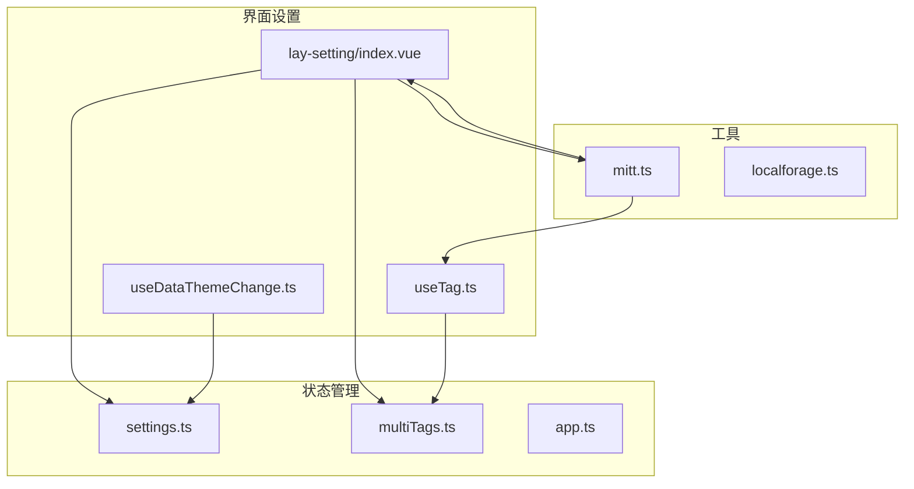
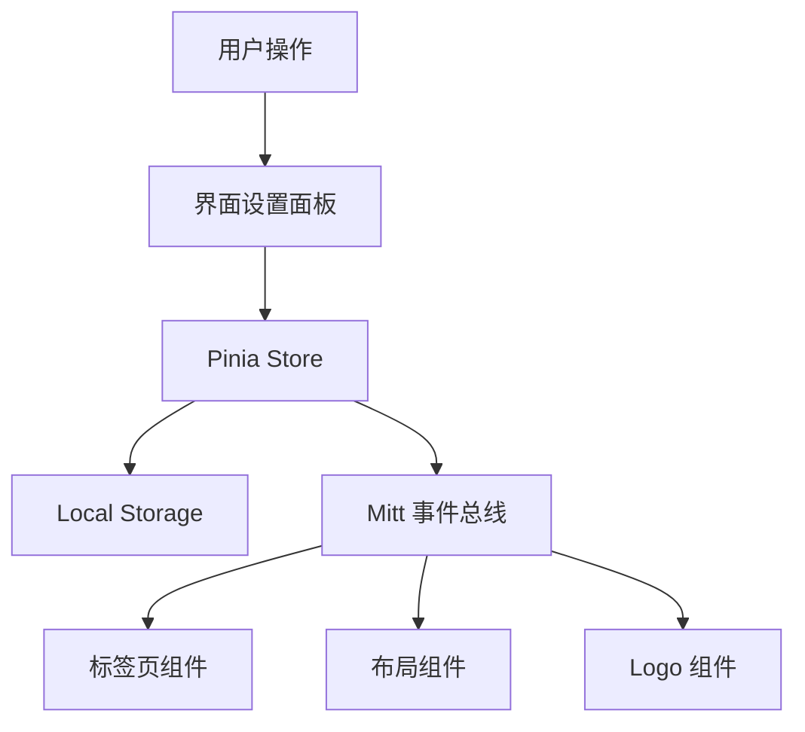
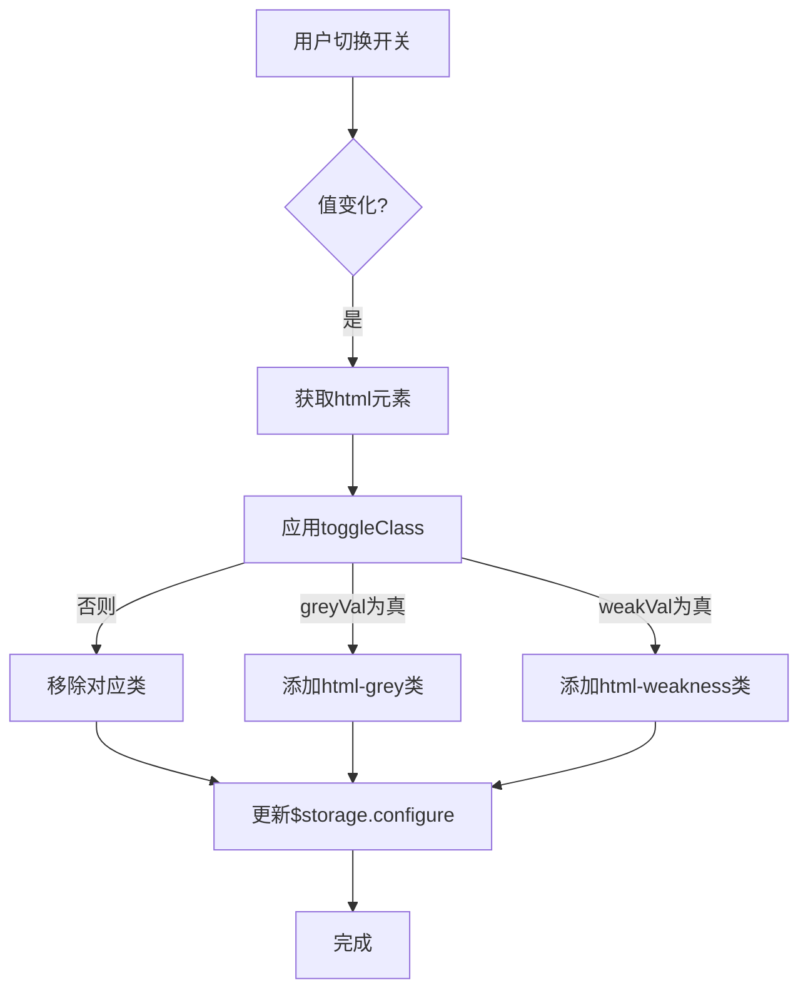
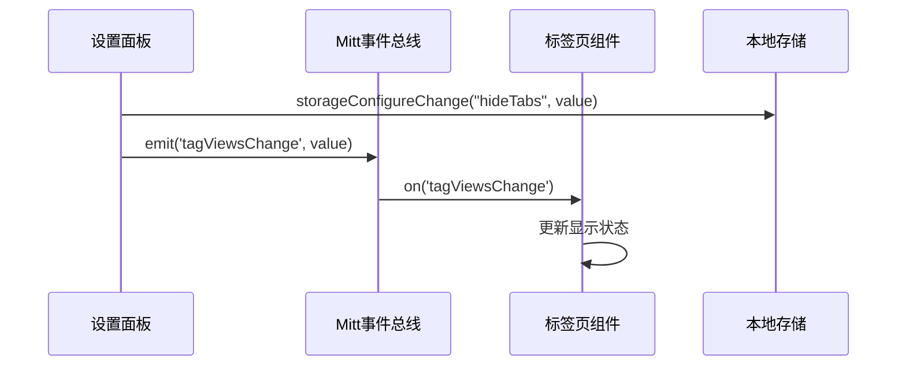
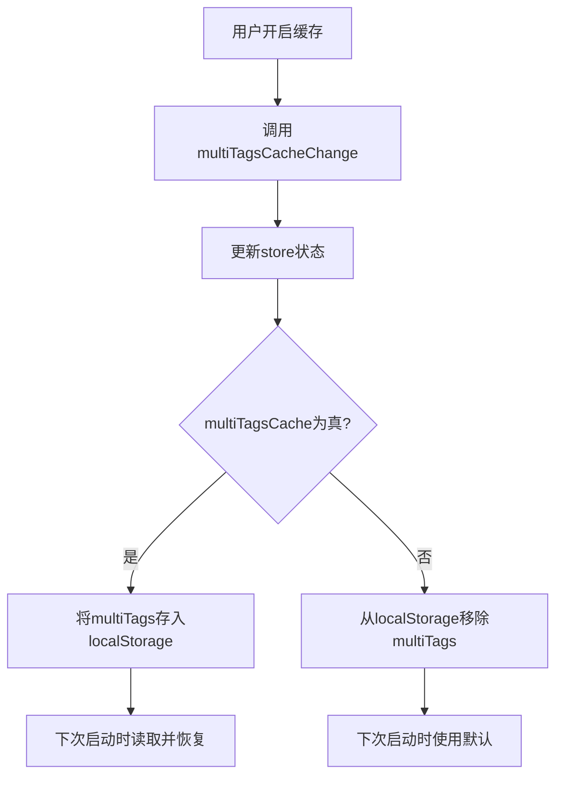
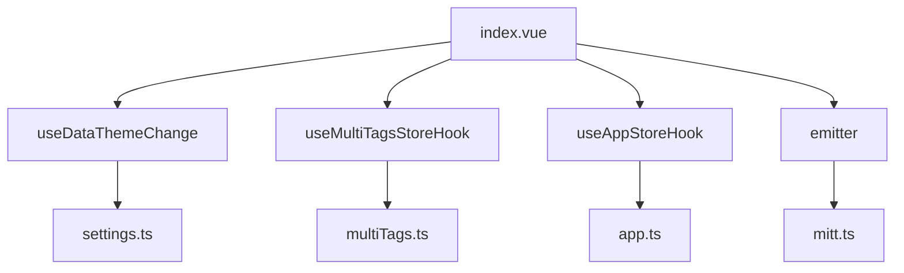

# 界面设置

<cite>
**本文档中引用的文件**  
- [index.vue](file://web/src/layout/components/lay-setting/index.vue)
- [settings.ts](file://web/src/store/modules/settings.ts)
- [multiTags.ts](file://web/src/store/modules/multiTags.ts)
- [mitt.ts](file://web/src/utils/mitt.ts)
- [useTag.ts](file://web/src/layout/hooks/useTag.ts)
</cite>

## 目录
1. [简介](#简介)
2. [项目结构](#项目结构)
3. [核心组件](#核心组件)
4. [架构概述](#架构概述)
5. [详细组件分析](#详细组件分析)
6. [依赖分析](#依赖分析)
7. [性能考虑](#性能考虑)
8. [故障排除指南](#故障排除指南)
9. [结论](#结论)

## 简介
本文档系统性地介绍了 `vue-pure-admin` 项目中界面设置功能的实现机制。重点涵盖灰色模式、色弱模式、标签页显示控制、页脚与 Logo 显示状态的持久化存储、多标签页缓存、页宽设置等核心功能。通过分析相关组件与状态管理逻辑，阐述其技术实现原理与最佳实践。

## 项目结构
界面设置功能主要由布局组件、状态管理模块和工具函数构成，分布在 `src` 目录下的多个子模块中。

**Diagram sources**
- [index.vue](file://web/src/layout/components/lay-setting/index.vue)
- [settings.ts](file://web/src/store/modules/settings.ts)
- [multiTags.ts](file://web/src/store/modules/multiTags.ts)
- [mitt.ts](file://web/src/utils/mitt.ts)

**Section sources**
- [index.vue](file://web/src/layout/components/lay-setting/index.vue)
- [settings.ts](file://web/src/store/modules/settings.ts)
- [multiTags.ts](file://web/src/store/modules/multiTags.ts)
- [mitt.ts](file://web/src/utils/mitt.ts)

## 核心组件
核心组件 `lay-setting/index.vue` 提供了用户界面设置的可视化面板，集成了主题、布局、标签页样式、显示开关等配置项。该组件通过 Pinia 状态管理库与 `mitt` 事件总线，实现了配置的持久化存储与跨组件通信。

**Section sources**
- [index.vue](file://web/src/layout/components/lay-setting/index.vue)
- [useDataThemeChange.ts](file://web/src/layout/hooks/useDataThemeChange.ts)

## 架构概述
系统采用 Vue 3 的组合式 API 构建，利用 Pinia 进行全局状态管理，并通过 `mitt` 库实现轻量级事件通信。界面配置信息通过 `localforage` 存储在浏览器本地，确保用户设置在页面刷新后得以保留。

**Diagram sources**
- [index.vue](file://web/src/layout/components/lay-setting/index.vue)
- [settings.ts](file://web/src/store/modules/settings.ts)
- [multiTags.ts](file://web/src/store/modules/multiTags.ts)
- [mitt.ts](file://web/src/utils/mitt.ts)

## 详细组件分析

### 界面设置面板分析
`lay-setting/index.vue` 组件是用户配置界面的核心入口，它通过响应式数据绑定和事件监听，实时反映并更新用户的设置。

#### 灰色模式与色弱模式实现
灰色模式和色弱模式通过动态切换 HTML 元素上的 CSS 类来实现。当用户开启灰色模式时，系统会为 `<html>` 标签添加 `html-grey` 类；开启色弱模式时，则添加 `html-weakness` 类。这两个类在全局样式中定义了相应的滤镜效果，从而改变整个页面的视觉呈现。

**Diagram sources**
- [index.vue](file://web/src/layout/components/lay-setting/index.vue#L100-L115)

**Section sources**
- [index.vue](file://web/src/layout/components/lay-setting/index.vue#L100-L120)

#### 标签页显示/隐藏控制机制
标签页的显示与隐藏通过 `mitt` 事件总线实现跨组件通信。当用户在设置面板中切换“隐藏标签页”开关时，会触发 `tagsChange` 函数，该函数首先更新本地存储中的配置，然后通过 `emitter.emit('tagViewsChange', showVal)` 发出事件。

**Diagram sources**
- [index.vue](file://web/src/layout/components/lay-setting/index.vue#L117-L125)
- [mitt.ts](file://web/src/utils/mitt.ts#L20)
- [useTag.ts](file://web/src/layout/hooks/useTag.ts#L38-L42)

**Section sources**
- [index.vue](file://web/src/layout/components/lay-setting/index.vue#L117-L125)
- [useTag.ts](file://web/src/layout/hooks/useTag.ts#L38-L42)

#### 页脚与Logo显示状态持久化
页脚和 Logo 的显示状态通过 `$storage.configure` 对象进行管理。该对象利用 `localforage` 将配置数据持久化存储在浏览器的 IndexedDB 或 localStorage 中。当组件挂载时，会从存储中读取初始值，并在用户操作后立即更新存储，确保状态的持久性。

**Section sources**
- [index.vue](file://web/src/layout/components/lay-setting/index.vue#L32-L35)
- [index.vue](file://web/src/layout/components/lay-setting/index.vue#L135-L143)
- [index.vue](file://web/src/layout/components/lay-setting/index.vue#L155-L161)

#### 多标签页缓存功能实现
多标签页缓存功能由 `multiTags` 模块管理。当用户开启“多标签页缓存”选项时，`multiTagsCacheChange` 函数会被调用，它不仅更新 `multiTagsStore` 中的 `multiTagsCache` 状态，还会将当前的标签页信息 (`multiTags`) 保存到本地存储中。当用户下次进入应用时，如果缓存开启，系统会优先从存储中恢复标签页状态。

**Diagram sources**
- [index.vue](file://web/src/layout/components/lay-setting/index.vue#L145-L153)
- [multiTags.ts](file://web/src/store/modules/multiTags.ts#L10-L25)

**Section sources**
- [index.vue](file://web/src/layout/components/lay-setting/index.vue#L145-L153)
- [multiTags.ts](file://web/src/store/modules/multiTags.ts#L10-L25)

#### 页宽设置模式
页宽设置提供“固定”和“自定义”两种模式。用户通过 `Segmented` 组件进行选择。选择“固定”模式时，页面宽度由系统自动管理；选择“自定义”模式时，用户可以通过输入框精确设置页面宽度（范围1280-1600px）。该设置同样通过 `storageConfigureChange` 函数持久化。

**Section sources**
- [index.vue](file://web/src/layout/components/lay-setting/index.vue#L175-L200)

## 依赖分析
界面设置功能依赖于多个核心模块，形成了清晰的依赖链。

**Diagram sources**
- [index.vue](file://web/src/layout/components/lay-setting/index.vue)
- [settings.ts](file://web/src/store/modules/settings.ts)
- [multiTags.ts](file://web/src/store/modules/multiTags.ts)
- [mitt.ts](file://web/src/utils/mitt.ts)

**Section sources**
- [index.vue](file://web/src/layout/components/lay-setting/index.vue)
- [settings.ts](file://web/src/store/modules/settings.ts)
- [multiTags.ts](file://web/src/store/modules/multiTags.ts)

## 性能考虑
- **CSS 类切换**：使用 `html-grey` 和 `html-weakness` 类通过 CSS `filter` 属性实现视觉效果，相比 JavaScript 逐个修改元素样式，性能开销更小。
- **事件总线**：`mitt` 作为轻量级事件总线，避免了深层组件间的 props 传递，减少了不必要的组件重渲染。
- **本地存储**：使用 `localforage` 进行异步存储，避免了 `localStorage` 同步操作可能带来的主线程阻塞。

## 故障排除指南
- **设置不生效**：检查浏览器是否禁用了本地存储（IndexedDB 或 localStorage），或尝试清除应用数据后重试。
- **事件未触发**：确认 `mitt` 事件的监听器是否在组件卸载时被正确移除，避免内存泄漏。
- **样式冲突**：检查 `html-grey` 和 `html-weakness` 类的 CSS 优先级，确保其能够正确覆盖其他样式。

**Section sources**
- [index.vue](file://web/src/layout/components/lay-setting/index.vue)
- [mitt.ts](file://web/src/utils/mitt.ts)

## 结论
`vue-pure-admin` 的界面设置功能设计精巧，通过组合式 API、Pinia 状态管理、Mitt 事件总线和本地持久化存储，实现了高度可配置且用户体验良好的界面。其模块化的设计使得功能易于维护和扩展，为开发者提供了清晰的实现范例。