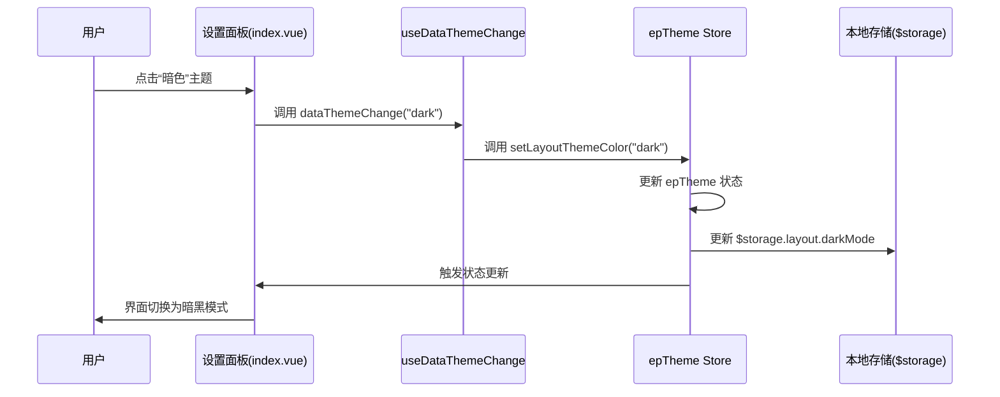
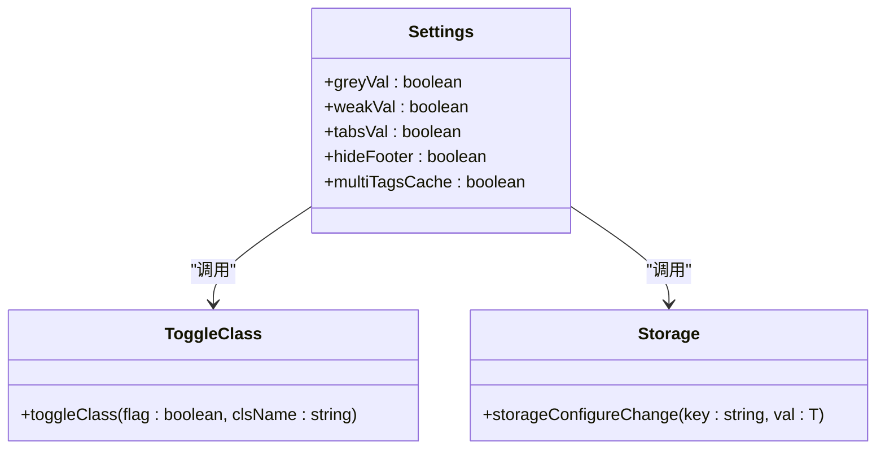
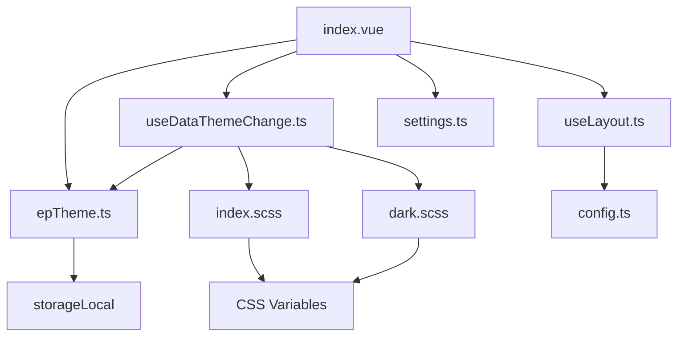

# 设置面板组件

<cite>
**本文档引用文件**  
- [index.vue](file://web/src/layout/components/lay-setting/index.vue)
- [useDataThemeChange.ts](file://web/src/layout/hooks/useDataThemeChange.ts)
- [useLayout.ts](file://web/src/layout/hooks/useLayout.ts)
- [settings.ts](file://web/src/store/modules/settings.ts)
- [epTheme.ts](file://web/src/store/modules/epTheme.ts)
- [index.scss](file://web/src/style/index.scss)
- [dark.scss](file://web/src/style/dark.scss)
- [config.ts](file://web/src/config/index.ts)
</cite>

## 目录
1. [简介](#简介)
2. [项目结构](#项目结构)
3. [核心组件](#核心组件)
4. [架构概览](#架构概览)
5. [详细组件分析](#详细组件分析)
6. [依赖分析](#依赖分析)
7. [性能考虑](#性能考虑)
8. [故障排除指南](#故障排除指南)
9. [结论](#结论)

## 简介
本文档深入解析 Vue Pure Admin 项目中的设置面板组件，重点阐述其作为系统配置中心的设计与实现。设置面板提供了一个直观的界面，允许用户调整布局、主题、界面显示等关键系统参数。文档详细说明了设置面板如何通过双向绑定机制与 settings store 实时同步配置变更，并持久化存储这些设置。同时，文档解析了主题切换的实现原理，包括通过 epTheme store 管理主题状态和使用 useDataThemeChange 工具进行主题应用。此外，还提供了暗黑模式的实现细节、实际使用示例以及为开发者准备的完整扩展指南。

## 项目结构
设置面板组件是 `vue-pure-admin-all` 项目中 `web` 子项目的一部分，位于 `src/layout/components/lay-setting/` 目录下。该组件是整个系统配置功能的核心，与多个关键模块紧密协作。

```mermaid
graph TB
subgraph "设置面板 (lay-setting)"
indexVue[index.vue]
end
subgraph "核心逻辑"
useDataThemeChange[useDataThemeChange.ts]
useLayout[useLayout.ts]
end
subgraph "状态管理"
settingsStore[settings.ts]
epThemeStore[epTheme.ts]
end
subgraph "样式与配置"
style[index.scss]
darkStyle[dark.scss]
config[config.ts]
end
indexVue --> useDataThemeChange
indexVue --> useLayout
indexVue --> settingsStore
indexVue --> epThemeStore
useDataThemeChange --> epThemeStore
useDataThemeChange --> style
useDataThemeChange --> darkStyle
useLayout --> config
```

**Diagram sources**
- [index.vue](file://web/src/layout/components/lay-setting/index.vue)
- [useDataThemeChange.ts](file://web/src/layout/hooks/useDataThemeChange.ts)
- [useLayout.ts](file://web/src/layout/hooks/useLayout.ts)
- [settings.ts](file://web/src/store/modules/settings.ts)
- [epTheme.ts](file://web/src/store/modules/epTheme.ts)
- [index.scss](file://web/src/style/index.scss)
- [dark.scss](file://web/src/style/dark.scss)
- [config.ts](file://web/src/config/index.ts)

**Section sources**
- [index.vue](file://web/src/layout/components/lay-setting/index.vue)

## 核心组件
设置面板的核心功能由 `lay-setting/index.vue` 组件实现。该组件通过 `useDataThemeChange` 和 `useLayout` 等自定义 Hook 来获取和操作应用状态。其 UI 结构清晰地划分为多个功能区：整体风格、主题色、布局模式、页宽、标签页样式和界面显示。每个功能区都通过 `v-model` 或事件监听器与 `settings` 响应式对象进行双向绑定，确保用户操作能立即反映在界面上，并通过 `storageConfigureChange` 函数将变更持久化到本地存储 (`$storage`)。

**Section sources**
- [index.vue](file://web/src/layout/components/lay-setting/index.vue#L60-L69)
- [useDataThemeChange.ts](file://web/src/layout/hooks/useDataThemeChange.ts#L12-L137)

## 架构概览
整个设置系统的架构围绕着状态管理、UI 组件和持久化存储三者之间的交互展开。`settings store` 和 `epTheme store` 作为单一数据源，集中管理应用的配置状态。`lay-setting` 组件作为视图层，通过 Composables (如 `useDataThemeChange`) 订阅这些状态，并将用户输入转换为对 store 的操作。最终，所有配置变更都会通过 `useGlobal` 提供的 `$storage` 对象同步到浏览器的本地存储中，实现持久化。



**Diagram sources**
- [index.vue](file://web/src/layout/components/lay-setting/index.vue)
- [useDataThemeChange.ts](file://web/src/layout/hooks/useDataThemeChange.ts)
- [epTheme.ts](file://web/src/store/modules/epTheme.ts)

## 详细组件分析

### 设置面板功能分区分析
设置面板的 UI 被精心设计为多个逻辑清晰的功能模块。

#### 布局设置
此模块允许用户在“垂直”、“水平”和“混合”三种导航布局之间切换。当用户点击某个布局图标时，会触发 `setLayoutModel` 函数。该函数不仅更新 `layoutTheme` 的值，还会通过 `window.document.body.setAttribute` 直接修改 DOM 的 `layout` 属性，以便 CSS 样式能够根据此属性进行相应的调整。

```mermaid
flowchart TD
A[用户点击布局图标] --> B[调用 setLayoutModel(layout)]
B --> C[更新 layoutTheme.value.layout]
C --> D[设置 body 的 layout 属性]
D --> E[触发 CSS 重绘]
E --> F[界面布局改变]
```

**Diagram sources**
- [index.vue](file://web/src/layout/components/lay-setting/index.vue#L241-L254)

#### 主题设置
主题设置模块是系统外观的核心。它通过 `useDataThemeChange` Hook 提供的 `themeColors` 数组来展示可选的主题色。用户点击某个颜色时，会调用 `setLayoutThemeColor` 函数。该函数会更新 `layoutTheme` 的 `theme` 字段，并通过 `document.documentElement.setAttribute("data-theme", theme)` 设置根元素的 `data-theme` 属性。CSS 样式表会监听此属性的变化，从而应用不同的配色方案。

**Section sources**
- [index.vue](file://web/src/layout/components/lay-setting/index.vue#L36-L84)
- [useDataThemeChange.ts](file://web/src/layout/hooks/useDataThemeChange.ts#L48-L64)

#### 界面设置
此模块包含一系列开关，用于控制界面的显示效果，如灰色模式、色弱模式、隐藏标签页等。这些开关通过 `v-model` 绑定到 `settings` 对象的相应属性上。当开关状态改变时，会触发对应的处理函数（如 `greyChange`），这些函数会调用 `toggleClass` 来动态添加或移除 HTML 元素上的 CSS 类（如 `html-grey`），从而实现视觉效果的即时切换。



**Diagram sources**
- [index.vue](file://web/src/layout/components/lay-setting/index.vue#L81-L126)

### 主题切换与暗黑模式实现
主题切换和暗黑模式的实现是本系统的一大亮点，它结合了 CSS 变量和 JavaScript 逻辑。

#### 实现原理
系统通过 `useDataThemeChange` Hook 中的 `dataTheme` 和 `overallStyle` 两个响应式变量来管理整体风格。`overallStyle` 决定了是“浅色”、“深色”还是“跟随系统”。当 `overallStyle` 为“深色”或“跟随系统”且系统主题为深色时，`dataTheme.value` 会被设置为 `true`。

#### CSS 变量的应用
在 `dark.scss` 文件中，定义了一个 `html.dark` 的 CSS 类。当 `dataTheme.value` 为 `true` 时，`useDataThemeChange` 会通过 `document.documentElement.classList.add("dark")` 将 `dark` 类添加到 `<html>` 根元素上。此时，`dark.scss` 中定义的深色主题 CSS 变量就会生效，覆盖默认的浅色样式。

```scss
// dark.scss
html.dark {
  --el-bg-color: #151515;
  --el-text-color: #c9d1d9;
  // ... 更多深色变量
}
```

**Section sources**
- [useDataThemeChange.ts](file://web/src/layout/hooks/useDataThemeChange.ts#L102-L105)
- [dark.scss](file://web/src/style/dark.scss#L0-L36)

## 依赖分析
设置面板组件依赖于多个核心模块，形成了一个紧密耦合的系统。



**Diagram sources**
- [index.vue](file://web/src/layout/components/lay-setting/index.vue)
- [useDataThemeChange.ts](file://web/src/layout/hooks/useDataThemeChange.ts)
- [useLayout.ts](file://web/src/layout/hooks/useLayout.ts)
- [settings.ts](file://web/src/store/modules/settings.ts)
- [epTheme.ts](file://web/src/store/modules/epTheme.ts)
- [index.scss](file://web/src/style/index.scss)
- [dark.scss](file://web/src/style/dark.scss)
- [config.ts](file://web/src/config/index.ts)

## 性能考虑
该设置系统的性能表现良好。通过使用 Pinia store 进行集中状态管理，避免了状态的冗余和不一致。利用 `computed` 属性和响应式系统，UI 能够高效地对状态变化做出反应。对于频繁触发的事件（如窗口大小变化），系统使用了 `debounce` 函数进行防抖处理，防止了不必要的计算和渲染。此外，将配置持久化到本地存储的操作是异步且轻量的，不会阻塞主线程。

## 故障排除指南
*   **问题：更改设置后页面没有反应。**
    *   **检查：** 确认 `useDataThemeChange` 或 `useLayout` Hook 是否正确导入并调用。检查浏览器控制台是否有 JavaScript 错误。
*   **问题：主题切换后颜色不正确。**
    *   **检查：** 确认 `data-theme` 属性是否已正确添加到 `<html>` 元素。检查 `index.scss` 和 `dark.scss` 文件是否已正确引入。
*   **问题：配置无法持久化。**
    *   **检查：** 确认 `useGlobal` 提供的 `$storage` 对象是否正常工作。检查浏览器的本地存储权限是否被禁用。

**Section sources**
- [useDataThemeChange.ts](file://web/src/layout/hooks/useDataThemeChange.ts)
- [index.vue](file://web/src/layout/components/lay-setting/index.vue)

## 结论
`lay-setting` 组件是一个设计精良、功能完善的系统配置中心。它通过清晰的 UI 分区、高效的双向绑定机制和强大的主题管理能力，为用户提供了极佳的个性化体验。其背后的状态管理、CSS 变量和持久化存储方案，共同构建了一个健壮且可扩展的配置系统。开发者可以基于此架构轻松地添加新的设置项或集成第三方主题，满足不断变化的业务需求。