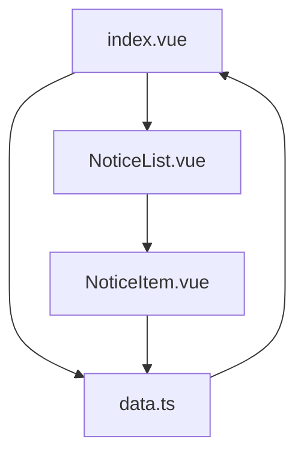
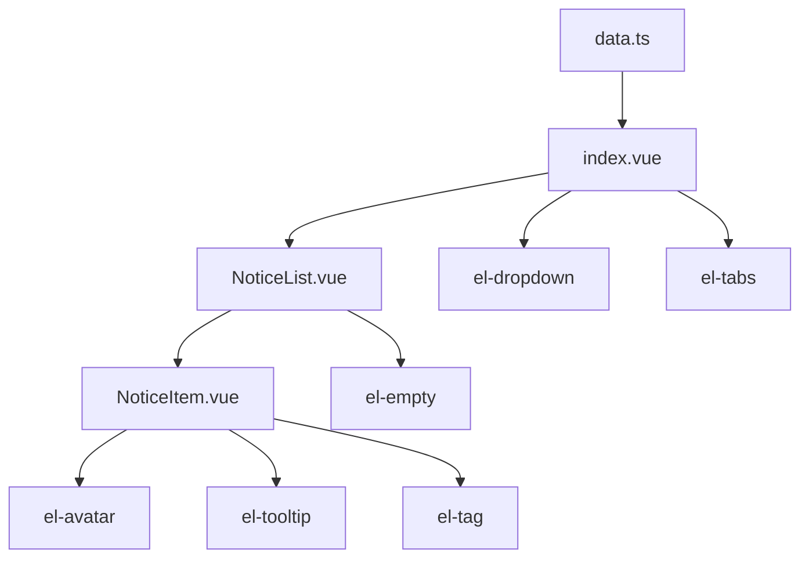
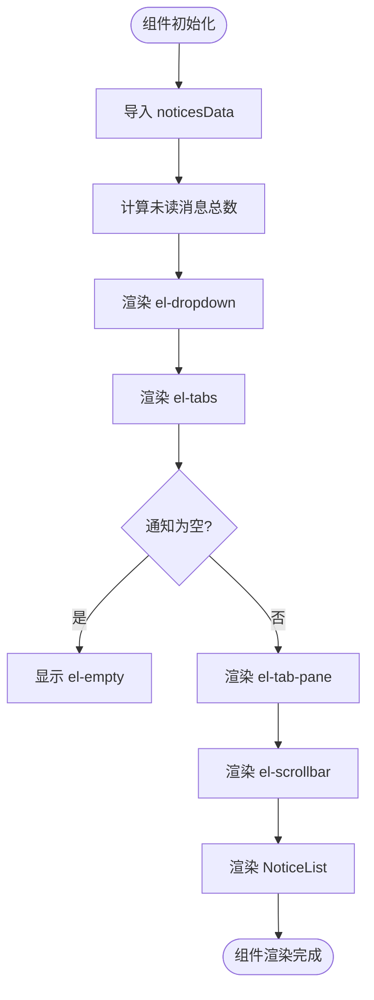
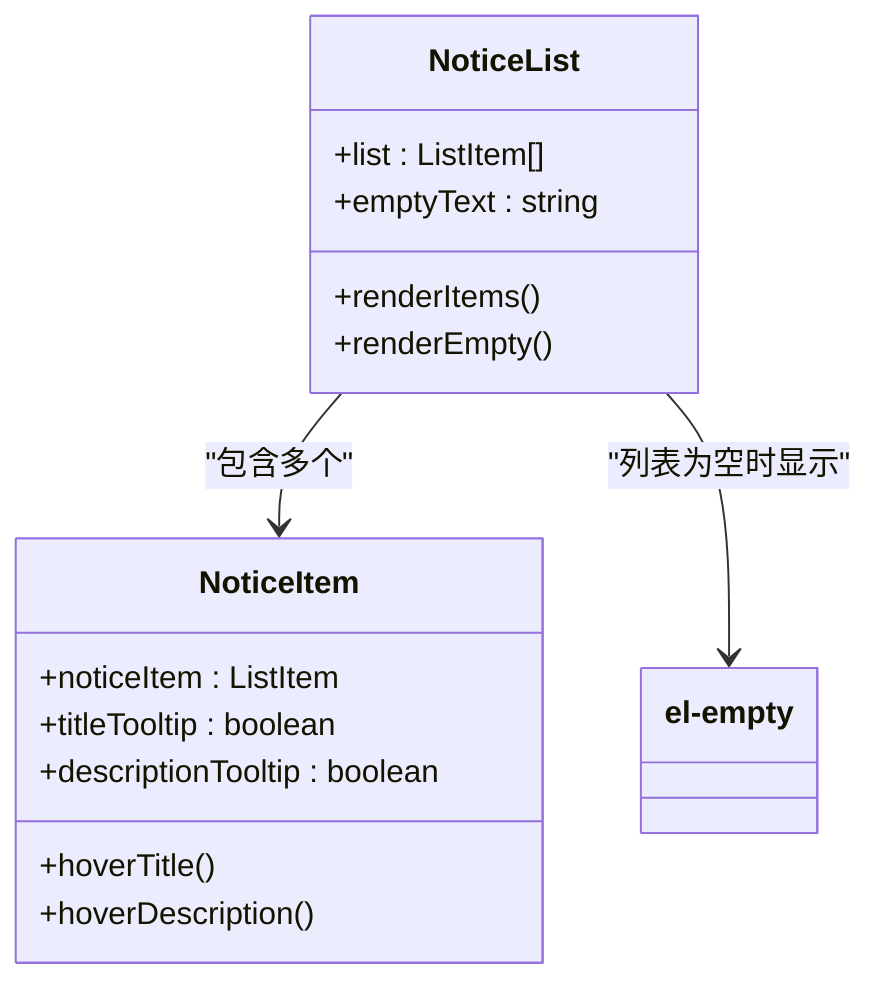
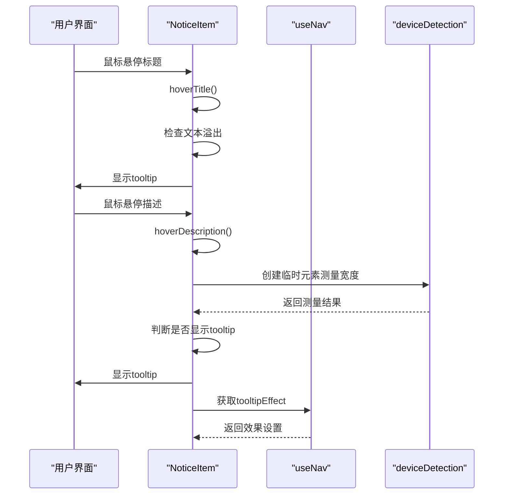
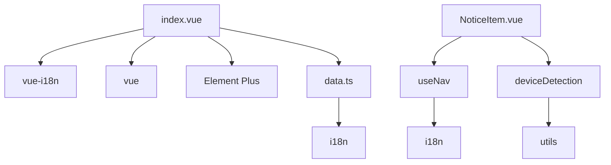

# 通知UI组件

<cite>
**本文档中引用的文件**  
- [index.vue](file://web/src/layout/components/lay-notice/index.vue)
- [NoticeList.vue](file://web/src/layout/components/lay-notice/components/NoticeList.vue)
- [NoticeItem.vue](file://web/src/layout/components/lay-notice/components/NoticeItem.vue)
- [data.ts](file://web/src/layout/components/lay-notice/data.ts)
</cite>

## 目录
1. [简介](#简介)
2. [项目结构](#项目结构)
3. [核心组件](#核心组件)
4. [架构概览](#架构概览)
5. [详细组件分析](#详细组件分析)
6. [依赖分析](#依赖分析)
7. [性能考虑](#性能考虑)
8. [故障排除指南](#故障排除指南)
9. [结论](#结论)

## 简介
本项目实现了一个基于Vue 3和Element Plus的下拉式通知中心UI组件，集成在管理后台布局中。该组件通过`el-dropdown`和`el-tabs`构建交互式通知面板，支持消息、通知和待办事项的分类展示。组件具备响应式设计、多语言支持和可定制的视觉样式，能够根据通知类型和状态动态渲染内容。

## 项目结构
通知中心组件位于`web/src/layout/components/lay-notice`目录下，采用模块化结构组织代码。根组件`index.vue`负责整体布局和交互控制，`components`子目录包含`NoticeList`和`NoticeItem`两个子组件，分别处理通知列表渲染和单个通知项的展示。`data.ts`文件定义了数据结构和初始数据。

**Diagram sources**  
- [index.vue](file://web/src/layout/components/lay-notice/index.vue)
- [NoticeList.vue](file://web/src/layout/components/lay-notice/components/NoticeList.vue)
- [NoticeItem.vue](file://web/src/layout/components/lay-notice/components/NoticeItem.vue)
- [data.ts](file://web/src/layout/components/lay-notice/data.ts)

**Section sources**  
- [index.vue](file://web/src/layout/components/lay-notice/index.vue)
- [NoticeList.vue](file://web/src/layout/components/lay-notice/components/NoticeList.vue)
- [NoticeItem.vue](file://web/src/layout/components/lay-notice/components/NoticeItem.vue)
- [data.ts](file://web/src/layout/components/lay-notice/data.ts)

## 核心组件
通知中心的核心由三个主要文件构成：`index.vue`作为根组件协调整体功能，`NoticeList.vue`负责列表渲染，`NoticeItem.vue`处理单个通知项的展示逻辑。这些组件通过props传递数据，实现了清晰的职责分离和可维护的代码结构。

**Section sources**  
- [index.vue](file://web/src/layout/components/lay-notice/index.vue#L1-L98)
- [NoticeList.vue](file://web/src/layout/components/lay-notice/components/NoticeList.vue#L1-L25)
- [NoticeItem.vue](file://web/src/layout/components/lay-notice/components/NoticeItem.vue#L1-L178)

## 架构概览
通知中心采用分层架构设计，`index.vue`作为容器组件管理状态和布局，`NoticeList.vue`作为中间层组件处理列表逻辑，`NoticeItem.vue`作为展示组件负责具体UI渲染。数据流从`data.ts`的静态数据源流向根组件，再通过props逐级向下传递。

**Diagram sources**  
- [index.vue](file://web/src/layout/components/lay-notice/index.vue#L1-L98)
- [NoticeList.vue](file://web/src/layout/components/lay-notice/components/NoticeList.vue#L1-L25)
- [NoticeItem.vue](file://web/src/layout/components/lay-notice/components/NoticeItem.vue#L1-L178)
- [data.ts](file://web/src/layout/components/lay-notice/data.ts#L1-L100)

## 详细组件分析

### 根组件分析
`index.vue`作为通知中心的根组件，使用`el-dropdown`创建下拉菜单，通过`el-tabs`实现标签页切换功能。组件初始化时从`data.ts`导入通知数据，并计算未读消息总数。标签页标题通过计算属性动态生成，包含类型名称和数量提示。

**Diagram sources**  
- [index.vue](file://web/src/layout/components/lay-notice/index.vue#L1-L98)

**Section sources**  
- [index.vue](file://web/src/layout/components/lay-notice/index.vue#L1-L98)

### 通知列表组件分析
`NoticeList.vue`组件接收父组件传递的列表数据和空状态文本，使用`v-for`指令遍历渲染`NoticeItem`组件。当列表为空时，显示`el-empty`组件并使用`transformI18n`函数处理多语言文本。

**Diagram sources**  
- [NoticeList.vue](file://web/src/layout/components/lay-notice/components/NoticeList.vue#L1-L25)
- [NoticeItem.vue](file://web/src/layout/components/lay-notice/components/NoticeItem.vue#L1-L178)

**Section sources**  
- [NoticeList.vue](file://web/src/layout/components/lay-notice/components/NoticeList.vue#L1-L25)

### 通知项组件分析
`NoticeItem.vue`组件根据通知项的数据属性展示不同的视觉样式。组件包含头像、标题、描述、时间和额外信息等元素。通过`el-tooltip`实现文本溢出提示，使用`deviceDetection`函数检测移动设备并调整交互行为。

**Diagram sources**  
- [NoticeItem.vue](file://web/src/layout/components/lay-notice/components/NoticeItem.vue#L1-L178)
- [useNav.ts](file://web/src/layout/hooks/useNav.ts)
- [utils.ts](file://web/src/utils/index.ts)

**Section sources**  
- [NoticeItem.vue](file://web/src/layout/components/lay-notice/components/NoticeItem.vue#L1-L178)

## 依赖分析
通知中心组件依赖多个外部模块和内部工具函数。主要依赖包括Element Plus组件库、Vue 3 Composition API、i18n国际化插件和设备检测工具。组件通过`@/plugins/i18n`导入多语言支持，使用`@pureadmin/utils`进行设备类型检测。

**Diagram sources**  
- [index.vue](file://web/src/layout/components/lay-notice/index.vue#L1-L98)
- [data.ts](file://web/src/layout/components/lay-notice/data.ts#L1-L100)
- [NoticeItem.vue](file://web/src/layout/components/lay-notice/components/NoticeItem.vue#L1-L178)
- [useNav.ts](file://web/src/layout/hooks/useNav.ts)
- [utils.ts](file://web/src/utils/index.ts)

**Section sources**  
- [index.vue](file://web/src/layout/components/lay-notice/index.vue#L1-L98)
- [data.ts](file://web/src/layout/components/lay-notice/data.ts#L1-L100)
- [NoticeItem.vue](file://web/src/layout/components/lay-notice/components/NoticeItem.vue#L1-L178)

## 性能考虑
组件在性能方面进行了多项优化。使用`v-if`和`v-else`条件渲染避免不必要的DOM操作，通过`computed`属性缓存计算结果。`NoticeItem`组件的tooltip显示逻辑采用延迟计算，避免频繁的DOM测量操作。列表渲染使用`key`属性优化Vue的diff算法效率。

## 故障排除指南
常见问题包括通知面板无法显示、标签页切换失效和tooltip不出现。检查`noticesData`数据格式是否正确，确保`activeKey`初始值与数据匹配。对于tooltip问题，验证`titleRef`和`descriptionRef`引用是否正确绑定，检查移动设备检测逻辑是否影响交互行为。

**Section sources**  
- [index.vue](file://web/src/layout/components/lay-notice/index.vue#L1-L98)
- [NoticeItem.vue](file://web/src/layout/components/lay-notice/components/NoticeItem.vue#L1-L178)

## 结论
通知中心UI组件通过合理的架构设计和组件划分，实现了功能完整且易于维护的通知系统。组件支持多语言、响应式设计和可定制的视觉样式，能够满足现代管理后台的需求。通过深入理解各组件的职责和交互方式，开发者可以轻松定制和扩展该通知系统。