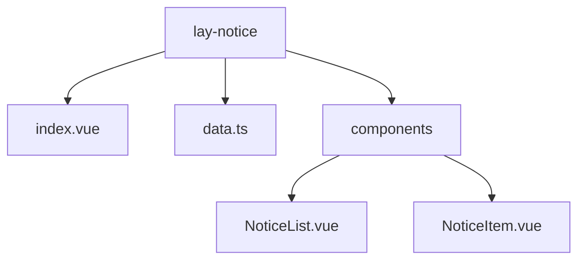
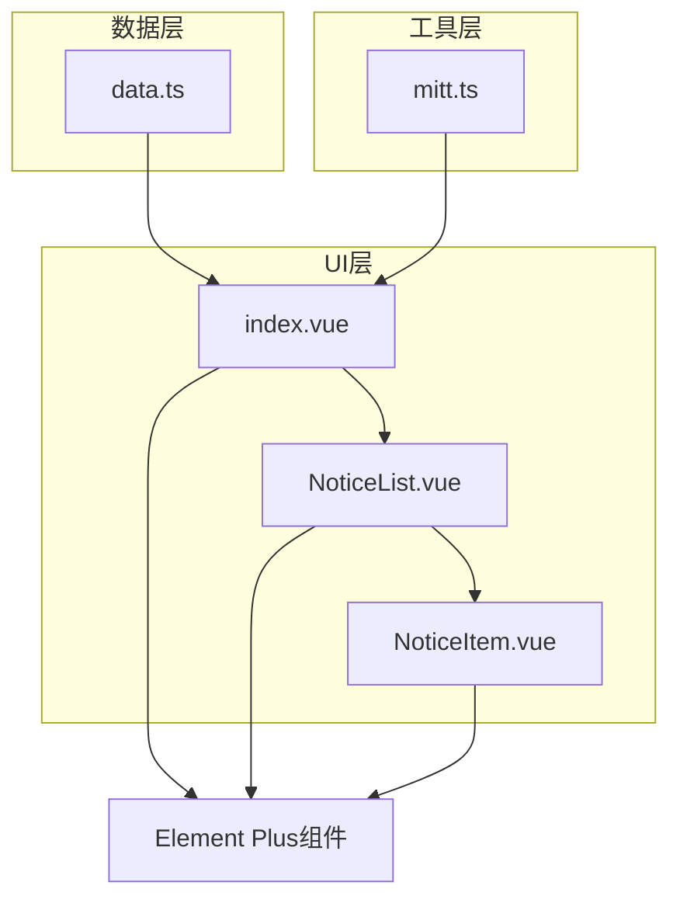
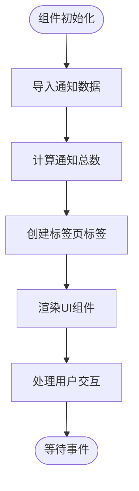
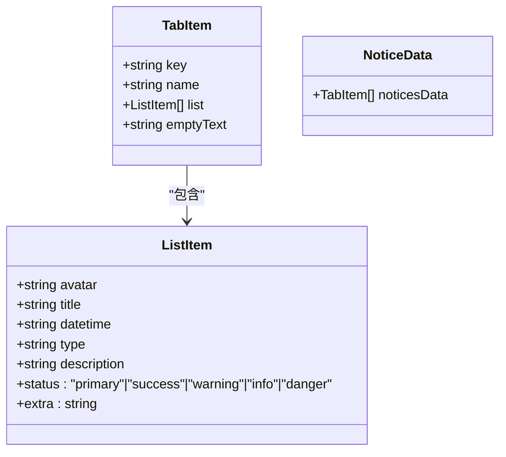
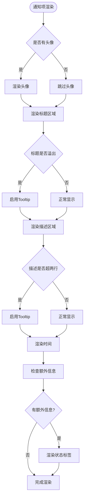
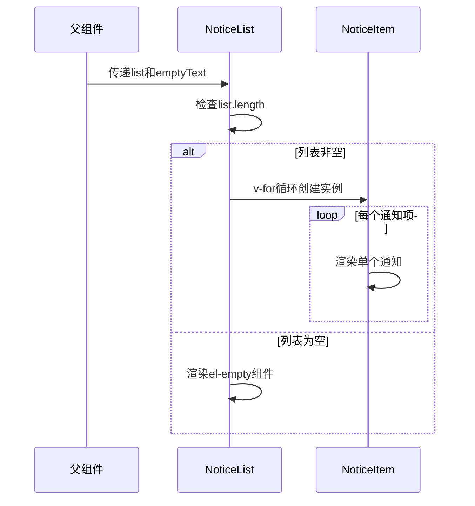
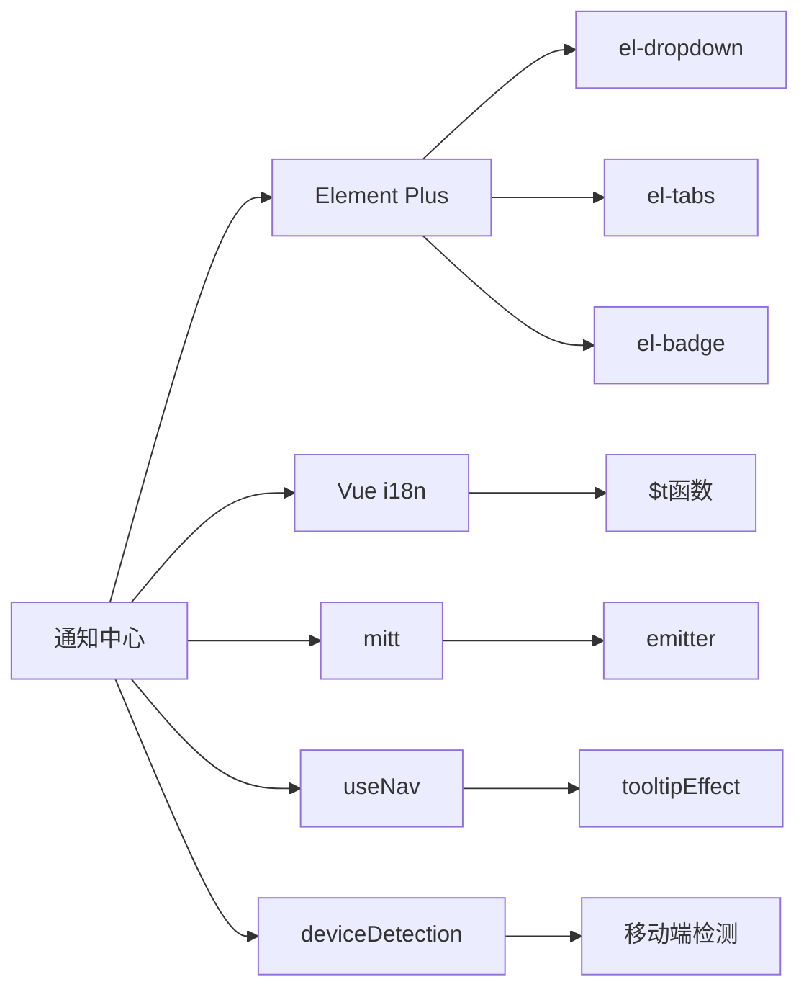

# 通知中心组件

<cite>
**本文档中引用的文件**  
- [index.vue](file://web/src/layout/components/lay-notice/index.vue)
- [data.ts](file://web/src/layout/components/lay-notice/data.ts)
- [NoticeItem.vue](file://web/src/layout/components/lay-notice/components/NoticeItem.vue)
- [NoticeList.vue](file://web/src/layout/components/lay-notice/components/NoticeList.vue)
- [mitt.ts](file://web/src/utils/mitt.ts)
</cite>

## 目录
1. [简介](#简介)
2. [项目结构](#项目结构)
3. [核心组件](#核心组件)
4. [架构概述](#架构概述)
5. [详细组件分析](#详细组件分析)
6. [依赖分析](#依赖分析)
7. [性能考虑](#性能考虑)
8. [故障排除指南](#故障排除指南)
9. [结论](#结论)

## 简介
通知中心组件是Vue Pure Admin项目中的关键功能模块，用于集中展示系统通知、消息和待办事项。该组件通过下拉菜单形式集成在页面顶部导航栏中，提供通知数量徽章提示，并支持多标签页分类展示不同类型的提醒内容。组件设计注重用户体验，支持国际化、响应式布局和动态内容渲染。

## 项目结构
通知中心组件位于`web/src/layout/components/lay-notice`目录下，采用模块化设计，包含主入口文件、数据定义和子组件。整体结构清晰，职责分离明确。

**Diagram sources**
- [index.vue](file://web/src/layout/components/lay-notice/index.vue)
- [data.ts](file://web/src/layout/components/lay-notice/data.ts)
- [NoticeList.vue](file://web/src/layout/components/lay-notice/components/NoticeList.vue)

**Section sources**
- [index.vue](file://web/src/layout/components/lay-notice/index.vue)
- [data.ts](file://web/src/layout/components/lay-notice/data.ts)

## 核心组件
通知中心的核心功能由三个主要部分构成：主容器组件`index.vue`负责整体布局和交互控制，`data.ts`文件定义了通知数据模型和初始数据，`NoticeItem.vue`和`NoticeList.vue`组件分别负责单个通知项和通知列表的渲染。组件间通过标准的Vue属性传递机制进行通信，确保了良好的封装性和可维护性。

**Section sources**
- [index.vue](file://web/src/layout/components/lay-notice/index.vue)
- [data.ts](file://web/src/layout/components/lay-notice/data.ts)
- [NoticeItem.vue](file://web/src/layout/components/lay-notice/components/NoticeItem.vue)
- [NoticeList.vue](file://web/src/layout/components/lay-notice/components/NoticeList.vue)

## 架构概述
通知中心采用典型的Vue组件分层架构，以数据驱动视图更新。主组件通过导入预定义的数据模型初始化通知内容，并利用Element Plus的UI组件库实现下拉菜单、标签页和滚动条等交互元素。整个架构体现了清晰的关注点分离原则。

**Diagram sources**
- [index.vue](file://web/src/layout/components/lay-notice/index.vue)
- [data.ts](file://web/src/layout/components/lay-notice/data.ts)
- [NoticeList.vue](file://web/src/layout/components/lay-notice/components/NoticeList.vue)
- [NoticeItem.vue](file://web/src/layout/components/lay-notice/components/NoticeItem.vue)

## 详细组件分析

### 主容器组件分析
主容器组件`index.vue`是通知中心的入口点，负责协调其他组件的工作。它使用Vue 3的组合式API进行状态管理，通过`ref`和`computed`创建响应式数据。组件利用`el-dropdown`实现下拉交互，`el-tabs`支持多标签页切换，并通过`el-badge`显示未读通知数量。

**Diagram sources**
- [index.vue](file://web/src/layout/components/lay-notice/index.vue)

**Section sources**
- [index.vue](file://web/src/layout/components/lay-notice/index.vue)

### 数据模型分析
数据模型定义在`data.ts`文件中，包含两个核心接口：`ListItem`描述单个通知项的结构，`TabItem`定义标签页的数据结构。通知数据通过`noticesData`常量导出，包含通知、消息和待办事项三个预设分类，每个分类都有独立的名称、空状态文本和通知列表。

**Diagram sources**
- [data.ts](file://web/src/layout/components/lay-notice/data.ts)

**Section sources**
- [data.ts](file://web/src/layout/components/lay-notice/data.ts)

### 通知项渲染分析
`NoticeItem.vue`组件负责渲染单个通知项，包含头像、标题、描述和时间等元素。组件实现了智能文本截断功能，当标题或描述内容过长时自动显示省略号，并通过`el-tooltip`提供完整内容的悬停预览。对于待办事项，还支持状态标签显示。

**Diagram sources**
- [NoticeItem.vue](file://web/src/layout/components/lay-notice/components/NoticeItem.vue)

**Section sources**
- [NoticeItem.vue](file://web/src/layout/components/lay-notice/components/NoticeItem.vue)

### 通知列表分析
`NoticeList.vue`组件作为容器组件，负责管理通知项的列表渲染。它接收父组件传递的通知列表数据，通过`v-for`指令循环创建多个`NoticeItem`实例。当列表为空时，显示由`el-empty`组件提供的空状态提示。

**Diagram sources**
- [NoticeList.vue](file://web/src/layout/components/lay-notice/components/NoticeList.vue)
- [NoticeItem.vue](file://web/src/layout/components/lay-notice/components/NoticeItem.vue)

**Section sources**
- [NoticeList.vue](file://web/src/layout/components/lay-notice/components/NoticeList.vue)

## 依赖分析
通知中心组件依赖多个项目内部模块和第三方库。主要依赖包括Element Plus UI组件库、Vue i18n国际化支持、mitt事件总线以及项目内部的工具函数。

**Diagram sources**
- [index.vue](file://web/src/layout/components/lay-notice/index.vue)
- [NoticeItem.vue](file://web/src/layout/components/lay-notice/components/NoticeItem.vue)
- [mitt.ts](file://web/src/utils/mitt.ts)

**Section sources**
- [index.vue](file://web/src/layout/components/lay-notice/index.vue)
- [NoticeItem.vue](file://web/src/layout/components/lay-notice/components/NoticeItem.vue)
- [mitt.ts](file://web/src/utils/mitt.ts)

## 性能考虑
通知中心在设计时考虑了多项性能优化措施。通过使用`ref`和`computed`确保响应式系统的高效运行，利用`nextTick`优化DOM测量时机，采用虚拟滚动技术（通过`el-scrollbar`）处理大量通知内容。文本溢出检测采用离线计算方式，避免频繁的DOM操作影响性能。

## 故障排除指南
常见问题包括通知数量不更新、文本溢出检测失效和移动端显示异常。解决方案包括检查数据绑定是否正确、确认`nextTick`调用时机以及验证响应式断点检测结果。对于国际化问题，需确保`$t`函数正确加载语言包。

**Section sources**
- [index.vue](file://web/src/layout/components/lay-notice/index.vue)
- [NoticeItem.vue](file://web/src/layout/components/lay-notice/components/NoticeItem.vue)
- [data.ts](file://web/src/layout/components/lay-notice/data.ts)

## 结论
通知中心组件是一个功能完整、设计良好的Vue组件，有效集成了通知管理的核心需求。通过清晰的架构分层、合理的数据模型设计和优秀的用户体验考虑，为管理系统提供了可靠的通知服务基础。组件的模块化设计也便于后续的功能扩展和样式定制。