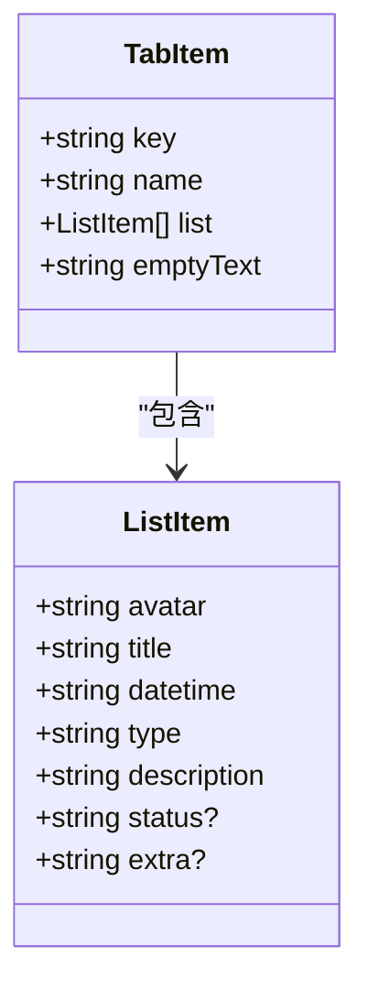
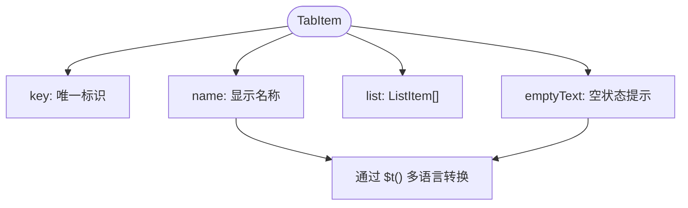
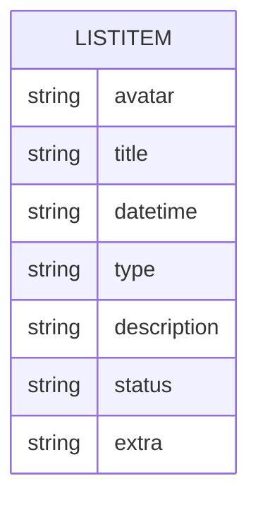
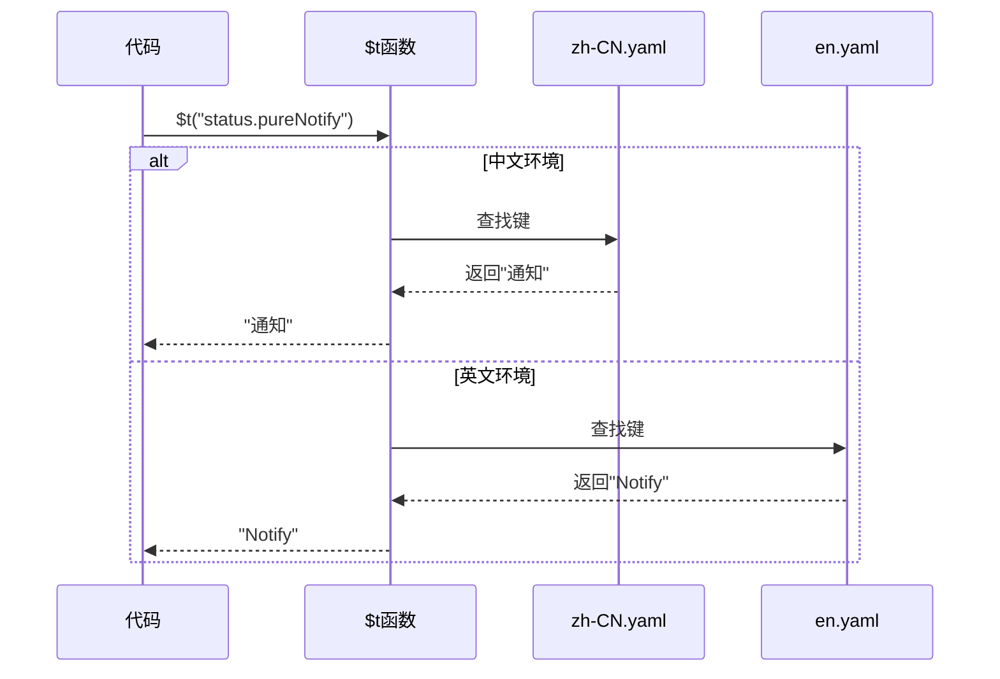

# 通知数据模型

<cite>
**本文档中引用的文件**  
- [data.ts](file://src/layout/components/lay-notice/data.ts)
- [zh-CN.yaml](file://locales/zh-CN.yaml)
- [en.yaml](file://locales/en.yaml)
</cite>

## 目录
1. [简介](#简介)
2. [核心数据结构](#核心数据结构)
3. [TabItem 接口详解](#tabitem-接口详解)
4. [ListItem 接口详解](#listitem-接口详解)
5. [数据初始化与默认值](#数据初始化与默认值)
6. [多语言支持机制](#多语言支持机制)
7. [通知类型差异分析](#通知类型差异分析)
8. [实际数据示例](#实际数据示例)
9. [数据扩展指南](#数据扩展指南)
10. [附录](#附录)

## 简介
本文档全面解析 vue-pure-admin 项目中通知中心的数据模型设计，重点阐述 `TabItem` 和 `ListItem` 两个核心接口的字段定义、业务含义及使用方式。涵盖标签页配置、通知项属性、状态标识、多语言处理等关键设计，为开发者提供清晰的数据结构参考和扩展指导。

## 核心数据结构

通知中心的数据模型由两个核心接口构成：`TabItem` 和 `ListItem`。`TabItem` 表示通知中心的标签页（如通知、消息、待办），每个标签页包含一个 `ListItem` 数组，代表该分类下的具体通知条目。



**图示来源**  
- [data.ts](file://src/layout/components/lay-notice/data.ts#L1-L20)

**本节来源**  
- [data.ts](file://src/layout/components/lay-notice/data.ts#L1-L20)

## TabItem 接口详解

`TabItem` 接口定义了通知中心每个标签页的元数据和内容列表。

- **key**: 唯一标识符，用于区分不同的标签页（如 "1" 表示通知，"2" 表示消息）。
- **name**: 标签页显示名称，通过 `$t` 函数实现多语言支持，例如 `$t("status.pureNotify")` 显示为“通知”。
- **list**: `ListItem` 类型的数组，存储该标签页下的所有通知条目。
- **emptyText**: 当 `list` 为空时显示的提示文本，同样通过 `$t` 实现多语言，如 `$t("status.pureNoNotify")` 显示为“暂无通知”。



**图示来源**  
- [data.ts](file://src/layout/components/lay-notice/data.ts#L5-L10)

**本节来源**  
- [data.ts](file://src/layout/components/lay-notice/data.ts#L5-L10)

## ListItem 接口详解

`ListItem` 接口定义了单个通知条目的详细信息。

- **avatar**: 发送者头像的 URL 地址，用于在通知项左侧显示。
- **title**: 通知标题，通常为一条简短的描述性文本。
- **datetime**: 时间戳或相对时间（如“今天”、“昨天”），表示通知的生成时间。
- **type**: 通知类型标识，用于区分不同来源或类别的通知（如 "2" 表示消息，"3" 表示待办）。
- **description**: 通知的详细描述内容，可能包含较长的文本。
- **status**: 可选的状态标识，类型为 `"primary" | "success" | "warning" | "info" | "danger"`，用于视觉上突出通知的紧急程度或状态。
- **extra**: 可选的附加信息，通常显示在通知项的右侧，用于补充说明（如“马上到期”、“进行中”）。



**图示来源**  
- [data.ts](file://src/layout/components/lay-notice/data.ts#L1-L5)

**本节来源**  
- [data.ts](file://src/layout/components/lay-notice/data.ts#L1-L5)

## 数据初始化与默认值

通知数据通过 `noticesData` 常量进行初始化，该常量是一个 `TabItem` 数组，预定义了“通知”、“消息”、“待办”三个标签页的初始状态。

- **通知标签页** (`key: "1"`)：初始 `list` 为空数组，表示无通知。
- **消息标签页** (`key: "2"`)：包含三条模拟消息，每条消息都有头像、标题、描述和时间。
- **待办标签页** (`key: "3"`)：包含四条模拟待办事项，每条都设置了 `status` 和 `extra` 字段来表示任务状态。

所有字段均通过合理的默认值确保 UI 的稳定渲染，例如空数组防止渲染错误，多语言键确保文本可翻译。

**本节来源**  
- [data.ts](file://src/layout/components/lay-notice/data.ts#L22-L99)

## 多语言支持机制

系统通过 `$t` 函数实现多语言支持。`$t` 是一个国际化函数，接收一个语言键（如 `"status.pureNotify"`）并返回对应语言环境下的文本。

- 中文环境 (`zh-CN.yaml`) 中，`$t("status.pureNotify")` 返回“通知”。
- 英文环境 (`en.yaml`) 中，`$t("status.pureNotify")` 返回“Notify”。

这种设计将界面文本与代码逻辑分离，便于维护和扩展多语言版本。



**图示来源**  
- [data.ts](file://src/layout/components/lay-notice/data.ts#L1)
- [zh-CN.yaml](file://locales/zh-CN.yaml#L100-L105)
- [en.yaml](file://locales/en.yaml#L100-L105)

**本节来源**  
- [data.ts](file://src/layout/components/lay-notice/data.ts#L1)
- [zh-CN.yaml](file://locales/zh-CN.yaml#L100-L105)
- [en.yaml](file://locales/en.yaml#L100-L105)

## 通知类型差异分析

三种通知类型通过 `type` 字段和 `status` 字段进行区分：

- **通知** (`type: "1"`)：通常为系统广播或公告，`list` 初始为空。
- **消息** (`type: "2"`)：用户间的互动消息，包含头像和时间，强调社交属性。
- **待办** (`type: "3"`)：需要用户处理的任务，使用 `status` 字段（如 "danger"、"warning"）和 `extra` 字段（如“马上到期”）来突出任务的紧急性和状态。

这种设计使得前端可以根据 `type` 和 `status` 应用不同的样式和交互逻辑。

**本节来源**  
- [data.ts](file://src/layout/components/lay-notice/data.ts#L22-L99)

## 实际数据示例

以下是 `noticesData` 中“待办”标签页的一个实际数据条目：

```json
{
  "avatar": "",
  "title": "第三方紧急代码变更",
  "description": "小林提交于 2024-05-10，需在 2024-05-11 前完成代码变更任务",
  "datetime": "",
  "extra": "马上到期",
  "status": "danger",
  "type": "3"
}
```

此数据表示一个高优先级的待办任务，通过 `status: "danger"` 和 `extra: "马上到期"` 提醒用户立即处理。

**本节来源**  
- [data.ts](file://src/layout/components/lay-notice/data.ts#L65-L73)

## 数据扩展指南

开发者可以按照以下方式扩展通知数据模型：

1. **添加新的通知类型**：在 `noticesData` 数组中添加新的 `TabItem` 对象，设置唯一的 `key`，并在 `zh-CN.yaml` 和 `en.yaml` 中添加对应的多语言键。
2. **自定义数据字段**：在 `ListItem` 接口中添加新的可选字段（如 `priority?: number`），然后在数据中使用。
3. **修改数据渲染逻辑**：根据 `type` 或 `status` 字段，在 `NoticeItem.vue` 组件中调整样式或添加交互功能。

**本节来源**  
- [data.ts](file://src/layout/components/lay-notice/data.ts#L1-L99)

## 附录

### 多语言键对照表

| 语言键 | 中文 (zh-CN) | 英文 (en) |
|--------|-------------|----------|
| status.pureNotify | 通知 | Notify |
| status.pureMessage | 消息 | Message |
| status.pureTodo | 待办 | Todo |
| status.pureNoNotify | 暂无通知 | No Notify |
| status.pureNoMessage | 暂无消息 | No Message |
| status.pureNoTodo | 暂无待办 | No Todo |

**本节来源**  
- [zh-CN.yaml](file://locales/zh-CN.yaml#L100-L105)
- [en.yaml](file://locales/en.yaml#L100-L105)