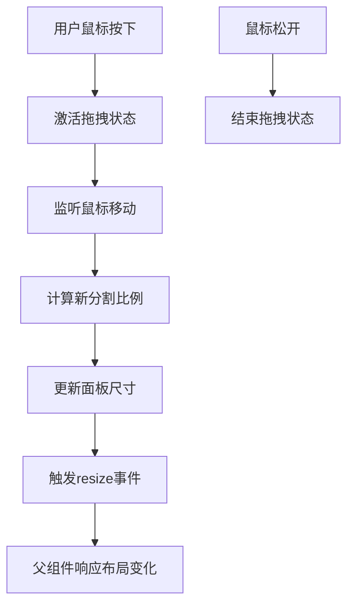
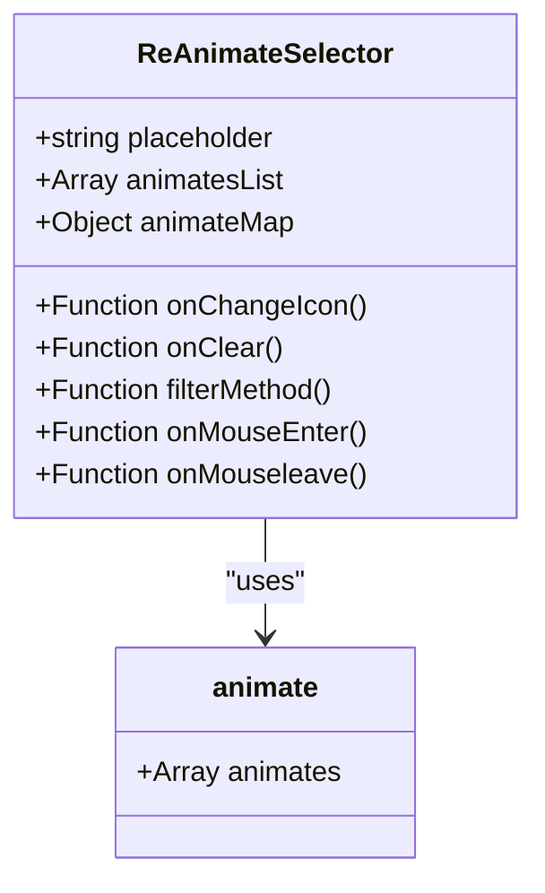
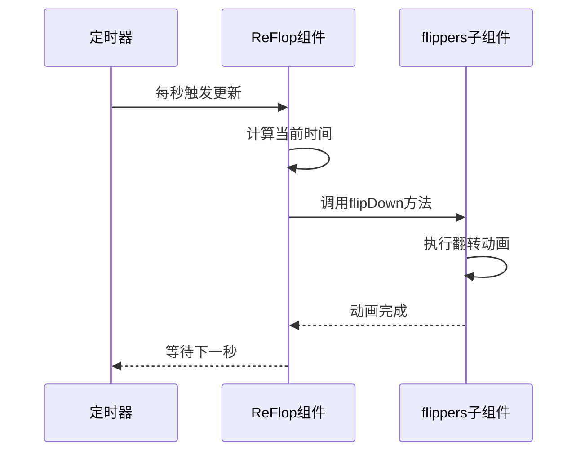

# 交互类组件

<cite>
**Referenced Files in This Document**   
- [ReDialog/index.vue](file://web/src/components/ReDialog/index.vue)
- [ReDialog/type.ts](file://web/src/components/ReDialog/type.ts)
- [ReDrawer/index.vue](file://web/src/components/ReDrawer/index.vue)
- [ReDrawer/type.ts](file://web/src/components/ReDrawer/type.ts)
- [ReSplitPane/index.tsx](file://web/src/components/ReSplitPane/index.tsx)
- [ReSplitPane/resizer.tsx](file://web/src/components/ReSplitPane/resizer.tsx)
- [ReAnimateSelector/src/index.vue](file://web/src/components/ReAnimateSelector/src/index.vue)
- [ReAnimateSelector/src/animate.ts](file://web/src/components/ReAnimateSelector/src/animate.ts)
- [ReFlicker/index.css](file://web/src/components/ReFlicker/index.css)
- [ReFlop/src/index.vue](file://web/src/components/ReFlop/src/index.vue)
- [ReFlop/src/filpper.tsx](file://web/src/components/ReFlop/src/filpper.tsx)
</cite>

## 目录
1. [简介](#简介)
2. [核心组件分析](#核心组件分析)
3. [交互设计与实现原理](#交互设计与实现原理)
4. [状态管理与事件处理](#状态管理与事件处理)
5. [实际应用场景](#实际应用场景)
6. [高级特性与优化](#高级特性与优化)

## 简介

本文档详细阐述了Vue Pure Admin项目中提供的交互类组件，包括对话框（ReDialog）、抽屉（ReDrawer）、分割面板（ReSplitPane）、动画选择器（ReAnimateSelector）、闪烁效果（ReFlicker）和翻转动画（ReFlop）。这些组件为用户提供丰富的交互体验，涵盖了模态对话、侧边导航、可调节布局等多种场景。文档将深入分析每个组件的打开/关闭机制、动画过渡、事件处理和状态管理，为开发者提供全面的使用指南和最佳实践。

## 核心组件分析

### 对话框组件（ReDialog）

ReDialog组件基于Element Plus的Dialog组件封装，提供了增强的交互功能和灵活的配置选项。该组件支持自定义标题渲染器、内容渲染器和底部按钮操作区，允许开发者根据具体需求定制对话框的外观和行为。通过`headerRenderer`属性，可以完全自定义对话框标题区域的内容，包括添加额外的控件或信息展示。`contentRenderer`属性则允许动态渲染对话框主体内容，支持传入任意Vue组件。底部操作区通过`footerButtons`数组进行配置，可以定义多个按钮及其点击回调函数，满足复杂的交互需求。

**Section sources**
- [ReDialog/index.vue](file://web/src/components/ReDialog/index.vue)
- [ReDialog/type.ts](file://web/src/components/ReDialog/type.ts)

### 抽屉组件（ReDrawer）

ReDrawer组件实现了侧边抽屉式的交互模式，适用于移动端导航、表单编辑等场景。与对话框类似，抽屉组件也支持自定义渲染器和灵活的按钮配置。其核心特性包括方向控制（从左、右、上、下四个方向滑出）、尺寸自定义和遮罩层管理。通过`direction`属性可以指定抽屉的展开方向，`size`属性则控制抽屉的宽度或高度。抽屉组件特别适合需要保持上下文信息的场景，用户可以在主界面和抽屉内容之间快速切换，而不会丢失当前的工作状态。

**Section sources**
- [ReDrawer/index.vue](file://web/src/components/ReDrawer/index.vue)
- [ReDrawer/type.ts](file://web/src/components/ReDrawer/type.ts)

### 分割面板组件（ReSplitPane）

ReSplitPane组件提供了一个可拖拽调节的分割面板，允许用户在运行时动态调整两个子区域的大小比例。该组件通过`splitSet`属性接收配置，包括分割方向（水平或垂直）、最小百分比和默认百分比。内部实现了一个名为`resizer`的子组件，作为拖拽手柄，监听鼠标事件来计算新的分割比例。当用户拖拽手柄时，组件会实时更新两个面板的宽度或高度，并通过`resize`事件向外传递当前的分割比例，便于父组件进行状态同步和布局调整。

**Diagram sources**
- [ReSplitPane/index.tsx](file://web/src/components/ReSplitPane/index.tsx)
- [ReSplitPane/resizer.tsx](file://web/src/components/ReSplitPane/resizer.tsx)

**Section sources**
- [ReSplitPane/index.tsx](file://web/src/components/ReSplitPane/index.tsx)
- [ReSplitPane/resizer.tsx](file://web/src/components/ReSplitPane/resizer.tsx)

### 动画选择器组件（ReAnimateSelector）

ReAnimateSelector组件是一个动画效果选择器，集成了Animate.css库中的多种动画效果。该组件以下拉选择框的形式展示所有可用的动画名称，用户可以通过搜索快速定位特定动画。当鼠标悬停在某个动画名称上时，会实时预览该动画效果，提供直观的视觉反馈。组件内部维护了一个动画列表`animates`，包含了从Attention seekers到Sliding exits等类别的100多种动画。通过`filterMethod`方法实现搜索过滤功能，`onMouseEnter`和`onMouseleave`事件处理函数控制动画预览的开始和结束。

**Diagram sources**
- [ReAnimateSelector/src/index.vue](file://web/src/components/ReAnimateSelector/src/index.vue)
- [ReAnimateSelector/src/animate.ts](file://web/src/components/ReAnimateSelector/src/animate.ts)

**Section sources**
- [ReAnimateSelector/src/index.vue](file://web/src/components/ReAnimateSelector/src/index.vue)
- [ReAnimateSelector/src/animate.ts](file://web/src/components/ReAnimateSelector/src/animate.ts)

### 闪烁效果组件（ReFlicker）

ReFlicker组件实现了圆点或方形的闪烁动画效果，常用于加载指示器或状态提示。该组件通过CSS动画实现核心的闪烁效果，利用`@keyframes`定义了一个名为`flicker`的动画序列，从中心点向外扩散并逐渐消失。组件支持通过props配置宽度、高度、背景颜色、圆角半径和闪烁范围等样式属性。通过CSS变量（如`--point-width`、`--point-background`）将这些属性传递给样式系统，实现了高度的可定制性。闪烁动画的持续时间和范围可以通过`scale`属性进行调整，适应不同的设计需求。

**Diagram sources**
- [ReFlicker/index.css](file://web/src/components/ReFlicker/index.css)

**Section sources**
- [ReFlicker/index.css](file://web/src/components/ReFlicker/index.css)

### 翻转动画组件（ReFlop）

ReFlop组件实现了数字翻牌的动画效果，常用于倒计时、时钟或数据展示场景。该组件由多个`flippers`子组件组成，每个子组件负责一个数字位的翻转动画。通过`flipDown`和`flipUp`方法控制翻转方向，`setFront`和`setBack`方法更新前后牌面的数字。组件内部维护了一个定时器，每秒更新一次时间显示，触发相应的翻转动画。翻转动画的持续时间通过`duration`属性配置，需要与CSS中的`animation-duration`保持一致，以确保动画的流畅性。

**Diagram sources**
- [ReFlop/src/index.vue](file://web/src/components/ReFlop/src/index.vue)
- [ReFlop/src/filpper.tsx](file://web/src/components/ReFlop/src/filpper.tsx)

**Section sources**
- [ReFlop/src/index.vue](file://web/src/components/ReFlop/src/index.vue)
- [ReFlop/src/filpper.tsx](file://web/src/components/ReFlop/src/filpper.tsx)

## 交互设计与实现原理

### 打开/关闭机制

对话框和抽屉组件的打开/关闭机制基于`visible`属性的双向绑定实现。当`visible`属性设置为`true`时，组件显示；设置为`false`时，组件隐藏。这一过程通过v-model指令与父组件的状态进行同步。在关闭过程中，组件提供了`beforeClose`、`beforeCancel`和`beforeSure`等前置回调函数，允许在真正关闭前执行一些验证或清理操作。这些回调函数接收一个`done`参数，只有在调用`done()`方法后，组件才会真正关闭，为异步操作提供了支持。

### 动画过渡

所有交互组件都内置了平滑的动画过渡效果。对话框和抽屉使用Element Plus提供的内置动画，包括淡入淡出和滑动效果。分割面板的尺寸调整通过CSS过渡实现，确保拖拽过程中的流畅性。动画选择器在鼠标悬停时触发动画预览，利用Animate.css的`animate__animated`和`animate__infinite`类名实现无限循环的动画效果。闪烁效果组件完全依赖CSS动画，通过`@keyframes`定义的`flicker`动画序列实现中心扩散的视觉效果。翻转动画组件则使用自定义的CSS动画，模拟真实翻牌的3D效果。

### 键盘导航与焦点管理

对话框和抽屉组件支持键盘导航，用户可以通过Tab键在可聚焦元素间切换，按Esc键关闭组件。组件在打开时会自动将焦点移动到第一个可聚焦元素上（通过`openAutoFocus`事件通知），在关闭时则恢复之前的焦点状态（通过`closeAutoFocus`事件通知）。这种焦点管理机制符合无障碍访问标准，确保了键盘用户的操作体验。对于分割面板，虽然主要依赖鼠标拖拽，但也提供了键盘友好的替代方案，例如通过按钮控制分割比例。

### 遮罩层处理

对话框和抽屉组件都包含一个遮罩层（modal），用于阻止用户与背景内容的交互。遮罩层的显示与否由`modal`属性控制，默认为`true`。当用户点击遮罩层时，组件会根据`closeOnClickModal`属性的值决定是否关闭。这一机制通过在遮罩层上监听点击事件实现，事件处理函数会调用关闭逻辑。遮罩层还负责捕获Esc键事件，当`closeOnPressEscape`属性为`true`时，按下Esc键会触发关闭操作。

## 状态管理与事件处理

### 状态管理

交互组件的状态主要通过props和内部响应式变量进行管理。外部状态（如`visible`、`fullscreen`等）通过props从父组件传入，内部状态（如拖拽激活状态、翻转动画状态等）则使用`ref`或`reactive`创建。对于需要跨组件共享的状态，如多个对话框的堆栈管理，使用了全局状态存储（`dialogStore`和`drawerStore`）。这些状态存储通常定义在组件的index.ts文件中，作为响应式对象暴露给外部使用。

### 事件处理

组件通过emit机制向外抛出各种事件，包括`open`、`close`、`resize`等。这些事件携带了丰富的上下文信息，如当前组件的配置选项、索引位置和操作参数。父组件可以通过监听这些事件来响应用户的交互行为。例如，在对话框关闭时，可以通过`closeCallBack`事件获取关闭原因（取消、确定或直接关闭），并执行相应的业务逻辑。事件处理函数通常在setup函数中定义，并通过render函数的事件绑定语法与DOM元素关联。

## 实际应用场景

### 模态对话

对话框组件最适合用于需要用户确认或输入信息的场景，如删除确认、表单提交、详细信息查看等。通过配置不同的按钮和回调函数，可以实现复杂的交互流程。例如，在删除操作中，可以设置一个带有Popconfirm气泡确认框的确定按钮，防止误操作。在表单提交场景中，可以启用确定按钮的loading状态，表示正在处理请求，提升用户体验。

### 侧边抽屉导航

抽屉组件在移动端或需要节省屏幕空间的场景中非常有用。它可以作为侧边菜单、设置面板或详细信息查看器。通过从屏幕边缘滑入的方式，抽屉不会完全遮挡主界面内容，允许用户在主界面和抽屉内容之间快速切换。例如，在电商应用中，可以使用抽屉展示购物车内容，用户可以随时查看和编辑购物车，而不会离开商品浏览页面。

### 可调节布局

分割面板组件适用于需要用户自定义界面布局的场景，如代码编辑器、数据分析仪表板等。通过拖拽分割线，用户可以根据自己的偏好调整不同区域的大小。例如，在IDE中，可以使用分割面板将编辑区和预览区并排显示，用户可以根据需要调整两者的宽度比例。在数据仪表板中，可以将图表区和数据表格区垂直分割，方便对比分析。

## 高级特性与优化

### 移动端适配

所有交互组件都考虑了移动端的使用体验。对话框和抽屉在小屏幕上会自动调整尺寸，确保内容完整显示。触摸事件被正确处理，支持在移动设备上的拖拽和点击操作。对于分割面板，虽然鼠标拖拽是主要交互方式，但也提供了触摸友好的替代方案，如通过按钮控制分割比例。响应式设计确保了组件在不同设备上的可用性和美观性。

### 无障碍访问

组件遵循无障碍访问最佳实践，为屏幕阅读器用户提供必要的ARIA属性。对话框和抽屉设置了正确的`role`和`aria-labelledby`属性，确保屏幕阅读器能够正确识别组件类型和标题。键盘导航支持允许完全通过键盘操作组件，符合WCAG标准。焦点管理机制确保了焦点在组件打开和关闭时的正确移动，避免了"焦点陷阱"问题。

### 性能优化

组件在性能方面进行了多项优化。动画效果使用CSS而非JavaScript实现，利用了浏览器的硬件加速能力，确保了流畅的动画表现。对于频繁更新的状态，如分割面板的尺寸调整，使用了防抖或节流技术，避免过度的重绘和重排。组件的销毁策略通过`destroyOnClose`属性控制，可以在关闭时销毁内部元素，释放内存资源，特别适合内容复杂的场景。