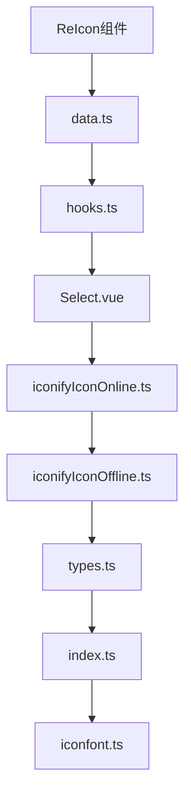
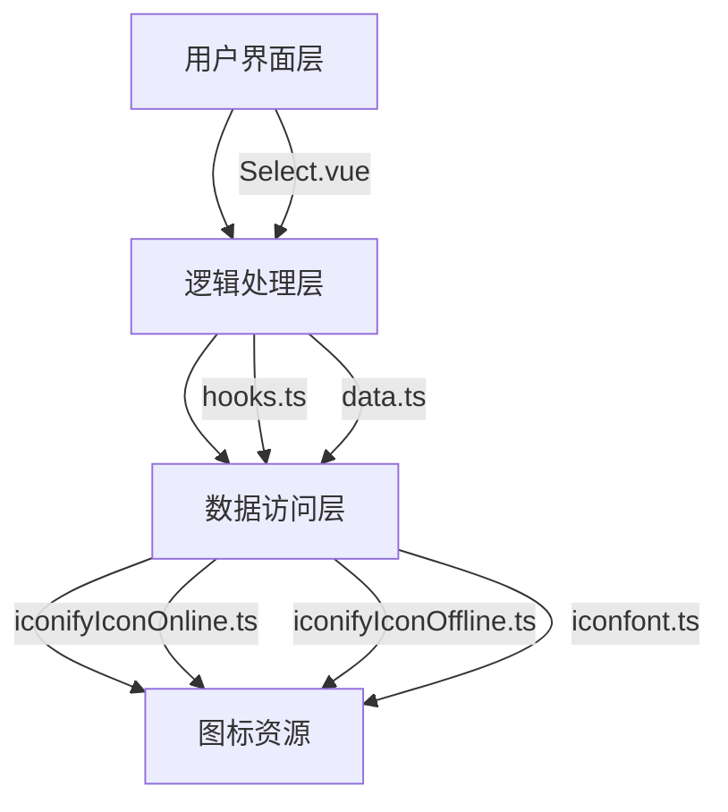
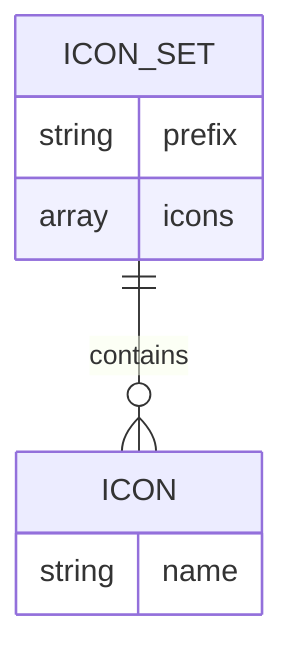
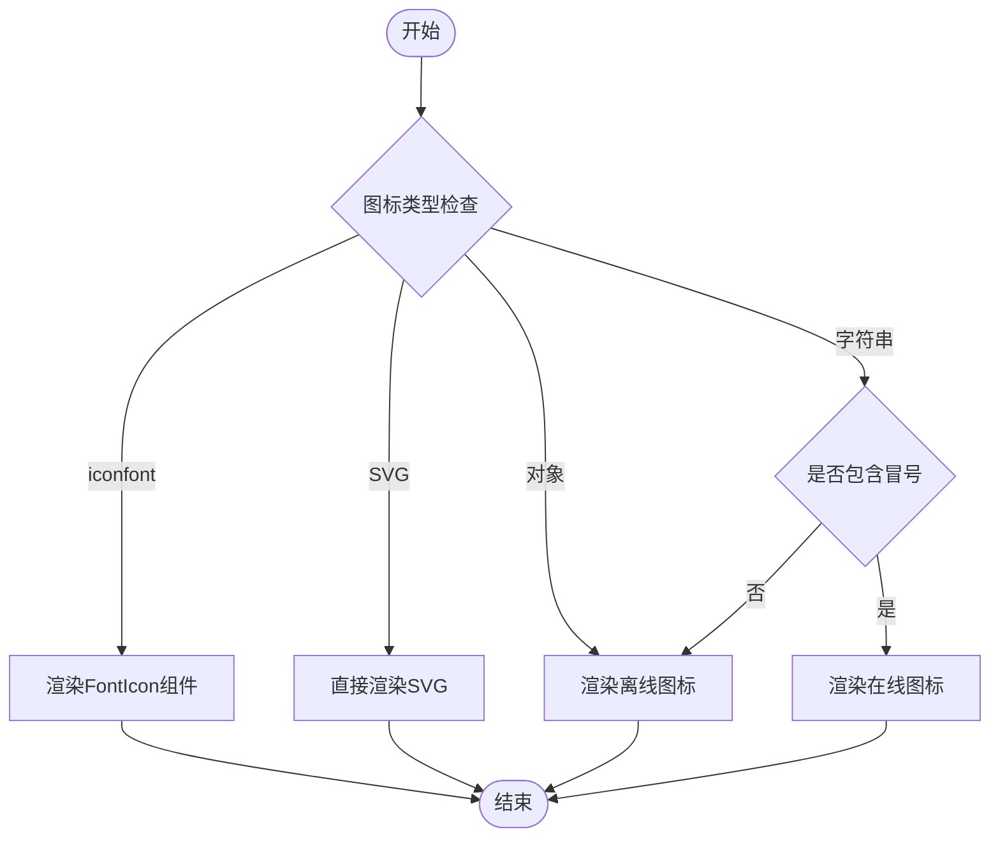
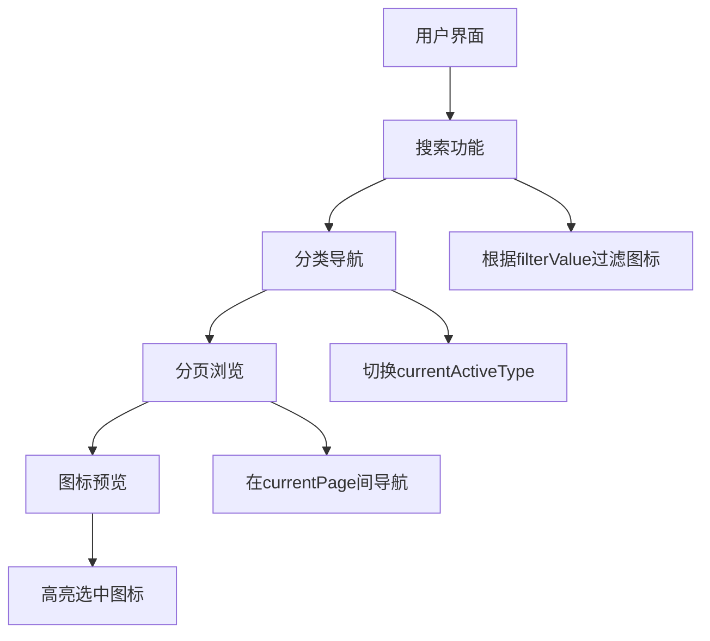
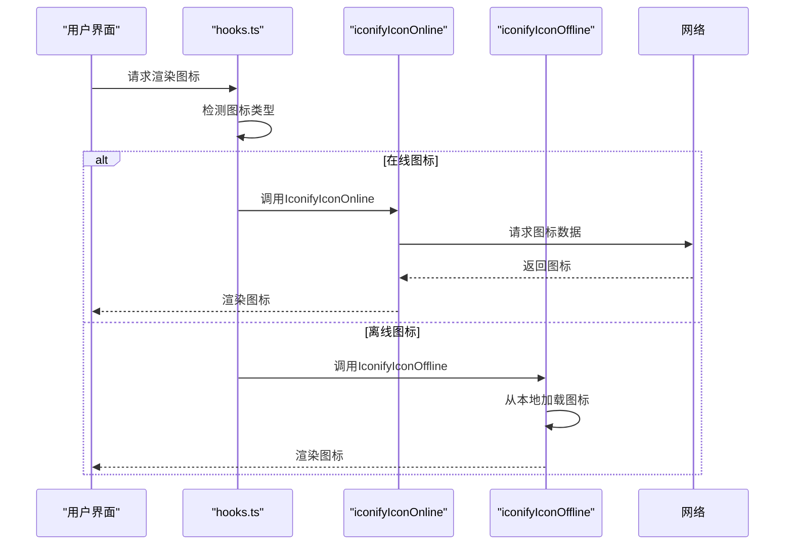

# 图标选择器组件 (ReIcon)

<cite>
**Referenced Files in This Document**   
- [data.ts](file://web/src/components/ReIcon/data.ts)
- [hooks.ts](file://web/src/components/ReIcon/src/hooks.ts)
- [Select.vue](file://web/src/components/ReIcon/src/Select.vue)
- [iconifyIconOnline.ts](file://web/src/components/ReIcon/src/iconifyIconOnline.ts)
- [iconifyIconOffline.ts](file://web/src/components/ReIcon/src/iconifyIconOffline.ts)
- [types.ts](file://web/src/components/ReIcon/src/types.ts)
- [index.ts](file://web/src/components/ReIcon/index.ts)
- [iconfont.ts](file://web/src/components/ReIcon/src/iconfont.ts)
</cite>

## 目录
1. [简介](#简介)
2. [项目结构](#项目结构)
3. [核心组件](#核心组件)
4. [架构概述](#架构概述)
5. [详细组件分析](#详细组件分析)
6. [依赖分析](#依赖分析)
7. [性能考虑](#性能考虑)
8. [故障排除指南](#故障排除指南)
9. [结论](#结论)

## 简介

ReIcon图标选择器是一个功能强大的Vue组件，旨在为开发者提供统一的图标管理解决方案。该组件支持多种图标来源，包括iconfont、Iconify在线/离线资源等，为前端开发提供了极大的灵活性和便利性。通过精心设计的复合架构，ReIcon实现了对不同图标源的无缝集成，使开发者能够轻松地在项目中使用各种图标资源。

## 项目结构

ReIcon组件的文件组织结构清晰合理，各文件职责分明。核心功能分散在多个专门的文件中，实现了关注点分离的设计原则。



**Diagram sources**
- [data.ts](file://web/src/components/ReIcon/data.ts)
- [hooks.ts](file://web/src/components/ReIcon/src/hooks.ts)
- [Select.vue](file://web/src/components/ReIcon/src/Select.vue)
- [iconifyIconOnline.ts](file://web/src/components/ReIcon/src/iconifyIconOnline.ts)
- [iconifyIconOffline.ts](file://web/src/components/ReIcon/src/iconifyIconOffline.ts)
- [types.ts](file://web/src/components/ReIcon/src/types.ts)
- [index.ts](file://web/src/components/ReIcon/index.ts)
- [iconfont.ts](file://web/src/components/ReIcon/src/iconfont.ts)

**Section sources**
- [data.ts](file://web/src/components/ReIcon/data.ts)
- [hooks.ts](file://web/src/components/ReIcon/src/hooks.ts)
- [Select.vue](file://web/src/components/ReIcon/src/Select.vue)

## 核心组件

ReIcon图标选择器的核心由多个协同工作的组件构成，每个组件负责特定的功能领域。`data.ts`文件定义了图标元数据，`hooks.ts`实现了状态管理和渲染逻辑，`Select.vue`提供了用户界面，而`iconifyIconOnline.ts`和`iconifyIconOffline.ts`则分别处理在线和离线图标的加载。

**Section sources**
- [data.ts](file://web/src/components/ReIcon/data.ts)
- [hooks.ts](file://web/src/components/ReIcon/src/hooks.ts)
- [Select.vue](file://web/src/components/ReIcon/src/Select.vue)
- [iconifyIconOnline.ts](file://web/src/components/ReIcon/src/iconifyIconOnline.ts)
- [iconifyIconOffline.ts](file://web/src/components/ReIcon/src/iconifyIconOffline.ts)

## 架构概述

ReIcon组件采用分层架构设计，将图标管理功能分解为多个独立但相互协作的模块。这种设计不仅提高了代码的可维护性，还增强了组件的可扩展性。



**Diagram sources**
- [Select.vue](file://web/src/components/ReIcon/src/Select.vue)
- [hooks.ts](file://web/src/components/ReIcon/src/hooks.ts)
- [iconifyIconOnline.ts](file://web/src/components/ReIcon/src/iconifyIconOnline.ts)
- [iconifyIconOffline.ts](file://web/src/components/ReIcon/src/iconifyIconOffline.ts)
- [iconfont.ts](file://web/src/components/ReIcon/src/iconfont.ts)
- [data.ts](file://web/src/components/ReIcon/data.ts)

## 详细组件分析

### 数据管理分析

`data.ts`文件是ReIcon组件的图标元数据中心，它定义了所有可用图标的集合。该文件通过`IconJson`常量导出一个对象，其中包含多个图标集，每个图标集以特定前缀标识。



**Diagram sources**
- [data.ts](file://web/src/components/ReIcon/data.ts)

**Section sources**
- [data.ts](file://web/src/components/ReIcon/data.ts)

### 状态管理分析

`hooks.ts`文件中的`useRenderIcon`函数是ReIcon组件的核心逻辑之一，负责根据图标类型选择适当的渲染策略。该函数通过正则表达式检测图标类型，并相应地返回不同的Vue组件。



**Diagram sources**
- [hooks.ts](file://web/src/components/ReIcon/src/hooks.ts)

**Section sources**
- [hooks.ts](file://web/src/components/ReIcon/src/hooks.ts)

### 用户界面分析

`Select.vue`组件实现了图标选择器的用户界面，提供了搜索、分类导航和图标预览等功能。该组件使用Element Plus的UI组件构建，确保了与主流UI框架的良好集成。



**Diagram sources**
- [Select.vue](file://web/src/components/ReIcon/src/Select.vue)

**Section sources**
- [Select.vue](file://web/src/components/ReIcon/src/Select.vue)

### 图标加载策略分析

ReIcon组件通过`iconifyIconOnline.ts`和`iconifyIconOffline.ts`两个文件实现了不同的图标加载策略。在线图标通过网络请求动态加载，而离线图标则在本地预加载，以适应不同的网络环境。



**Diagram sources**
- [hooks.ts](file://web/src/components/ReIcon/src/hooks.ts)
- [iconifyIconOnline.ts](file://web/src/components/ReIcon/src/iconifyIconOnline.ts)
- [iconifyIconOffline.ts](file://web/src/components/ReIcon/src/iconifyIconOffline.ts)

**Section sources**
- [hooks.ts](file://web/src/components/ReIcon/src/hooks.ts)
- [iconifyIconOnline.ts](file://web/src/components/ReIcon/src/iconifyIconOnline.ts)
- [iconifyIconOffline.ts](file://web/src/components/ReIcon/src/iconifyIconOffline.ts)

## 依赖分析

ReIcon组件的依赖关系清晰，各模块之间的耦合度适中。通过分析组件间的依赖，可以更好地理解其架构设计。

```mermaid
graph TD
index --> Select
index --> hooks
index --> iconifyOnline
index --> iconifyOffline
index --> iconfont
Select --> data
Select --> hooks
hooks --> iconifyOnline
hooks --> iconifyOffline
hooks --> iconfont
iconifyOnline --> "@iconify/vue"
iconifyOffline --> "@iconify/vue/dist/offline"
```

**Diagram sources**
- [index.ts](file://web/src/components/ReIcon/index.ts)
- [Select.vue](file://web/src/components/ReIcon/src/Select.vue)
- [hooks.ts](file://web/src/components/ReIcon/src/hooks.ts)
- [iconifyIconOnline.ts](file://web/src/components/ReIcon/src/iconifyIconOnline.ts)
- [iconifyIconOffline.ts](file://web/src/components/ReIcon/src/iconifyIconOffline.ts)

**Section sources**
- [index.ts](file://web/src/components/ReIcon/index.ts)
- [Select.vue](file://web/src/components/ReIcon/src/Select.vue)
- [hooks.ts](file://web/src/components/ReIcon/src/hooks.ts)
- [iconifyIconOnline.ts](file://web/src/components/ReIcon/src/iconifyIconOnline.ts)
- [iconifyIconOffline.ts](file://web/src/components/ReIcon/src/iconifyIconOffline.ts)

## 性能考虑

ReIcon组件在设计时充分考虑了性能因素。通过在前端进行搜索过滤，避免了不必要的网络请求。同时，分页机制限制了单次渲染的图标数量，防止了大量DOM元素导致的性能问题。

**Section sources**
- [Select.vue](file://web/src/components/ReIcon/src/Select.vue)
- [data.ts](file://web/src/components/ReIcon/data.ts)

## 故障排除指南

在使用ReIcon组件时，可能会遇到一些常见问题。例如，图标无法显示可能是由于网络问题导致在线图标加载失败，此时可以考虑使用离线模式。搜索功能不工作可能是由于`data.ts`中的图标数据未正确加载。

**Section sources**
- [hooks.ts](file://web/src/components/ReIcon/src/hooks.ts)
- [Select.vue](file://web/src/components/ReIcon/src/Select.vue)

## 结论

ReIcon图标选择器通过精心设计的复合架构，成功地整合了多种图标来源，为开发者提供了灵活且高效的图标管理解决方案。其模块化的设计使得组件易于维护和扩展，而清晰的依赖关系则保证了代码的可读性和可测试性。无论是用于表单设计、菜单配置还是其他UI场景，ReIcon都是一个强大而可靠的工具。