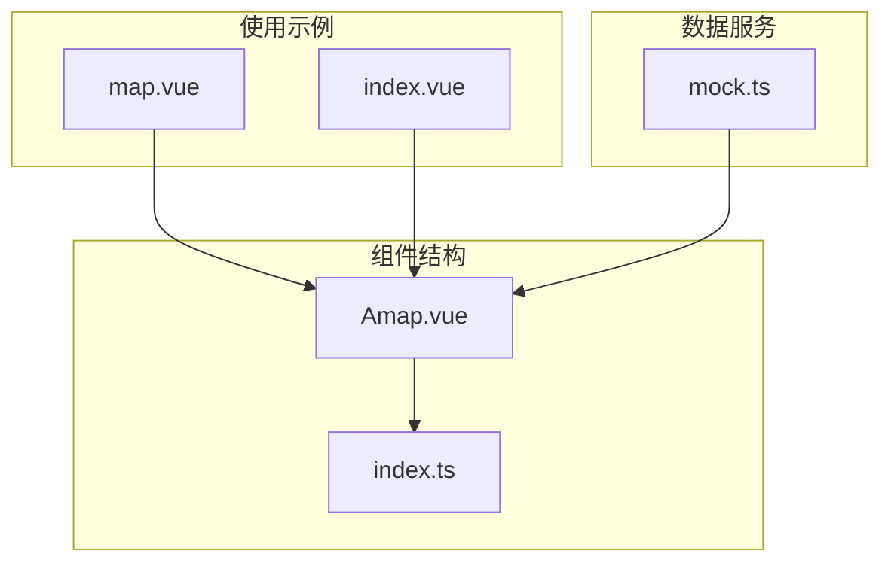
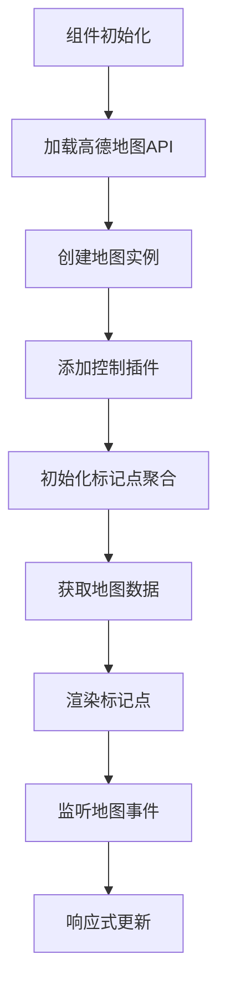
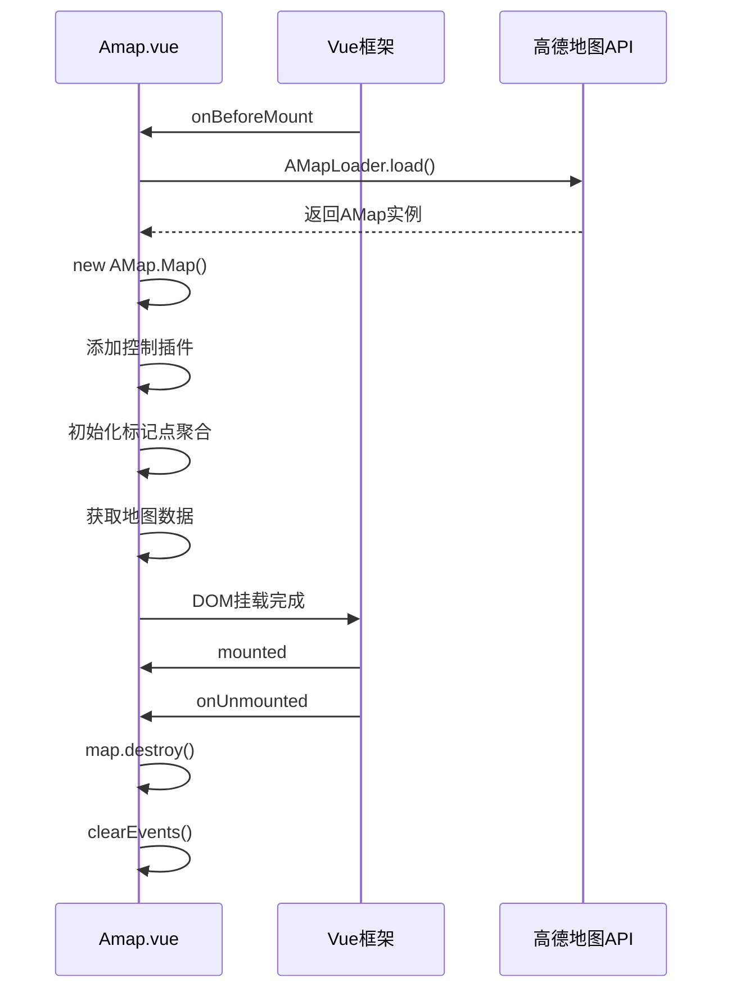

# 地图集成组件 (ReMap)

<cite>
**本文档中引用的文件**
- [Amap.vue](file://web/src/components/ReMap/src/Amap.vue)
- [map.vue](file://web/src/views/able/map.vue)
- [index.vue](file://web/src/views/monitor/online/index.vue)
- [mock.ts](file://web/src/api/mock.ts)
</cite>

## 目录
1. [简介](#简介)
2. [项目结构](#项目结构)
3. [核心组件](#核心组件)
4. [架构概述](#架构概述)
5. [详细组件分析](#详细组件分析)
6. [依赖分析](#依赖分析)
7. [性能考虑](#性能考虑)
8. [故障排除指南](#故障排除指南)
9. [结论](#结论)

## 简介
ReMap组件是基于高德地图JavaScript API封装的Vue3地图集成组件，旨在为Vue3项目提供开箱即用的地图功能。该组件通过`Amap.vue`实现地图的初始化、生命周期管理、事件代理和响应式配置更新。组件支持地图中心点、缩放级别、标记点等核心配置项的动态更新，并通过props机制与父级页面（如`map.vue`）进行数据交互。此外，组件还集成了地理编码服务、自定义图层叠加等高级功能，并在`monitor/online/index.vue`等实际场景中实现了实时定位和轨迹绘制等功能。本文档将深入解析该组件的技术实现细节，提供使用指南和最佳实践。

## 项目结构
ReMap组件位于`web/src/components/ReMap`目录下，采用标准的Vue3组件结构。组件的核心实现位于`src/Amap.vue`文件中，通过`index.ts`进行导出。该组件依赖于高德地图的JavaScript API加载器`@amap/amap-jsapi-loader`，并在初始化时动态加载地图资源。组件的使用示例可以在`web/src/views/able/map.vue`中找到，该文件通过简单的标签引用即可使用地图功能。此外，`monitor/online/index.vue`展示了更复杂的使用场景，包括在线用户监控和地图数据展示。



**Diagram sources**
- [Amap.vue](file://web/src/components/ReMap/src/Amap.vue)
- [map.vue](file://web/src/views/able/map.vue)
- [index.vue](file://web/src/views/monitor/online/index.vue)
- [mock.ts](file://web/src/api/mock.ts)

**Section sources**
- [Amap.vue](file://web/src/components/ReMap/src/Amap.vue)
- [map.vue](file://web/src/views/able/map.vue)

## 核心组件
ReMap组件的核心是`Amap.vue`文件，它实现了地图的完整生命周期管理。组件使用Vue3的组合式API，在`onBeforeMount`钩子中初始化地图实例，并在`onUnmounted`钩子中正确销毁地图资源以防止内存泄漏。地图实例的创建通过`AMapLoader.load`方法异步完成，该方法加载高德地图API并返回一个Promise。组件通过`reactive`状态管理加载状态，并在移动设备上自动调整加载行为。地图的配置项（如中心点、缩放级别）通过`MapConfigure`全局配置对象获取，实现了配置的集中管理。

**Section sources**
- [Amap.vue](file://web/src/components/ReMap/src/Amap.vue#L1-L136)

## 架构概述
ReMap组件采用分层架构设计，将地图功能封装为独立的可复用组件。组件通过props接收外部配置，通过事件机制与父组件通信。在初始化阶段，组件动态加载高德地图API，创建地图实例，并添加必要的控制插件（如工具栏和地图类型切换）。组件还实现了标记点聚合功能，通过`AMap.MarkerCluster`插件优化大量标记点的显示性能。数据获取通过`mapJson` API完成，该API返回模拟的车辆位置信息，并在地图上以自定义图标形式展示。整个架构设计遵循单一职责原则，将地图初始化、配置管理、数据获取和UI渲染分离。



**Diagram sources**
- [Amap.vue](file://web/src/components/ReMap/src/Amap.vue#L1-L136)

## 详细组件分析

### Amap.vue 组件分析
`Amap.vue`组件是ReMap的核心实现，采用Vue3的`<script setup>`语法糖简化代码结构。组件使用`getCurrentInstance`获取当前实例引用，以便在回调函数中访问组件上下文。地图的加载状态通过`mapSet.loading`响应式变量管理，并在移动设备上默认关闭加载动画以优化用户体验。组件通过`defineOptions`设置组件名称，便于调试和性能分析。

#### 生命周期管理
组件的生命周期管理严格遵循Vue3的生命周期钩子。在`onBeforeMount`钩子中，组件开始地图的异步加载过程。这个时机选择非常重要，因为它确保了在DOM挂载之前完成地图资源的准备，避免了渲染竞争条件。在`onUnmounted`钩子中，组件调用`map.destroy()`方法销毁地图实例，并清除所有事件监听器，这是防止内存泄漏的关键措施。



**Diagram sources**
- [Amap.vue](file://web/src/components/ReMap/src/Amap.vue#L1-L136)

#### 地图实例化过程
地图实例化过程是一个复杂的异步操作链。首先，`AMapLoader.load`方法加载高德地图的核心库和指定的插件（如`AMap.MarkerCluster`）。加载成功后，返回的`AMap`对象用于创建地图实例。地图实例的创建需要指定容器元素（通过`instance.refs.mapview`获取）和配置选项。配置选项从全局配置对象`$config.MapConfigure`中获取，实现了配置的外部化管理。创建地图实例后，组件立即添加工具栏和地图类型切换控件，提升用户体验。

#### 地图事件代理机制
组件实现了完善的事件代理机制，通过`map.on`方法监听地图的`complete`事件，该事件在地图渲染完成后触发。事件处理函数将`mapSet.loading`设置为`false`，关闭加载动画。对于标记点，组件为每个聚合标记点注册`click`事件监听器，实现点击标记点后自动缩放到13级并居中显示的功能。这种事件代理模式避免了为每个标记点单独注册事件监听器，提高了性能和内存效率。

**Section sources**
- [Amap.vue](file://web/src/components/ReMap/src/Amap.vue#L1-L136)

### 父级页面交互模式
ReMap组件与父级页面的交互模式简单而高效。以`map.vue`为例，父组件只需通过`<Amap />`标签即可使用地图功能，无需传递任何props。这种设计降低了使用复杂度，使组件易于集成。对于需要自定义配置的场景，可以通过全局配置对象`$config.MapConfigure`进行设置，实现了配置的集中管理。`monitor/online/index.vue`虽然没有直接使用地图组件，但它展示了类似的数据交互模式，通过API获取数据并在UI中展示。

**Section sources**
- [map.vue](file://web/src/views/able/map.vue#L1-L17)

## 依赖分析
ReMap组件的主要依赖包括Vue3核心库、高德地图JavaScript API加载器和项目内部的工具函数库。组件通过`@amap/amap-jsapi-loader`动态加载高德地图API，避免了在项目构建时引入庞大的地图库，优化了初始加载性能。对`@pureadmin/utils`的依赖主要用于设备检测功能，实现了移动端和桌面端的不同行为。数据获取依赖于项目内部的`http`请求库和`mock.ts`中的`mapJson`函数，形成了清晰的依赖链。

```mermaid
graph LR
A[Amap.vue] --> B[Vue3]
A --> C[@amap/amap-jsapi-loader]
A --> D[@pureadmin/utils]
A --> E[http请求库]
C --> F[高德地图API]
E --> G[mock.ts]
```

**Diagram sources**
- [Amap.vue](file://web/src/components/ReMap/src/Amap.vue#L1-L136)
- [mock.ts](file://web/src/api/mock.ts#L8-L10)

**Section sources**
- [Amap.vue](file://web/src/components/ReMap/src/Amap.vue#L1-L136)
- [mock.ts](file://web/src/api/mock.ts#L8-L10)

## 性能考虑
ReMap组件在性能方面做了多项优化。首先，通过异步加载高德地图API，避免了阻塞主线程，提升了应用的初始加载速度。其次，使用标记点聚合（MarkerCluster）技术处理大量标记点，显著减少了DOM元素数量，提高了渲染性能。组件还实现了正确的资源清理机制，在组件销毁时调用`map.destroy()`方法释放地图占用的内存和事件监听器，防止内存泄漏。加载状态的响应式管理也优化了用户体验，特别是在移动设备上自动关闭加载动画，减少了不必要的计算开销。

## 故障排除指南
在使用ReMap组件时可能遇到的主要问题包括地图加载失败、标记点显示异常和内存泄漏。地图加载失败通常由API密钥错误或网络问题引起，可以通过检查浏览器控制台的网络请求和错误信息来诊断。标记点显示异常可能是由于数据格式不正确，需要确保传递给`MarkerCluster.setData()`的数据包含正确的经纬度信息。内存泄漏问题可以通过确保在组件销毁时正确调用`map.destroy()`来避免。如果遇到性能问题，可以检查是否启用了标记点聚合功能，并确保没有为每个标记点单独注册大量事件监听器。

**Section sources**
- [Amap.vue](file://web/src/components/ReMap/src/Amap.vue#L1-L136)

## 结论
ReMap组件是一个功能完整、设计良好的Vue3地图集成解决方案。它通过封装高德地图API的复杂性，为开发者提供了简单易用的地图功能。组件的生命周期管理严谨，资源清理机制完善，有效防止了内存泄漏。响应式设计和事件代理机制确保了良好的性能表现。通过全局配置和API数据获取的分离，组件实现了高内聚低耦合的设计目标。未来可以考虑增加更多的配置选项支持，如地图样式自定义、更多类型的覆盖物等，进一步提升组件的灵活性和适用性。