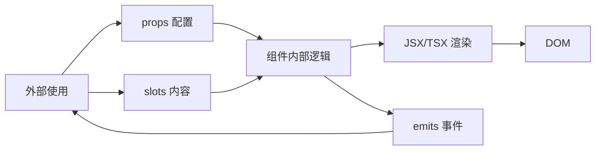
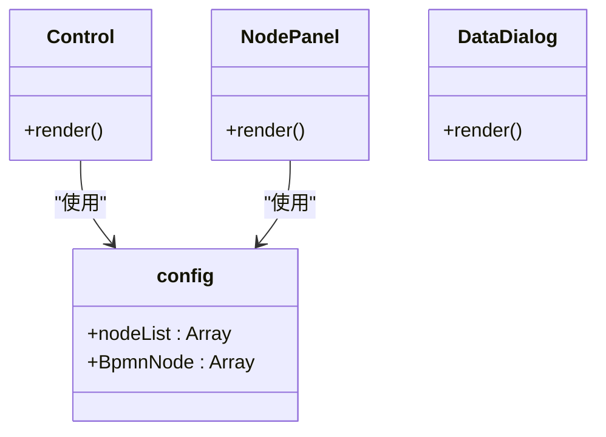
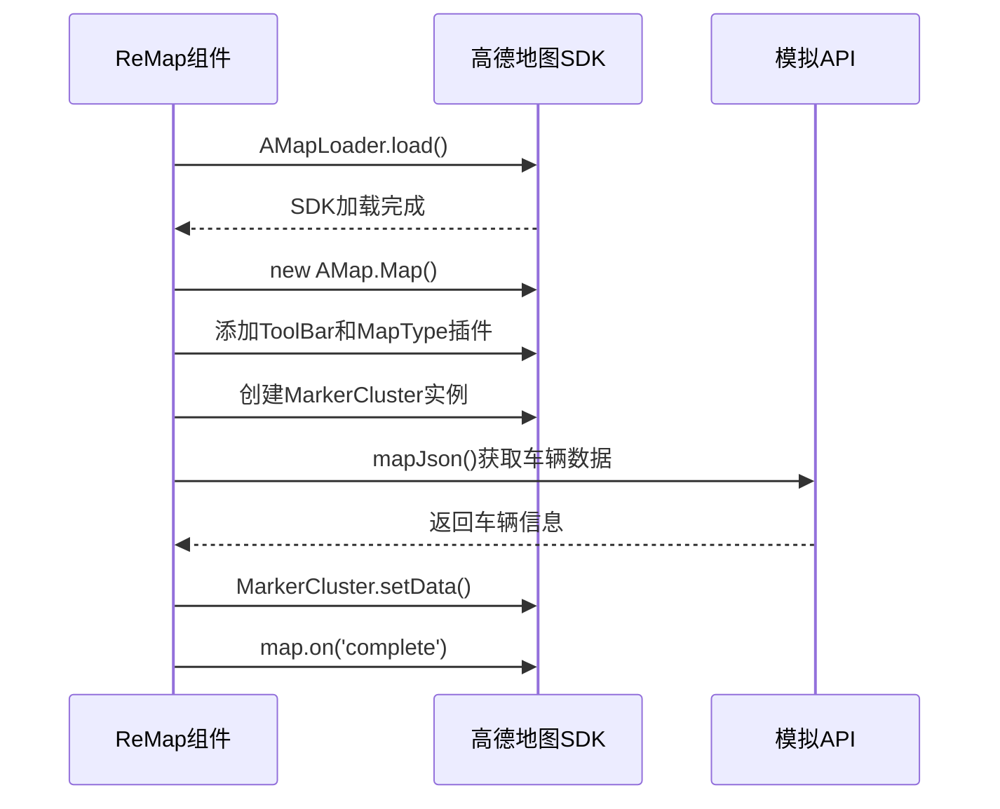
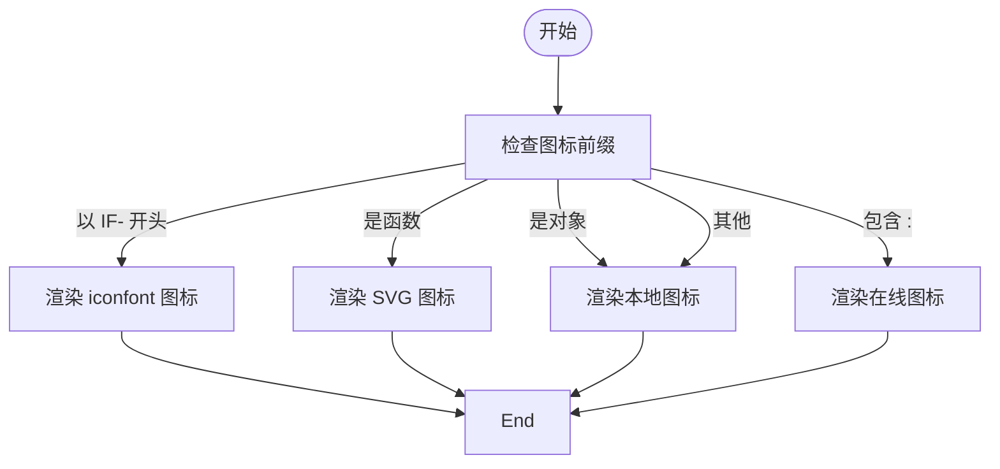
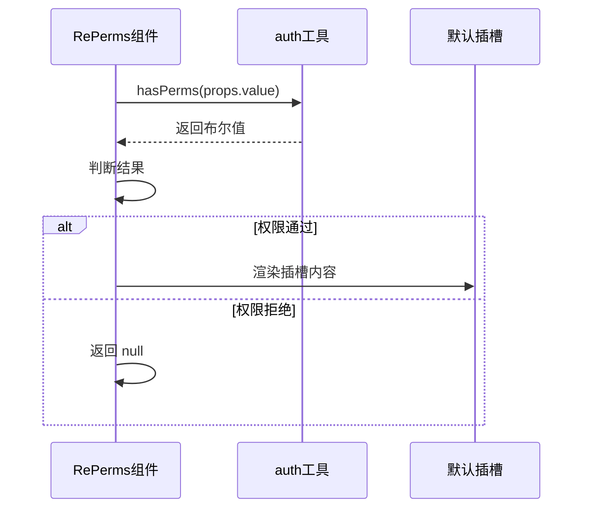
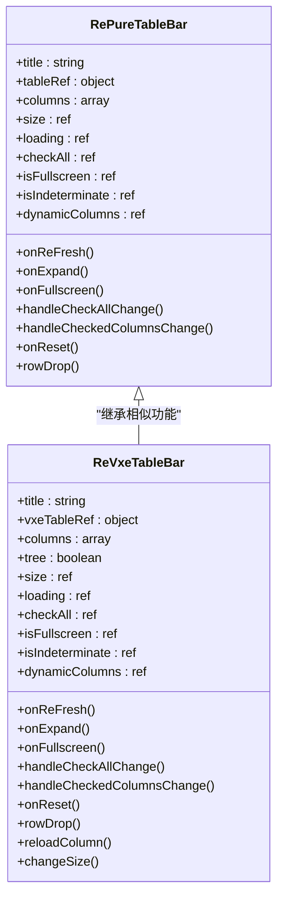

# 复合型组件

<cite>
**本文档引用文件**  
- [ReFlowChart/index.ts](file://web/src/components/ReFlowChart/index.ts)
- [ReFlowChart/src/config.ts](file://web/src/components/ReFlowChart/src/config.ts)
- [ReFlowChart/src/Control.vue](file://web/src/components/ReFlowChart/src/Control.vue)
- [ReMap/index.ts](file://web/src/components/ReMap/index.ts)
- [ReMap/src/Amap.vue](file://web/src/components/ReMap/src/Amap.vue)
- [ReIcon/index.ts](file://web/src/components/ReIcon/index.ts)
- [ReIcon/src/hooks.ts](file://web/src/components/ReIcon/src/hooks.ts)
- [RePerms/index.ts](file://web/src/components/RePerms/index.ts)
- [RePerms/src/perms.tsx](file://web/src/components/RePerms/src/perms.tsx)
- [RePureTableBar/index.ts](file://web/src/components/RePureTableBar/index.ts)
- [RePureTableBar/src/bar.tsx](file://web/src/components/RePureTableBar/src/bar.tsx)
- [ReVxeTableBar/index.ts](file://web/src/components/ReVxeTableBar/index.ts)
- [ReVxeTableBar/src/bar.tsx](file://web/src/components/ReVxeTableBar/src/bar.tsx)
- [utils/auth.ts](file://web/src/utils/auth.ts)
- [config/index.ts](file://web/src/config/index.ts)
- [plugins/i18n.ts](file://web/src/plugins/i18n.ts)
- [store/modules/epTheme.ts](file://web/src/store/modules/epTheme.ts)
</cite>

## 目录
1. [简介](#简介)
2. [项目结构](#项目结构)
3. [核心组件](#核心组件)
4. [架构概述](#架构概述)
5. [详细组件分析](#详细组件分析)
6. [依赖分析](#依赖分析)
7. [性能考虑](#性能考虑)
8. [故障排除指南](#故障排除指南)
9. [结论](#结论)

## 简介
本文档深入分析了 `vue-pure-admin` 项目中的复合型通用组件，涵盖流程图（ReFlowChart）、地图集成（ReMap）、图标选择器（ReIcon）、权限控制（RePerms）以及表格工具栏（RePureTableBar、ReVxeTableBar）。这些组件集成了多种功能或依赖第三方库，具有高度可配置性和扩展性。文档详细说明了每个组件的外部依赖、配置选项、数据绑定机制和扩展能力，并提供完整的集成指南。

## 项目结构
`vue-pure-admin` 项目采用模块化设计，核心复合组件位于 `web/src/components` 目录下。每个组件通常包含 `src` 子目录存放实现代码和 `index.ts` 入口文件。项目依赖 `@pureadmin/utils` 工具库和多个第三方库（如 `sortablejs`、`@amap/amap-jsapi-loader`）来实现高级功能。

```mermaid
graph TB
subgraph "核心组件"
ReFlowChart[ReFlowChart]
ReMap[ReMap]
ReIcon[ReIcon]
RePerms[RePerms]
RePureTableBar[RePureTableBar]
ReVxeTableBar[ReVxeTableBar]
end
subgraph "依赖库"
PureAdminUtils["@pureadmin/utils"]
SortableJS[sortablejs]
AMapJSAPI[@amap/amap-jsapi-loader]
Iconify[iconify]
end
ReFlowChart --> PureAdminUtils
ReMap --> AMapJSAPI
ReIcon --> Iconify
RePureTableBar --> SortableJS
ReVxeTableBar --> SortableJS
```

**图示来源**
- [ReFlowChart/index.ts](file://web/src/components/ReFlowChart/index.ts)
- [ReMap/index.ts](file://web/src/components/ReMap/index.ts)
- [ReIcon/index.ts](file://web/src/components/ReIcon/index.ts)
- [RePerms/index.ts](file://web/src/components/RePerms/index.ts)
- [RePureTableBar/index.ts](file://web/src/components/RePureTableBar/index.ts)
- [ReVxeTableBar/index.ts](file://web/src/components/ReVxeTableBar/index.ts)

**本节来源**
- [web/src/components](file://web/src/components)

## 核心组件
本文档重点分析的复合型组件包括：
- **ReFlowChart**: 基于 LogicFlow 的流程图组件，提供控制面板、节点面板和数据查看功能。
- **ReMap**: 集成高德地图的组件，支持车辆信息展示和地图交互。
- **ReIcon**: 统一的图标渲染组件，支持 iconfont、SVG 和 Iconify 图标。
- **RePerms**: 基于权限码的权限控制组件，用于条件性渲染内容。
- **RePureTableBar / ReVxeTableBar**: 为表格组件提供操作工具栏，支持刷新、全屏、列设置等功能。

**本节来源**
- [ReFlowChart/index.ts](file://web/src/components/ReFlowChart/index.ts)
- [ReMap/index.ts](file://web/src/components/ReMap/index.ts)
- [ReIcon/index.ts](file://web/src/components/ReIcon/index.ts)
- [RePerms/index.ts](file://web/src/components/RePerms/index.ts)
- [RePureTableBar/index.ts](file://web/src/components/RePureTableBar/index.ts)
- [ReVxeTableBar/index.ts](file://web/src/components/ReVxeTableBar/index.ts)

## 架构概述
复合型组件采用 Vue 3 的 Composition API 和 JSX/TSX 进行开发，通过 `defineComponent` 定义组件。组件通过 `withInstall` 函数进行封装，使其支持按需引入。组件间通过 props 接收配置，通过 slots 提供内容分发，并通过 emits 触发事件与外部通信。



**图示来源**
- [RePerms/src/perms.tsx](file://web/src/components/RePerms/src/perms.tsx)
- [RePureTableBar/src/bar.tsx](file://web/src/components/RePureTableBar/src/bar.tsx)
- [ReVxeTableBar/src/bar.tsx](file://web/src/components/ReVxeTableBar/src/bar.tsx)

## 详细组件分析

### ReFlowChart 分析
`ReFlowChart` 组件封装了 LogicFlow 流程图库，提供开箱即用的流程图功能。

#### 架构设计
组件由三个主要部分组成：`Control`（控制面板）、`NodePanel`（节点面板）和 `DataDialog`（数据查看）。`config.ts` 文件定义了可用的节点类型和配置。



**图示来源**
- [ReFlowChart/src/Control.vue](file://web/src/components/ReFlowChart/src/Control.vue)
- [ReFlowChart/src/NodePanel.vue](file://web/src/components/ReFlowChart/src/NodePanel.vue)
- [ReFlowChart/src/DataDialog.vue](file://web/src/components/ReFlowChart/src/DataDialog.vue)
- [ReFlowChart/src/config.ts](file://web/src/components/ReFlowChart/src/config.ts)

**本节来源**
- [ReFlowChart/index.ts](file://web/src/components/ReFlowChart/index.ts)
- [ReFlowChart/src/config.ts](file://web/src/components/ReFlowChart/src/config.ts)

### ReMap 分析
`ReMap` 组件集成了高德地图 JavaScript API，提供地图展示和交互功能。

#### 技术实现
组件在 `onBeforeMount` 钩子中动态加载高德地图 SDK，并创建地图实例。通过 `AMap.MarkerCluster` 实现车辆信息的聚合展示。



**图示来源**
- [ReMap/src/Amap.vue](file://web/src/components/ReMap/src/Amap.vue)

**本节来源**
- [ReMap/index.ts](file://web/src/components/ReMap/index.ts)
- [ReMap/src/Amap.vue](file://web/src/components/ReMap/src/Amap.vue)

### ReIcon 分析
`ReIcon` 组件提供统一的图标渲染接口，支持多种图标来源。

#### 数据绑定机制
`useRenderIcon` 钩子函数根据图标名称的前缀（如 `IF-`）或内容（是否包含 `:`）来判断图标类型，并返回相应的渲染组件。



**图示来源**
- [ReIcon/src/hooks.ts](file://web/src/components/ReIcon/src/hooks.ts)

**本节来源**
- [ReIcon/index.ts](file://web/src/components/ReIcon/index.ts)
- [ReIcon/src/hooks.ts](file://web/src/components/ReIcon/src/hooks.ts)

### RePerms 分析
`RePerms` 组件实现了基于权限码的细粒度权限控制。

#### 权限控制机制
组件通过 `hasPerms` 工具函数检查当前用户权限，仅当权限匹配时才渲染插槽内容。



**图示来源**
- [RePerms/src/perms.tsx](file://web/src/components/RePerms/src/perms.tsx)
- [utils/auth.ts](file://web/src/utils/auth.ts)

**本节来源**
- [RePerms/index.ts](file://web/src/components/RePerms/index.ts)
- [RePerms/src/perms.tsx](file://web/src/components/RePerms/src/perms.tsx)

### RePureTableBar 与 ReVxeTableBar 分析
这两个组件为不同表格库提供功能一致的操作工具栏。

#### 扩展能力
组件通过 `slots` 提供高度可定制性，允许用户自定义标题、按钮和表格内容。通过 `Sortable` 实现列的拖拽排序。



**图示来源**
- [RePureTableBar/src/bar.tsx](file://web/src/components/RePureTableBar/src/bar.tsx)
- [ReVxeTableBar/src/bar.tsx](file://web/src/components/ReVxeTableBar/src/bar.tsx)

**本节来源**
- [RePureTableBar/index.ts](file://web/src/components/RePureTableBar/index.ts)
- [RePureTableBar/src/bar.tsx](file://web/src/components/RePureTableBar/src/bar.tsx)
- [ReVxeTableBar/index.ts](file://web/src/components/ReVxeTableBar/index.ts)
- [ReVxeTableBar/src/bar.tsx](file://web/src/components/ReVxeTableBar/src/bar.tsx)

## 依赖分析
复合型组件依赖多个外部库和内部模块，形成清晰的依赖关系。

```mermaid
graph TD
    ReFlowChart --> LogicFlow
    ReMap --> AMapJSAPI
    ReIcon --> Iconify
    ReIcon --> PureAdminUtils
    RePerms --> AuthUtils
    RePureTableBar --> SortableJS
    RePureTableBar --> PureAdminUtils
    RePureTableBar --> EpThemeStore
    ReVxeTableBar --> SortableJS
    ReVxeTableBar --> PureAdminUtils
    ReVxeTableBar --> EpThemeStore
    ReVxeTableBar --> I18n