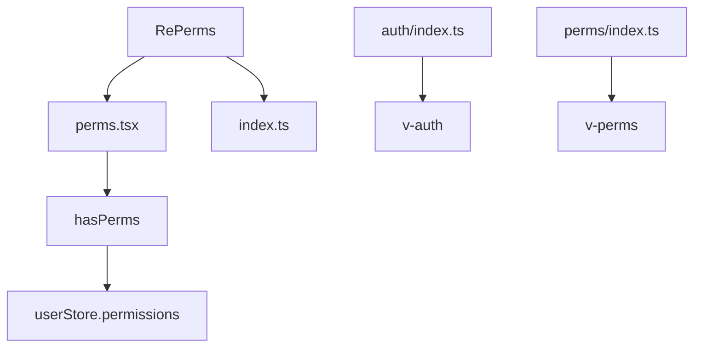
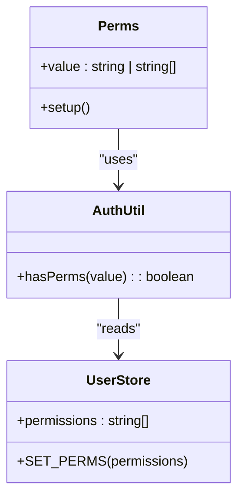
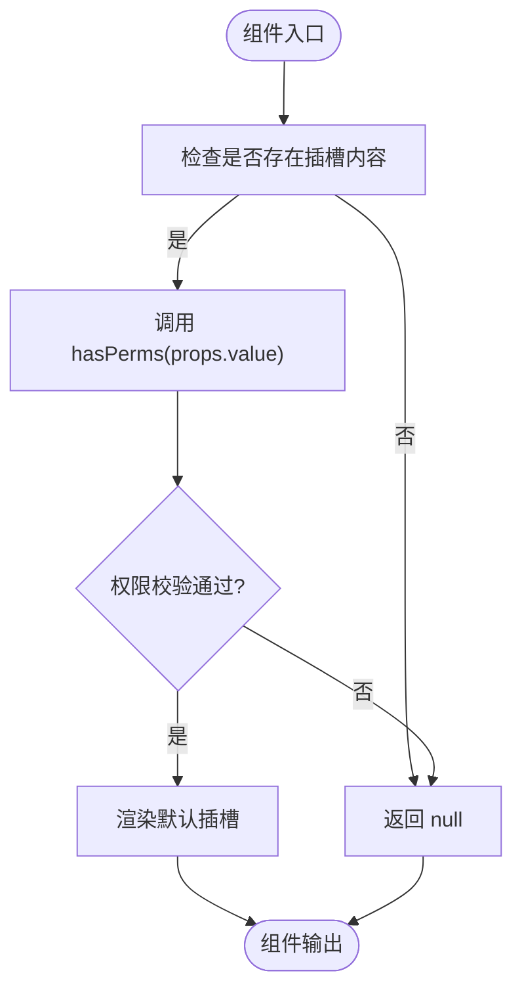
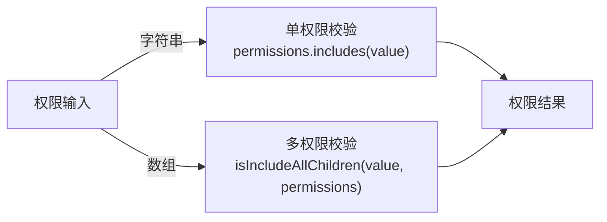
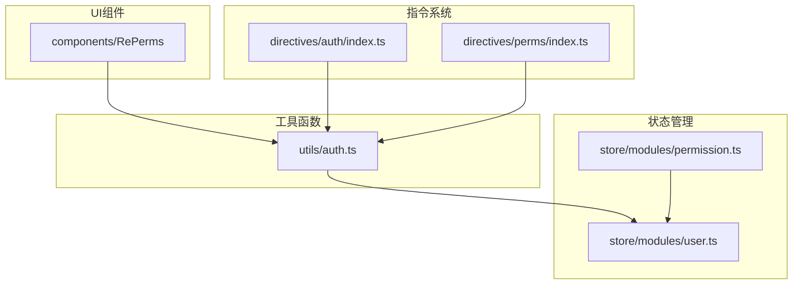

# 权限控制组件 (RePerms)

<cite>
**本文档引用文件**  
- [perms.tsx](file://web/src/components/RePerms/src/perms.tsx)
- [auth.ts](file://web/src/utils/auth.ts)
- [user.ts](file://web/src/store/modules/user.ts)
- [permission.ts](file://web/src/store/modules/permission.ts)
- [index.ts](file://web/src/components/RePerms/index.ts)
- [index.vue](file://web/src/views/system/user/index.vue)
- [index.vue](file://web/src/views/permission/button/index.vue)
- [auth/index.ts](file://web/src/directives/auth/index.ts)
- [perms/index.ts](file://web/src/directives/perms/index.ts)
</cite>

## 目录
1. [简介](#简介)
2. [项目结构](#项目结构)
3. [核心组件](#核心组件)
4. [架构概览](#架构概览)
5. [详细组件分析](#详细组件分析)
6. [依赖分析](#依赖分析)
7. [性能考虑](#性能考虑)
8. [故障排除指南](#故障排除指南)
9. [结论](#结论)

## 简介
RePerms 是一个基于角色的细粒度权限控制组件，用于在 Vue.js 应用中实现动态内容可见性控制。该组件通过结合 Pinia 状态管理（user 模块）与自定义指令（auth、perms）来实现按钮级和页面级的权限渲染机制。本文档深入分析其工作原理、权限匹配模式、多权限逻辑组合以及 fallback 内容处理策略。

## 项目结构
RePerms 组件位于 `web/src/components/RePerms` 目录下，主要由 `src/perms.tsx` 和 `index.ts` 构成。该组件依赖于 `utils/auth.ts` 中的权限判断函数，并与 `store/modules/user.ts` 和 `store/modules/permission.ts` 模块紧密集成。

**Diagram sources**
- [perms.tsx](file://web/src/components/RePerms/src/perms.tsx)
- [auth/index.ts](file://web/src/directives/auth/index.ts)
- [perms/index.ts](file://web/src/directives/perms/index.ts)

**Section sources**
- [perms.tsx](file://web/src/components/RePerms/src/perms.tsx)
- [index.ts](file://web/src/components/RePerms/index.ts)

## 核心组件
RePerms 组件的核心是 `perms.tsx` 文件，它使用 Vue 的 `defineComponent` 创建一个函数式组件，接收 `value` 属性作为权限标识符。组件通过调用 `hasPerms` 函数判断当前用户是否具有指定权限，若具备则渲染子元素，否则不渲染。

**Section sources**
- [perms.tsx](file://web/src/components/RePerms/src/perms.tsx)
- [auth.ts](file://web/src/utils/auth.ts)

## 架构概览
RePerms 权限控制系统基于 Pinia 状态管理库，将用户权限信息存储在 `user` 模块中。系统启动时从本地存储或后端接口加载用户权限，并通过 `hasPerms` 函数进行权限校验。自定义指令 `v-perms` 和 `v-auth` 在元素挂载时执行权限检查，决定是否保留该元素。

**Diagram sources**
- [perms.tsx](file://web/src/components/RePerms/src/perms.tsx)
- [user.ts](file://web/src/store/modules/user.ts)
- [auth.ts](file://web/src/utils/auth.ts)

## 详细组件分析

### RePerms 组件分析
RePerms 是一个无状态函数式组件，利用 Vue 的 `slots` 机制实现内容分发。其核心逻辑在于 `setup` 函数中对 `hasPerms` 的调用，根据权限判断结果决定是否渲染默认插槽内容。

#### 组件结构

**Diagram sources**
- [perms.tsx](file://web/src/components/RePerms/src/perms.tsx)

**Section sources**
- [perms.tsx](file://web/src/components/RePerms/src/perms.tsx)

### 权限匹配模式
RePerms 支持两种权限标识符传入方式：字符串单权限和字符串数组多权限。当传入数组时，默认采用 AND 逻辑组合，即用户必须拥有数组中所有权限才能通过校验。

**Diagram sources**
- [auth.ts](file://web/src/utils/auth.ts#L130-L140)

### 实际用例分析
在 `system/user/index.vue` 和 `permission/button/index.vue` 中展示了 RePerms 的典型应用场景。前者用于控制用户管理界面中的操作按钮可见性，后者演示了组件、函数和指令三种权限控制方式。

**Section sources**
- [index.vue](file://web/src/views/system/user/index.vue)
- [index.vue](file://web/src/views/permission/button/index.vue)

## 依赖分析
RePerms 组件依赖于多个核心模块，形成完整的权限控制链路。

**Diagram sources**
- [user.ts](file://web/src/store/modules/user.ts)
- [permission.ts](file://web/src/store/modules/permission.ts)
- [auth.ts](file://web/src/utils/auth.ts)
- [auth/index.ts](file://web/src/directives/auth/index.ts)
- [perms/index.ts](file://web/src/directives/perms/index.ts)

**Section sources**
- [user.ts](file://web/src/store/modules/user.ts)
- [permission.ts](file://web/src/store/modules/permission.ts)
- [auth.ts](file://web/src/utils/auth.ts)

## 性能考虑
由于权限校验发生在组件渲染阶段，建议避免频繁修改权限状态以减少不必要的重渲染。对于动态权限变更场景，可通过强制组件重新挂载或使用 `key` 属性触发更新。

## 故障排除指南
常见问题包括权限未生效、按钮不隐藏等。应检查：
- 用户登录后是否正确设置了 `permissions` 状态
- 权限标识符拼写是否准确
- 是否正确引入并注册了 `v-perms` 指令

**Section sources**
- [auth.ts](file://web/src/utils/auth.ts#L130-L140)
- [user.ts](file://web/src/store/modules/user.ts)

## 结论
RePerms 提供了一套完整的基于角色的细粒度权限控制解决方案，通过组件化和指令化的方式实现了灵活的内容可见性控制。其设计充分考虑了可维护性和扩展性，适用于复杂的企业级管理系统。