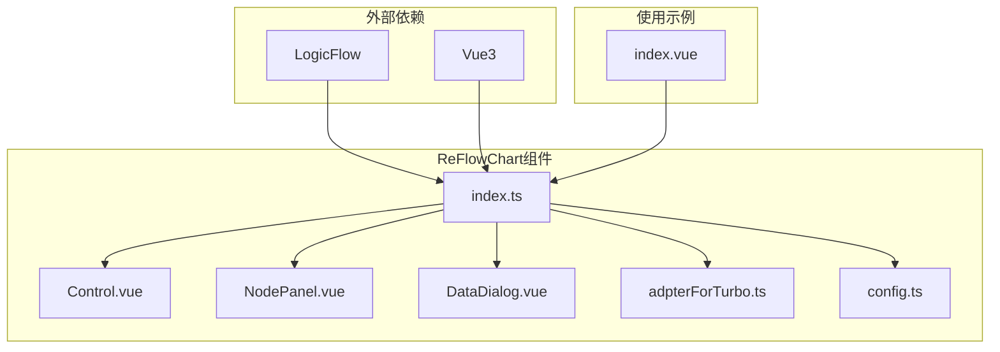

# 流程图组件 (ReFlowChart)

<cite>
**本文档引用文件**   
- [index.ts](file://src/components/ReFlowChart/index.ts)
- [config.ts](file://src/components/ReFlowChart/src/config.ts)
- [adpterForTurbo.ts](file://src/components/ReFlowChart/src/adpterForTurbo.ts)
- [Control.vue](file://src/components/ReFlowChart/src/Control.vue)
- [DataDialog.vue](file://src/components/ReFlowChart/src/DataDialog.vue)
- [NodePanel.vue](file://src/components/ReFlowChart/src/NodePanel.vue)
- [index.vue](file://src/views/flow-chart/index.vue)
- [dataTurbo.json](file://src/views/flow-chart/dataTurbo.json)
</cite>

## 目录
1. [简介](#简介)
2. [项目结构](#项目结构)
3. [核心组件](#核心组件)
4. [架构概述](#架构概述)
5. [详细组件分析](#详细组件分析)
6. [依赖分析](#依赖分析)
7. [性能考虑](#性能考虑)
8. [故障排除指南](#故障排除指南)
9. [结论](#结论)
10. [附录](#附录) (如有必要)

## 简介
ReFlowChart组件是一个基于Vue3组合式API的集成式流程图编辑器，旨在为开发者提供一个功能丰富、易于集成的可视化工作流设计解决方案。该组件通过封装LogicFlow图形库，实现了节点拖拽、连线编辑和数据绑定等核心功能。组件设计遵循模块化原则，将控制面板、节点面板和数据查看器等功能拆分为独立的子组件，通过清晰的职责划分和通信机制确保系统的可维护性和扩展性。此外，组件还提供了与Turbo工作流引擎的适配器，实现了流程数据的双向转换，支持在复杂业务场景下的无缝集成。

## 项目结构
ReFlowChart组件位于`src/components/ReFlowChart`目录下，采用典型的Vue组件结构。核心功能实现在`src`子目录中，包含Control.vue、DataDialog.vue、NodePanel.vue三个主要子组件以及adpterForTurbo.ts和config.ts两个功能模块。组件通过index.ts文件对外暴露Control、NodePanel和DataDialog三个可复用的UI组件。该组件依赖于LogicFlow图形库及其BPMN扩展，通过Vue3的组合式API实现响应式数据绑定和生命周期管理。在`src/views/flow-chart`目录下提供了完整的使用示例，展示了如何在实际项目中集成和使用该组件。

**Diagram sources**
- [index.ts](file://src/components/ReFlowChart/index.ts)
- [Control.vue](file://src/components/ReFlowChart/src/Control.vue)
- [NodePanel.vue](file://src/components/ReFlowChart/src/NodePanel.vue)
- [DataDialog.vue](file://src/components/ReFlowChart/src/DataDialog.vue)
- [adpterForTurbo.ts](file://src/components/ReFlowChart/src/adpterForTurbo.ts)
- [config.ts](file://src/components/ReFlowChart/src/config.ts)
- [index.vue](file://src/views/flow-chart/index.vue)

**Section sources**
- [index.ts](file://src/components/ReFlowChart/index.ts)
- [Control.vue](file://src/components/ReFlowChart/src/Control.vue)
- [NodePanel.vue](file://src/components/ReFlowChart/src/NodePanel.vue)
- [DataDialog.vue](file://src/components/ReFlowChart/src/DataDialog.vue)
- [adpterForTurbo.ts](file://src/components/ReFlowChart/src/adpterForTurbo.ts)
- [config.ts](file://src/components/ReFlowChart/src/config.ts)
- [index.vue](file://src/views/flow-chart