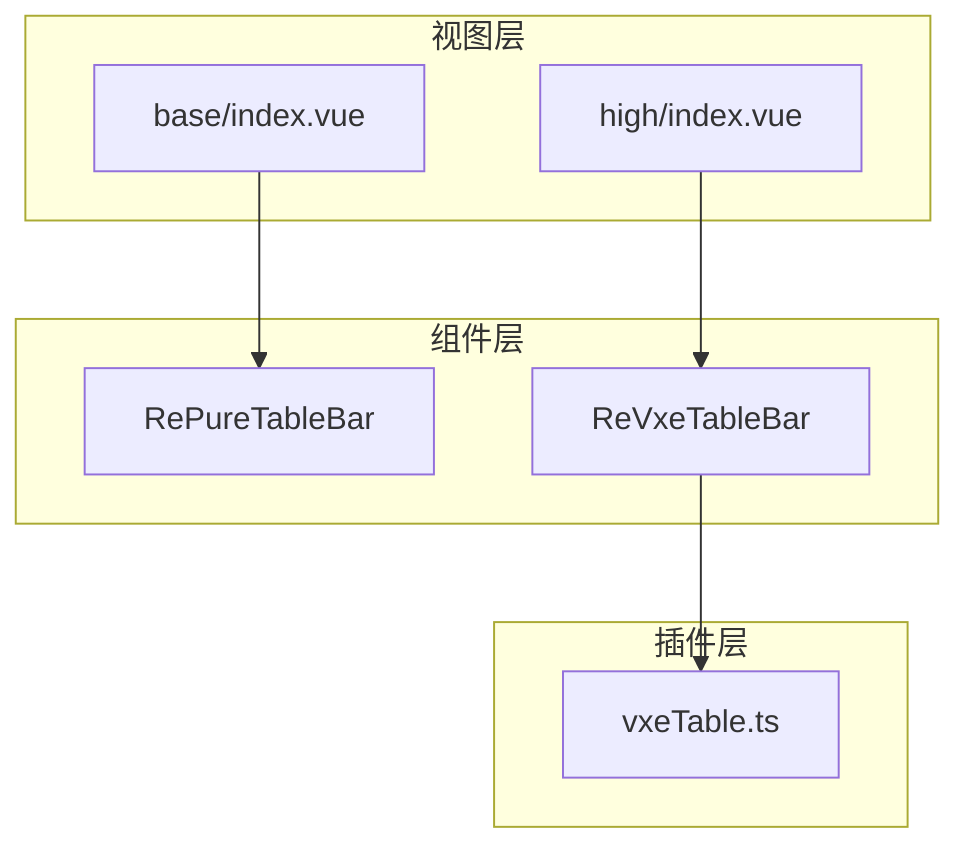
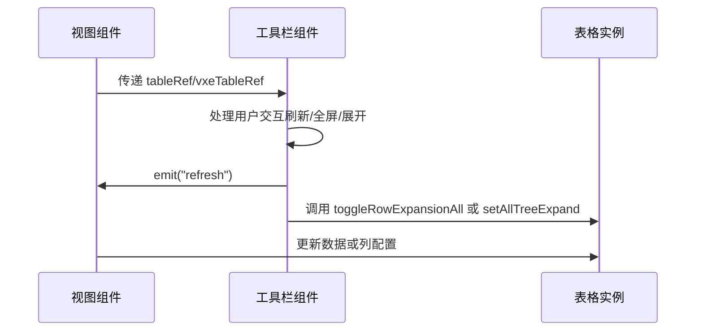
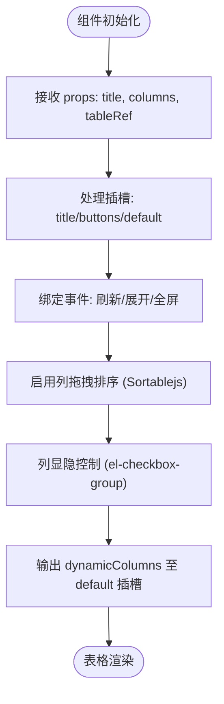

# 表格工具栏组件 (RePureTableBar & ReVxeTableBar)

<cite>
**本文档引用文件**  
- [bar.tsx](file://web/src/components/RePureTableBar/src/bar.tsx)
- [bar.tsx](file://web/src/components/ReVxeTableBar/src/bar.tsx)
- [vxeTable.ts](file://web/src/plugins/vxeTable.ts)
- [index.vue](file://web/src/views/table/base/index.vue)
- [high.vue](file://web/src/views/table/high/index.vue)
</cite>

## 目录
1. [简介](#简介)
2. [项目结构](#项目结构)
3. [核心组件](#核心组件)
4. [架构概述](#架构概述)
5. [详细组件分析](#详细组件分析)
6. [依赖分析](#依赖分析)
7. [性能考虑](#性能考虑)
8. [故障排除指南](#故障排除指南)
9. [结论](#结论)

## 简介
RePureTableBar 和 ReVxeTableBar 是为 Vue-Pure-Admin 项目设计的双工具栏组件，分别适配原生表格与 VxeTable。它们提供统一接口封装导出、打印、列显隐控制等公共功能，并通过插槽机制支持自定义操作按钮注入和批量操作回调扩展。

## 项目结构
该组件位于 `web/src/components` 目录下，分为两个独立模块：RePureTableBar 针对基础表格，ReVxeTableBar 针对 VxeTable 高级表格。视图层在 `web/src/views/table` 中通过 base 和 high 模块调用这些工具栏组件。



**Diagram sources**  
- [RePureTableBar](file://web/src/components/RePureTableBar/src/bar.tsx)
- [ReVxeTableBar](file://web/src/components/ReVxeTableBar/src/bar.tsx)
- [vxeTable.ts](file://web/src/plugins/vxeTable.ts)

**Section sources**
- [bar.tsx](file://web/src/components/RePureTableBar/src/bar.tsx)
- [bar.tsx](file://web/src/components/ReVxeTableBar/src/bar.tsx)
- [vxeTable.ts](file://web/src/plugins/vxeTable.ts)

## 核心组件
RePureTableBar 和 ReVxeTableBar 均采用 JSX 编写，利用 Vue 的 setup 模式实现响应式逻辑。两者均支持标题自定义、刷新、全屏、密度切换、列拖拽排序及显隐控制等功能。

**Section sources**
- [bar.tsx](file://web/src/components/RePureTableBar/src/bar.tsx#L1-L399)
- [bar.tsx](file://web/src/components/ReVxeTableBar/src/bar.tsx#L1-L390)

## 架构概述
组件通过 props 接收表格引用、列配置和状态参数，使用 emit 向外冒泡 refresh 和 fullscreen 事件。插槽机制允许外部注入自定义按钮，slots.default 传递动态列配置和尺寸信息给表格主体。



**Diagram sources**  
- [bar.tsx](file://web/src/components/RePureTableBar/src/bar.tsx#L50-L100)
- [bar.tsx](file://web/src/components/ReVxeTableBar/src/bar.tsx#L50-L100)

## 详细组件分析

### RePureTableBar 分析
专为原生表格设计，依赖 `@pureadmin/utils` 提供的 `delay`、`cloneDeep` 等工具函数处理异步与深拷贝。通过 `transformI18n` 支持国际化列名显示。

#### 插槽机制与操作项配置
支持 title、buttons、default 三个插槽：
- `title`：自定义标题区域
- `buttons`：插入额外操作按钮
- `default`：接收动态列配置并渲染表格



**Diagram sources**  
- [bar.tsx](file://web/src/components/RePureTableBar/src/bar.tsx#L150-L300)

**Section sources**
- [bar.tsx](file://web/src/components/RePureTableBar/src/bar.tsx#L1-L399)

### ReVxeTableBar 分析
针对 VxeTable 封装，通过 `vxeTableRef` 调用其特有的 `setAllTreeExpand`、`clearTreeExpand` 和 `reloadColumn` 方法实现树形展开与列重载。

#### 与 vxeTable 插件集成
通过 `useVxeTable(app)` 在应用启动时注册 VxeTable 所需组件与功能模块，确保 `reloadColumn` 等方法可用。

```mermaid
classDiagram
class ReVxeTableBar {
+props : title, vxeTableRef, columns, tree
+emits : refresh, fullscreen
+setup() : JSX Render
-onExpand() : void
-reloadColumn() : void
-handleCheckAllChange() : void
}
class VxeTablePlugin {
+useVxeTable(app) : void
+setConfig() : void
}
ReVxeTableBar --> VxeTablePlugin : "依赖"
ReVxeTableBar --> "vxe-table" : "使用 Table, Column, Grid 等组件"
```

**Diagram sources**  
- [bar.tsx](file://web/src/components/ReVxeTableBar/src/bar.tsx#L1-L390)
- [vxeTable.ts](file://web/src/plugins/vxeTable.ts#L1-L105)

**Section sources**
- [bar.tsx](file://web/src/components/ReVxeTableBar/src/bar.tsx#L1-L390)
- [vxeTable.ts](file://web/src/plugins/vxeTable.ts#L1-L105)

### 样式兼容性处理
两组件均采用 Tailwind CSS 类名书写，适配暗色主题（dark mode）。图标使用 `~icons` 和 SVG 组件化引入，确保不同表格模式下的视觉一致性。

## 依赖分析
组件依赖 `sortablejs` 实现列拖拽，`v-tippy` 提供提示气泡，`@pureadmin/utils` 提供通用工具函数。ReVxeTableBar 强依赖 `vxe-table` 库及其插件系统。

```mermaid
graph LR
A[RePureTableBar] --> B[sortablejs]
A --> C[v-tippy]
A --> D[@pureadmin/utils]
E[ReVxeTableBar] --> B
E --> C
E --> F[vxe-table]
F --> G[vxeTable.ts]
```

**Diagram sources**  
- [bar.tsx](file://web/src/components/RePureTableBar/src/bar.tsx#L1-L10)
- [bar.tsx](file://web/src/components/ReVxeTableBar/src/bar.tsx#L1-L10)
- [vxeTable.ts](file://web/src/plugins/vxeTable.ts#L1-L10)

**Section sources**
- [bar.tsx](file://web/src/components/RePureTableBar/src/bar.tsx#L1-L399)
- [bar.tsx](file://web/src/components/ReVxeTableBar/src/bar.tsx#L1-L390)
- [vxeTable.ts](file://web/src/plugins/vxeTable.ts#L1-L105)

## 性能考虑
- 使用 `nextTick` 延迟初始化 `Sortable` 实例，避免 DOM 未渲染完成
- `cloneDeep` 用于隔离原始列配置，防止副作用
- `delay` 控制加载动画时长，提升用户体验
- `refreshColumn` 和 `reloadColumn` 按需调用，减少不必要的重渲染

## 故障排除指南
常见问题包括列拖拽失效、全屏样式错乱、树形展开无效等。检查点如下：
- 确保 `tableRef` 或 `vxeTableRef` 正确传递
- 固定列（fixed）不支持拖拽，需检查 `fixed` 属性
- 国际化列名需确保 `transformI18n` 正常工作
- 插槽内容未显示时，确认父组件正确使用 `<template #buttons>`

**Section sources**
- [bar.tsx](file://web/src/components/RePureTableBar/src/bar.tsx#L200-L250)
- [bar.tsx](file://web/src/components/ReVxeTableBar/src/bar.tsx#L200-L250)

## 结论
RePureTableBar 与 ReVxeTableBar 实现了对不同表格方案的统一工具栏封装，具备良好的扩展性与维护性。通过插槽机制和事件冒泡，实现了高度灵活的自定义能力，适用于复杂企业级后台管理系统。