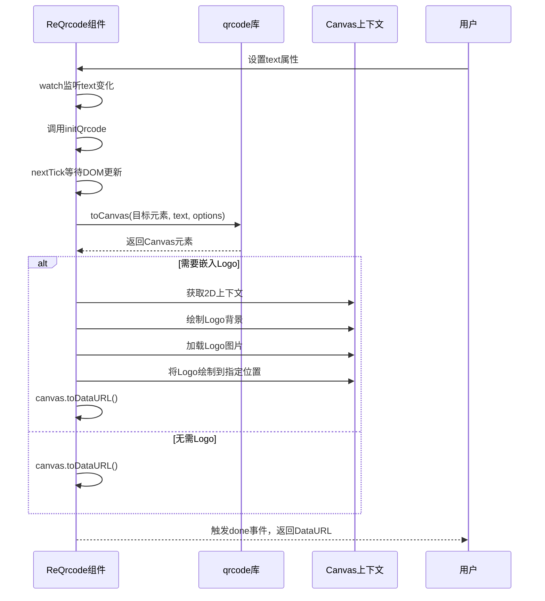
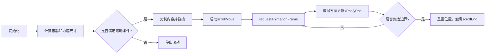
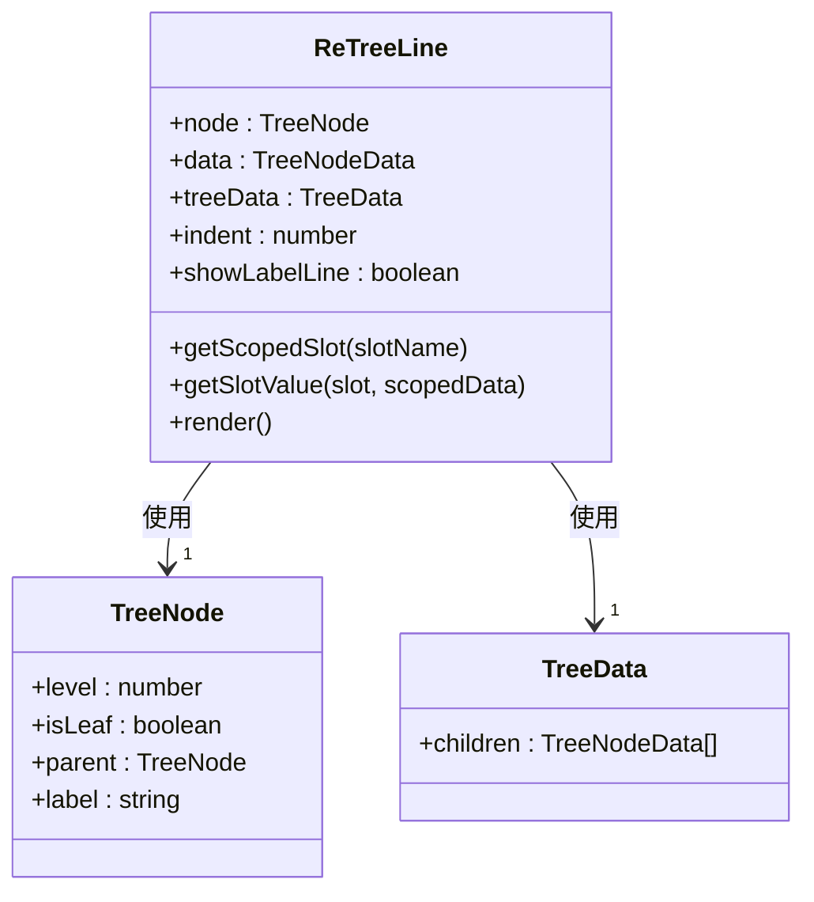

# 展示类组件

<cite>
**本文档中引用的文件**  
- [ReCountTo/src/normal/index.tsx](file://web/src/components/ReCountTo/src/normal/index.tsx)
- [ReCountTo/src/normal/props.ts](file://web/src/components/ReCountTo/src/normal/props.ts)
- [ReCountTo/src/rebound/index.tsx](file://web/src/components/ReCountTo/src/rebound/index.tsx)
- [ReCountTo/src/rebound/props.ts](file://web/src/components/ReCountTo/src/rebound/props.ts)
- [ReCountTo/README.md](file://web/src/components/ReCountTo/README.md)
- [ReQrcode/src/index.tsx](file://web/src/components/ReQrcode/src/index.tsx)
- [ReQrcode/src/index.scss](file://web/src/components/ReQrcode/src/index.scss)
- [ReSeamlessScroll/src/index.vue](file://web/src/components/ReSeamlessScroll/src/index.vue)
- [ReSeamlessScroll/src/utils.ts](file://web/src/components/ReSeamlessScroll/src/utils.ts)
- [ReText/src/index.vue](file://web/src/components/ReText/src/index.vue)
- [ReTreeLine/index.ts](file://web/src/components/ReTreeLine/index.ts)
- [ReTreeLine/index.scss](file://web/src/components/ReTreeLine/index.scss)
- [ReTypeit/src/index.tsx](file://web/src/components/ReTypeit/src/index.tsx)
</cite>

## 目录
1. [介绍](#介绍)
2. [核心组件](#核心组件)
3. [数字滚动（ReCountTo）](#数字滚动recountto)
4. [二维码生成（ReQrcode）](#二维码生成reqrcode)
5. [无缝滚动（ReSeamlessScroll）](#无缝滚动reseamlessscroll)
6. [文本渲染（ReText）](#文本渲染retext)
7. [树形线条（ReTreeLine）](#树形线条retreeline)
8. [打字机效果（ReTypeit）](#打字机效果retypeit)
9. [性能优化建议](#性能优化建议)
10. [常见问题与解决方案](#常见问题与解决方案)

## 介绍
本技术文档全面解析 `vue-pure-admin` 项目中用于信息可视化和动态展示的通用展示类组件。文档深入分析了数字滚动（ReCountTo）、二维码生成（ReQrcode）、无缝滚动（ReSeamlessScroll）、文本渲染（ReText）、树形线条（ReTreeLine）和打字机效果（ReTypeit）六个核心组件的技术实现、配置选项和使用方法。每个组件的动画机制、性能优化策略和响应式设计都得到了详细阐述，并提供了丰富的使用示例和集成方案，旨在为开发者提供一份详尽的开发指南。

## 核心组件
本文档涵盖的展示类组件均位于 `web/src/components` 目录下，是 `vue-pure-admin` 项目中实现动态视觉效果和信息展示的关键模块。这些组件遵循 Vue 3 的 Composition API 和 TypeScript 规范，具有良好的类型支持和可维护性。它们通过封装复杂的动画逻辑和交互行为，为上层应用提供了简洁易用的接口，极大地提升了开发效率和用户体验。

**Section sources**
- [ReCountTo/README.md](file://web/src/components/ReCountTo/README.md)

## 数字滚动（ReCountTo）
`ReCountTo` 组件提供两种风格的数字动画效果：普通滚动和回弹式滚动。它通过精确的动画控制，将一个数字从起始值平滑地过渡到目标值，常用于数据大屏、统计面板等需要突出显示数值变化的场景。

### 普通数字滚动
普通滚动模式通过 `requestAnimationFrame` 实现高性能的逐帧动画。组件根据设定的持续时间（`duration`）和起止值（`startVal`, `endVal`），在每一帧计算当前应显示的数值，并通过内置的缓动函数（`easingFn`）实现非线性的、更自然的动画效果。

```mermaid
flowchart TD
A[组件挂载] --> B{autoplay为true?}
B --> |是| C[调用start方法]
B --> |否| D[等待手动触发]
C --> E[初始化动画状态]
E --> F[requestAnimationFrame(count)]
F --> G[计算当前帧数值]
G --> H[格式化并显示]
H --> I{动画是否结束?}
I --> |否| F
I --> |是| J[触发callback事件]
```

**Diagram sources**
- [ReCountTo/src/normal/index.tsx](file://web/src/components/ReCountTo/src/normal/index.tsx)

**Section sources**
- [ReCountTo/src/normal/index.tsx](file://web/src/components/ReCountTo/src/normal/index.tsx)
- [ReCountTo/src/normal/props.ts](file://web/src/components/ReCountTo/src/normal/props.ts)

### 回弹式数字滚动
回弹式滚动采用 CSS3 动画实现，通过创建一个包含 0-9 数字的列表，并利用 `transform: translateY` 来切换显示的数字，从而模拟出数字快速滚动并最终“回弹”到目标值的视觉效果。此模式在 Safari 浏览器上进行了特殊兼容处理。

**Section sources**
- [ReCountTo/src/rebound/index.tsx](file://web/src/components/ReCountTo/src/rebound/index.tsx)
- [ReCountTo/src/rebound/props.ts](file://web/src/components/ReCountTo/src/rebound/props.ts)

## 二维码生成（ReQrcode）
`ReQrcode` 组件基于 `qrcode` 库，能够将任意文本内容生成为二维码图像。它支持 `canvas` 和 `img` 两种渲染模式，并提供了丰富的自定义选项，如尺寸、容错率、Logo 嵌入等。

### 动画与性能机制
组件利用 `nextTick` 确保 DOM 元素已渲染完成，然后调用 `qrcode` 库的 `toCanvas` 或 `toDataURL` 方法生成二维码。对于需要嵌入 Logo 的情况，组件会先生成基础二维码，再通过 `CanvasRenderingContext2D` API 将 Logo 绘制到画布上，并支持圆角等高级样式。



**Diagram sources**
- [ReQrcode/src/index.tsx](file://web/src/components/ReQrcode/src/index.tsx)

**Section sources**
- [ReQrcode/src/index.tsx](file://web/src/components/ReQrcode/src/index.tsx)
- [ReQrcode/src/index.scss](file://web/src/components/ReQrcode/src/index.scss)

## 无缝滚动（ReSeamlessScroll）
`ReSeamlessScroll` 是一个功能强大的无缝滚动组件，支持上下左右四个方向的平滑滚动。它通过 `transform: translate` 属性结合 `requestAnimationFrame` 实现流畅的动画，并内置了鼠标悬停暂停、触摸滑动、手动控制开关等交互功能。

### 核心逻辑与优化
组件的核心是 `scrollMove` 函数，它通过递归调用 `requestAnimationFrame` 来持续更新元素的 `translate` 值。为了实现无缝效果，组件会复制一份原始内容并拼接在后面，当滚动到复制内容的起始位置时，立即将位置重置到原始内容的起始处，从而形成视觉上的无缝循环。



**Diagram sources**
- [ReSeamlessScroll/src/index.vue](file://web/src/components/ReSeamlessScroll/src/index.vue)

**Section sources**
- [ReSeamlessScroll/src/index.vue](file://web/src/components/ReSeamlessScroll/src/index.vue)
- [ReSeamlessScroll/src/utils.ts](file://web/src/components/ReSeamlessScroll/src/utils.ts)

## 文本渲染（ReText）
`ReText` 组件主要用于处理文本溢出，当文本内容超出容器宽度或指定行数时，自动显示省略号（...）。它还集成了 `vue-tippy` 库，在鼠标悬停时显示完整的文本内容作为提示。

### 实现原理
组件通过 `onMounted` 钩子获取 DOM 元素的引用，并使用 `scrollWidth` 与 `clientWidth`（单行）或 `scrollHeight` 与 `clientHeight`（多行）的比较来判断文本是否发生溢出。一旦检测到溢出，即激活 `tippy` 提示框。

**Section sources**
- [ReText/src/index.vue](file://web/src/components/ReText/src/index.vue)

## 树形线条（ReTreeLine）
`ReTreeLine` 组件为 `Element Plus` 的树形组件（Tree）提供自定义的连接线样式。它通过分析节点的层级结构和父子关系，动态生成垂直和水平的连接线，以清晰地展示树形数据的层级。

### 技术细节
组件在 `render` 函数中遍历当前节点到根节点的路径，构建一个 `lastnodeArr` 数组，用于记录每一层的节点是否是其父节点的最后一个子节点。根据这个数组，组件决定是否绘制垂直连接线以及其样式（实线或透明）。



**Diagram sources**
- [ReTreeLine/index.ts](file://web/src/components/ReTreeLine/index.ts)

**Section sources**
- [ReTreeLine/index.ts](file://web/src/components/ReTreeLine/index.ts)
- [ReTreeLine/index.scss](file://web/src/components/ReTreeLine/index.scss)

## 打字机效果（ReTypeit）
`ReTypeit` 组件封装了 `TypeIt` 库，实现了经典的打字机动画效果。它可以逐字、逐句地显示文本内容，并支持光标闪烁、删除、延迟等多种高级动画。

### 集成与使用
组件在 `onMounted` 生命周期中实例化 `TypeIt` 对象，并传入用户定义的 `options`。它要求模板中必须存在一个 `class` 为 `type-it` 的元素作为动画的宿主。组件通过 `expose` 暴露了 `typeIt` 实例，允许父组件进行更精细的控制。

**Section sources**
- [ReTypeit/src/index.tsx](file://web/src/components/ReTypeit/src/index.tsx)

## 性能优化建议
1. **合理使用 `autoplay`**：对于 `ReCountTo` 和 `ReSeamlessScroll` 等持续动画组件，若非必要，应将 `autoplay` 设置为 `false`，并在需要时手动触发，以减少不必要的性能开销。
2. **避免过度嵌套**：在 `ReSeamlessScroll` 中，尽量减少滚动内容的 DOM 层级和复杂度，以保证滚动的流畅性。
3. **控制 `ReQrcode` 的生成频率**：频繁生成二维码会消耗大量计算资源，应确保 `text` 属性的变更不会过于频繁。
4. **按需引入**：仅在需要时才引入和使用这些展示类组件，避免在项目中引入不必要的依赖和代码。

## 常见问题与解决方案
- **问题**：`ReTypeit` 组件不显示任何内容。
  - **解决方案**：请确保在插槽中提供一个 `class="type-it"` 的元素，这是 `TypeIt` 库工作的必要条件。
- **问题**：`ReSeamlessScroll` 在移动端无法滑动。
  - **解决方案**：检查 `classOption` 中的 `openTouch` 是否设置为 `true`。
- **问题**：`ReQrcode` 生成的二维码无法显示 Logo。
  - **解决方案**：确保 Logo 图片的 URL 是可访问的，并且没有跨域限制。如果使用 `canvas` 模式，图片必须支持 CORS。
- **问题**：`ReTreeLine` 在 `el-tree-v2` (虚拟树) 中报错。
  - **解决方案**：必须为 `ReTreeLine` 组件提供 `treeData` 属性，因为虚拟树的节点没有 `parent` 引用。