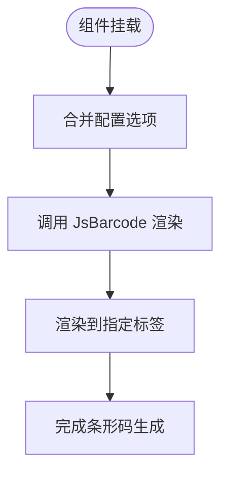

# 表单类组件

<cite>
**本文档中引用的文件**  
- [ReSelector](file://web/src/components/ReSelector/src/index.tsx)
- [ReSegmented](file://web/src/components/ReSegmented/src/index.tsx)
- [ReAuth](file://web/src/components/ReAuth/src/auth.tsx)
- [ReImageVerify](file://web/src/components/ReImageVerify/src/index.vue)
- [ReBarcode](file://web/src/components/ReBarcode/src/index.vue)
- [type.ts](file://web/src/components/ReSegmented/src/type.ts)
- [hooks.ts](file://web/src/components/ReImageVerify/src/hooks.ts)
- [ReSelector/index.ts](file://web/src/components/ReSelector/index.ts)
- [ReSegmented/index.ts](file://web/src/components/ReSegmented/index.ts)
- [ReImageVerify/index.ts](file://web/src/components/ReImageVerify/index.ts)
- [ReBarcode/index.ts](file://web/src/components/ReBarcode/index.ts)
</cite>

## 目录
1. [介绍](#介绍)
2. [核心组件](#核心组件)
3. [选择器组件（ReSelector）](#选择器组件reselector)
4. [分段控件组件（ReSegmented）](#分段控件组件resegmented)
5. [认证组件（ReAuth）](#认证组件reauth)
6. [图像验证码组件（ReImageVerify）](#图像验证码组件reimageverify)
7. [条形码组件（ReBarcode）](#条形码组件rebarcode)
8. [表单集成与验证](#表单集成与验证)
9. [可访问性与用户体验](#可访问性与用户体验)
10. [最佳实践指南](#最佳实践指南)

## 介绍
本文档详细介绍了 `vue-pure-admin-all` 项目中用于数据输入和验证的通用表单类组件。重点涵盖选择器（ReSelector）、分段控件（ReSegmented）、认证组件（ReAuth）、图像验证码（ReImageVerify）和条形码输入（ReBarcode）的实现机制。文档将深入分析每个组件的属性配置、事件回调、插槽使用和表单集成方式，并提供实际代码示例展示在不同场景下的应用模式。

**Section sources**
- [ReSelector](file://web/src/components/ReSelector/src/index.tsx)
- [ReSegmented](file://web/src/components/ReSegmented/src/index.tsx)
- [ReAuth](file://web/src/components/ReAuth/src/auth.tsx)
- [ReImageVerify](file://web/src/components/ReImageVerify/src/index.vue)
- [ReBarcode](file://web/src/components/ReBarcode/src/index.vue)

## 核心组件
本文档涵盖的表单类组件均位于 `web/src/components` 目录下，采用 Vue 3 的 Composition API 和 JSX/TSX 语法实现。这些组件通过 `withInstall` 函数进行封装，支持按需引入和全局注册。组件设计遵循单一职责原则，具有良好的可复用性和可维护性。

**Section sources**
- [ReSelector/index.ts](file://web/src/components/ReSelector/index.ts)
- [ReSegmented/index.ts](file://web/src/components/ReSegmented/index.ts)
- [ReImageVerify/index.ts](file://web/src/components/ReImageVerify/index.ts)
- [ReBarcode/index.ts](file://web/src/components/ReBarcode/index.ts)

## 选择器组件（ReSelector）
ReSelector 是一个用于范围选择的交互式组件，允许用户通过鼠标操作选择一个数值范围。组件通过表格结构呈现可选项，并支持鼠标悬停、点击和范围选择等交互行为。

### Props 配置
- `HsKey`: 唯一标识符，用于区分同一页面中的多个实例
- `disabled`: 是否禁用组件
- `value`: 当前值
- `max`: 可选项数组
- `echo`: 回显数据的索引数组，长度必须为 2

### 事件回调
- `selectedVal`: 当用户完成选择时触发，返回包含左右边界值和完整选择列表的对象

### 实现机制
组件通过维护 `selectedList` 和 `overList` 两个数组来跟踪用户的选择状态。利用 CSS 类名（如 `hs-on`、`hs-off`、`hs-range`）实现视觉反馈，并通过 `addClass` 和 `removeClass` 工具函数动态更新 DOM 元素的样式。

**Diagram sources**
- [ReSelector](file://web/src/components/ReSelector/src/index.tsx)

**Section sources**
- [ReSelector](file://web/src/components/ReSelector/src/index.tsx)

## 分段控件组件（ReSegmented）
ReSegmented 是一个分段选择控件，类似于单选按钮组，但具有更现代的视觉效果。它允许用户从一组互斥的选项中进行选择。

### Props 配置
- `options`: 选项数组，每个选项包含 label、value、icon 等属性
- `modelValue`: 当前选中的值或索引
- `block`: 是否将宽度调整为父元素宽度
- `size`: 控件尺寸（small/default/large）
- `disabled`: 是否全局禁用
- `resize`: 是否在容器大小变化时自适应

### 事件回调
- `change`: 当选择发生变化时触发
- `update:modelValue`: 用于 v-model 绑定的更新事件

### 插槽使用
组件通过 `slots.default` 支持内容分发，允许在选项中嵌入自定义内容，包括图标和文本标签。

### 实现机制
组件使用 `useResizeObserver` 监听容器大小变化，确保在 `block` 或 `resize` 模式下能够正确调整尺寸。通过 `translateX` 和 `width` CSS 变换来实现选中状态的平滑过渡动画。

**Diagram sources**
- [ReSegmented](file://web/src/components/ReSegmented/src/index.tsx)
- [type.ts](file://web/src/components/ReSegmented/src/type.ts)

**Section sources**
- [ReSegmented](file://web/src/components/ReSegmented/src/index.tsx)
- [type.ts](file://web/src/components/ReSegmented/src/type.ts)

## 认证组件（ReAuth）
ReAuth 是一个基于权限的条件渲染组件，用于控制特定内容的可见性。

### Props 配置
- `value`: 权限标识符或权限数组

### 实现机制
组件通过 `hasAuth` 工具函数检查当前用户是否具有指定权限。如果具有权限，则渲染默认插槽内容；否则不渲染任何内容。组件使用 `Fragment` 作为根节点，避免引入额外的 DOM 元素。

**Diagram sources**
- [ReAuth](file://web/src/components/ReAuth/src/auth.tsx)

**Section sources**
- [ReAuth](file://web/src/components/ReAuth/src/auth.tsx)

## 图像验证码组件（ReImageVerify）
ReImageVerify 是一个图形验证码组件，用于防止自动化攻击。

### Props 配置
- `code`: 验证码值（支持 v-model 绑定）

### 事件回调
- `update:code`: 当验证码值发生变化时触发

### 实现机制
组件使用 `useImageVerify` 自定义 Hook 管理验证码的生成和绘制逻辑。通过 Canvas API 绘制包含随机字符、干扰线和噪点的验证码图像。点击验证码图像会重新生成新的验证码。

**Diagram sources**
- [ReImageVerify](file://web/src/components/ReImageVerify/src/index.vue)
- [hooks.ts](file://web/src/components/ReImageVerify/src/hooks.ts)

**Section sources**
- [ReImageVerify](file://web/src/components/ReImageVerify/src/index.vue)
- [hooks.ts](file://web/src/components/ReImageVerify/src/hooks.ts)

## 条形码组件（ReBarcode）
ReBarcode 是一个条形码生成组件，基于 JsBarcode 库实现。

### Props 配置
- `tag`: 渲染标签（canvas/svg）
- `text`: 条形码文本内容
- `options`: JsBarcode 配置选项
- `type`: 条形码类型（CODE128 等）

### 实现机制
组件在 `onMounted` 生命周期钩子中调用 JsBarcode 库，将指定文本渲染为条形码。支持通过 `component` 动态标签实现 canvas 或 svg 渲染。

**Diagram sources**
- [ReBarcode](file://web/src/components/ReBarcode/src/index.vue)

**Section sources**
- [ReBarcode](file://web/src/components/ReBarcode/src/index.vue)

## 表单集成与验证
这些组件可以与 Element Plus 的表单验证系统无缝集成。通过 v-model 绑定和自定义验证规则，可以实现复杂的表单验证逻辑。

### 与 Element Plus 表单集成

**Diagram sources**
- [ReSelector](file://web/src/components/ReSelector/src/index.tsx)
- [ReSegmented](file://web/src/components/ReSegmented/src/index.tsx)

**Section sources**
- [ReSelector](file://web/src/components/ReSelector/src/index.tsx)
- [ReSegmented](file://web/src/components/ReSegmented/src/index.tsx)

## 可访问性与用户体验
所有组件都考虑了可访问性设计，包括适当的 ARIA 属性、键盘导航支持和视觉反馈。错误状态通过禁用状态和视觉样式进行处理，确保用户能够清晰地理解组件状态。

### 错误状态处理
- 禁用状态通过 `disabled` prop 控制
- 验证错误通过外部表单系统处理
- 视觉反馈通过 CSS 类名和内联样式实现

**Section sources**
- [ReSelector](file://web/src/components/ReSelector/src/index.tsx)
- [ReSegmented](file://web/src/components/ReSegmented/src/index.tsx)

## 最佳实践指南
1. **性能优化**：对于大量选项的 ReSelector，考虑虚拟滚动或分页
2. **可访问性**：确保所有交互元素都支持键盘操作
3. **响应式设计**：使用 `resize` 属性确保组件在不同屏幕尺寸下正常显示
4. **安全性**：在生产环境中定期更新验证码算法
5. **可维护性**：遵循组件的 props 约束，避免直接操作 DOM

**Section sources**
- [ReSelector](file://web/src/components/ReSelector/src/index.tsx)
- [ReSegmented](file://web/src/components/ReSegmented/src/index.tsx)
- [ReImageVerify](file://web/src/components/ReImageVerify/src/index.vue)
- [ReBarcode](file://web/src/components/ReBarcode/src/index.vue)