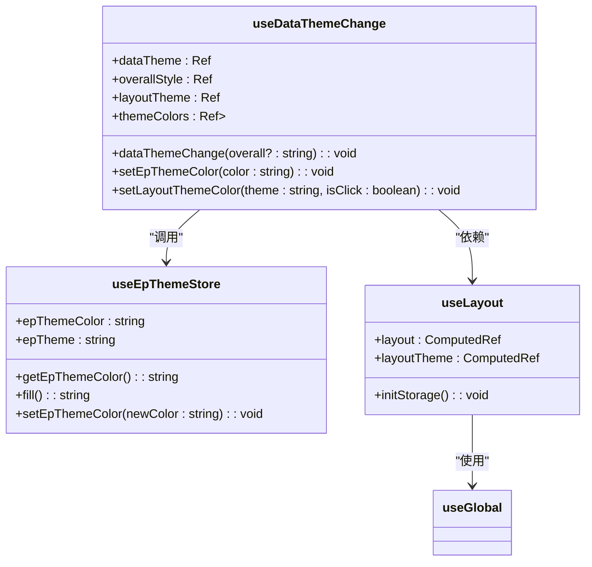
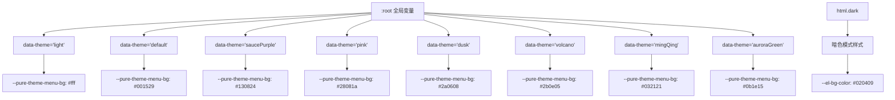
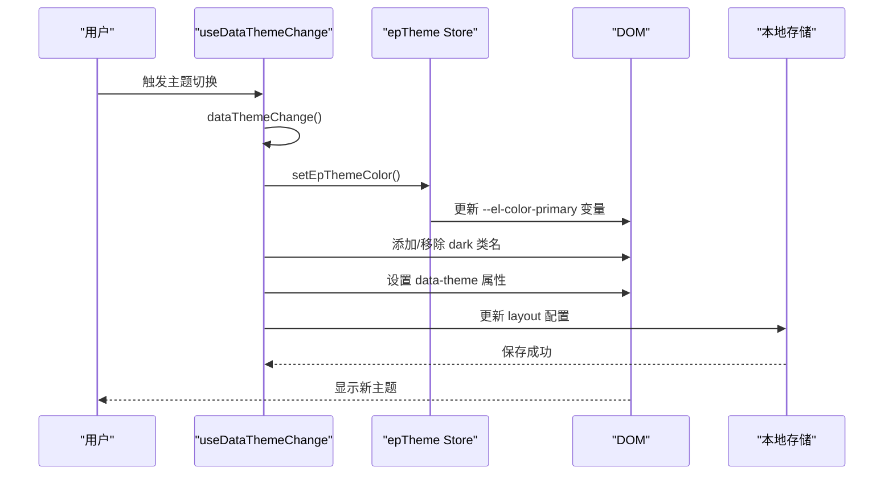
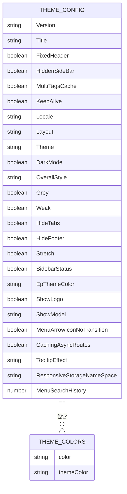
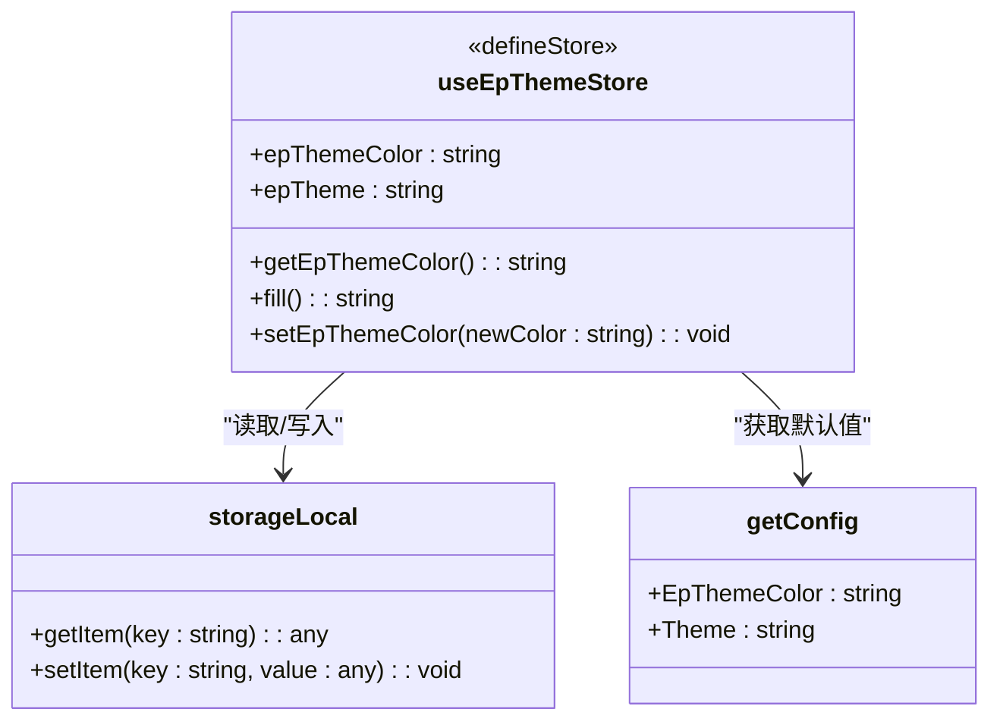

<cite>
**本文档中引用的文件**   
- [epTheme.ts](file://web/src/store/modules/epTheme.ts)
- [useDataThemeChange.ts](file://web/src/layout/hooks/useDataThemeChange.ts)
- [useLayout.ts](file://web/src/layout/hooks/useLayout.ts)
- [theme.scss](file://web/src/style/theme.scss)
- [dark.scss](file://web/src/style/dark.scss)
- [index.scss](file://web/src/style/index.scss)
- [platform-config.json](file://web/public/platform-config.json)
</cite>

## 目录
1. [主题系统](#主题系统)
2. [核心组件](#核心组件)
3. [主题状态管理](#主题状态管理)
4. [CSS变量与样式应用](#css变量与样式应用)
5. [样式切换机制](#样式切换机制)
6. [主题颜色配置](#主题颜色配置)
7. [自定义主题可能性](#自定义主题可能性)
8. [epTheme Store模块](#eptheme-store模块)
9. [SCSS文件组织与作用](#scss文件组织与作用)
10. [开发者主题定制指南](#开发者主题定制指南)

## 主题系统

本项目实现了一套完整的主题系统，支持明暗模式切换、多种主题颜色配置和整体风格定制。系统通过`epTheme` Store模块管理主题状态，利用CSS变量实现样式动态应用，并通过SCSS文件组织主题样式。主题配置信息存储在本地，支持持久化和初始化设置。

**Section sources**
- [epTheme.ts](file://web/src/store/modules/epTheme.ts)
- [useDataThemeChange.ts](file://web/src/layout/hooks/useDataThemeChange.ts)
- [useLayout.ts](file://web/src/layout/hooks/useLayout.ts)

## 核心组件

主题系统的核心由多个组件协同工作：`epTheme` Store模块负责状态管理，`useDataThemeChange` Hook处理主题切换逻辑，`useLayout` Hook提供布局配置，以及位于`style`目录下的SCSS样式文件。这些组件共同实现了主题的动态切换和持久化存储。

**Section sources**
- [epTheme.ts](file://web/src/store/modules/epTheme.ts)
- [useDataThemeChange.ts](file://web/src/layout/hooks/useDataThemeChange.ts)
- [useLayout.ts](file://web/src/layout/hooks/useLayout.ts)

## 主题状态管理

主题状态通过Pinia Store进行管理，主要状态包括`epThemeColor`（主题颜色）和`epTheme`（主题模式）。状态初始化时会从本地存储中读取配置，如果不存在则使用默认值。主题状态的变更会同步更新到本地存储，确保页面刷新后仍能保持用户选择的主题。



**Diagram sources**
- [epTheme.ts](file://web/src/store/modules/epTheme.ts)
- [useDataThemeChange.ts](file://web/src/layout/hooks/useDataThemeChange.ts)
- [useLayout.ts](file://web/src/layout/hooks/useLayout.ts)

**Section sources**
- [epTheme.ts](file://web/src/store/modules/epTheme.ts#L15-L25)
- [useDataThemeChange.ts](file://web/src/layout/hooks/useDataThemeChange.ts#L12-L137)
- [useLayout.ts](file://web/src/layout/hooks/useLayout.ts#L6-L63)

## CSS变量与样式应用

项目采用CSS自定义属性（CSS变量）实现主题样式的动态应用。在`style/index.scss`中定义了全局CSS变量，通过`:root`选择器设置默认值。不同主题模式通过`data-theme`属性区分，每个主题对应一组CSS变量值。暗色模式通过`dark`类名激活，使用Sass的`color.adjust`等函数进行颜色计算。



**Diagram sources**
- [index.scss](file://web/src/style/index.scss#L20-L38)
- [theme.scss](file://web/src/style/theme.scss#L2-L95)
- [dark.scss](file://web/src/style/dark.scss#L1-L278)

**Section sources**
- [index.scss](file://web/src/style/index.scss#L20-L38)
- [theme.scss](file://web/src/style/theme.scss#L2-L95)
- [dark.scss](file://web/src/style/dark.scss#L1-L278)

## 样式切换机制

主题切换机制通过JavaScript动态修改DOM元素的属性和类名来实现。`useDataThemeChange` Hook中的`dataThemeChange`函数负责处理整体风格切换，根据当前状态添加或移除`dark`类名，并更新`data-theme`属性。`setLayoutThemeColor`函数负责设置具体的主题颜色，同时更新本地存储中的配置。



**Diagram sources**
- [useDataThemeChange.ts](file://web/src/layout/hooks/useDataThemeChange.ts#L12-L137)
- [epTheme.ts](file://web/src/store/modules/epTheme.ts#L15-L50)

**Section sources**
- [useDataThemeChange.ts](file://web/src/layout/hooks/useDataThemeChange.ts#L12-L137)

## 主题颜色配置

主题颜色配置通过`themeColors`数组定义，包含八种预设主题：亮白色、道奇蓝、深紫罗兰色、深粉色、猩红色、橙红色、绿宝石和酸橙绿。每种主题都有对应的颜色值和主题标识。配置信息来源于`platform-config.json`文件，其中`EpThemeColor`字段定义了默认主题颜色，`Theme`字段定义了默认主题模式。



**Diagram sources**
- [platform-config.json](file://web/public/platform-config.json#L1-L36)
- [useDataThemeChange.ts](file://web/src/layout/hooks/useDataThemeChange.ts#L14-L28)

**Section sources**
- [platform-config.json](file://web/public/platform-config.json#L1-L36)
- [useDataThemeChange.ts](file://web/src/layout/hooks/useDataThemeChange.ts#L14-L28)

## 自定义主题可能性

系统支持一定程度的自定义主题。开发者可以通过修改`theme.scss`文件中的CSS变量来调整现有主题的样式，或添加新的主题变体。通过扩展`themeColors`数组可以增加新的预设主题。此外，还可以通过修改`platform-config.json`中的默认配置来改变应用的初始主题状态。对于更复杂的自定义需求，可以扩展`useDataThemeChange` Hook的功能。

**Section sources**
- [theme.scss](file://web/src/style/theme.scss#L2-L95)
- [useDataThemeChange.ts](file://web/src/layout/hooks/useDataThemeChange.ts#L14-L28)
- [platform-config.json](file://web/public/platform-config.json#L1-L36)

## epTheme Store模块

`epTheme` Store模块是主题系统的核心状态管理器，使用Pinia实现。模块定义了`epThemeColor`和`epTheme`两个状态，分别存储主题颜色和主题模式。通过`setEpThemeColor`动作方法更新主题颜色，该方法会同时更新Store状态和本地存储。模块还提供了`getEpThemeColor` getter和`fill` getter，后者用于特定组件的样式需求。



**Diagram sources**
- [epTheme.ts](file://web/src/store/modules/epTheme.ts#L1-L50)

**Section sources**
- [epTheme.ts](file://web/src/store/modules/epTheme.ts#L1-L50)

## SCSS文件组织与作用

`style`目录下的SCSS文件采用模块化组织方式。`index.scss`作为入口文件，导入所有样式模块。`theme.scss`定义了不同主题模式下的CSS变量。`dark.scss`专门处理暗色模式的样式适配。`element-plus.scss`负责Element Plus组件库的样式覆盖。`transition.scss`定义了过渡动画。这种组织方式实现了样式的解耦和可维护性。

```mermaid
graph TD
    A["index.scss"] --> B["theme.scss"]
    A --> C["transition.scss"]
    A --> D["element-plus.scss"]
    A --> E["sidebar.scss"]
    A --> F["dark.scss"]
    
    B --> G["data-theme='light'"]
    B --> H["data-theme='default'"]
    B --> I["data-theme='saucePurple'"]
    B --> J["data-theme='pink'"]
    B --> K["data-theme='dusk'"]
    B --> L["data-theme='vol