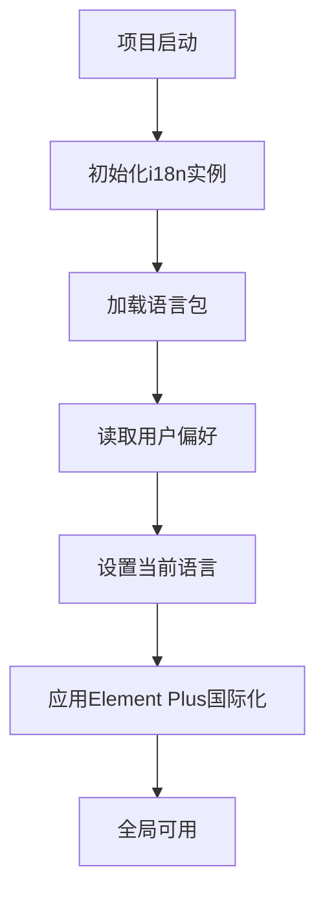
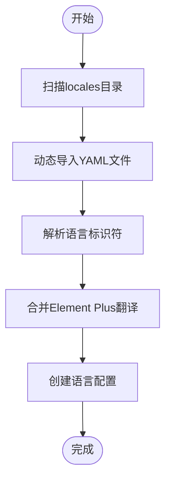
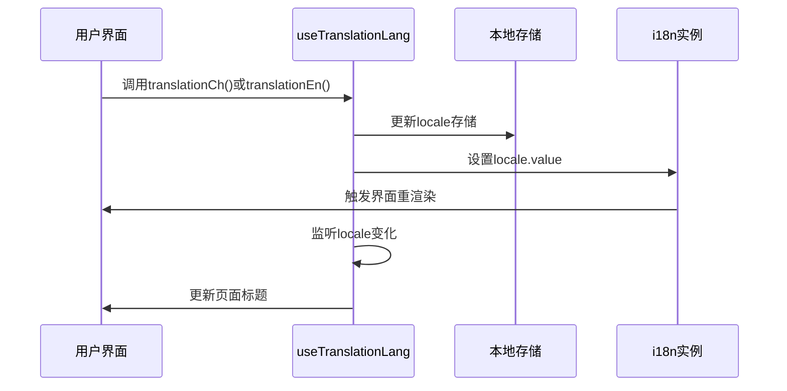
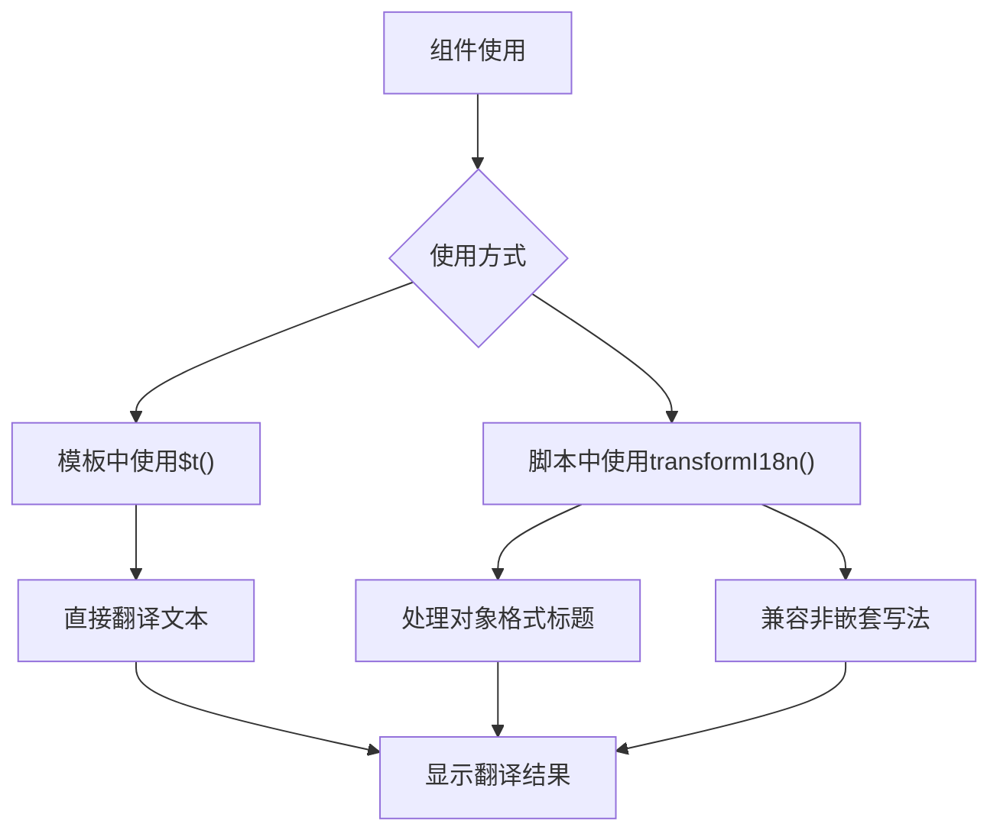

# 国际化

<cite>
**Referenced Files in This Document**   
- [i18n.ts](file://web/src/plugins/i18n.ts)
- [useTranslationLang.ts](file://web/src/layout/hooks/useTranslationLang.ts)
- [en.yaml](file://web/locales/en.yaml)
- [zh-CN.yaml](file://web/locales/zh-CN.yaml)
</cite>

## 目录
1. [项目国际化架构](#项目国际化架构)
2. [语言包组织与加载机制](#语言包组织与加载机制)
3. [语言切换功能实现](#语言切换功能实现)
4. [组件与模板中的国际化使用](#组件与模板中的国际化使用)
5. [语言资源文件结构](#语言资源文件结构)
6. [开发者最佳实践](#开发者最佳实践)

## 项目国际化架构

该项目通过 `vue-i18n` 插件实现了完整的多语言支持系统，结合 Element Plus 组件库的国际化能力，构建了一个可扩展的国际化架构。系统在启动时初始化 i18n 实例，加载本地语言包，并与用户偏好设置集成。



**Diagram sources**
- [i18n.ts](file://web/src/plugins/i18n.ts#L103-L111)

**Section sources**
- [i18n.ts](file://web/src/plugins/i18n.ts#L1-L116)

## 语言包组织与加载机制

项目采用 YAML 格式存储语言资源，将不同语言的翻译内容分别存放在 `locales` 目录下的独立文件中。系统通过动态导入机制自动加载这些语言包，并与 Element Plus 的国际化资源合并。

语言包加载流程如下：
1. 使用 `import.meta.glob` 动态导入 `locales` 目录下的所有 YAML 文件
2. 解析文件名获取语言标识符（如 `zh-CN`、`en`）
3. 将本地翻译与 Element Plus 组件库的翻译合并
4. 创建语言配置对象供 i18n 实例使用



**Diagram sources**
- [i18n.ts](file://web/src/plugins/i18n.ts#L10-L35)

**Section sources**
- [i18n.ts](file://web/src/plugins/i18n.ts#L1-L116)

## 语言切换功能实现

语言切换功能通过 `useTranslationLang` 钩子函数实现，该函数封装了语言切换的完整逻辑，包括状态更新、本地存储和界面响应。



**Diagram sources**
- [useTranslationLang.ts](file://web/src/layout/hooks/useTranslationLang.ts#L5-L40)
- [i18n.ts](file://web/src/plugins/i18n.ts#L103-L111)

**Section sources**
- [useTranslationLang.ts](file://web/src/layout/hooks/useTranslationLang.ts#L5-L40)

## 组件与模板中的国际化使用

在组件和模板中使用国际化文本有两种主要方式：直接使用 `$t` 函数或通过 `transformI18n` 工具函数。

### 直接使用方式
在模板中可以直接使用 `$t` 函数进行文本翻译：
```vue
<template>
  <button>{{ $t('buttons.pureLogin') }}</button>
</template>
```

### 工具函数方式
对于复杂场景，可以使用 `transformI18n` 工具函数处理动态路由标题等特殊情况。



**Diagram sources**
- [i18n.ts](file://web/src/plugins/i18n.ts#L76-L98)
- [i18n.ts](file://web/src/plugins/i18n.ts#L113-L115)

**Section sources**
- [i18n.ts](file://web/src/plugins/i18n.ts#L76-L98)

## 语言资源文件结构

语言资源文件采用 YAML 格式，按照功能模块组织翻译键值对，确保结构清晰且易于维护。

### 文件结构示例
```yaml
buttons:
  pureLogin: Login
  pureConfirm: Confirm
menus:
  pureHome: Home
  pureUser: User Manage
login:
  pureUsername: Username
  purePassword: Password
```

### 模块化组织
语言资源按以下模块组织：
- `buttons`: 按钮文本
- `search`: 搜索相关文本
- `panel`: 面板配置文本
- `menus`: 菜单文本
- `status`: 状态提示文本
- `login`: 登录页面文本

这种模块化结构便于团队协作和维护，每个模块的翻译内容集中管理。

**Section sources**
- [en.yaml](file://web/locales/en.yaml#L1-L240)
- [zh-CN.yaml](file://web/locales/zh-CN.yaml#L1-L240)

## 开发者最佳实践

### 添加新语言支持
1. 在 `locales` 目录下创建新的 YAML 文件，如 `fr.yaml`
2. 复制现有语言文件结构，翻译所有键值
3. 在 `i18n.ts` 的 `localesConfigs` 中添加新语言配置
4. 如有必要，导入对应 Element Plus 语言包

### 扩展现有翻译
1. 确定新文本所属模块（如按钮、菜单等）
2. 在相应模块下添加新的键值对
3. 使用一致的命名规范：`模块名+描述性名称`
4. 确保所有语言文件都包含新键的翻译

### 命名规范
- 使用 `pure` 前缀避免命名冲突
- 采用小写字母和连字符分隔单词
- 模块名简短明确（如 `buttons`、`menus`）
- 描述性名称清晰表达文本用途

### 测试建议
1. 切换不同语言验证翻译完整性
2. 检查长文本在界面中的显示效果
3. 验证动态内容的翻译功能
4. 确保 Element Plus 组件的正确国际化

**Section sources**
- [i18n.ts](file://web/src/plugins/i18n.ts#L1-L116)
- [en.yaml](file://web/locales/en.yaml#L1-L240)
- [zh-CN.yaml](file://web/locales/zh-CN.yaml#L1-L240)