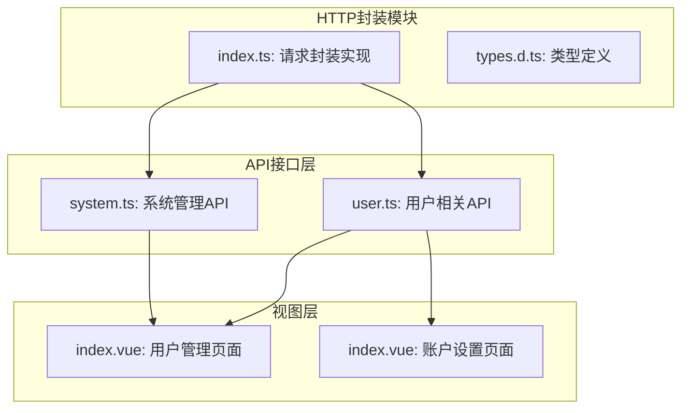
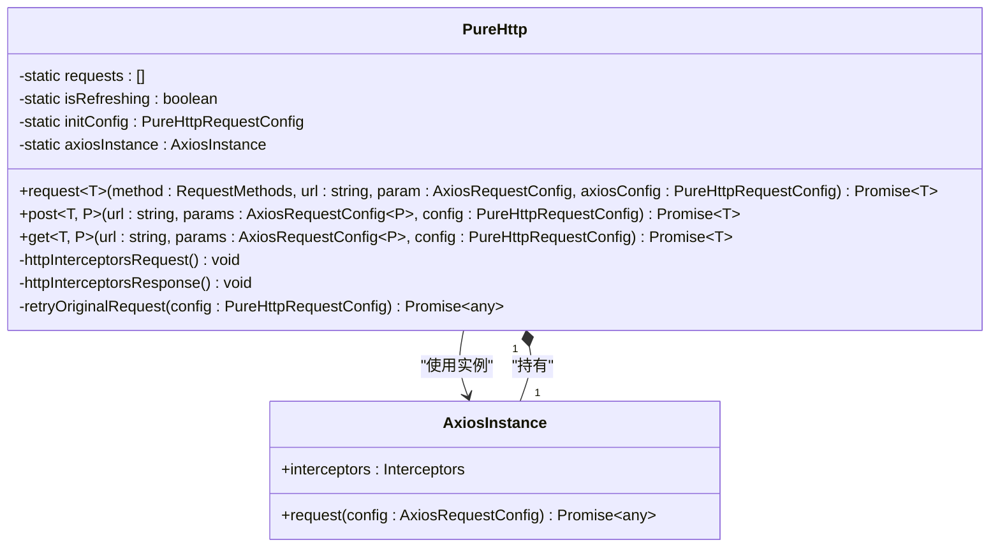
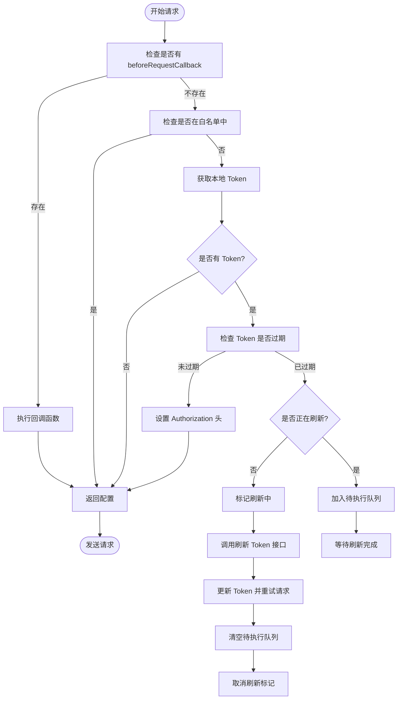
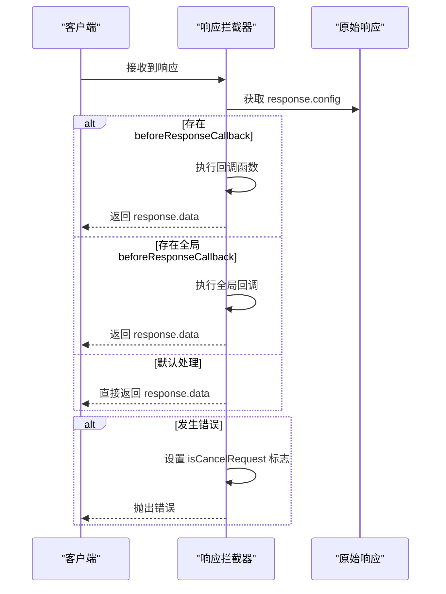
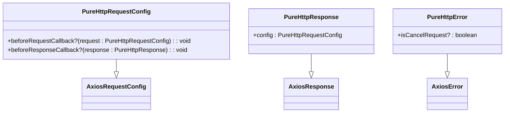
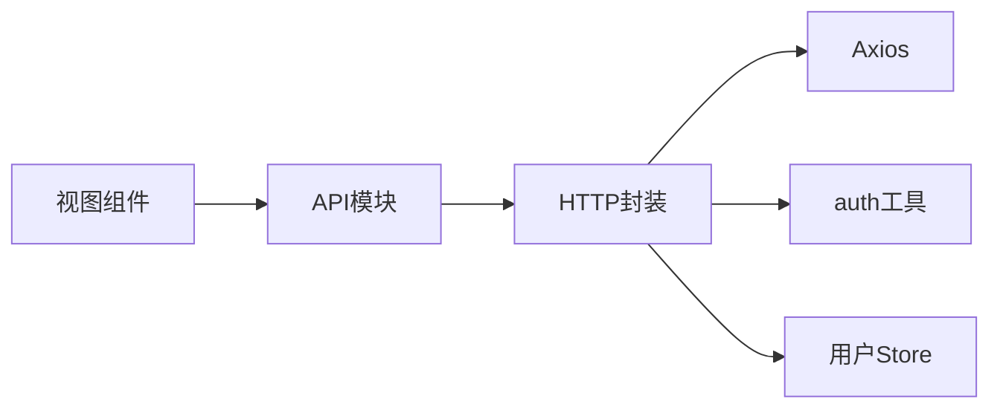

# HTTP请求封装

<cite>
**本文档中引用的文件**  
- [index.ts](file://src/utils/http/index.ts)
- [types.d.ts](file://src/utils/http/types.d.ts)
- [user.ts](file://src/api/user.ts)
- [system.ts](file://src/api/system.ts)
- [index.vue](file://src/views/system/user/index.vue)
- [index.vue](file://src/views/account-settings/index.vue)
</cite>

## 目录
1. [简介](#简介)
2. [项目结构](#项目结构)
3. [核心组件](#核心组件)
4. [架构概述](#架构概述)
5. [详细组件分析](#详细组件分析)
6. [依赖分析](#依赖分析)
7. [性能考虑](#性能考虑)
8. [故障排除指南](#故障排除指南)
9. [结论](#结论)

## 简介
本文档详细解析了基于 Axios 的 HTTP 请求封装实现，位于 `utils/http/index.ts`。该封装提供了统一的请求配置、拦截器机制、环境适配、超时控制和请求取消功能。文档涵盖如何发起 GET、POST 请求，处理文件上传下载，自定义请求头与响应类型，并结合实际调用示例说明其在项目中的使用方式。同时解释了 `types.d.ts` 中定义的请求响应类型结构及其泛型应用，提供常见问题解决方案及性能优化建议。

## 项目结构
HTTP 请求封装模块位于 `src/utils/http/` 目录下，包含两个核心文件：`index.ts` 实现请求逻辑，`types.d.ts` 定义类型接口。该工具被多个 API 模块（如 `api/user.ts`、`api/system.ts`）引用，并在视图组件（如用户管理、账户设置页面）中实际调用。

**Diagram sources**
- [index.ts](file://src/utils/http/index.ts)
- [types.d.ts](file://src/utils/http/types.d.ts)
- [user.ts](file://src/api/user.ts)
- [system.ts](file://src/api/system.ts)
- [index.vue](file://src/views/system/user/index.vue)
- [index.vue](file://src/views/account-settings/index.vue)

**Section sources**
- [index.ts](file://src/utils/http/index.ts)
- [types.d.ts](file://src/utils/http/types.d.ts)

## 核心组件
HTTP 请求封装的核心是 `PureHttp` 类，它通过 Axios 实例化并配置默认请求参数，实现了请求/响应拦截器、Token 自动注入、过期刷新机制、错误统一处理等功能。对外暴露 `http` 实例，提供 `request`、`get`、`post` 等方法供上层调用。

**Section sources**
- [index.ts](file://src/utils/http/index.ts#L30-L184)
- [types.d.ts](file://src/utils/http/types.d.ts#L29-L46)

## 架构概述
整个 HTTP 封装采用类封装模式，结合 Axios 拦截器机制实现请求流程的统一控制。初始化时设置默认配置（如超时时间、Content-Type），并通过构造函数注册请求和响应拦截器。请求拦截器负责 Token 注入与刷新，响应拦截器统一处理返回数据或错误信息。

**Diagram sources**
- [index.ts](file://src/utils/http/index.ts#L30-L184)

## 详细组件分析

### 请求拦截器分析
请求拦截器在发送请求前执行，主要职责包括：执行自定义回调函数、检查 Token 状态、自动注入 Authorization 头、处理 Token 过期刷新逻辑。

**Diagram sources**
- [index.ts](file://src/utils/http/index.ts#L59-L112)

**Section sources**
- [index.ts](file://src/utils/http/index.ts#L59-L112)

### 响应拦截器分析
响应拦截器负责处理服务器返回的数据或错误，提取响应数据体、执行自定义回调、标记取消请求状态，实现统一的数据格式输出和错误分类。

**Diagram sources**
- [index.ts](file://src/utils/http/index.ts#L115-L138)

**Section sources**
- [index.ts](file://src/utils/http/index.ts#L115-L138)

### 类型定义分析
`types.d.ts` 文件定义了封装所用的核心类型，包括请求方法枚举、扩展的错误与响应接口、以及支持前后置回调的请求配置。

**Diagram sources**
- [types.d.ts](file://src/utils/http/types.d.ts)

**Section sources**
- [types.d.ts](file://src/utils/http/types.d.ts)

## 依赖分析
HTTP 封装模块依赖于 Axios 库进行底层通信，同时依赖项目内的认证工具（`@/utils/auth`）获取 Token，以及用户状态管理（`@/store/modules/user`）来刷新 Token。上层 API 模块依赖此封装发起请求，视图组件通过 API 模块间接使用。

**Diagram sources**
- [index.ts](file://src/utils/http/index.ts)
- [user.ts](file://src/api/user.ts)
- [index.vue](file://src/views/system/user/index.vue)

**Section sources**
- [index.ts](file://src/utils/http/index.ts)
- [user.ts](file://src/api/user.ts)

## 性能考虑
- **请求合并与缓存**：对于频繁调用且数据变化不敏感的接口，建议在业务层实现缓存机制。
- **拦截器轻量化**：避免在拦截器中执行耗时操作，确保请求流程高效。
- **超时合理设置**：当前默认超时为 10 秒，可根据网络环境和接口特性动态调整。
- **并发控制**：利用 Axios 的 CancelToken 或 AbortController 避免重复请求，提升用户体验。

## 故障排除指南
- **Token 刷新死循环**：确保 `/login` 和 `/refresh-token` 接口在白名单中，防止因 Token 过期导致刷新接口自身也被拦截。
- **跨域问题**：后端需正确配置 CORS 头，前端可借助 Vite 代理解决开发环境跨域。
- **请求被取消**：检查是否误调用了取消令牌，或页面切换时未妥善处理异步请求。
- **泛型类型推导失败**：调用 `get`/`post` 方法时应显式指定返回类型，如 `http.get<UserResult>("/user")`。

**Section sources**
- [index.ts](file://src/utils/http/index.ts)
- [user.ts](file://src/api/user.ts)

## 结论
该 HTTP 请求封装设计合理，功能完整，具备良好的可维护性和扩展性。通过拦截器实现了认证自动化，通过泛型支持增强了类型安全性，通过模块化设计便于统一管理和升级。建议在实际项目中继续沿用此类封装模式，并根据具体需求进一步优化错误处理和日志记录能力。