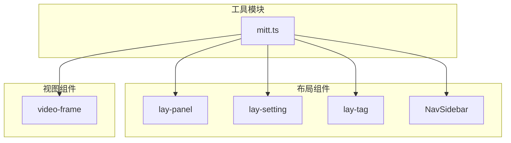
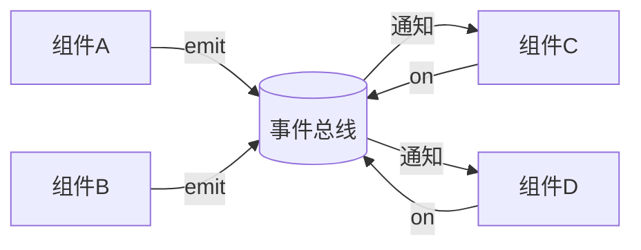
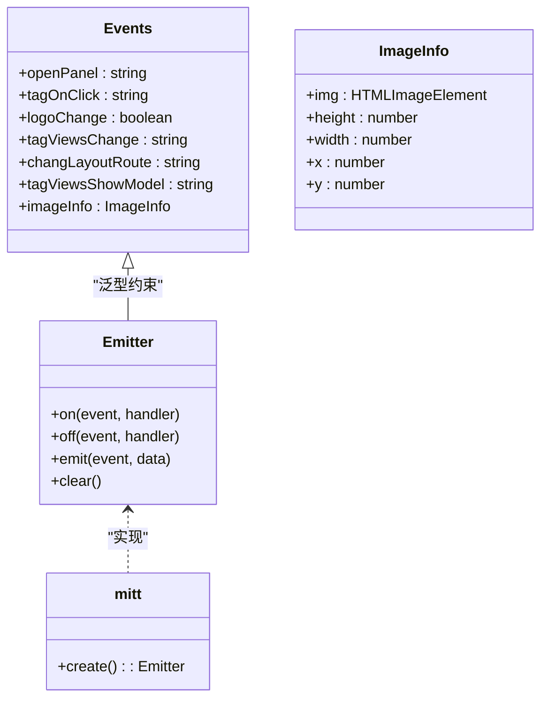
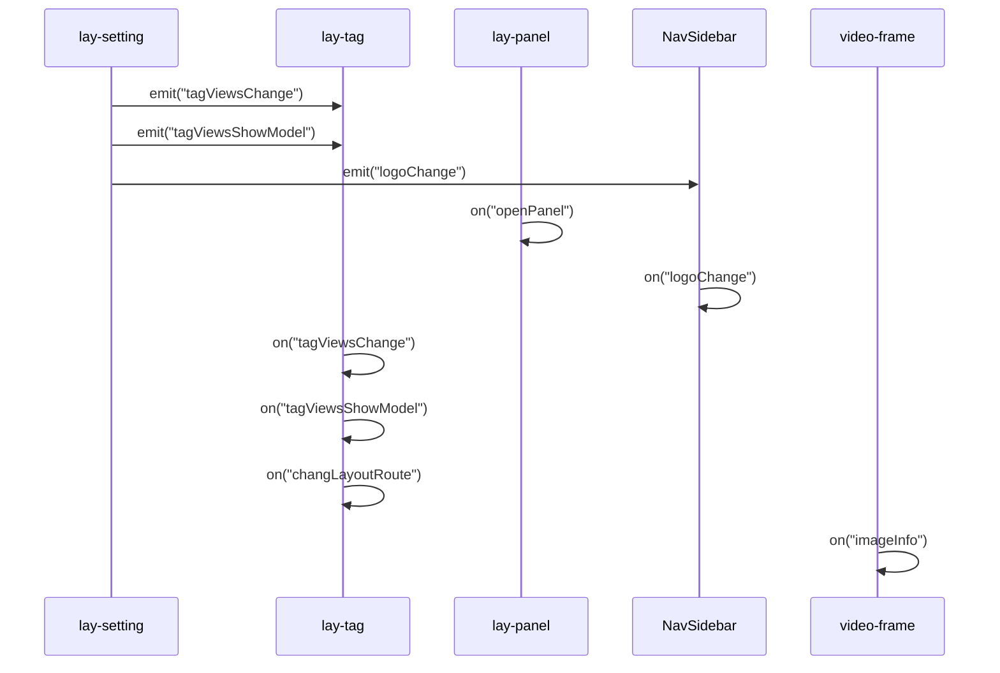
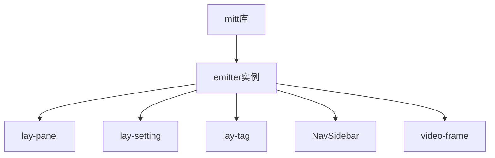

# 事件总线工具

<cite>
**Referenced Files in This Document**  
- [mitt.ts](file://src/utils/mitt.ts)
- [lay-panel/index.vue](file://src/layout/components/lay-panel/index.vue)
- [lay-setting/index.vue](file://src/layout/components/lay-setting/index.vue)
- [NavHorizontal.vue](file://src/layout/components/lay-sidebar/NavHorizontal.vue)
- [NavVertical.vue](file://src/layout/components/lay-sidebar/NavVertical.vue)
- [index.vue](file://src/layout/components/lay-tag/index.vue)
- [video-frame/index.vue](file://src/views/able/video-frame/index.vue)
</cite>

## 目录
1. [简介](#简介)
2. [项目结构](#项目结构)
3. [核心组件](#核心组件)
4. [架构概述](#架构概述)
5. [详细组件分析](#详细组件分析)
6. [依赖分析](#依赖分析)
7. [性能考虑](#性能考虑)
8. [故障排除指南](#故障排除指南)
9. [结论](#结论)

## 简介
本项目中的事件总线工具基于 `mitt` 库实现，为Vue应用提供了轻量级的全局事件通信机制。该工具通过创建全局事件发射器实例，实现了跨组件、跨层级的状态同步和通信功能，特别适用于微前端架构中的模块间交互场景。

## 项目结构
事件总线工具的核心实现位于 `src/utils` 目录下，作为工具模块被整个应用所依赖。该工具通过类型安全的方式定义了应用中所有可能的全局事件，确保了事件通信的可靠性和可维护性。

**Diagram sources**
- [mitt.ts](file://src/utils/mitt.ts)

**Section sources**
- [mitt.ts](file://src/utils/mitt.ts)

## 核心组件
事件总线的核心组件是 `emitter` 实例，它是一个类型化的 `mitt` 事件发射器，定义了应用中所有全局事件的类型签名。该实例被导出为模块的公共接口，供其他组件订阅和发布事件。

**Section sources**
- [mitt.ts](file://src/utils/mitt.ts)

## 架构概述
事件总线采用发布-订阅模式，通过中心化的事件管理器协调不同组件间的通信。这种架构避免了组件间的直接耦合，使得系统更加灵活和可扩展。

**Diagram sources**
- [mitt.ts](file://src/utils/mitt.ts)

## 详细组件分析

### 事件总线实现分析
事件总线的实现基于 `mitt` 库，通过 TypeScript 的类型系统为事件通信提供了完整的类型安全支持。

**Diagram sources**
- [mitt.ts](file://src/utils/mitt.ts)

**Section sources**
- [mitt.ts](file://src/utils/mitt.ts)

### 组件间通信场景分析
事件总线在多个组件间实现了高效的通信，包括面板控制、标签管理、布局切换等功能。

**Diagram sources**
- [lay-setting/index.vue](file://src/layout/components/lay-setting/index.vue)
- [lay-tag/index.vue](file://src/layout/components/lay-tag/index.vue)
- [lay-panel/index.vue](file://src/layout/components/lay-panel/index.vue)
- [NavHorizontal.vue](file://src/layout/components/lay-sidebar/NavHorizontal.vue)
- [NavVertical.vue](file://src/layout/components/lay-sidebar/NavVertical.vue)
- [video-frame/index.vue](file://src/views/able/video-frame/index.vue)

**Section sources**
- [lay-setting/index.vue](file://src/layout/components/lay-setting/index.vue)
- [lay-tag/index.vue](file://src/layout/components/lay-tag/index.vue)
- [lay-panel/index.vue](file://src/layout/components/lay-panel/index.vue)
- [NavHorizontal.vue](file://src/layout/components/lay-sidebar/NavHorizontal.vue)
- [NavVertical.vue](file://src/layout/components/lay-sidebar/NavVertical.vue)
- [video-frame/index.vue](file://src/views/able/video-frame/index.vue)

## 依赖分析
事件总线工具依赖于 `mitt` 库，并被多个布局和视图组件所依赖，形成了中心化的通信架构。

**Diagram sources**
- [package.json](file://package.json)
- [mitt.ts](file://src/utils/mitt.ts)

**Section sources**
- [package.json](file://package.json)
- [mitt.ts](file://src/utils/mitt.ts)

## 性能考虑
事件总线作为一种轻量级的通信机制，具有以下性能优势：
- 低内存占用：`mitt` 库体积小，运行时开销低
- 高效的事件分发：O(1) 时间复杂度的事件注册和触发
- 类型安全：编译时检查减少运行时错误
- 易于清理：提供 `off` 方法防止内存泄漏

## 故障排除指南
在使用事件总线时，需要注意以下常见问题：

**Section sources**
- [mitt.ts](file://src/utils/mitt.ts)
- [lay-panel/index.vue](file://src/layout/components/lay-panel/index.vue)
- [lay-tag/index.vue](file://src/layout/components/lay-tag/index.vue)

## 结论
该事件总线工具通过 `mitt` 库实现了高效、类型安全的全局事件通信机制。它在项目中被广泛应用于组件间通信、状态同步和UI更新等场景，为复杂应用的架构设计提供了灵活的解决方案。与Vue3 Composition API中的 `provide/inject` 相比，事件总线更适合跨层级、非父子关系的组件通信，尤其在微前端架构中展现了良好的适用性。