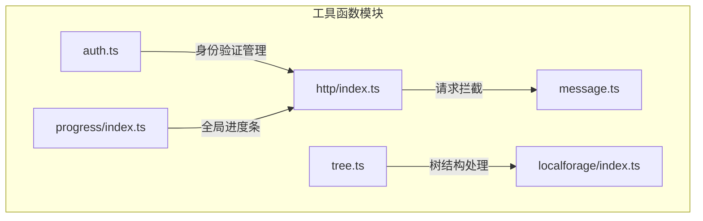
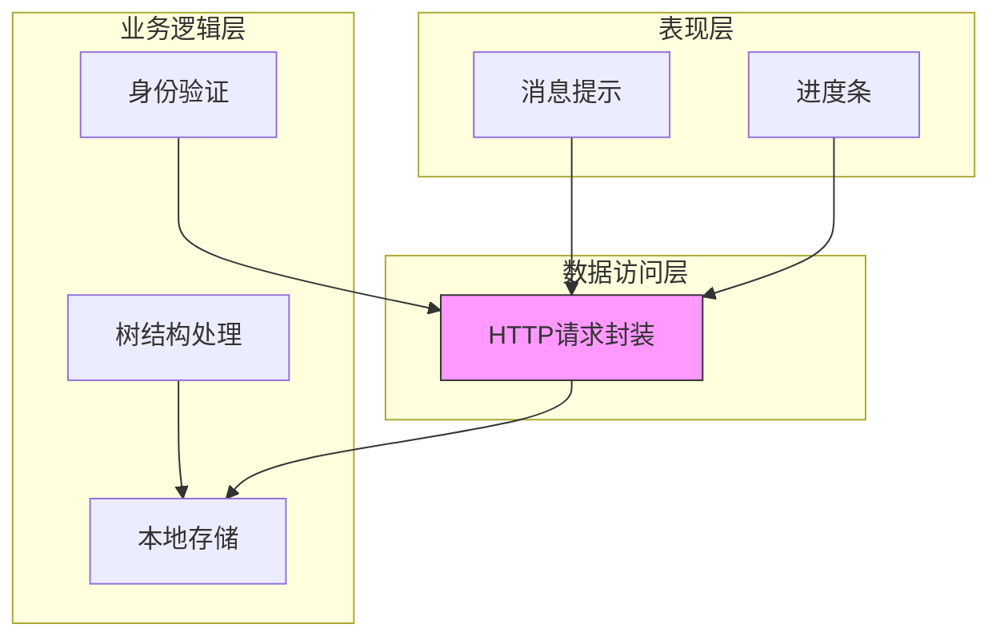
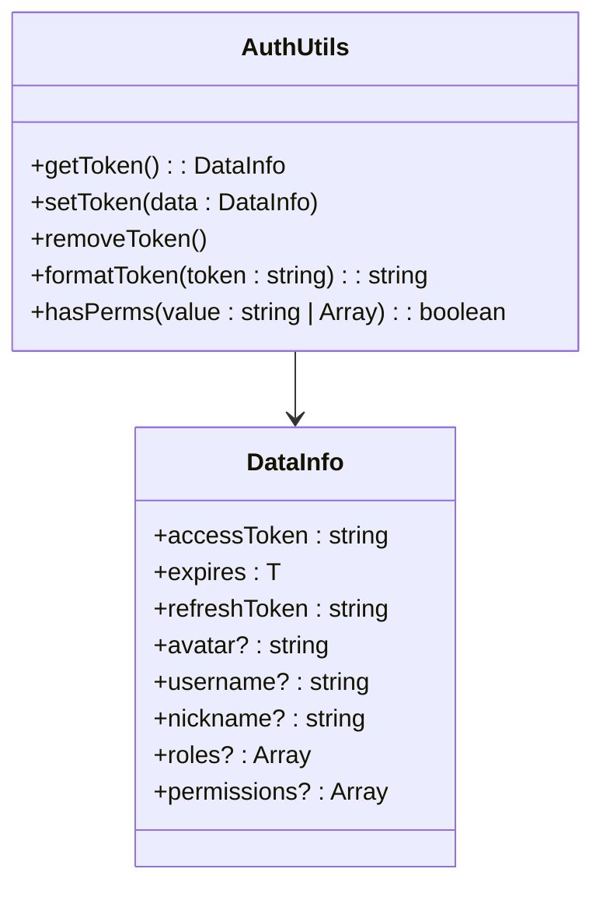
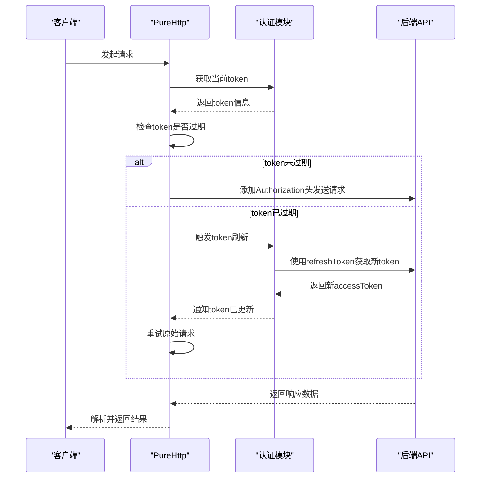
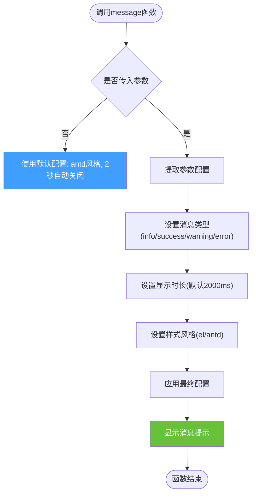
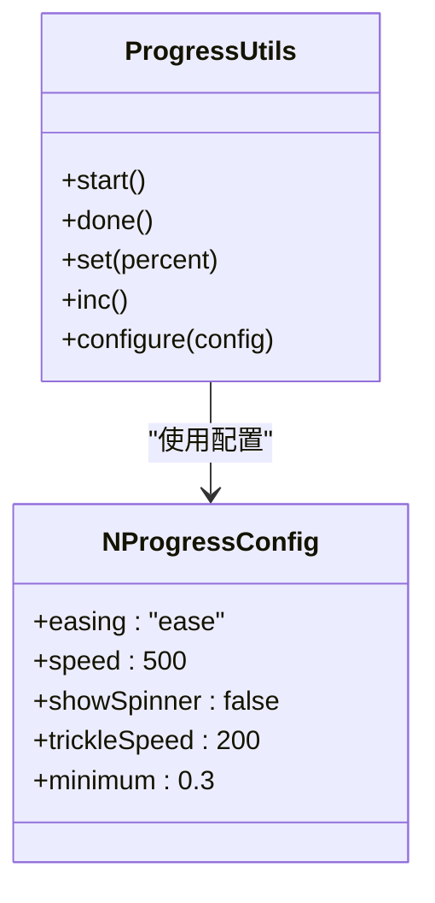
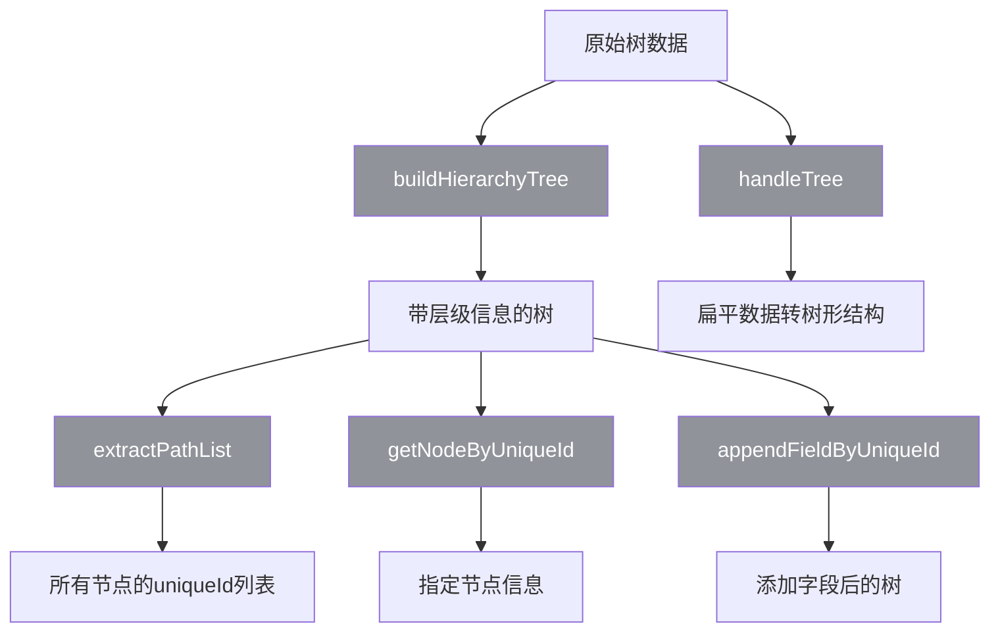
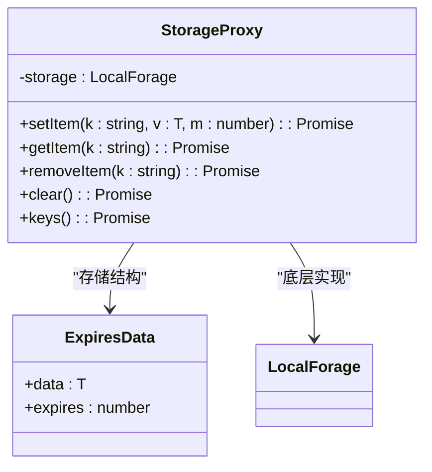
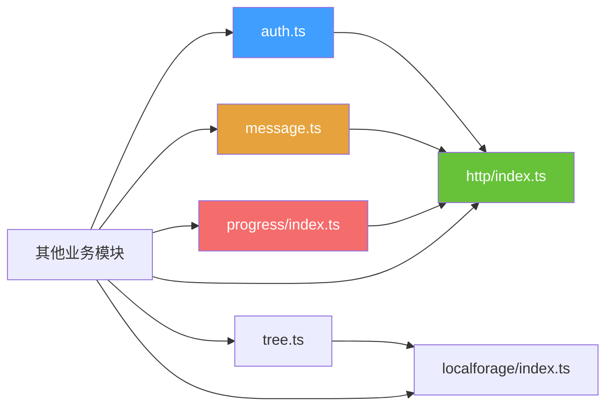

# 工具函数

<cite>
**本文档中引用的文件**  
- [auth.ts](file://src/utils/auth.ts)
- [http/index.ts](file://src/utils/http/index.ts)
- [message.ts](file://src/utils/message.ts)
- [progress/index.ts](file://src/utils/progress/index.ts)
- [tree.ts](file://src/utils/tree.ts)
- [localforage/index.ts](file://src/utils/localforage/index.ts)
</cite>

## 目录
1. [简介](#简介)
2. [项目结构](#项目结构)
3. [核心组件](#核心组件)
4. [架构概述](#架构概述)
5. [详细组件分析](#详细组件分析)
6. [依赖分析](#依赖分析)
7. [性能考虑](#性能考虑)
8. [故障排除指南](#故障排除指南)
9. [结论](#结论)

## 简介
本项目提供了一套完整的前端工具函数库，涵盖身份验证、HTTP请求封装、消息提示、进度条、树结构处理和本地存储等功能。这些工具函数旨在提升开发效率，统一项目中的通用逻辑处理方式。特别地，`auth.ts` 和 `http/index.ts` 模块实现了无感刷新token机制，确保用户在长时间使用系统时无需频繁重新登录。

## 项目结构
`src/utils` 目录下组织了所有工具函数模块，采用功能划分的方式进行管理。每个子模块专注于特定领域的功能实现，保持高内聚低耦合的设计原则。

**Diagram sources**
- [auth.ts](file://src/utils/auth.ts)
- [http/index.ts](file://src/utils/http/index.ts)
- [message.ts](file://src/utils/message.ts)
- [tree.ts](file://src/utils/tree.ts)
- [progress/index.ts](file://src/utils/progress/index.ts)
- [localforage/index.ts](file://src/utils/localforage/index.ts)

**Section sources**
- [auth.ts](file://src/utils/auth.ts)
- [http/index.ts](file://src/utils/http/index.ts)

## 核心组件
工具函数库的核心组件包括身份验证管理、HTTP请求封装、消息提示系统、进度条控制、树结构操作和增强型本地存储。这些组件共同构成了前端应用的基础支撑体系，为业务开发提供了标准化的解决方案。

**Section sources**
- [auth.ts](file://src/utils/auth.ts#L1-L141)
- [http/index.ts](file://src/utils/http/index.ts#L1-L187)
- [message.ts](file://src/utils/message.ts#L1-L89)
- [progress/index.ts](file://src/utils/progress/index.ts#L1-L17)
- [tree.ts](file://src/utils/tree.ts#L1-L188)

## 架构概述
整个工具函数库采用分层架构设计，上层业务模块通过统一接口调用底层服务。HTTP请求模块集成身份验证逻辑，自动处理token刷新；消息提示和进度条提供一致的用户体验；树结构工具简化复杂数据的处理；本地存储模块增强浏览器原生能力。

**Diagram sources**
- [http/index.ts](file://src/utils/http/index.ts#L1-L187)
- [auth.ts](file://src/utils/auth.ts#L1-L141)
- [message.ts](file://src/utils/message.ts#L1-L89)
- [progress/index.ts](file://src/utils/progress/index.ts#L1-L17)

## 详细组件分析

### 身份验证模块分析
`auth.ts` 模块负责管理用户认证状态，采用cookie和localStorage相结合的方式存储token信息。通过`multiple-tabs`机制支持多标签页免登录，利用Pinia状态管理持久化用户信息。

**Diagram sources**
- [auth.ts](file://src/utils/auth.ts#L1-L141)

**Section sources**
- [auth.ts](file://src/utils/auth.ts#L1-L141)
- [store/modules/user.ts](file://src/store/modules/user.ts#L118-L120)

### HTTP请求封装模块分析
`http/index.ts` 模块基于Axios封装了统一的HTTP客户端，集成自动token注入、过期处理和刷新机制。采用拦截器模式实现请求/响应的统一处理，支持自定义配置和回调函数。

**Diagram sources**
- [http/index.ts](file://src/utils/http/index.ts#L1-L187)
- [auth.ts](file://src/utils/auth.ts#L1-L141)

**Section sources**
- [http/index.ts](file://src/utils/http/index.ts#L1-L187)

### 消息提示模块分析
`message.ts` 模块封装了Element Plus的消息提示组件，提供更简洁的调用接口和默认配置。支持多种消息类型、自定义样式和关闭回调，确保全站消息提示风格统一。

**Diagram sources**
- [message.ts](file://src/utils/message.ts#L1-L89)

**Section sources**
- [message.ts](file://src/utils/message.ts#L1-L89)

### 进度条模块分析
`progress/index.ts` 模块封装了NProgress库，提供页面级别的加载进度指示。通过合理配置参数，实现流畅的用户体验，避免过度干扰用户操作。

**Diagram sources**
- [progress/index.ts](file://src/utils/progress/index.ts#L1-L17)

**Section sources**
- [progress/index.ts](file://src/utils/progress/index.ts#L1-L17)

### 树结构处理模块分析
`tree.ts` 模块提供了一系列树结构数据处理函数，支持路径提取、层级构建、节点查找等常见操作。特别适用于菜单系统、组织架构等场景的数据处理。

**Diagram sources**
- [tree.ts](file://src/utils/tree.ts#L1-L188)

**Section sources**
- [tree.ts](file://src/utils/tree.ts#L1-L188)

### 本地存储模块分析
`localforage/index.ts` 模块基于localForage库封装，提供带过期时间的增强型本地存储功能。优先使用IndexedDB，降级到localStorage，支持设置缓存有效期。

**Diagram sources**
- [localforage/index.ts](file://src/utils/localforage/index.ts#L1-L108)
- [localforage/types.d.ts](file://src/utils/localforage/types.d.ts)

**Section sources**
- [localforage/index.ts](file://src/utils/localforage/index.ts#L1-L108)

## 依赖分析
工具函数库内部各模块之间存在明确的依赖关系。HTTP请求模块依赖身份验证模块进行token管理；消息提示和进度条模块被HTTP模块调用以提供用户反馈；树结构和本地存储模块相对独立，可被多个业务模块复用。

**Diagram sources**
- [auth.ts](file://src/utils/auth.ts)
- [http/index.ts](file://src/utils/http/index.ts)
- [message.ts](file://src/utils/message.ts)
- [progress/index.ts](file://src/utils/progress/index.ts)
- [tree.ts](file://src/utils/tree.ts)
- [localforage/index.ts](file://src/utils/localforage/index.ts)

**Section sources**
- [auth.ts](file://src/utils/auth.ts)
- [http/index.ts](file://src/utils/http/index.ts)
- [message.ts](file://src/utils/message.ts)
- [progress/index.ts](file://src/utils/progress/index.ts)
- [tree.ts](file://src/utils/tree.ts)
- [localforage/index.ts](file://src/utils/localforage/index.ts)

## 性能考虑
工具函数库在设计时充分考虑了性能因素。HTTP请求模块采用单例模式，避免重复创建实例；本地存储模块优先使用IndexedDB提高读写效率；树结构处理函数采用递归优化算法，减少不必要的遍历操作。建议在实际使用中合理利用缓存机制，减少重复计算和网络请求。

## 故障排除指南
当遇到工具函数相关问题时，可按以下步骤排查：
1. 检查token是否正确存储在cookie和localStorage中
2. 确认HTTP请求的拦截器是否正常工作
3. 验证消息提示和进度条的样式是否正确加载
4. 检查树结构数据的格式是否符合预期
5. 确保localForage的驱动配置正确

**Section sources**
- [auth.ts](file://src/utils/auth.ts#L1-L141)
- [http/index.ts](file://src/utils/http/index.ts#L1-L187)
- [message.ts](file://src/utils/message.ts#L1-L89)

## 结论
该工具函数库为Vue Pure Admin项目提供了完整的基础功能支持，通过模块化设计实现了高可维护性和可扩展性。各组件之间职责分明，接口清晰，便于开发者