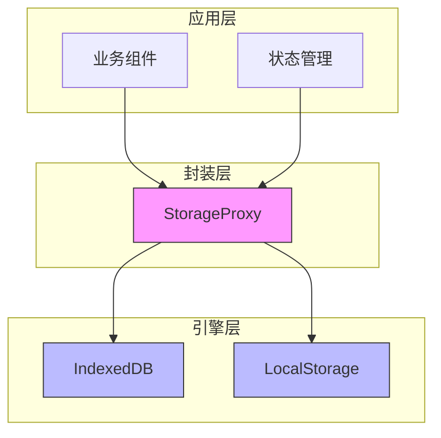
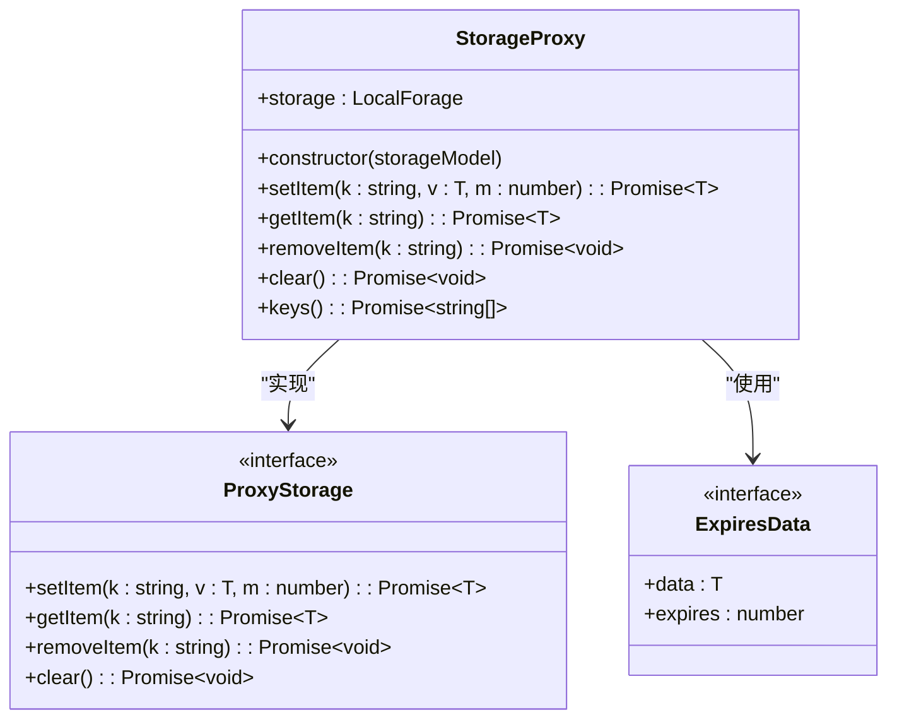
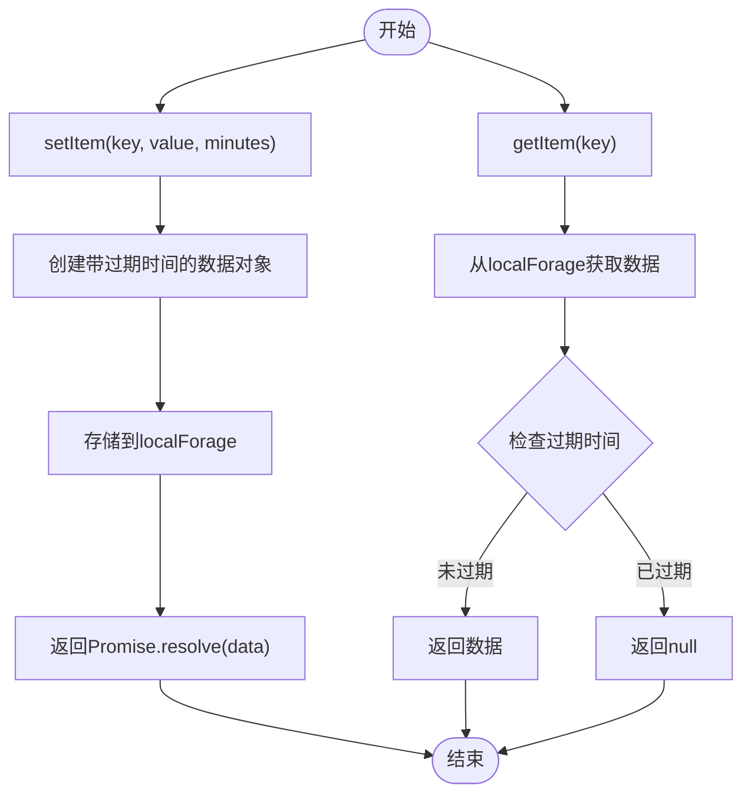
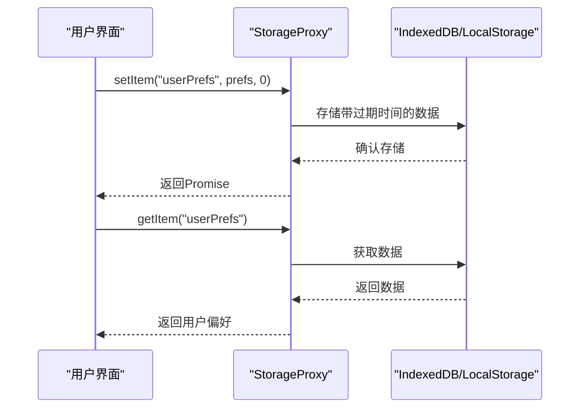
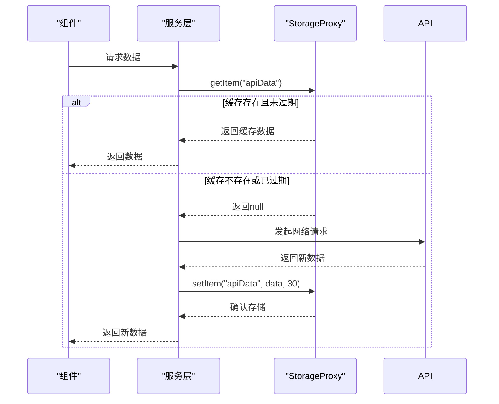
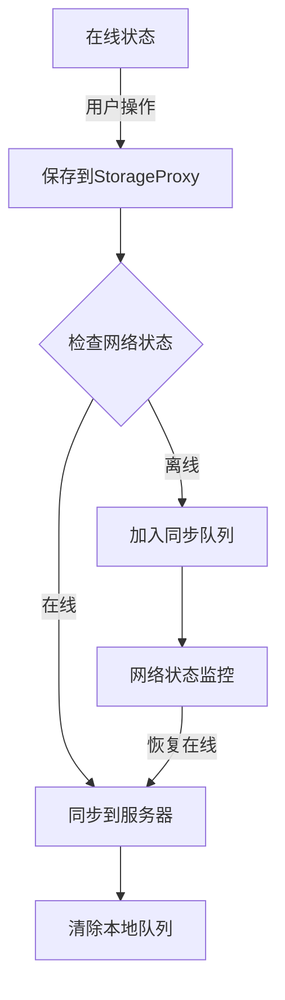
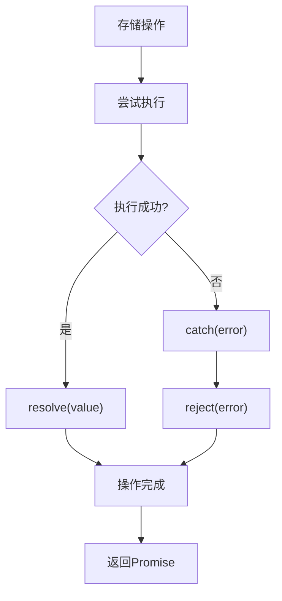
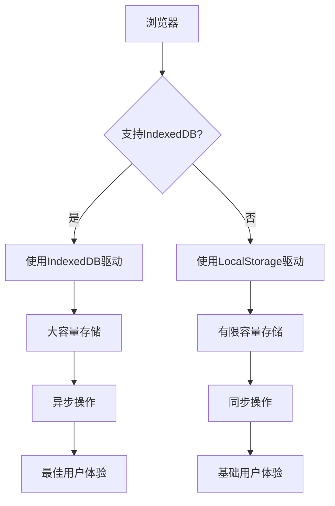

# 本地存储封装

<cite>
**Referenced Files in This Document**  
- [index.ts](file://src/utils/localforage/index.ts)
- [types.d.ts](file://src/utils/localforage/types.d.ts)
</cite>

## 目录
1. [简介](#简介)
2. [核心功能](#核心功能)
3. [架构设计](#架构设计)
4. [详细组件分析](#详细组件分析)
5. [应用场景](#应用场景)
6. [与原生localStorage对比](#与原生localstorage对比)
7. [错误处理](#错误处理)
8. [浏览器兼容性](#浏览器兼容性)

## 简介
本项目提供了一个基于localForage的本地存储工具封装，旨在为Vue Pure Admin应用提供更强大、灵活的客户端数据持久化解决方案。该封装不仅继承了localForage的所有优势，还通过二次开发增加了缓存过期时间管理功能，并提供了完整的TypeScript类型提示，确保开发过程中的类型安全。

**Section sources**
- [index.ts](file://src/utils/localforage/index.ts#L1-L110)

## 核心功能
本地存储工具实现了以下核心功能：
- **异步存储机制**：所有操作均返回Promise，避免阻塞主线程
- **智能降级策略**：优先使用IndexedDB，不支持时自动降级到LocalStorage
- **数据过期管理**：支持设置数据缓存时间（单位：分钟）
- **完整类型支持**：提供TypeScript接口定义，确保类型安全
- **统一API接口**：封装了set、get、remove、clear等常用方法

这些功能共同构成了一个现代化的客户端存储解决方案，适用于各种复杂的应用场景。

**Section sources**
- [index.ts](file://src/utils/localforage/index.ts#L1-L110)
- [types.d.ts](file://src/utils/localforage/types.d.ts#L0-L167)

## 架构设计
本地存储工具采用分层架构设计，将底层存储引擎与上层业务逻辑分离，提高了代码的可维护性和扩展性。

**Diagram sources**
- [index.ts](file://src/utils/localforage/index.ts#L1-L110)

## 详细组件分析

### StorageProxy类分析
StorageProxy是本地存储工具的核心实现类，负责封装所有存储操作。

**Diagram sources**
- [index.ts](file://src/utils/localforage/index.ts#L4-L108)
- [types.d.ts](file://src/utils/localforage/types.d.ts#L136-L165)

#### 存储操作流程

**Diagram sources**
- [index.ts](file://src/utils/localforage/index.ts#L44-L108)

## 应用场景

### 用户偏好设置
存储用户的界面主题、布局偏好等个性化设置，实现跨会话的用户体验一致性。

**Diagram sources**
- [index.ts](file://src/utils/localforage/index.ts#L44-L81)

### 缓存管理
实现API响应数据的本地缓存，减少网络请求，提升应用性能。

**Diagram sources**
- [index.ts](file://src/utils/localforage/index.ts#L44-L81)

### 离线数据存储
在离线状态下保存用户操作，待网络恢复后同步到服务器。

**Diagram sources**
- [index.ts](file://src/utils/localforage/index.ts#L44-L108)

## 与原生localStorage对比

| 特性 | 本地存储封装 | 原生localStorage |
|------|-------------|-----------------|
| **存储容量** | IndexedDB支持50MB以上 | 通常限制为5-10MB |
| **数据类型** | 支持任意JavaScript对象 | 仅支持字符串 |
| **操作模式** | 异步非阻塞 | 同步阻塞 |
| **过期管理** | 内置过期时间支持 | 需手动实现 |
| **错误处理** | Promise错误捕获 | 无错误处理机制 |
| **浏览器支持** | 自动降级策略 | 所有现代浏览器支持 |
| **性能影响** | 主线程无阻塞 | 大量数据时阻塞主线程 |

**Section sources**
- [index.ts](file://src/utils/localforage/index.ts#L1-L110)

## 错误处理
本地存储工具采用Promise模式进行错误处理，所有异步操作都包含完整的错误捕获机制。

当存储操作失败时，Promise会被拒绝并传递具体的错误信息，开发者可以通过`.catch()`方法或`try-catch`语法处理这些错误。

**Section sources**
- [index.ts](file://src/utils/localforage/index.ts#L44-L108)

## 浏览器兼容性
本地存储工具通过localForage的智能驱动选择机制，确保了广泛的浏览器兼容性。

**Diagram sources**
- [index.ts](file://src/utils/localforage/index.ts#L8-L12)