# 树结构处理工具

<cite>
**本文档引用的文件**  
- [tree.ts](file://web/src/utils/tree.ts)
- [menu-tree.vue](file://web/src/views/able/menu-tree.vue)
- [line-tree.vue](file://web/src/views/able/line-tree.vue)
- [index.vue](file://web/src/views/system/menu/index.vue)
- [tree.vue](file://web/src/views/system/user/tree.vue)
</cite>

## 目录
1. [简介](#简介)
2. [核心功能概览](#核心功能概览)
3. [核心算法实现](#核心算法实现)
4. [业务场景应用](#业务场景应用)
5. [无限层级嵌套处理](#无限层级嵌套处理)
6. [与Element Plus Tree组件配合使用](#与element-plus-tree组件配合使用)
7. [性能优化建议](#性能优化建议)
8. [总结](#总结)

## 简介

树结构处理工具是一套专门用于处理树形数据的专业工具集，主要位于`tree.ts`文件中。该工具集为前端应用中的菜单权限树、组织架构树、分类目录等复杂树形结构提供了完整的解决方案。通过一系列精心设计的函数，开发者可以轻松实现数组与树结构之间的转换、节点查找、树遍历等常见操作。

**Section sources**
- [tree.ts](file://web/src/utils/tree.ts#L1-L10)

## 核心功能概览

树结构处理工具提供了一套完整的树形数据操作方法，涵盖了从数据转换到节点操作的各个方面。这些功能不仅满足了基本的树形数据处理需求，还针对实际业务场景进行了优化。

**Diagram sources**
- [tree.ts](file://web/src/utils/tree.ts#L5-L187)

**Section sources**
- [tree.ts](file://web/src/utils/tree.ts#L5-L187)

## 核心算法实现

### 数组转树 (handleTree)

`handleTree`函数实现了将扁平化数组转换为树形结构的核心算法。该函数通过建立父子节点映射关系，高效地构建出完整的树结构。

**Diagram sources**
- [tree.ts](file://web/src/utils/tree.ts#L136-L187)

**Section sources**
- [tree.ts](file://web/src/utils/tree.ts#L136-L187)

### 节点查找 (getNodeByUniqueId)

`getNodeByUniqueId`函数采用广度优先遍历策略，根据唯一标识符查找树中特定节点。该算法在处理大型树结构时表现出良好的性能特征。

**Diagram sources**
- [tree.ts](file://web/src/utils/tree.ts#L79-L95)

**Section sources**
- [tree.ts](file://web/src/utils/tree.ts#L79-L95)

### 层级关系构建 (buildHierarchyTree)

`buildHierarchyTree`函数为树中每个节点构建完整的层级信息，包括节点ID、父节点ID、路径列表和唯一ID。这一功能对于需要精确追踪节点位置的场景至关重要。

**Diagram sources**
- [tree.ts](file://web/src/utils/tree.ts#L55-L71)

**Section sources**
- [tree.ts](file://web/src/utils/tree.ts#L55-L71)

## 业务场景应用

### 菜单权限树

在系统管理模块中，树结构处理工具被广泛应用于菜单权限管理。通过`deleteChildren`和`extractPathList`函数，实现了菜单树的扁平化展示和默认展开状态管理。

**Diagram sources**
- [menu-tree.vue](file://web/src/views/able/menu-tree.vue#L1-L91)
- [tree.ts](file://web/src/utils/tree.ts#L28-L47)

**Section sources**
- [menu-tree.vue](file://web/src/views/able/menu-tree.vue#L1-L91)

### 组织架构树

在用户管理模块中，树结构处理工具用于展示企业组织架构。`tree.vue`组件结合`el-tree`实现了部门树的搜索、展开/折叠和节点选中功能。

**Diagram sources**
- [tree.vue](file://web/src/views/system/user/tree.vue#L1-L211)

**Section sources**
- [tree.vue](file://web/src/views/system/user/tree.vue#L1-L211)

### 分类目录

在内容管理系统中，树结构处理工具可用于商品分类、文章分类等场景。通过`handleTree`函数，可以将数据库中的扁平化分类数据转换为树形结构，便于用户浏览和选择。

## 无限层级嵌套处理

树结构处理工具通过递归算法完美支持无限层级的嵌套数据处理。所有核心函数都采用了递归设计模式，确保能够处理任意深度的树形结构。

### 递归处理机制

**Diagram sources**
- [tree.ts](file://web/src/utils/tree.ts#L5-L187)

**Section sources**
- [tree.ts](file://web/src/utils/tree.ts#L5-L187)

### 边界条件处理

所有函数都包含了完善的边界条件检查，确保在处理异常数据时不会导致程序崩溃：

- 输入数据类型验证
- 空数组或null值处理
- 循环引用检测（通过递归深度限制）
- 性能优化的提前终止条件

## 与Element Plus Tree组件配合使用

树结构处理工具与Element Plus的Tree和Tree V2组件无缝集成，提供了完整的树形数据解决方案。

### 基本集成模式

```mermaid
flowchart LR
A[原始数据] --> B[树工具处理]
B --> C[处理后的树结构]
C --> D[Element Plus Tree]
D --> E[用户界面]
subgraph "处理阶段"
B1[handleTree: 数组转树]
B2[buildHierarchyTree: 构建层级]
B3[deleteChildren: 优化显示]
end
subgraph "展示阶段"
D1[default-expanded-keys]
D2[props配置]
D3[自定义模板]
end
B --> B1
B --> B2
B --> B3
D --> D1
D --> D2
D --> D3
```

**Diagram sources**
- [menu-tree.vue](file://web/src/views/able/menu-tree.vue#L1-L91)
- [line-tree.vue](file://web/src/views/able/line-tree.vue#L1-L102)

**Section sources**
- [menu-tree.vue](file://web/src/views/able/menu-tree.vue#L1-L91)
- [line-tree.vue](file://web/src/views/able/line-tree.vue#L1-L102)

### 高级功能集成

在`line-tree.vue`中展示了更高级的集成方式，包括：

- 普通树与虚拟树的对比展示
- 连接线样式的自定义
- 国际化标题的处理
- 搜索过滤功能的实现

## 性能优化建议

### 大数据量树的懒加载策略

对于包含大量节点的树结构，建议采用懒加载策略来提升性能：

**Diagram sources**
- [tree.vue](file://web/src/views/system/user/tree.vue#L1-L211)

**Section sources**
- [tree.vue](file://web/src/views/system/user/tree.vue#L1-L211)

### 其他性能优化措施

1. **虚拟滚动**：对于大型树结构，使用Tree V2组件的虚拟滚动功能
2. **数据缓存**：对处理过的树结构进行缓存，避免重复计算
3. **节流搜索**：对搜索输入进行节流处理，避免频繁触发过滤
4. **分批渲染**：对于极大数据集，考虑分批加载和渲染

## 总结

树结构处理工具为前端应用中的树形数据管理提供了全面而高效的解决方案。通过`handleTree`、`buildHierarchyTree`、`getNodeByUniqueId`等核心函数，开发者可以轻松应对各种复杂的树形数据处理需求。

该工具集已在菜单权限管理、组织架构展示等实际业务场景中得到验证，与Element Plus组件库无缝集成，提供了良好的开发体验。对于大数据量的树形结构，结合懒加载和虚拟滚动等技术，能够确保应用的流畅运行。

**Section sources**
- [tree.ts](file://web/src/utils/tree.ts#L1-L187)
- [menu-tree.vue](file://web/src/views/able/menu-tree.vue#L1-L91)
- [line-tree.vue](file://web/src/views/able/line-tree.vue#L1-L102)