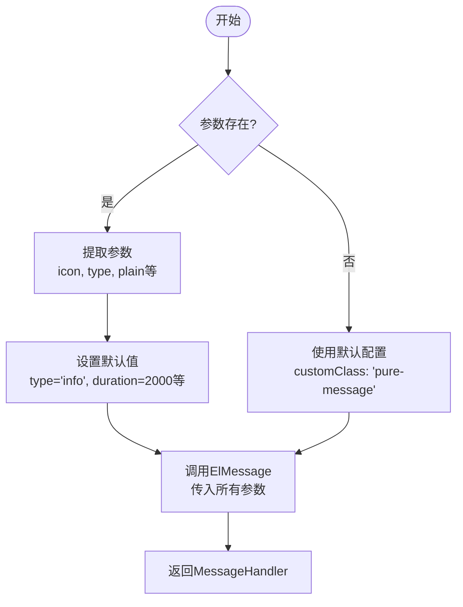
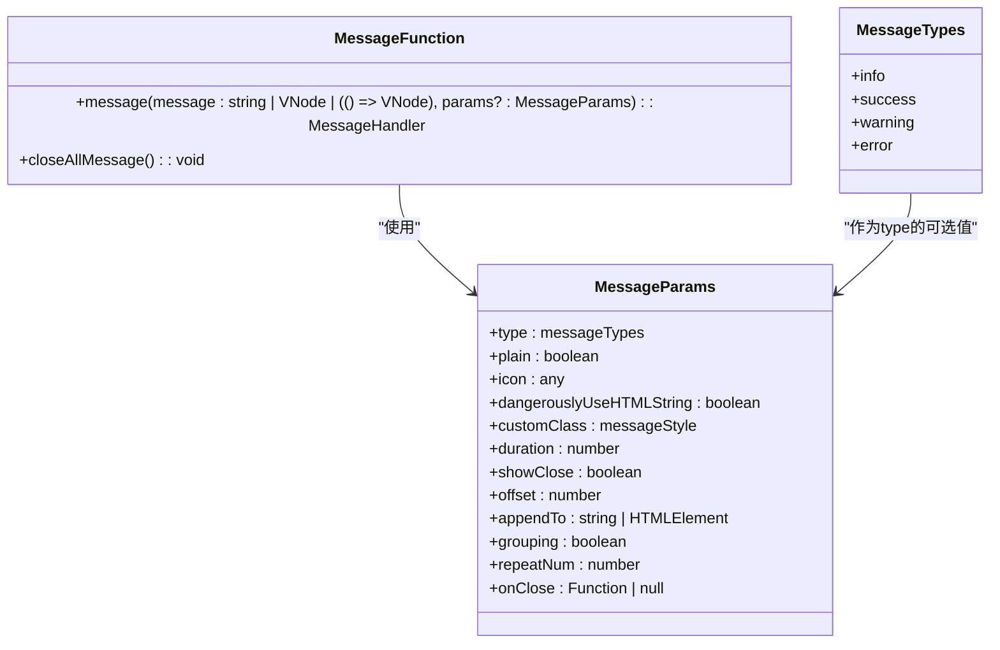

# 消息提示工具

<cite>
**Referenced Files in This Document**   
- [message.ts](file://web/src/utils/message.ts)
- [elementPlus.ts](file://web/src/plugins/elementPlus.ts)
- [message.vue](file://web/src/views/components/message.vue)
- [index.scss](file://web/src/style/index.scss)
- [dark.scss](file://web/src/style/dark.scss)
</cite>

## 目录
1. [简介](#简介)
2. [核心功能](#核心功能)
3. [消息类型与快捷调用](#消息类型与快捷调用)
4. [全局配置选项](#全局配置选项)
5. [与Element Plus原生Message的关系](#与element-plus原生message的关系)
6. [使用场景示例](#使用场景示例)
7. [自定义样式与图标](#自定义样式与图标)
8. [国际化集成](#国际化集成)
9. [结论](#结论)

## 简介

消息提示工具是vue-pure-admin-all项目中用于向用户展示即时反馈信息的核心组件。该工具基于Element Plus的ElMessage组件进行了功能增强和样式优化，提供了更加灵活和一致的用户体验。通过封装在`message.ts`文件中的`message`函数，开发者可以轻松地在各种场景下显示不同类型的消息提示，包括成功、警告、错误和信息等。

**Section sources**
- [message.ts](file://web/src/utils/message.ts#L0-L89)

## 核心功能

消息提示工具的核心功能是提供一个统一的接口来显示各种类型的消息。该工具通过`message`函数实现，该函数接受一个消息内容和一个可选的参数对象。参数对象允许开发者自定义消息的各个方面，包括类型、图标、显示时间、是否显示关闭按钮等。

该工具还提供了一个`closeAllMessage`函数，用于关闭所有当前显示的消息提示。这对于在特定操作后清理所有消息非常有用，例如在用户完成表单提交后。



**Diagram sources**
- [message.ts](file://web/src/utils/message.ts#L39-L81)

**Section sources**
- [message.ts](file://web/src/utils/message.ts#L39-L81)

## 消息类型与快捷调用

消息提示工具支持四种主要的消息类型：信息（info）、成功（success）、警告（warning）和错误（error）。这些类型可以通过`type`参数来指定。当不指定`type`时，默认使用信息类型。

除了通过参数指定类型外，开发者还可以通过直接调用`message`函数并传入相应的参数来快速显示特定类型的消息。例如，要显示一个成功消息，可以调用`message('Success类型消息', { type: 'success' })`。



**Diagram sources**
- [message.ts](file://web/src/utils/message.ts#L10-L27)

**Section sources**
- [message.ts](file://web/src/utils/message.ts#L10-L27)
- [message.vue](file://web/src/views/components/message.vue#L137-L189)

## 全局配置选项

消息提示工具提供了多种全局配置选项，允许开发者根据项目需求自定义消息的外观和行为。这些选项包括：

- **显示时间（duration）**：控制消息显示的时长，单位为毫秒。默认值为2000毫秒，比Element Plus原生的3000毫秒更短，以提供更快的反馈。
- **关闭按钮（showClose）**：控制是否显示关闭按钮。默认值为`false`，即不显示关闭按钮。
- **消息合并（grouping）**：当设置为`true`时，内容相同的消息将被合并，避免重复显示。
- **偏移量（offset）**：控制消息距离窗口顶部的偏移量，默认值为16。
- **根元素（appendTo）**：设置消息组件的根元素，默认为`document.body`。

这些配置选项使得消息提示工具更加灵活，能够适应不同的使用场景和设计需求。

**Section sources**
- [message.ts](file://web/src/utils/message.ts#L15-L25)

## 与Element Plus原生Message的关系

消息提示工具是基于Element Plus的ElMessage组件构建的，但它通过封装和扩展提供了更多的功能和更好的用户体验。主要区别包括：

- **默认样式**：消息提示工具使用`pure-message`类名来应用自定义样式，这种样式更接近Ant Design的风格，同时适配了整体的暗色主题。
- **默认显示时间**：将默认显示时间从3000毫秒缩短到2000毫秒，以提供更快的反馈。
- **样式隔离**：通过使用不同的类名，确保自定义样式不会影响Element Plus原生的ElMessage组件。

这种设计使得项目可以在不改变现有ElMessage使用方式的情况下，享受到增强的消息提示功能。

```mermaid
graph TB
subgraph "Element Plus"
ElMessage[ElMessage组件]
end
subgraph "vue-pure-admin-all"
CustomMessage[消息提示工具]
Style[pure-message样式]
end
ElMessage --> CustomMessage : "作为基础"
Style --> CustomMessage : "应用自定义样式"
CustomMessage --> App[应用程序] : "提供消息提示"
```

**Diagram sources**
- [message.ts](file://web/src/utils/message.ts#L39-L81)
- [dark.scss](file://web/src/style/dark.scss#L250-L270)

**Section sources**
- [message.ts](file://web/src/utils/message.ts#L39-L81)
- [dark.scss](file://web/src/style/dark.scss#L250-L270)

## 使用场景示例

消息提示工具在多种场景下都非常有用，包括：

- **用户操作反馈**：当用户执行某个操作（如保存表单、删除项目）时，显示成功或错误消息以确认操作结果。
- **表单验证结果**：在表单验证失败时，显示错误消息以指导用户修正输入。
- **系统通知**：在系统状态发生变化时（如网络连接丢失、新版本可用），显示通知消息。

这些场景下的使用示例可以在`message.vue`文件中找到，该文件展示了如何在实际应用中使用消息提示工具。

**Section sources**
- [message.vue](file://web/src/views/components/message.vue#L0-L204)

## 自定义样式与图标

消息提示工具允许开发者通过`icon`参数自定义消息图标，该参数会覆盖`type`参数指定的默认图标。此外，通过`customClass`参数，开发者可以应用不同的样式风格，目前支持`el`和`antd`两种风格。

自定义样式主要在`dark.scss`文件中定义，使用了CSS变量和Sass函数来确保样式的一致性和可维护性。`pure-message`类名被用来应用这些自定义样式，确保不会影响Element Plus原生的ElMessage组件。

**Section sources**
- [message.ts](file://web/src/utils/message.ts#L13-L14)
- [dark.scss](file://web/src/style/dark.scss#L250-L270)

## 国际化集成

虽然消息提示工具本身不直接处理国际化，但它与项目的国际化系统无缝集成。消息内容可以是任何字符串，包括通过国际化函数获取的翻译文本。这使得开发者可以轻松地为不同语言的用户提供本地化的消息提示。

**Section sources**
- [message.ts](file://web/src/utils/message.ts#L39-L81)

## 结论

消息提示工具是vue-pure-admin-all项目中一个强大而灵活的组件，它基于Element Plus的ElMessage组件进行了功能增强和样式优化。通过提供统一的接口、丰富的配置选项和自定义样式，该工具使得开发者能够轻松地在各种场景下向用户提供即时反馈。其与Element Plus原生组件的良好隔离性确保了项目的稳定性和可维护性。