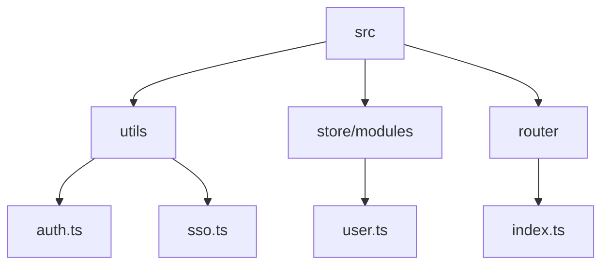
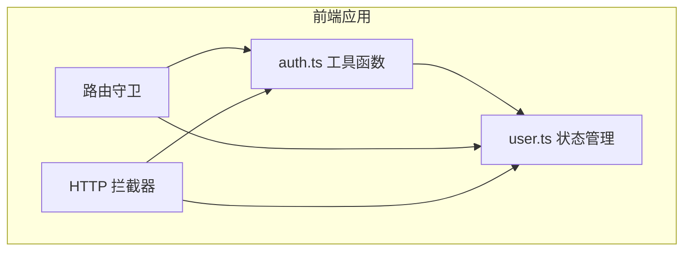
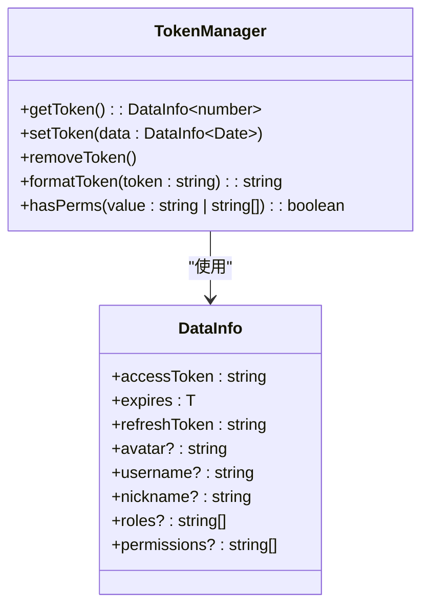
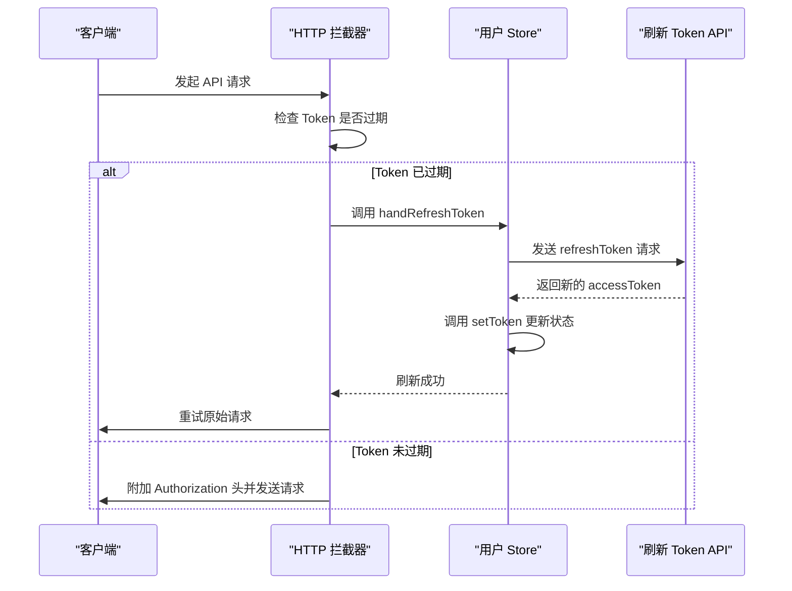
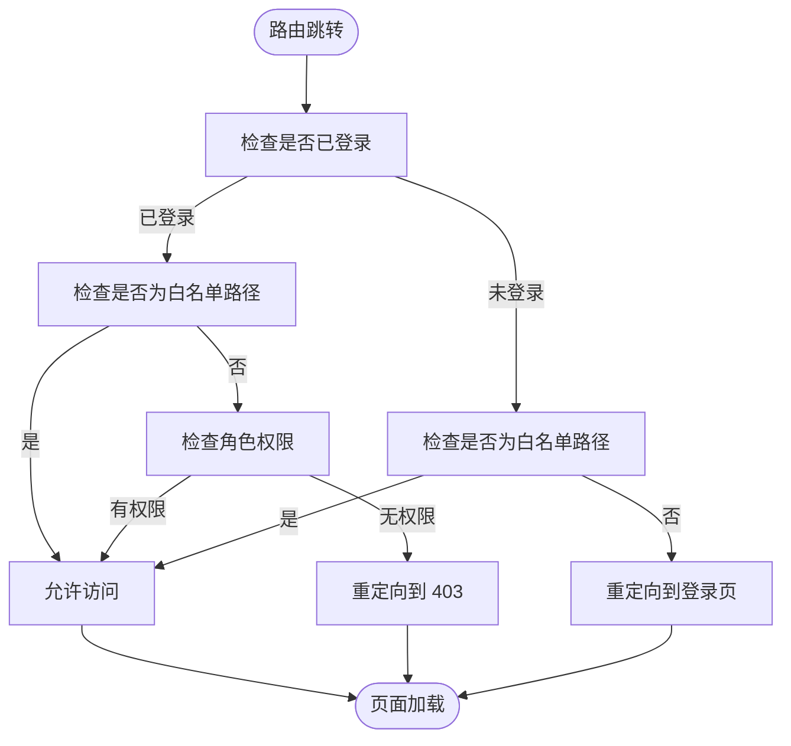
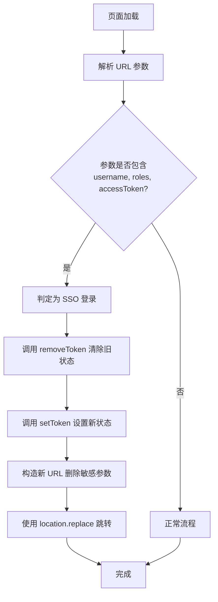
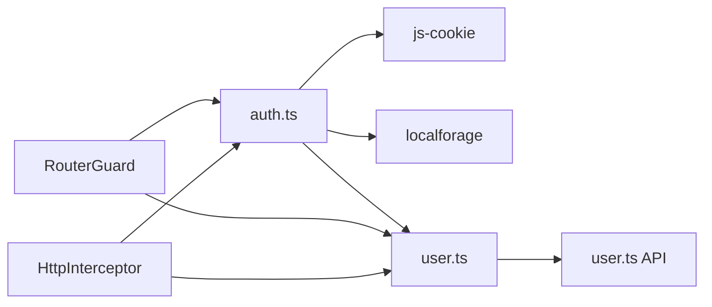

# 认证工具函数

<cite>
**本文档中引用的文件**  
- [auth.ts](file://web/src/utils/auth.ts)
- [user.ts](file://web/src/store/modules/user.ts)
- [index.ts](file://web/src/router/index.ts)
- [sso.ts](file://web/src/utils/sso.ts)
- [http/index.ts](file://web/src/utils/http/index.ts)
</cite>

## 目录
1. [简介](#简介)
2. [项目结构](#项目结构)
3. [核心组件](#核心组件)
4. [架构概述](#架构概述)
5. [详细组件分析](#详细组件分析)
6. [依赖分析](#依赖分析)
7. [性能考虑](#性能考虑)
8. [故障排除指南](#故障排除指南)
9. [结论](#结论)

## 简介
本文档深入解析 Vue Pure Admin 项目中的认证工具函数，重点分析 `auth.ts` 文件中实现的 Token 管理机制。文档涵盖 Token 的获取、设置与移除逻辑，Token 过期处理与自动刷新策略，以及该工具与状态管理、路由守卫和 API 请求拦截器的集成方式。同时，文档还介绍了 SSO 单点登录的实现原理和安全最佳实践。

## 项目结构
项目采用典型的 Vue 3 + Vite 架构，认证相关的核心逻辑分布在 `src/utils` 和 `src/store/modules` 目录下。`auth.ts` 文件位于 `utils` 目录，是整个认证系统的核心工具库。

**图示来源**
- [auth.ts](file://web/src/utils/auth.ts)
- [user.ts](file://web/src/store/modules/user.ts)
- [index.ts](file://web/src/router/index.ts)

**本节来源**
- [auth.ts](file://web/src/utils/auth.ts)
- [user.ts](file://web/src/store/modules/user.ts)

## 核心组件
`auth.ts` 文件提供了 `getToken`、`setToken`、`removeToken` 等核心函数，用于管理用户的认证状态。这些函数与 `user.ts` 中的 Pinia Store 紧密协作，共同维护用户信息和权限。

**本节来源**
- [auth.ts](file://web/src/utils/auth.ts#L34-L140)
- [user.ts](file://web/src/store/modules/user.ts#L1-L122)

## 架构概述
整个认证系统由工具函数、状态管理、路由守卫和 HTTP 拦截器四部分构成。`auth.ts` 作为基础工具层，提供原子化的 Token 操作。`user.ts` 的 Store 负责集中管理用户状态。`router/index.ts` 中的路由守卫负责权限校验和登录状态检查。`http/index.ts` 中的拦截器负责在请求中自动附加 Token。

**图示来源**
- [auth.ts](file://web/src/utils/auth.ts)
- [user.ts](file://web/src/store/modules/user.ts)
- [index.ts](file://web/src/router/index.ts)
- [http/index.ts](file://web/src/utils/http/index.ts)

## 详细组件分析

### Token 管理机制分析
`auth.ts` 文件实现了基于 Cookie 和 LocalStorage 的双层 Token 存储策略。

#### Token 获取与设置

**图示来源**
- [auth.ts](file://web/src/utils/auth.ts#L1-L142)

#### Token 过期与自动刷新流程

**图示来源**
- [http/index.ts](file://web/src/utils/http/index.ts#L30-L184)
- [user.ts](file://web/src/store/modules/user.ts#L118-L120)

#### 登录状态校验与路由守卫

**图示来源**
- [index.ts](file://web/src/router/index.ts#L0-L229)

**本节来源**
- [auth.ts](file://web/src/utils/auth.ts#L34-L140)
- [user.ts](file://web/src/store/modules/user.ts#L1-L122)
- [index.ts](file://web/src/router/index.ts#L0-L229)

### SSO 单点登录分析
SSO 机制通过解析 URL 参数来实现无感登录。

**图示来源**
- [sso.ts](file://web/src/utils/sso.ts#L0-L59)

**本节来源**
- [sso.ts](file://web/src/utils/sso.ts#L0-L59)

## 依赖分析
认证工具函数依赖于多个外部库和内部模块。

**图示来源**
- [auth.ts](file://web/src/utils/auth.ts)
- [user.ts](file://web/src/store/modules/user.ts)
- [index.ts](file://web/src/router/index.ts)
- [http/index.ts](file://web/src/utils/http/index.ts)

**本节来源**
- [auth.ts](file://web/src/utils/auth.ts)
- [user.ts](file://web/src/store/modules/user.ts)

## 性能考虑
- **无感刷新**：通过在 HTTP 拦截器中处理 Token 刷新，避免了因 Token 过期导致的请求失败和用户感知中断。
- **状态持久化**：利用 Cookie 和 LocalStorage 的组合，支持多标签页登录和免登录功能，提升了用户体验。
- **内存管理**：在 Token 过期时，将待处理的请求暂存于静态数组中，刷新成功后统一重试，避免了请求丢失。

## 故障排除指南
- **问题：登录后页面无法跳转或刷新后需重新登录**
  - **原因**：`multipleTabsKey` 的 Cookie 未正确设置。
  - **解决方案**：检查 `setToken` 函数中关于 `multipleTabsKey` 的逻辑，确保 `isRemembered` 状态正确。

- **问题：Token 自动刷新失败，导致连续 401 错误**
  - **原因**：`PureHttp.isRefreshing` 标志位未正确处理，导致刷新请求被重复触发。
  - **解决方案**：确保 `handRefreshToken` API 调用后，无论成功或失败，`isRefreshing` 都会被设置为 `false`。

- **问题：SSO 登录后 URL 仍包含敏感参数**
  - **原因**：`sso.ts` 中的 URL 重构逻辑出错。
  - **解决方案**：检查 `subBefore` 和 `JSON.stringify` 后的字符串替换逻辑。

**本节来源**
- [auth.ts](file://web/src/utils/auth.ts#L47-L115)
- [http/index.ts](file://web/src/utils/http/index.ts#L30-L184)
- [sso.ts](file://web/src/utils/sso.ts#L0-L59)

## 结论
`auth.ts` 文件实现了一套完整、健壮且用户体验良好的认证机制。它通过巧妙地结合 Cookie 和 LocalStorage，实现了 Token 管理、状态持久化和 SSO 登录。与 Pinia Store 和 Vue Router 的深度集成，确保了状态的一致性和路由的安全性。HTTP 拦截器中的无感刷新策略，极大地提升了应用的稳定性和用户体验。该设计模式值得在其他 Vue 项目中借鉴和应用。