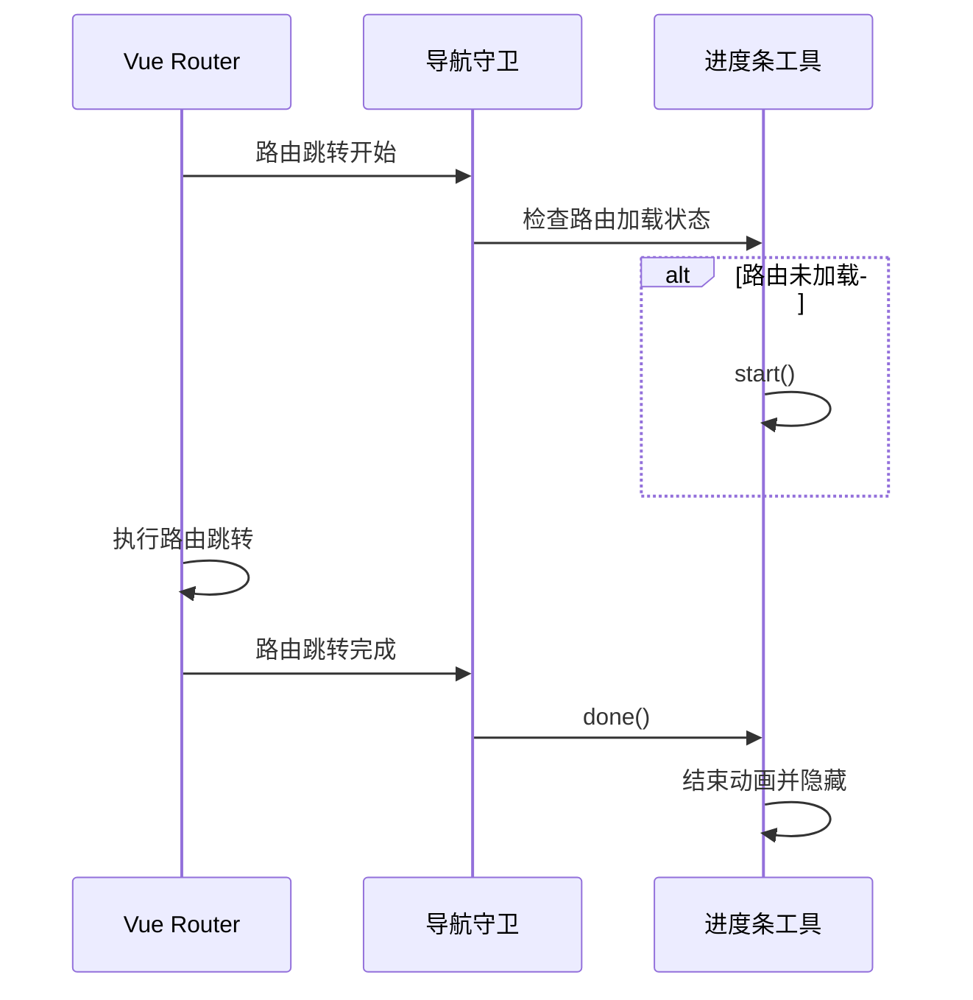

# 进度条工具

<cite>
**Referenced Files in This Document**   
- [index.ts](file://web/src/utils/progress/index.ts)
- [index.ts](file://web/src/router/index.ts)
- [progress.vue](file://web/src/views/components/progress.vue)
</cite>

## 目录
1. [核心功能概述](#核心功能概述)
2. [核心方法使用](#核心方法使用)
3. [路由跳转集成](#路由跳转集成)
4. [异步请求场景](#异步请求场景)
5. [手动控制高级用法](#手动控制高级用法)
6. [样式自定义](#样式自定义)
7. [性能监控建议](#性能监控建议)

## 核心功能概述

进度条工具基于 NProgress 库进行封装，为应用程序提供流畅的页面加载进度指示。该工具通过在路由跳转和异步操作期间自动显示和隐藏进度条，提升用户体验。核心功能包括自动进度条管理、与 Vue Router 的深度集成、可配置的动画效果以及灵活的样式定制能力。

**Section sources**
- [index.ts](file://web/src/utils/progress/index.ts#L1-L17)

## 核心方法使用

### start 方法
`start()` 方法用于手动启动进度条显示。当需要在特定操作开始时显示进度条时，可调用此方法。该方法会触发进度条的动画效果，向用户表明系统正在处理请求。

### done 方法
`done()` 方法用于手动结束进度条显示。当操作完成时，调用此方法可使进度条流畅地完成动画并隐藏。该方法确保了用户体验的一致性，避免了进度条突然消失的突兀感。

### configure 方法
`configure()` 方法用于设置进度条的全局配置选项。通过此方法可以调整进度条的动画方式、速度、显示特性等参数，以满足不同应用场景的需求。

**Section sources**
- [index.ts](file://web/src/utils/progress/index.ts#L3-L16)

## 路由跳转集成

### 集成机制
进度条工具与 Vue Router 的导航守卫深度集成，通过 `beforeEach` 和 `afterEach` 钩子实现自动控制。当路由开始跳转时，在 `beforeEach` 钩子中检查目标路由是否已加载，若未加载则启动进度条。当路由跳转完成后，在 `afterEach` 钩子中结束进度条动画。

### 流畅动画效果
集成机制确保了页面切换时进度条的流畅动画效果。通过在路由跳转的整个生命周期中精确控制进度条的显示与隐藏，避免了闪烁或延迟等问题，为用户提供平滑的视觉体验。

**Diagram sources**
- [index.ts](file://web/src/utils/progress/index.ts#L1-L17)
- [index.ts](file://web/src/router/index.ts#L120-L228)

**Section sources**
- [index.ts](file://web/src/router/index.ts#L120-L228)

## 异步请求场景

在异步请求场景下，进度条工具能够自动触发显示与隐藏。当发起网络请求时，系统会自动调用 `start()` 方法显示进度条；当请求完成或失败时，自动调用 `done()` 方法结束进度条动画。这种自动化机制减少了开发者的手动干预，确保了所有异步操作都有相应的视觉反馈。

**Section sources**
- [index.ts](file://web/src/router/index.ts#L120-L228)

## 手动控制高级用法

### 条件性触发
在某些复杂场景下，可能需要根据特定条件决定是否显示进度条。通过在业务逻辑中手动调用 `start()` 和 `done()` 方法，可以实现更精细的控制。例如，仅在数据量较大或处理时间较长的操作中显示进度条。

### 组合操作
对于包含多个步骤的复杂操作，可以组合使用进度条方法。在操作开始时调用 `start()`，在每个关键步骤完成后保持进度条显示，在整个操作完成后调用 `done()`。这种用法可以为用户提供更详细的进度反馈。

**Section sources**
- [index.ts](file://web/src/utils/progress/index.ts#L1-L17)

## 样式自定义

### 颜色与高度
通过修改 NProgress 的 CSS 变量或覆盖默认样式，可以自定义进度条的颜色和高度。可以在项目样式文件中定义新的 CSS 规则，改变进度条的外观以匹配应用程序的整体设计风格。

### 动画效果
进度条的动画效果可以通过 `configure()` 方法进行调整。可以修改动画的缓动函数、速度、递增间隔等参数，创建独特的动画效果。例如，使用不同的缓动函数可以实现更平滑或更活泼的动画表现。

**Section sources**
- [progress.vue](file://web/src/views/components/progress.vue#L1-L147)

## 性能监控建议

### 避免高频触发
为避免在高频操作中误触发进度条，建议实施节流机制。对于频繁发生的操作，可以设置最小显示时间或使用计数器来合并多个连续的进度条请求，防止进度条频繁闪烁影响用户体验。

### 资源优化
确保进度条相关的 CSS 和 JavaScript 资源经过优化，减少加载时间。可以通过代码分割将进度条组件按需加载，避免在不需要的页面中加载相关资源，从而提升整体应用性能。

**Section sources**
- [index.ts](file://web/src/router/index.ts#L120-L228)