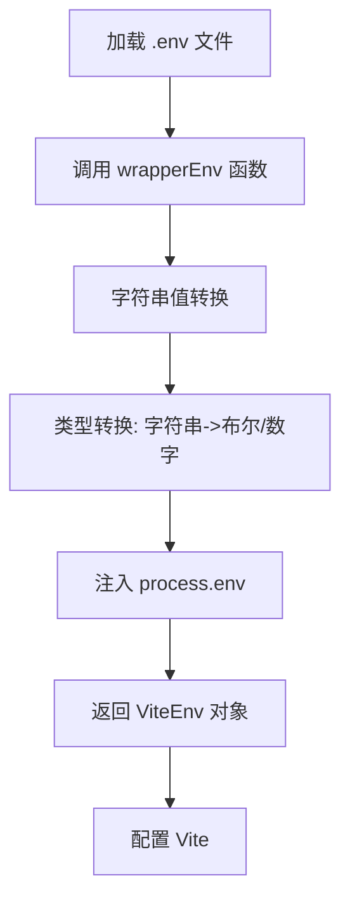

# 快速开始

<cite>
**Referenced Files in This Document**   
- [README.md](file://web/README.md)
- [package.json](file://web/package.json)
- [vite.config.ts](file://web/vite.config.ts)
- [.npmrc](file://web/.npmrc)
- [Dockerfile](file://web/Dockerfile)
- [build/utils.ts](file://web/build/utils.ts)
</cite>

## 目录
1. [简介](#简介)
2. [环境要求](#环境要求)
3. [项目搭建步骤](#项目搭建步骤)
4. [开发与构建命令](#开发与构建命令)
5. [关键配置文件解析](#关键配置文件解析)
6. [Docker部署](#docker部署)
7. [常见问题解决方案](#常见问题解决方案)

## 简介

`vue-pure-admin` 是一款开源免费且开箱即用的中后台管理系统模板，采用 `ECMAScript` 模块（`ESM`）规范编写，基于 `Vue3`、`Vite`、`Element-Plus`、`TypeScript`、`Pinia` 和 `Tailwindcss` 等主流技术栈开发。本指南将详细介绍如何在本地环境中快速搭建和运行该项目，为开发者提供清晰的入门路径。

**Section sources**
- [README.md](file://web/README.md#L1-L50)

## 环境要求

在开始搭建项目之前，请确保您的开发环境满足以下要求：

- **Node.js**: 版本要求为 `^20.19.0` 或 `>=22.12.0`。项目在 `package.json` 的 `engines` 字段中明确指定了 Node.js 版本范围，建议使用 Node.js 20 或 22 的最新稳定版本。
- **pnpm**: 版本要求为 `>=9`。项目使用 pnpm 作为包管理工具，并在 `package.json` 中通过 `preinstall` 脚本强制使用 pnpm（`npx only-allow pnpm`），以确保团队成员使用统一的包管理器。
- **操作系统**: 支持 Windows、macOS 和 Linux 系统。

这些环境要求确保了项目依赖的正确安装和构建过程的顺利进行。

**Section sources**
- [package.json](file://web/package.json#L140-L143)

## 项目搭建步骤

### 1. 克隆仓库

您可以选择从 GitHub 或 Gitee 克隆项目仓库：

```bash
# 从 GitHub 克隆
git clone https://github.com/pure-admin/vue-pure-admin.git

# 从 Gitee 克隆
git clone https://gitee.com/yiming_chang/vue-pure-admin.git
```

### 2. 进入项目目录

```bash
cd vue-pure-admin
```

### 3. 安装依赖

项目使用 pnpm 进行依赖管理。在项目根目录执行以下命令安装所有依赖：

```bash
pnpm install
```

此命令会根据 `pnpm-lock.yaml` 文件精确安装所有依赖包，确保不同环境下的依赖一致性。

**Section sources**
- [README.md](file://web/README.md#L113-L116)

## 开发与构建命令

项目通过 `package.json` 中的 `scripts` 字段定义了常用的开发和构建命令：

### 开发模式启动

启动开发服务器，支持热重载：

```bash
pnpm dev
```

或使用别名命令：

```bash
pnpm serve
```

开发服务器默认运行在 `8848` 端口，您可以在浏览器中访问 `http://localhost:8848` 查看应用。

### 生产环境构建

构建生产环境的静态资源文件：

```bash
pnpm build
```

此命令会清理 `dist` 目录并执行 Vite 构建，生成的文件将位于 `dist` 目录下，可用于部署。

### 预览构建结果

在本地预览生产构建的结果：

```bash
pnpm preview
```

或先构建再预览：

```bash
pnpm preview:build
```

### 代码检查与格式化

项目集成了 ESLint、Prettier 和 Stylelint 进行代码质量检查和格式化：

```bash
# 运行所有 lint 检查
pnpm lint

# 分别运行各工具
pnpm lint:eslint
pnpm lint:prettier
pnpm lint:stylelint
```

**Section sources**
- [package.json](file://web/package.json#L5-L25)
- [README.md](file://web/README.md#L117-L125)

## 关键配置文件解析

### vite.config.ts

`vite.config.ts` 是 Vite 构建工具的核心配置文件，定义了项目的构建和开发服务器配置。

#### 核心配置项

- **base**: 设置应用的公共基础路径，由环境变量 `VITE_PUBLIC_PATH` 控制，适用于部署在非根路径的场景。
- **server.port**: 开发服务器端口，由环境变量 `VITE_PORT` 控制，默认值为 `8848`。
- **resolve.alias**: 配置了路径别名，简化模块导入。
- **plugins**: 通过 `getPluginsList` 函数动态加载插件，支持 CDN 和代码压缩等特性。
- **optimizeDeps**: 配置依赖预构建，包含和排除特定模块以优化启动性能。
- **build.rollupOptions**: 自定义 Rollup 打包选项，控制输出文件的命名和分类。

#### 环境变量处理

配置文件通过 `wrapperEnv` 函数处理环境变量，将 `.env` 文件中的字符串值转换为正确的数据类型（如布尔值、数字），并注入到 `process.env` 中。



**Diagram sources**
- [vite.config.ts](file://web/vite.config.ts#L1-L63)
- [build/utils.ts](file://web/build/utils.ts#L50-L77)

### .npmrc

`.npmrc` 文件包含 pnpm 的特定配置：

- `shell-emulator=true`: 启用 shell 模拟器。
- `shamefully-hoist=true`: 将依赖提升到 `node_modules` 根目录，解决某些库的路径问题。
- `enable-pre-post-scripts=false`: 禁用预/后脚本。
- `strict-peer-dependencies=false`: 放宽对等依赖的严格检查。

这些配置优化了 pnpm 的行为，确保项目依赖的正确解析。

**Section sources**
- [.npmrc](file://web/.npmrc#L1-L4)
- [vite.config.ts](file://web/vite.config.ts#L1-L63)

## Docker部署

项目提供了 `Dockerfile`，支持使用 Docker 进行容器化部署。

### 构建镜像

```bash
docker build -t vue-pure-admin .
```

此命令基于 `node:20-alpine` 镜像构建，使用多阶段构建策略，第一阶段安装依赖并构建应用，第二阶段使用 `nginx:stable-alpine` 镜像作为轻量级 Web 服务器。

### 运行容器

```bash
docker run -dp 8080:80 --name pure-admin vue-pure-admin
```

将容器的 80 端口映射到主机的 8080 端口，启动后可通过 `http://localhost:8080` 访问应用。

**Section sources**
- [Dockerfile](file://web/Dockerfile#L1-L20)

## 常见问题解决方案

### 1. 依赖安装失败

**问题**: 执行 `pnpm install` 时出现依赖冲突或安装失败。

**解决方案**:
- 确保使用 pnpm 9 或更高版本。
- 清理缓存并重新安装：
  ```bash
  pnpm clean:cache
  ```
- 检查 `.npmrc` 文件是否存在，确保 pnpm 配置正确。

### 2. 环境变量未生效

**问题**: 修改 `.env` 文件后，配置未生效。

**解决方案**:
- 确认 `.env` 文件位于项目根目录。
- 检查环境变量名称是否以 `VITE_` 开头，只有以 `VITE_` 开头的变量才会被 Vite 注入到客户端代码中。
- 重启开发服务器以重新加载环境变量。

### 3. 端口被占用

**问题**: 启动开发服务器时提示端口 `8848` 已被占用。

**解决方案**:
- 修改 `.env` 文件中的 `VITE_PORT` 变量：
  ```
  VITE_PORT=8849
  ```
- 重新启动开发服务器。

### 4. 构建后白屏

**问题**: 构建并预览后页面显示空白。

**解决方案**:
- 检查 `vite.config.ts` 中的 `base` 配置是否正确。如果部署在子路径下，需设置正确的 `VITE_PUBLIC_PATH`。
- 确认 `index.html` 中的资源引用路径是否正确。

**Section sources**
- [README.md](file://web/README.md#L113-L125)
- [vite.config.ts](file://web/vite.config.ts#L1-L63)