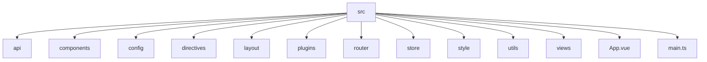
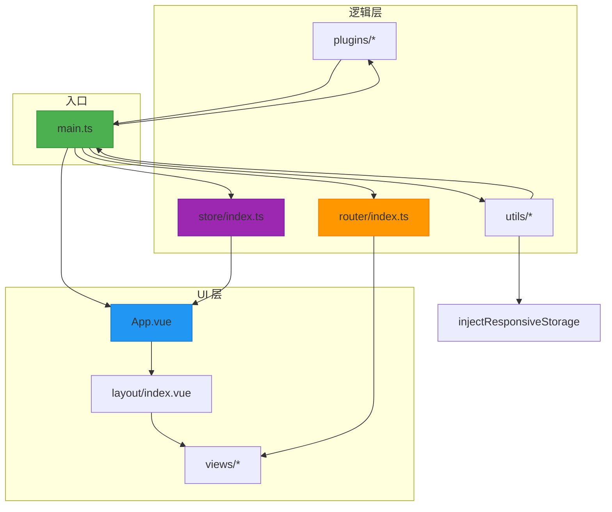
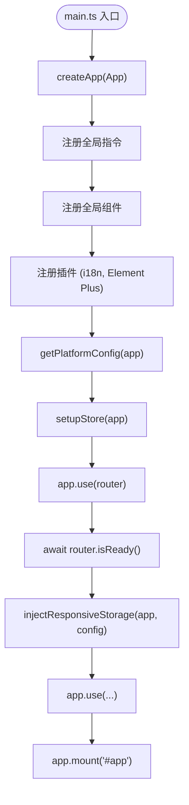
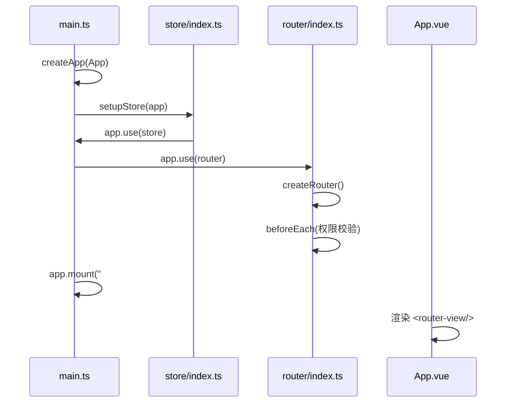
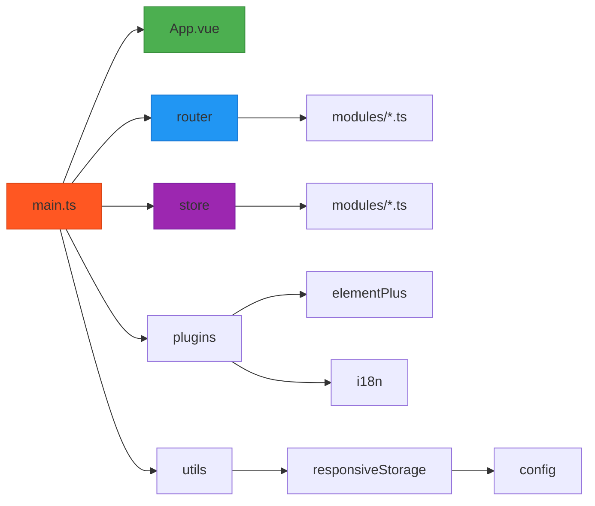

# 技术架构

<cite>
**本文档中引用的文件**  
- [main.ts](file://web/src/main.ts)
- [App.vue](file://web/src/App.vue)
- [router/index.ts](file://web/src/router/index.ts)
- [store/index.ts](file://web/src/store/index.ts)
- [layout/index.vue](file://web/src/layout/index.vue)
- [plugins/elementPlus.ts](file://web/src/plugins/elementPlus.ts)
- [utils/responsive.ts](file://web/src/utils/responsive.ts)
</cite>

## 目录
1. [简介](#简介)
2. [项目结构](#项目结构)
3. [核心组件](#核心组件)
4. [架构概览](#架构概览)
5. [详细组件分析](#详细组件分析)
6. [依赖分析](#依赖分析)
7. [性能考虑](#性能考虑)
8. [故障排除指南](#故障排除指南)
9. [结论](#结论)

## 简介
`vue-pure-admin-all` 是一个基于 Vue 3 和 TypeScript 的现代化前端管理框架，采用模块化设计和 MVVM 模式，支持响应式布局、多语言、权限控制和动态路由。本技术架构文档旨在为开发者提供系统的架构视角，帮助理解代码组织方式、数据流动机制以及核心组件之间的交互关系。

## 项目结构
项目采用分层清晰的目录结构，主要分为 `src` 下的多个功能模块，每个模块职责明确，便于维护和扩展。

**Diagram sources**  
- [main.ts](file://web/src/main.ts#L1-L72)
- [App.vue](file://web/src/App.vue#L1-L59)

**Section sources**  
- [main.ts](file://web/src/main.ts#L1-L72)
- [App.vue](file://web/src/App.vue#L1-L59)

## 核心组件

### 应用入口：main.ts
`main.ts` 是应用的入口文件，负责初始化 Vue 实例，注册全局插件、指令和组件，并注入路由与状态管理。

- 创建 Vue 应用实例 `createApp(App)`
- 注册全局指令（如权限、复制、涟漪等）
- 全局注册常用组件（如图标、对话框、抽屉等）
- 引入并配置第三方插件（Element Plus、ECharts、VxeTable 等）
- 调用 `setupStore(app)` 注入 Pinia 状态管理
- 使用 `router` 并在路由准备就绪后挂载应用

**Section sources**  
- [main.ts](file://web/src/main.ts#L1-L72)

### 根组件：App.vue
`App.vue` 是应用的根组件，使用 `<router-view />` 渲染当前路由对应的视图，并全局挂载 `ReDialog` 和 `ReDrawer` 组件，确保它们在任意页面都可调用。

- 使用 `ElConfigProvider` 统一 Element Plus 的语言配置
- 计算属性 `currentLocale` 动态切换中英文
- 在 `beforeCreate` 阶段进行版本检测（生产环境）

**Section sources**  
- [App.vue](file://web/src/App.vue#L1-L59)

### 路由系统：router/index.ts
路由系统采用 Vue Router 4，支持动态路由加载、权限控制、NProgress 进度条和多标签页管理。

- 自动导入 `modules` 目录下的所有路由模块
- 使用 `formatTwoStageRoutes` 将多级路由扁平化为二级
- 路由守卫中实现权限校验、登录白名单、页面标题设置
- 支持外部链接跳转、标签页缓存、滚动位置记忆

**Section sources**  
- [router/index.ts](file://web/src/router/index.ts#L1-L229)

### 状态管理：store/index.ts
使用 Pinia 作为状态管理工具，`setupStore(app)` 方法将 store 注入 Vue 应用实例。

- `createPinia()` 创建 store 实例
- `app.use(store)` 完成注入
- 各模块（如 app、user、permission）按功能拆分，实现模块化管理

**Section sources**  
- [store/index.ts](file://web/src/store/index.ts#L1-L10)

## 架构概览

**Diagram sources**  
- [main.ts](file://web/src/main.ts#L1-L72)
- [App.vue](file://web/src/App.vue#L1-L59)
- [router/index.ts](file://web/src/router/index.ts#L1-L229)
- [store/index.ts](file://web/src/store/index.ts#L1-L10)

## 详细组件分析

### main.ts 初始化流程分析

**Diagram sources**  
- [main.ts](file://web/src/main.ts#L1-L72)

### 路由与状态注入机制

**Diagram sources**  
- [main.ts](file://web/src/main.ts#L1-L72)
- [store/index.ts](file://web/src/store/index.ts#L1-L10)
- [router/index.ts](file://web/src/router/index.ts#L1-L229)
- [App.vue](file://web/src/App.vue#L1-L59)

## 依赖分析

**Diagram sources**  
- [main.ts](file://web/src/main.ts#L1-L72)
- [router/index.ts](file://web/src/router/index.ts#L1-L229)
- [store/index.ts](file://web/src/store/index.ts#L1-L10)
- [utils/responsive.ts](file://web/src/utils/responsive.ts#L1-L47)

**Section sources**  
- [main.ts](file://web/src/main.ts#L1-L72)
- [router/index.ts](file://web/src/router/index.ts#L1-L229)
- [store/index.ts](file://web/src/store/index.ts#L1-L10)
- [utils/responsive.ts](file://web/src/utils/responsive.ts#L1-L47)

## 性能考虑
- 使用 `import.meta.glob` 动态导入路由模块，实现代码分割
- 第三方样式（如 Tailwind CSS）单独引入，避免 HMR 时重复加载
- 路由懒加载 `() => import(...)` 提升首屏性能
- 响应式存储 `responsive-storage` 持久化用户配置，减少重复计算

## 故障排除指南
- **路由未生效**：检查 `router/modules` 下的文件是否被正确导入，路径是否匹配
- **状态未更新**：确认 `setupStore(app)` 是否在 `main.ts` 中被调用
- **组件未注册**：检查 `main.ts` 中的 `app.component()` 或 `components` 目录命名是否规范
- **国际化失效**：确认 `i18n.ts` 插件是否正确注入，语言包路径是否正确

**Section sources**  
- [main.ts](file://web/src/main.ts#L1-L72)
- [store/index.ts](file://web/src/store/index.ts#L1-L10)
- [plugins/i18n.ts](file://web/src/plugins/i18n.ts)
- [utils/responsive.ts](file://web/src/utils/responsive.ts#L1-L47)

## 结论
`vue-pure-admin-all` 采用模块化、组件化的设计理念，结合 Vue 3 的 Composition API 和 Pinia 状态管理，构建了一个高内聚、低耦合的前端架构。通过 `main.ts`