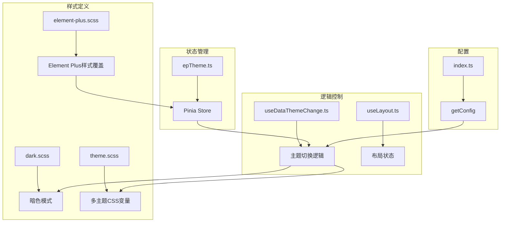
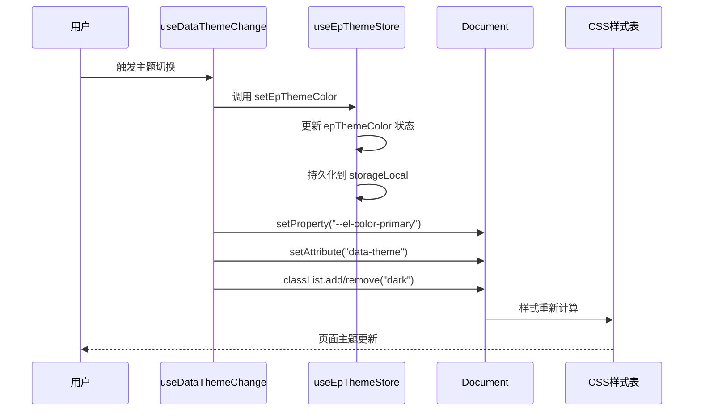
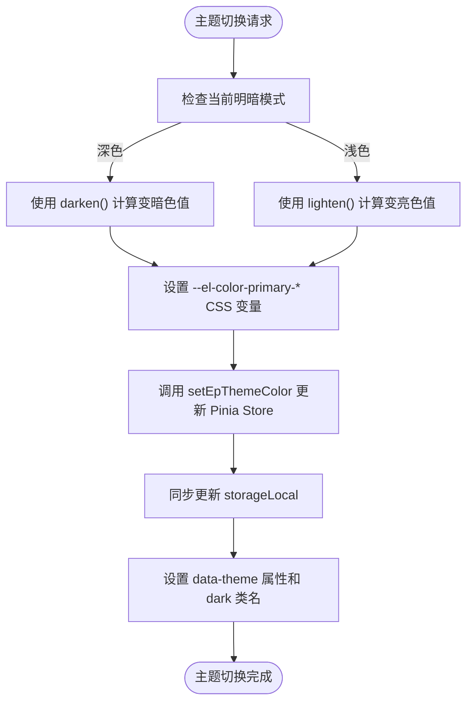

# 主题模块

<cite>
**本文档引用的文件**  
- [epTheme.ts](file://web/src/store/modules/epTheme.ts)
- [useDataThemeChange.ts](file://web/src/layout/hooks/useDataThemeChange.ts)
- [useLayout.ts](file://web/src/layout/hooks/useLayout.ts)
- [elementPlus.ts](file://web/src/plugins/elementPlus.ts)
- [index.ts](file://web/src/config/index.ts)
- [dark.scss](file://web/src/style/dark.scss)
- [theme.scss](file://web/src/style/theme.scss)
- [element-plus.scss](file://web/src/style/element-plus.scss)
</cite>

## 目录
1. [简介](#简介)
2. [项目结构](#项目结构)
3. [核心组件](#核心组件)
4. [架构概述](#架构概述)
5. [详细组件分析](#详细组件分析)
6. [依赖分析](#依赖分析)
7. [性能考虑](#性能考虑)
8. [故障排除指南](#故障排除指南)
9. [结论](#结论)

## 简介
本文档详细描述了 `vue-pure-admin-all` 项目中主题状态管理模块的实现机制，重点分析 `epTheme.ts` 文件中 Element Plus 主题的管理逻辑。涵盖明暗模式切换、主题颜色配置、动态主题加载的实现原理，以及 CSS 变量与状态管理的集成方式。通过实际代码路径说明主题变化的实时更新机制，阐述该模块与全局样式、组件主题的协同工作方式，并提供主题性能优化、兼容性处理和自定义主题开发的最佳实践。

## 项目结构
主题管理功能主要分布在 `src` 目录下的 `store/modules`、`layout/hooks`、`style` 和 `config` 子目录中。核心状态管理位于 `epTheme.ts`，主题切换逻辑封装在 `useDataThemeChange.ts`，而样式定义则分散在多个 SCSS 文件中。



**Diagram sources**
- [epTheme.ts](file://web/src/store/modules/epTheme.ts)
- [useDataThemeChange.ts](file://web/src/layout/hooks/useDataThemeChange.ts)
- [useLayout.ts](file://web/src/layout/hooks/useLayout.ts)
- [dark.scss](file://web/src/style/dark.scss)
- [theme.scss](file://web/src/style/theme.scss)
- [element-plus.scss](file://web/src/style/element-plus.scss)
- [index.ts](file://web/src/config/index.ts)

**Section sources**
- [epTheme.ts](file://web/src/store/modules/epTheme.ts)
- [useDataThemeChange.ts](file://web/src/layout/hooks/useDataThemeChange.ts)
- [useLayout.ts](file://web/src/layout/hooks/useLayout.ts)
- [dark.scss](file://web/src/style/dark.scss)
- [theme.scss](file://web/src/style/theme.scss)
- [element-plus.scss](file://web/src/style/element-plus.scss)
- [index.ts](file://web/src/config/index.ts)

## 核心组件
主题管理模块的核心是 `useEpThemeStore`，它基于 Pinia 实现，负责管理 Element Plus 的主题颜色和整体主题状态。该状态与本地存储 `storageLocal` 持久化，确保用户偏好在页面刷新后得以保留。`useDataThemeChange` 钩子函数是主题切换的入口，它协调状态更新、CSS 变量设置和 DOM 类名操作。

**Section sources**
- [epTheme.ts](file://web/src/store/modules/epTheme.ts#L1-L50)
- [useDataThemeChange.ts](file://web/src/layout/hooks/useDataThemeChange.ts#L1-L139)

## 架构概述
主题管理采用分层架构：Pinia Store 负责状态管理，Composition API 钩子封装业务逻辑，SCSS 文件定义样式规则。`useDataThemeChange` 作为核心协调者，接收用户操作，更新 Pinia Store 中的状态，然后通过直接操作 `document.documentElement` 的 `style.setProperty` 和 `setAttribute` 方法，将状态变化同步到 CSS 层。`data-theme` 属性和 `dark` 类名的变更触发了基于 CSS 选择器的样式切换。



**Diagram sources**
- [epTheme.ts](file://web/src/store/modules/epTheme.ts)
- [useDataThemeChange.ts](file://web/src/layout/hooks/useDataThemeChange.ts)

## 详细组件分析

### epTheme Store 分析
`useEpThemeStore` 是一个 Pinia Store，其状态 `epThemeColor` 和 `epTheme` 初始化时会优先从 `storageLocal` 中读取，若不存在则使用 `getConfig()` 提供的默认值。`setEpThemeColor` 动作是唯一的状态修改入口，它不仅更新自身状态，还会同步更新本地存储中的配置对象，确保数据一致性。

```mermaid
classDiagram
class useEpThemeStore {
+epThemeColor : string
+epTheme : string
+getEpThemeColor() : string
+fill() : string
+setEpThemeColor(newColor : string) : void
}
note right of useEpThemeStore
基于 Pinia 的状态管理
状态初始化：storageLocal -> getConfig()
状态持久化：storageLocal
end
useDataThemeChange --> useEpThemeStore : 调用 setEpThemeColor
useEpThemeStore --> storageLocal : 读取/写入
```

**Diagram sources**
- [epTheme.ts](file://web/src/store/modules/epTheme.ts#L1-L50)

**Section sources**
- [epTheme.ts](file://web/src/store/modules/epTheme.ts#L1-L50)

### 主题切换逻辑分析
`useDataThemeChange` 钩子提供了 `dataThemeChange` 和 `setLayoutThemeColor` 等函数，用于处理明暗模式和主题色的切换。其核心在于 `setPropertyPrimary` 函数，它利用 `@pureadmin/utils` 提供的 `darken` 和 `lighten` 工具函数，根据当前明暗模式动态计算并设置 Element Plus 的 `--el-color-primary-dark-*` 和 `--el-color-primary-light-*` 系列 CSS 变量，从而实现完整的主题色系。



**Diagram sources**
- [useDataThemeChange.ts](file://web/src/layout/hooks/useDataThemeChange.ts#L12-L137)

**Section sources**
- [useDataThemeChange.ts](file://web/src/layout/hooks/useDataThemeChange.ts#L1-L139)

### 样式定义分析
项目通过多个 SCSS 文件实现主题样式。`theme.scss` 定义了不同 `data-theme` 值对应的自定义 CSS 变量，用于项目自身的组件。`dark.scss` 利用了 Element Plus 内置的暗色模式 CSS 变量，并通过 `html.dark` 选择器进行覆盖，同时定义了项目内其他组件（如 vxe-table）在暗色模式下的样式。`element-plus.scss` 则负责全局覆盖 Element Plus 组件的默认样式，例如调整弹窗关闭按钮的视觉效果。

**Section sources**
- [theme.scss](file://web/src/style/theme.scss)
- [dark.scss](file://web/src/style/dark.scss)
- [element-plus.scss](file://web/src/style/element-plus.scss)

## 依赖分析
主题管理模块依赖于多个外部和内部组件。它依赖 `pinia` 进行状态管理，依赖 `@pureadmin/utils` 提供的 `storageLocal`、`darken`、`lighten` 等工具函数。`useDataThemeChange` 依赖 `useLayout` 钩子来获取布局配置，并依赖 `getConfig` 函数获取平台默认配置。此外，`elementPlus.ts` 插件的全局注册是主题色生效的前提。

```mermaid
graph TD
A[epTheme.ts] --> B[pinia]
A --> C[storageLocal]
A --> D[getConfig]
E[useDataThemeChange.ts] --> A
E --> F[useLayout]
E --> G[useGlobal]
E --> H[useAppStoreHook]
E --> I[useMultiTagsStoreHook]
E --> J[@pureadmin/utils]
K[elementPlus.ts] --> L[element-plus]
L --> M[CSS Variables]
A --> M
E --> M
N[theme.scss] --> M
O[dark.scss] --> M
```

**Diagram sources**
- [epTheme.ts](file://web/src/store/modules/epTheme.ts)
- [useDataThemeChange.ts](file://web/src/layout/hooks/useDataThemeChange.ts)
- [useLayout.ts](file://web/src/layout/hooks/useLayout.ts)
- [index.ts](file://web/src/config/index.ts)
- [elementPlus.ts](file://web/src/plugins/elementPlus.ts)
- [theme.scss](file://web/src/style/theme.scss)
- [dark.scss](file://web/src/style/dark.scss)

**Section sources**
- [epTheme.ts](file://web/src/store/modules/epTheme.ts)
- [useDataThemeChange.ts](file://web/src/layout/hooks/useDataThemeChange.ts)
- [useLayout.ts](file://web/src/layout/hooks/useLayout.ts)
- [index.ts](file://web/src/config/index.ts)
- [elementPlus.ts](file://web/src/plugins/elementPlus