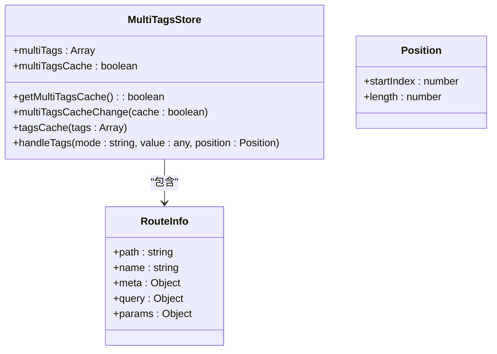
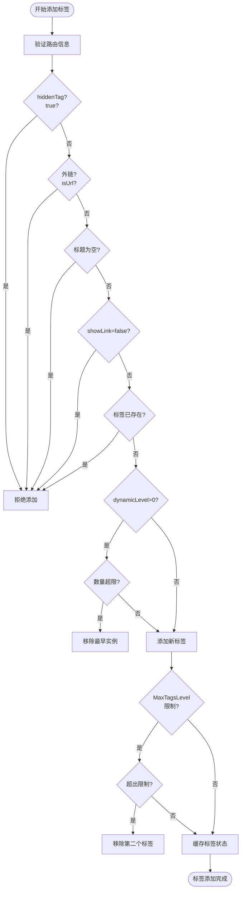
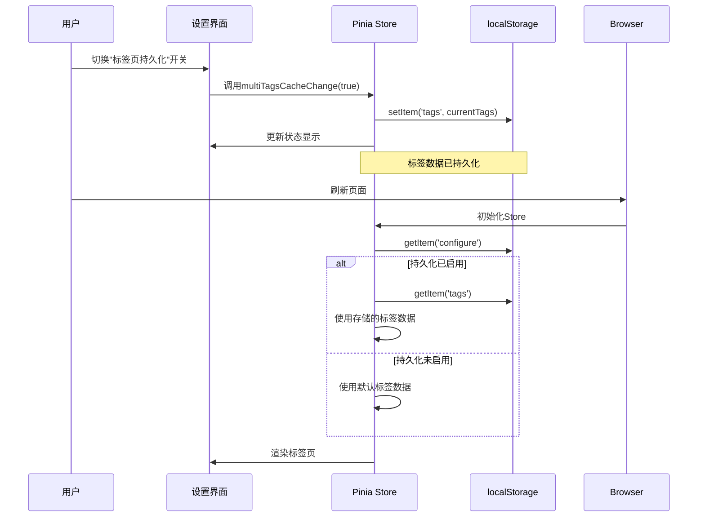

# 多标签模块

<cite>
**本文档引用文件**  
- [multiTags.ts](file://web/src/store/modules/multiTags.ts)
- [useTag.ts](file://web/src/layout/hooks/useTag.ts)
- [lay-tag/index.vue](file://web/src/layout/components/lay-tag/index.vue)
</cite>

## 目录
1. [简介](#简介)
2. [核心状态管理](#核心状态管理)
3. [标签操作机制](#标签操作机制)
4. [持久化与跨会话恢复](#持久化与跨会话恢复)
5. [API使用与异常处理](#api使用与异常处理)
6. [与路由系统集成](#与路由系统集成)
7. [性能优化与内存管理](#性能优化与内存管理)

## 简介
多标签页功能是vue-pure-admin-all管理系统中的核心用户体验组件，允许用户同时打开多个页面并快速切换。该模块通过Pinia状态管理实现标签页的全生命周期管理，支持标签的添加、删除、切换和缓存等操作，并提供持久化存储能力，确保用户刷新或重新登录后仍能恢复之前的标签页状态。

**Section sources**
- [multiTags.ts](file://web/src/store/modules/multiTags.ts#L1-L145)

## 核心状态管理
多标签状态由Pinia Store统一管理，主要包含两个核心状态字段：`multiTags`和`multiTagsCache`。

- `multiTags`：存储当前所有打开的标签页信息，包括路由路径、元数据、查询参数等
- `multiTagsCache`：控制是否启用标签页持久化功能的布尔值

状态初始化时会检查本地存储中是否已存在持久化的标签数据，若存在则优先使用，否则初始化为固定标签（如首页）和具有`fixedTag`元数据的路由。



**Diagram sources**
- [multiTags.ts](file://web/src/store/modules/multiTags.ts#L16-L140)

**Section sources**
- [multiTags.ts](file://web/src/store/modules/multiTags.ts#L16-L140)

## 标签操作机制
标签页管理通过`handleTags`方法实现多种操作模式，支持灵活的标签控制。

### 添加标签
当用户导航到新路由时，系统会调用`handleTags("push", routeInfo)`添加标签。添加前会进行多重校验：
- 检查路由元数据`hiddenTag`是否为true
- 判断是否为外链（通过isUrl检测）
- 验证标题是否为空
- 检查`showLink`元数据是否允许显示

若标签已存在（路径、查询参数、参数均相等），则不会重复添加。

### 动态路由限制
对于动态路由，可通过`dynamicLevel`元数据限制同一路径可打开的最大实例数。当超过限制时，系统会自动移除最早打开的实例。

### 删除标签
支持多种删除模式：
- `splice`：按路径或位置删除单个或多个标签
- `equal`：直接替换整个标签数组
- 右键菜单提供关闭当前、左侧、右侧、其他、全部等快捷操作



**Diagram sources**
- [multiTags.ts](file://web/src/store/modules/multiTags.ts#L85-L140)
- [lay-tag/index.vue](file://web/src/layout/components/lay-tag/index.vue#L200-L300)

**Section sources**
- [multiTags.ts](file://web/src/store/modules/multiTags.ts#L85-L140)
- [useTag.ts](file://web/src/layout/hooks/useTag.ts#L31-L247)

## 持久化与跨会话恢复
标签状态持久化是提升用户体验的关键特性，允许用户在刷新页面或重新登录后恢复之前的标签页布局。

### 持久化策略
通过`multiTagsCache`开关控制是否启用持久化：
- 当`multiTagsCache`为true时，标签数据会存储在localStorage中
- 存储键名为`responsiveStorageNameSpace() + 'tags'`
- 每次标签变更都会自动同步到存储

### 跨会话恢复
系统在初始化时会自动检查本地存储：
```typescript
multiTags: storageLocal().getItem(`${responsiveStorageNameSpace()}configure`)?.multiTagsCache
  ? storageLocal().getItem(`${responsiveStorageNameSpace()}tags`)
  : ([...routerArrays, ...fixedRoutes] as any)
```

用户可以在设置面板中开启或关闭此功能，变更会立即生效并同步到其他组件。



**Diagram sources**
- [multiTags.ts](file://web/src/store/modules/multiTags.ts#L16-L48)
- [lay-tag/index.vue](file://web/src/layout/components/lay-setting/index.vue#L118-L122)

**Section sources**
- [multiTags.ts](file://web/src/store/modules/multiTags.ts#L16-L48)
- [lay-tag/index.vue](file://web/src/layout/components/lay-setting/index.vue#L118-L122)

## API使用与异常处理
多标签模块提供了清晰的API接口供其他组件调用。

### 主要API方法
- `useMultiTagsStoreHook().handleTags(mode, value, position)`：核心操作方法
- `useMultiTagsStoreHook().multiTagsCacheChange(boolean)`：切换持久化状态
- `useMultiTagsStoreHook().tagsCache(tags)`：手动触发缓存

### 异常处理
系统在多个层面实现了异常防护：
1. **输入验证**：对传入的路由信息进行完整性检查
2. **边界条件**：处理空数组、单标签等特殊情况
3. **类型安全**：使用TypeScript定义严格的类型接口
4. **存储异常**：对localStorage操作进行try-catch包装

### 使用示例
```typescript
// 添加标签
useMultiTagsStoreHook().handleTags("push", route);

// 关闭当前标签
useMultiTagsStoreHook().handleTags("splice", route.path);

// 批量关闭标签
useMultiTagsStoreHook().handleTags("splice", "", {
  startIndex: 2,
  length: 3
});

// 启用持久化
useMultiTagsStoreHook().multiTagsCacheChange(true);
```

**Section sources**
- [multiTags.ts](file://web/src/store/modules/multiTags.ts#L49-L140)
- [useTag.ts](file://web/src/layout/hooks/useTag.ts#L31-L247)

## 与路由系统集成
多标签模块与Vue Router深度集成，实现了无缝的导航体验。

### 集成方式
通过组合式API`useTags`在布局组件中集成：
1. 监听路由变化，自动更新标签
2. 提供标签点击事件，实现路由跳转
3