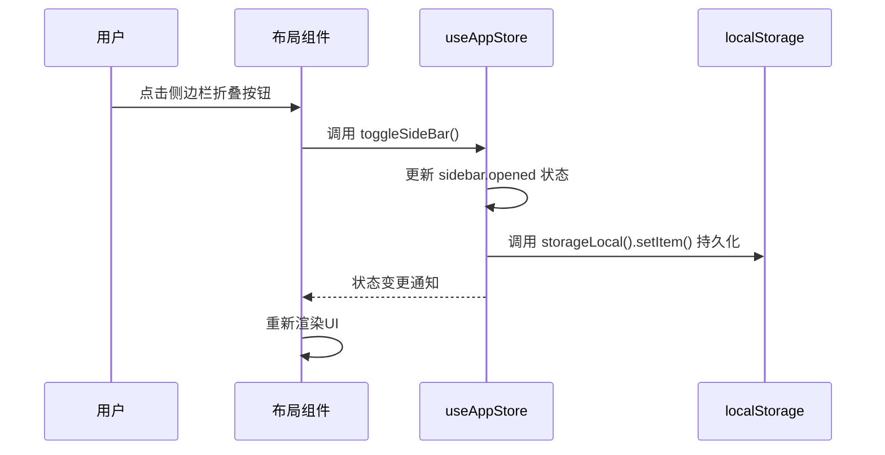
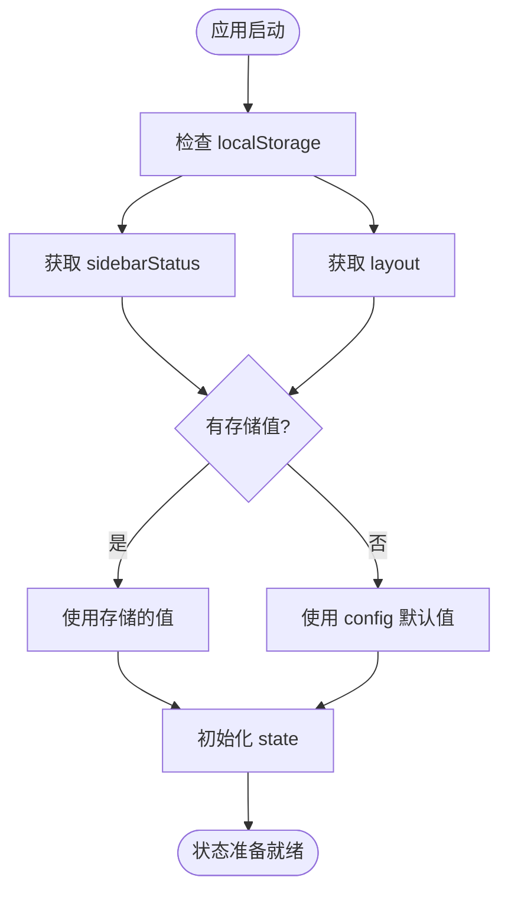

# 应用模块

<cite>
**本文档引用的文件**  
- [app.ts](file://web/src/store/modules/app.ts)
- [NavVertical.vue](file://web/src/layout/components/lay-sidebar/NavVertical.vue)
- [index.vue](file://web/src/layout/components/lay-navbar/index.vue)
- [useLayout.ts](file://web/src/layout/hooks/useLayout.ts)
- [responsive.ts](file://web/src/utils/responsive.ts)
</cite>

## 目录
1. [简介](#简介)
2. [项目结构](#项目结构)
3. [核心组件](#核心组件)
4. [架构概述](#架构概述)
5. [详细组件分析](#详细组件分析)
6. [依赖分析](#依赖分析)
7. [性能考虑](#性能考虑)
8. [故障排除指南](#故障排除指南)
9. [结论](#结论)

## 简介
本文档深入解析 `vue-pure-admin-all` 项目中应用状态管理模块的设计与实现，重点分析 `app.ts` 文件中定义的应用级状态，包括设备类型、侧边栏展开状态、菜单折叠状态等UI相关属性。文档详细说明这些状态如何影响整体布局和用户体验，展示组件如何响应状态变化，并阐述该模块在响应式设计中的核心作用。同时提供状态同步、性能优化和移动端适配的最佳实践。

**Section sources**
- [app.ts](file://web/src/store/modules/app.ts#L1-L90)

## 项目结构
`vue-pure-admin-all` 的状态管理模块位于 `src/store/modules/` 目录下，其中 `app.ts` 是管理应用级UI状态的核心文件。该模块与布局组件（如侧边栏、导航栏）紧密协作，通过 Pinia 状态管理库实现状态的集中式管理。`layout` 相关的 hooks 和 utils 提供了与状态交互的便捷接口。

```mermaid
graph TB
subgraph "状态管理"
A[app.ts] --> B[useAppStore]
A --> C[useAppStoreHook]
end
subgraph "布局组件"
D[NavVertical.vue]
E[index.vue]
end
subgraph "工具与配置"
F[useLayout.ts]
G[responsive.ts]
end
A --> D : 控制侧边栏状态
A --> E : 控制导航栏行为
F --> A : 初始化存储
G --> A : 提供响应式存储
```

**Diagram sources**
- [app.ts](file://web/src/store/modules/app.ts#L1-L90)
- [NavVertical.vue](file://web/src/layout/components/lay-sidebar/NavVertical.vue#L1-L138)
- [index.vue](file://web/src/layout/components/lay-navbar/index.vue#L1-L200)
- [useLayout.ts](file://web/src/layout/hooks/useLayout.ts#L1-L65)
- [responsive.ts](file://web/src/utils/responsive.ts#L1-L47)

**Section sources**
- [app.ts](file://web/src/store/modules/app.ts#L1-L90)
- [useLayout.ts](file://web/src/layout/hooks/useLayout.ts#L1-L65)
- [responsive.ts](file://web/src/utils/responsive.ts#L1-L47)

## 核心组件
`app.ts` 模块使用 Pinia 定义了一个名为 `pure-app` 的 store，其 `state` 包含了 `sidebar`（侧边栏状态）、`layout`（布局模式）、`device`（设备类型）、`viewportSize`（视口尺寸）等关键应用状态。这些状态通过 `actions` 方法（如 `TOGGLE_SIDEBAR`, `toggleDevice`）进行修改，并通过 `getters` 提供计算属性以供组件使用。

**Section sources**
- [app.ts](file://web/src/store/modules/app.ts#L1-L90)

## 架构概述
应用状态管理模块采用集中式架构，`app.ts` 作为单一数据源（SSOT）管理所有与UI布局相关的状态。组件通过 `useAppStoreHook` 获取 store 实例，并响应式地订阅状态变化。当用户交互或窗口尺寸变化时，`actions` 会更新 `state`，并持久化到 `localStorage`，确保页面刷新后状态得以恢复。



**Diagram sources**
- [app.ts](file://web/src/store/modules/app.ts#L1-L90)
- [NavVertical.vue](file://web/src/layout/components/lay-sidebar/NavVertical.vue#L1-L138)

## 详细组件分析

### 应用状态模块分析
`app.ts` 模块是整个应用布局行为的控制中心。

#### 状态初始化与持久化
状态的初始化逻辑不仅依赖于默认配置，还优先从 `localStorage` 中读取用户上次的设置（如 `sidebarStatus`, `layout`），实现了用户偏好记忆。`responsiveStorageNameSpace()` 确保了存储键名的唯一性。



**Diagram sources**
- [app.ts](file://web/src/store/modules/app.ts#L1-L90)
- [responsive.ts](file://web/src/utils/responsive.ts#L1-L47)

#### 侧边栏状态管理
`TOGGLE_SIDEBAR` action 是控制侧边栏展开/折叠的核心。它区分了用户点击触发和窗口拖拽触发两种场景，通过 `withoutAnimation` 标志来控制动画效果，提升在频繁调整窗口大小时的性能体验。

**Section sources**
- [app.ts](file://web/src/store/modules/app.ts#L1-L90)

### 布局组件分析
布局组件直接消费 `app.ts` 中的状态，实现动态UI。

#### 侧边栏组件 (NavVertical.vue)
`NavVertical.vue` 组件通过 `useNav` hook 获取 `pureApp` 实例，从而访问 `sidebar.opened` 和 `device` 状态。它根据这些状态决定是否显示Logo、侧边栏的折叠状态，并在移动端显示顶部的汉堡菜单。

**Section sources**
- [NavVertical.vue](file://web/src/layout/components/lay-sidebar/NavVertical.vue#L1-L138)

#### 导航栏组件 (index.vue)
`lay-navbar/index.vue` 同样依赖 `pureApp` 状态。例如，`LaySidebarTopCollapse` 组件的显示和激活状态完全由 `pureApp.sidebar.opened` 控制，实现了导航栏与侧边栏状态的联动。

**Section sources**
- [index.vue](file://web/src/layout/components/lay-navbar/index.vue#L1-L200)

## 依赖分析
`app.ts` 模块依赖于多个外部工具和配置，形成了一个清晰的依赖链。

```mermaid
graph LR
A[app.ts] --> B[Pinia]
A --> C[utils]
C --> D[storageLocal]
C --> E[deviceDetection]
C --> F[responsiveStorageNameSpace]
A --> G[getConfig]
H[useLayout.ts] --> I[$storage]
H --> J[useMultiTagsStore]
I --> K[localStorage]
H --> A : 初始化 layout 配置
```

**Diagram sources**
- [app.ts](file://web/src/store/modules/app.ts#L1-L90)
- [useLayout.ts](file://web/src/layout/hooks/useLayout.ts#L1-L65)
- [responsive.ts](file://web/src/utils/responsive.ts#L1-L47)

**Section sources**
- [app.ts](file://web/src/store/modules/app.ts#L1-L90)
- [useLayout.ts](file://web/src/layout/hooks/useLayout.ts#L1-L65)

## 性能考虑
该模块在性能方面有以下考量：
1.  **动画优化**：在窗口调整大小时，通过 `withoutAnimation` 临时关闭动画，避免卡顿。
2.  **持久化效率**：使用 `localStorage` 进行简单的键值对存储，读写效率高。
3.  **响应式更新**：利用 Vue 和 Pinia 的响应式系统，仅在状态变化时更新相关组件，避免不必要的重渲染。

## 故障排除指南
*   **状态未持久化**：检查 `responsiveStorageNameSpace()` 返回的命名空间是否正确，以及 `storageLocal().setItem()` 是否被正确调用。
*   **组件未响应状态变化**：确保组件正确使用了 `useAppStoreHook()` 并订阅了正确的 `getter` 或 `state` 属性。
*   **移动端显示异常**：检查 `deviceDetection()` 函数的逻辑，确保能准确识别移动设备。

**Section sources**
- [app.ts](file://web/src/store/modules/app.ts#L1-L90)
- [responsive.ts](file://web/src/utils/responsive.ts#L1-L47)

## 结论
`vue-pure-admin-all` 的应用状态管理模块设计精良，通过 `app.ts` 集中管理了所有关键的UI布局状态。它与 `localStorage` 深度集成，实现了用户偏好记忆，并通过清晰的 `actions` 和 `getters` API 与布局组件进行高效通信。该模块是实现应用响应式设计和良好用户体验的基石。