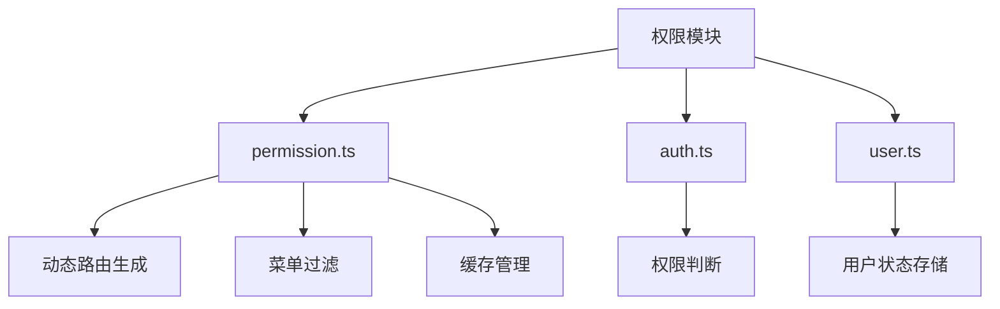
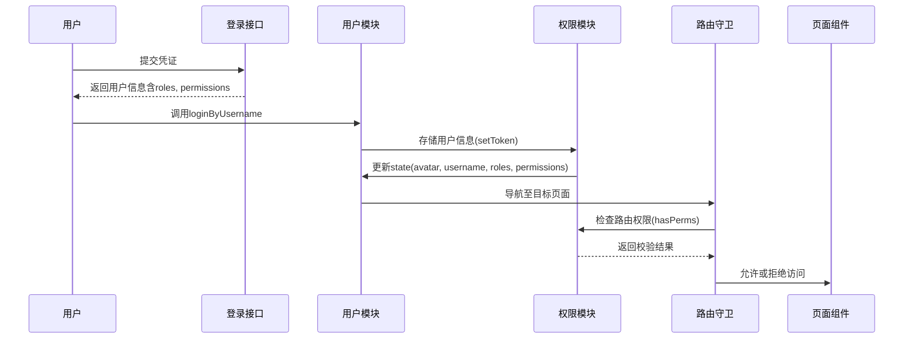
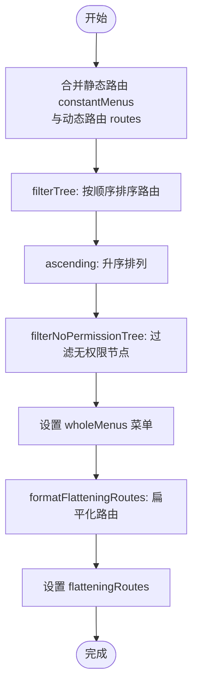
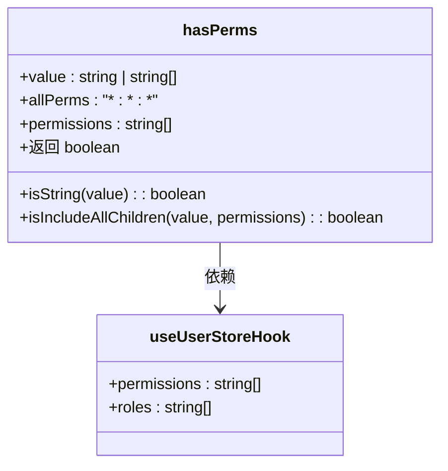
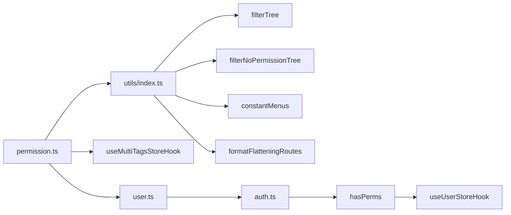

# 权限模块

<cite>
**本文档引用文件**  
- [permission.ts](file://web/src/store/modules/permission.ts)
- [auth.ts](file://web/src/utils/auth.ts)
- [user.ts](file://web/src/store/modules/user.ts)
- [user.ts](file://web/src/api/user.ts)
</cite>

## 目录
1. [介绍](#介绍)
2. [项目结构](#项目结构)
3. [核心组件](#核心组件)
4. [架构概述](#架构概述)
5. [详细组件分析](#详细组件分析)
6. [依赖分析](#依赖分析)
7. [性能考虑](#性能考虑)
8. [故障排除指南](#故障排除指南)
9. [结论](#结论)

## 介绍
本模块为 `vue-pure-admin-all` 项目中的权限状态管理核心，负责实现动态路由生成、菜单过滤、页面级与按钮级权限控制。通过集成 Pinia 状态管理、Vue Router 路由守卫与用户角色数据，实现基于用户权限的可访问路由表动态构建。该模块与用户模块紧密协作，确保系统安全性和用户体验的一致性。

## 项目结构
权限模块主要分布在 `src/store/modules/permission.ts` 和相关工具函数中，配合用户模块完成权限校验与状态维护。

**Diagram sources**
- [permission.ts](file://web/src/store/modules/permission.ts#L1-L75)
- [auth.ts](file://web/src/utils/auth.ts#L1-L142)
- [user.ts](file://web/src/store/modules/user.ts#L1-L122)

**Section sources**
- [permission.ts](file://web/src/store/modules/permission.ts#L1-L75)
- [auth.ts](file://web/src/utils/auth.ts#L1-L142)

## 核心组件
权限模块的核心逻辑集中在 `usePermissionStore` 中，通过 `handleWholeMenus` 方法实现动态路由与静态路由的合并与权限过滤。`cacheOperate` 方法管理页面缓存，支持 keep-alive 功能。用户权限信息由 `useUserStore` 提供，包括角色（roles）和按钮权限（permissions），用于细粒度访问控制。

**Section sources**
- [permission.ts](file://web/src/store/modules/permission.ts#L1-L75)
- [user.ts](file://web/src/store/modules/user.ts#L1-L122)

## 架构概述
系统采用基于角色的访问控制（RBAC）模型，结合前端动态路由机制实现权限管理。用户登录后，后端返回角色和权限列表，前端据此生成可访问的路由表并构建侧边栏菜单。路由守卫在导航时进行权限校验，确保用户只能访问授权页面。

**Diagram sources**
- [user.ts](file://web/src/api/user.ts#L1-L90)
- [user.ts](file://web/src/store/modules/user.ts#L1-L122)
- [auth.ts](file://web/src/utils/auth.ts#L1-L142)

## 详细组件分析

### 权限模块分析

#### 动态路由生成与菜单过滤

**Diagram sources**
- [permission.ts](file://web/src/store/modules/permission.ts#L20-L30)

#### 按钮级权限校验流程

**Diagram sources**
- [auth.ts](file://web/src/utils/auth.ts#L120-L140)

**Section sources**
- [auth.ts](file://web/src/utils/auth.ts#L120-L140)
- [permission.ts](file://web/src/store/modules/permission.ts#L20-L30)

## 依赖分析
权限模块依赖多个核心文件和工具函数，形成完整的权限管理体系。

**Diagram sources**
- [permission.ts](file://web/src/store/modules/permission.ts#L1-L75)
- [auth.ts](file://web/src/utils/auth.ts#L1-L142)

**Section sources**
- [permission.ts](file://web/src/store/modules/permission.ts#L1-L75)
- [auth.ts](file://web/src/utils/auth.ts#L1-L142)

## 性能考虑
- 使用 `debounce` 防抖函数优化缓存监听，避免频繁触发
- 路由扁平化处理提升查找效率
- 利用 Pinia 进行状态管理，避免重复计算
- 合理使用 `keep-alive` 缓存页面，减少组件重复渲染

## 故障排除指南
常见权限问题及调试方法：

**Section sources**
- [auth.ts](file://web/src/utils/auth.ts#L120-L140)
- [user.ts](file://web/src/store/modules/user.ts#L1-L122)

### 问题：页面无法访问，提示无权限
1. 检查用户登录返回的 `roles` 是否包含目标页面所需角色
2. 查看路由配置中 `meta.roles` 是否正确设置
3. 确认 `filterNoPermissionTree` 是否正确过滤了无权限路由

### 问题：按钮权限不生效
1. 检查 `permissions` 数组是否正确加载
2. 验证 `hasPerms` 方法传入的权限字符串是否与后端一致
3. 确保使用 `v-perms` 指令或 `<RePerms>` 组件正确包裹按钮

### 问题：菜单未正确显示
1. 检查 `handleWholeMenus` 是否被正确调用
2. 确认动态路由数据格式是否符合预期
3. 查看 `constantMenus` 静态路由配置是否完整

## 结论
`vue-pure-admin-all` 的权限模块通过 Pinia 状态管理实现了灵活的动态路由与细粒度权限控制。结合角色与按钮权限双重校验机制，既保证了系统安全性，又提供了良好的用户体验。建议在实际使用中遵循最小权限原则配置用户权限，并定期审查权限分配情况。