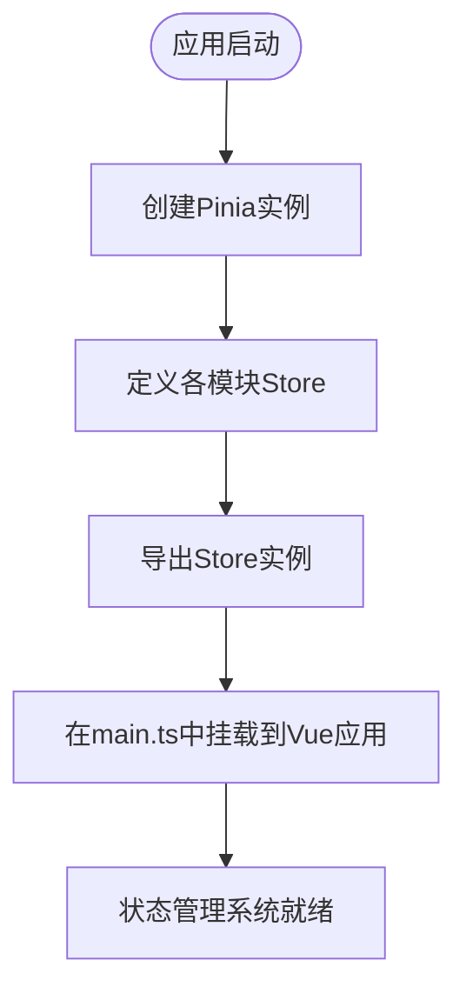
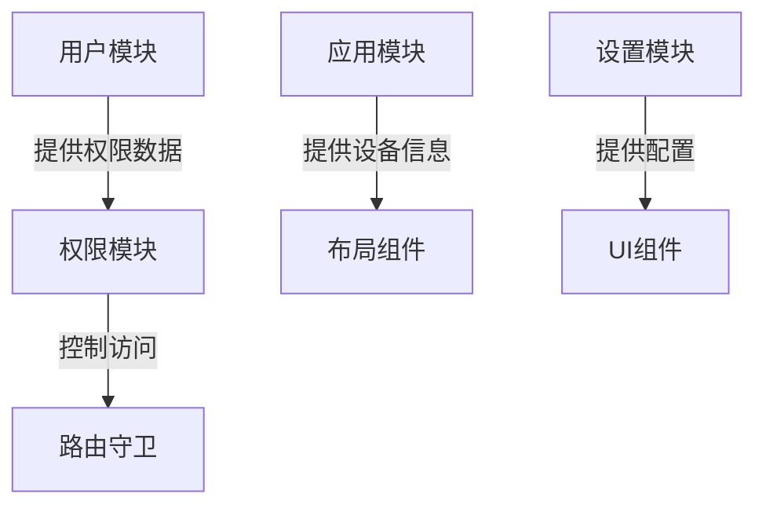
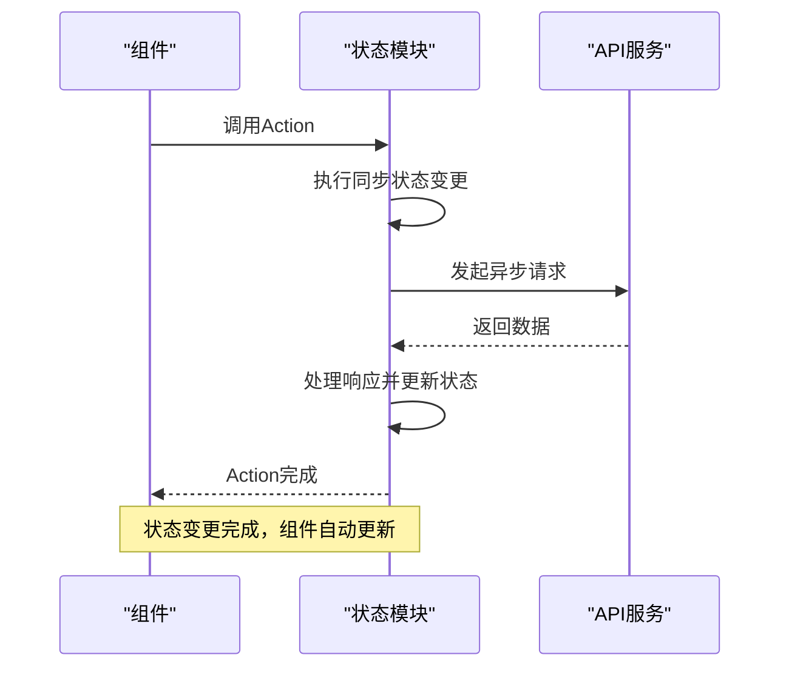
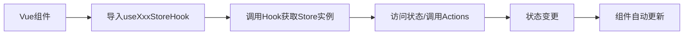

<cite>
**本文档中引用的文件**
- [user.ts](file://web/src/store/modules/user.ts)
- [app.ts](file://web/src/store/modules/app.ts)
- [permission.ts](file://web/src/store/modules/permission.ts)
- [settings.ts](file://web/src/store/modules/settings.ts)
- [index.ts](file://web/src/store/index.ts)
- [types.ts](file://web/src/store/types.ts)
- [utils.ts](file://web/src/store/utils.ts)
</cite>

## 目录
1. [状态管理](#状态管理)
2. [模块化设计](#模块化设计)
3. [Store初始化过程](#store初始化过程)
4. [模块间依赖关系](#模块间依赖关系)
5. [状态定义与实现](#状态定义与实现)
6. [Actions与Getters实现](#actions与getters实现)
7. [组件访问状态](#组件访问状态)
8. [最佳实践](#最佳实践)

## 状态管理

vue-pure-admin-all项目采用Pinia作为状态管理解决方案，实现了模块化的全局状态管理。通过将应用状态划分为多个独立模块，项目实现了清晰的状态组织和高效的跨组件状态共享。Pinia的轻量级设计和TypeScript支持为项目提供了类型安全的状态管理能力。

**Section sources**
- [index.ts](file://web/src/store/index.ts#L1-L10)

## 模块化设计

项目将全局状态划分为多个独立模块，每个模块负责特定领域的状态管理。主要模块包括用户模块、应用模块、权限模块和设置模块，这种设计遵循单一职责原则，提高了代码的可维护性和可测试性。

### 用户模块
用户模块（user.ts）管理用户相关的状态，包括用户基本信息、权限信息和登录状态。该模块存储用户的头像、用户名、昵称、角色列表和按钮级别权限等数据。

### 应用模块
应用模块（app.ts）管理应用级别的状态，包括侧边栏展开状态、设备类型、视口尺寸和布局模式等UI相关状态。

### 权限模块
权限模块（permission.ts）负责路由权限和菜单生成，管理静态路由和动态路由生成的菜单，以及页面缓存列表。

### 设置模块
设置模块（settings.ts）存储应用的全局配置，如页面标题、固定头部和侧边栏隐藏状态等可配置项。

**Section sources**
- [user.ts](file://web/src/store/modules/user.ts#L18-L116)
- [app.ts](file://web/src/store/modules/app.ts#L10-L85)
- [permission.ts](file://web/src/store/modules/permission.ts#L14-L69)
- [settings.ts](file://web/src/store/modules/settings.ts#L3-L30)

## Store初始化过程

Store的初始化过程在`index.ts`文件中定义，通过`createPinia()`函数创建Pinia实例，并在Vue应用启动时通过`setupStore`函数将Store挂载到应用实例上。这种设计确保了Store在整个应用生命周期中的可用性。



**Diagram sources**
- [index.ts](file://web/src/store/index.ts#L1-L10)

**Section sources**
- [index.ts](file://web/src/store/index.ts#L1-L10)

## 模块间依赖关系

各状态模块之间存在明确的依赖关系，这种设计确保了状态变更的一致性和数据流的清晰性。权限模块依赖于用户模块的权限数据，应用模块的状态变化可能影响其他模块的UI表现。



**Diagram sources**
- [user.ts](file://web/src/store/modules/user.ts#L18-L116)
- [permission.ts](file://web/src/store/modules/permission.ts#L14-L69)
- [app.ts](file://web/src/store/modules/app.ts#L10-L85)
- [settings.ts](file://web/src/store/modules/settings.ts#L3-L30)

## 状态定义与实现

状态定义遵循TypeScript接口规范，通过`types.ts`文件集中定义各模块的状态类型。每个模块使用`defineStore`函数创建具名Store，状态在`state`函数中初始化，支持从本地存储恢复持久化状态。

```mermaid
classDiagram
class UserState {
+avatar : string
+username : string
+nickname : string
+roles : Array<string>
+permissions : Array<string>
+currentPage : number
+isRemembered : boolean
+loginDay : number
}
class AppState {
+sidebar : {opened : boolean, withoutAnimation : boolean, isClickCollapse : boolean}
+layout : string
+device : string
+viewportSize : {width : number, height : number}
+sortSwap : boolean
}
class PermissionState {
+constantMenus : Array<any>
+wholeMenus : Array<any>
+flatteningRoutes : Array<any>
+cachePageList : Array<string>
}
class SettingsState {
+title : string
+fixedHeader : boolean
+hiddenSideBar : boolean
}
```

**Diagram sources**
- [types.ts](file://web/src/store/types.ts#L1-L50)
- [user.ts](file://web/src/store/modules/user.ts#L18-L116)
- [app.ts](file://web/src/store/modules/app.ts#L10-L85)
- [permission.ts](file://web/src/store/modules/permission.ts#L14-L69)
- [settings.ts](file://web/src/store/modules/settings.ts#L3-L30)

**Section sources**
- [types.ts](file://web/src/store/types.ts#L1-L50)
- [utils.ts](file://web/src/store/utils.ts#L1-L28)

## Actions与Getters实现

### Actions实现
Actions用于处理异步操作和复杂的状态变更逻辑。用户模块的`loginByUsername` Action处理登录逻辑，权限模块的`handleWholeMenus` Action负责菜单生成，应用模块的`TOGGLE_SIDEBAR` Action管理侧边栏状态切换。

### Getters实现
Getters提供计算属性和状态派生功能。应用模块定义了`getSidebarStatus`、`getDevice`等Getter，用于获取派生状态，避免在组件中重复计算逻辑。



**Diagram sources**
- [user.ts](file://web/src/store/modules/user.ts#L18-L116)
- [app.ts](file://web/src/store/modules/app.ts#L10-L85)
- [permission.ts](file://web/src/store/modules/permission.ts#L14-L69)

**Section sources**
- [user.ts](file://web/src/store/modules/user.ts#L18-L116)
- [app.ts](file://web/src/store/modules/app.ts#L10-L85)
- [permission.ts](file://web/src/store/modules/permission.ts#L14-L69)
- [settings.ts](file://web/src/store/modules/settings.ts#L3-L30)

## 组件访问状态

组件通过`useXxxStoreHook`函数访问对应模块的状态，这种设计模式提供了类型安全的状态访问。组件可以直接读取状态值，通过调用Actions修改状态，或使用Getters获取计算后的状态值。



**Diagram sources**
- [user.ts](file://web/src/store/modules/user.ts#L118-L122)
- [app.ts](file://web/src/store/modules/app.ts#L87-L91)
- [permission.ts](file://web/src/store/modules/permission.ts#L71-L75)
- [settings.ts](file://web/src/store/modules/settings.ts#L32-L36)

**Section sources**
- [user.ts](file://web/src/store/modules/user.ts#L118-L122)
- [app.ts](file://web/src/store/modules/app.ts#L87-L91)
- [permission.ts](file://web/src/store/modules/permission.ts#L71-L75)
- [settings.ts](file://web/src/store/modules/settings.ts#L32-L36)

## 最佳实践

### 状态持久化
用户模块通过`storageLocal`工具将用户信息持久化到本地存储，确保页面刷新后用户状态不丢失。

### 权限控制
权限模块结合用户角色和按钮权限，实现细粒度的访问控制，确保用户只能访问其权限范围内的功能。

### 响应式设计
应用模块实时监听视口尺寸变化，支持移动端和桌面端的自适应布局。

### 缓存管理
权限模块提供页面缓存管理功能，通过`cacheOperate` Action控制keepAlive缓存，优化用户体验。

### 类型安全
通过TypeScript接口定义状态结构，确保状态操作的类型安全，减少运行时错误。

**Section sources**
- [user.ts](file://web/src/store/modules/user.ts#L18-L116)
- [app.ts](file://web/src/store/modules/app.ts#L10-L85)
- [permission.ts](file://web/src/store/modules/permission.ts#L14-L69)
- [settings.ts](file://web/src/store/modules/settings.ts#L3-L30)