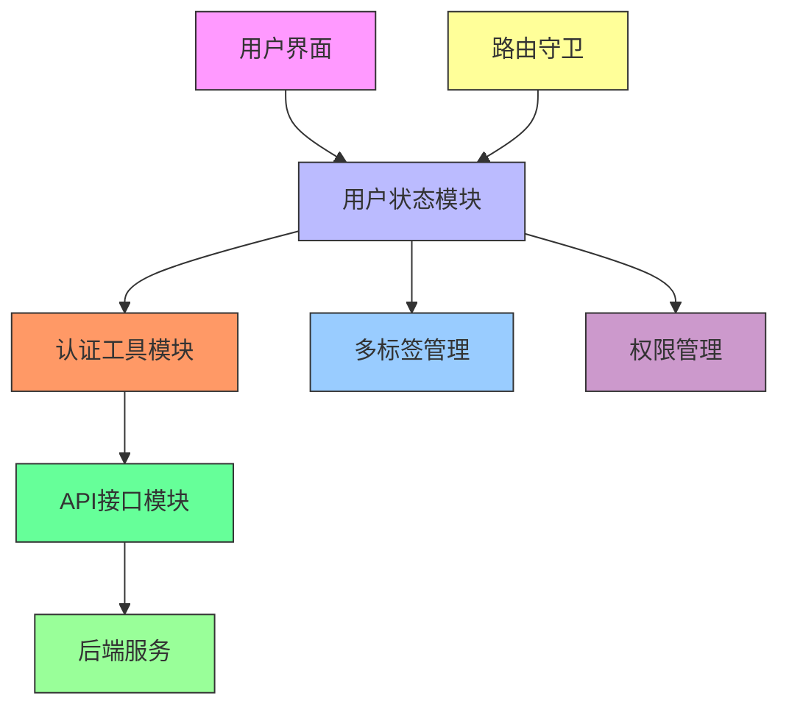
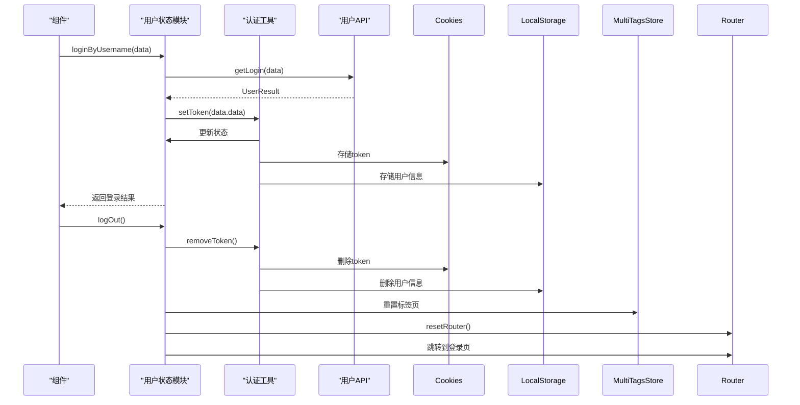
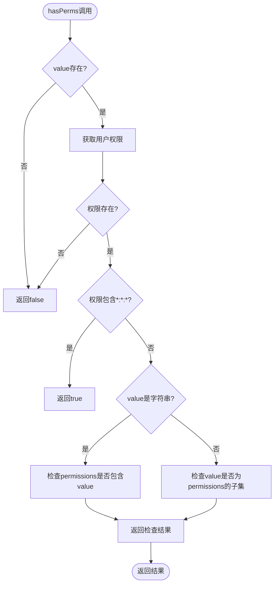
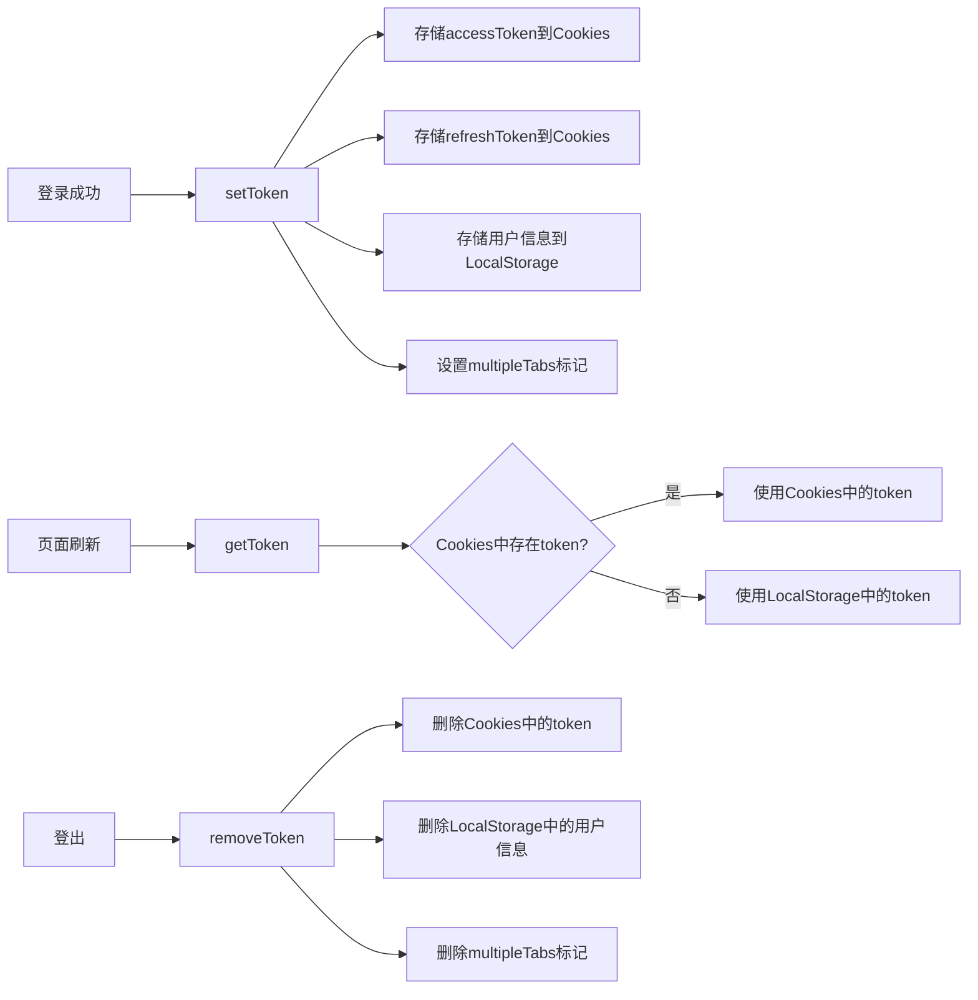
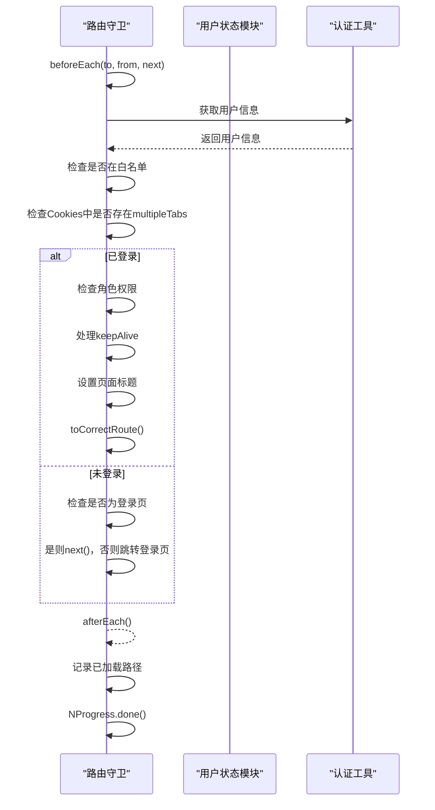
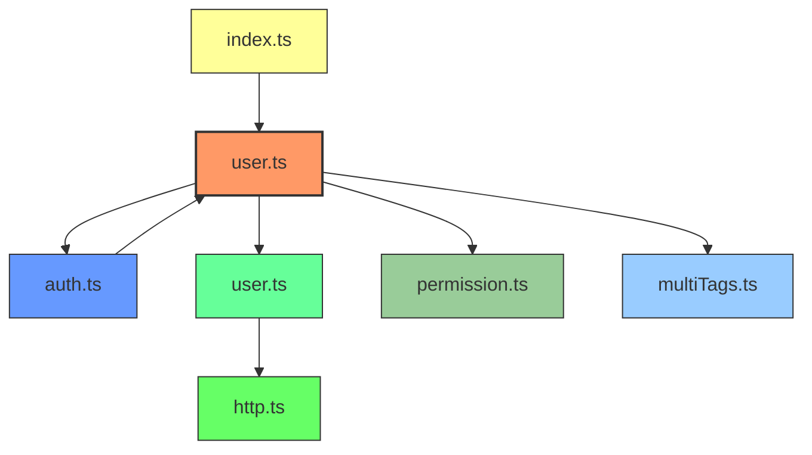

<cite>
**本文档中引用的文件**
- [user.ts](file://web/src/store/modules/user.ts)
- [auth.ts](file://web/src/utils/auth.ts)
- [user.ts](file://web/src/api/user.ts)
- [index.ts](file://web/src/router/index.ts)
- [index.ts](file://web/src/store/index.ts)
</cite>

## 目录
1. [用户模块](#用户模块)
2. [项目结构](#项目结构)
3. [核心组件](#核心组件)
4. [架构概述](#架构概述)
5. [详细组件分析](#详细组件分析)
6. [依赖分析](#依赖分析)
7. [性能考虑](#性能考虑)
8. [故障排除指南](#故障排除指南)
9. [结论](#结论)

## 用户模块

本文档详细解析vue-pure-admin-all项目中的用户状态管理模块，深入探讨user.ts中定义的状态属性、actions实现逻辑、getters权限判断机制，以及该模块与认证授权系统、路由守卫的集成方式。

## 项目结构

用户状态管理模块主要分布在项目的store、utils和api三个核心目录中，形成了一个完整的用户认证与权限管理体系。

```mermaid
graph TB
subgraph "状态管理"
userStore[user.ts<br>用户状态模块]
permissionStore[permission.ts<br>权限模块]
multiTagsStore[multiTags.ts<br>多标签模块]
end
subgraph "工具与辅助"
authUtils[auth.ts<br>认证工具]
httpUtils[http.ts<br>HTTP工具]
end
subgraph "API接口"
userApi[user.ts<br>用户API]
end
subgraph "路由系统"
router[index.ts<br>路由管理]
end
userStore --> authUtils : "使用"
userStore --> userApi : "调用"
userStore --> permissionStore : "交互"
userStore --> multiTagsStore : "交互"
router --> userStore : "依赖"
authUtils --> userStore : "更新状态"
```

**Diagram sources**
- [user.ts](file://web/src/store/modules/user.ts)
- [auth.ts](file://web/src/utils/auth.ts)
- [user.ts](file://web/src/api/user.ts)
- [index.ts](file://web/src/router/index.ts)

**Section sources**
- [user.ts](file://web/src/store/modules/user.ts)
- [auth.ts](file://web/src/utils/auth.ts)
- [user.ts](file://web/src/api/user.ts)
- [index.ts](file://web/src/router/index.ts)
- [index.ts](file://web/src/store/index.ts)

## 核心组件

用户状态管理模块的核心是基于Pinia的状态管理，通过useUserStore定义了用户相关的所有状态属性和操作方法。该模块与认证工具、API接口和路由系统紧密集成，实现了完整的用户会话管理功能。

**Section sources**
- [user.ts](file://web/src/store/modules/user.ts)
- [auth.ts](file://web/src/utils/auth.ts)

## 架构概述

用户状态管理模块采用分层架构设计，各组件职责分明，协同工作。



**Diagram sources**
- [user.ts](file://web/src/store/modules/user.ts)
- [auth.ts](file://web/src/utils/auth.ts)
- [user.ts](file://web/src/api/user.ts)
- [index.ts](file://web/src/router/index.ts)

## 详细组件分析

### 用户状态模块分析

用户状态模块是整个用户管理系统的中枢，负责维护用户会话状态、处理认证逻辑和权限管理。

#### 状态属性定义

```mermaid
classDiagram
class UserState {
+string avatar
+string username
+string nickname
+string[] roles
+string[] permissions
+string verifyCode
+number currentPage
+boolean isRemembered
+number loginDay
}
note right of UserState
用户状态模块中定义的核心状态属性
- avatar : 用户头像URL
- username : 用户名
- nickname : 用户昵称
- roles : 用户角色数组
- permissions : 按钮级别权限数组
- verifyCode : 前端生成的验证码
- currentPage : 登录页面当前显示的组件
- isRemembered : 是否勾选免登录
- loginDay : 免登录存储天数
end note
```

**Diagram sources**
- [user.ts](file://web/src/store/modules/user.ts#L15-L35)

#### Actions实现逻辑



**Diagram sources**
- [user.ts](file://web/src/store/modules/user.ts#L82-L121)
- [auth.ts](file://web/src/utils/auth.ts#L50-L128)
- [user.ts](file://web/src/api/user.ts#L75-L78)

#### 权限判断机制



**Diagram sources**
- [auth.ts](file://web/src/utils/auth.ts#L130-L140)

### 认证授权系统集成

用户状态管理模块与认证授权系统深度集成，实现了安全的用户会话管理。

#### Token管理机制



**Diagram sources**
- [auth.ts](file://web/src/utils/auth.ts#L50-L128)

#### 路由守卫集成



**Diagram sources**
- [index.ts](file://web/src/router/index.ts#L100-L220)

## 依赖分析

用户状态管理模块与其他组件存在明确的依赖关系，确保了系统的稳定性和可维护性。



**Diagram sources**
- [user.ts](file://web/src/store/modules/user.ts)
- [auth.ts](file://web/src/utils/auth.ts)
- [user.ts](file://web/src/api/user.ts)
- [index.ts](file://web/src/router/index.ts)
- [index.ts](file://web/src/store/index.ts)

**Section sources**
- [user.ts](file://web/src/store/modules/user.ts)
- [auth.ts](file://web/src/utils/auth.ts)
- [user.ts](file://web/src/api/user.ts)
- [index.ts](file://web/src/router/index.ts)

## 性能考虑

用户状态管理模块在设计时充分考虑了性能优化，通过多种机制确保了系统的高效运行。

- **状态持久化**：通过Cookies和LocalStorage实现用户状态的持久化存储，避免重复登录
- **无感刷新**：采用accessToken和refreshToken双token机制，实现用户无感知的token刷新
- **路由懒加载**：结合Vue Router的懒加载机制，优化页面加载性能
- **内存管理**：在登出时及时清理状态和缓存，防止内存泄漏
- **请求优化**：通过NProgress提供加载反馈，提升用户体验

## 故障排除指南

### 常见问题及解决方案

**Section sources**
- [user.ts](file://web/src/store/modules/user.ts)
- [auth.ts](file://web/src/utils/auth.ts)
- [index.ts](file://web/src/router/index.ts)

#### 状态持久化问题

当用户刷新页面后状态丢失时，检查：
1. Cookies和LocalStorage中是否正确存储了token和用户信息
2. 浏览器是否禁用了本地存储
3. 域名和路径设置是否正确

#### 并发请求处理

在多标签页场景下，可能出现并发请求问题：
- 使用multipleTabsKey标记确保多标签页间的会话一致性
- 在token刷新时使用锁机制防止并发刷新请求
- 对关键操作添加防重机制

#### 错误恢复策略

当API请求失败时的恢复策略：
- 登录失败：显示错误信息，保留输入状态
- token刷新失败：清除所有认证信息，跳转到登录页
- 网络错误：提供重试机制，显示友好的错误提示

## 结论

用户状态管理模块通过Pinia状态管理、Token认证机制和路由守卫的有机结合，构建了一个安全、高效、易用的用户管理系统。该模块具有以下特点：

1. **结构清晰**：分层架构设计，职责分明
2. **安全性高**：双token机制，防止会话劫持
3. **用户体验好**：免登录、多标签页支持
4. **可扩展性强**：模块化设计，易于功能扩展
5. **维护性好**：完善的错误处理和日志记录

该模块为vue-pure-admin-all项目提供了可靠的用户管理基础，是整个系统安全性和可用性的关键保障。