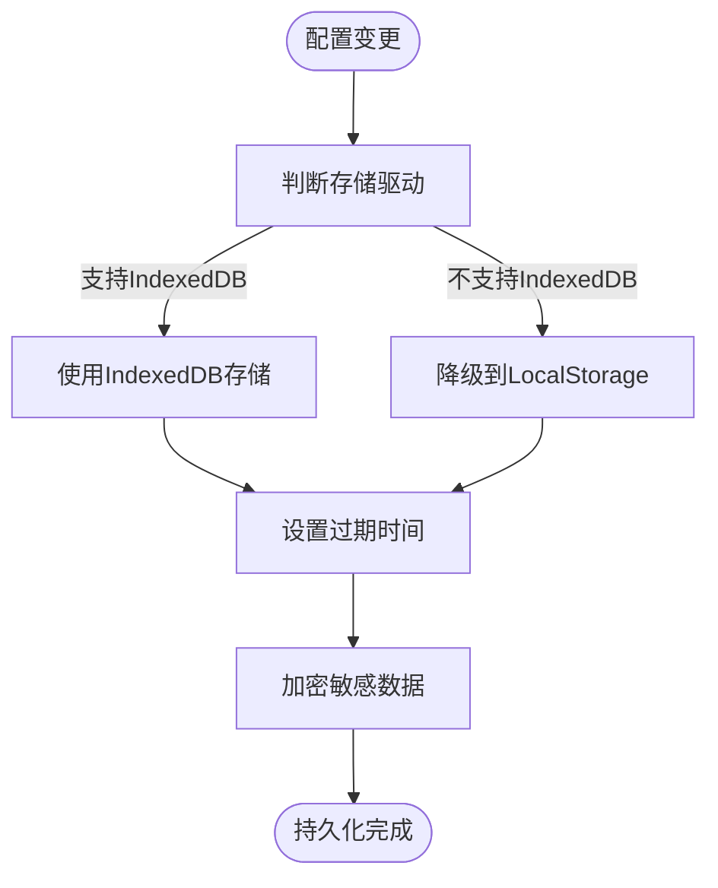

# 设置模块

<cite>
**本文档引用文件**  
- [settings.ts](file://web/src/store/modules/settings.ts)
- [useDataThemeChange.ts](file://web/src/layout/hooks/useDataThemeChange.ts)
- [lay-setting/index.vue](file://web/src/layout/components/lay-setting/index.vue)
- [index.ts](file://web/src/utils/localforage/index.ts)
- [index.ts](file://web/src/config/index.ts)
</cite>

## 目录
1. [简介](#简介)
2. [项目结构](#项目结构)
3. [核心组件](#核心组件)
4. [架构概述](#架构概述)
5. [详细组件分析](#详细组件分析)
6. [依赖分析](#依赖分析)
7. [性能考虑](#性能考虑)
8. [故障排除指南](#故障排除指南)
9. [结论](#结论)

## 简介
本模块是 vue-pure-admin-all 项目中负责全局应用配置管理的核心模块。它通过 Pinia 状态管理库实现对布局模式、主题风格、标签页设置等全局状态的集中管理。模块支持配置项的持久化存储和响应式更新，确保用户设置在页面刷新后依然生效。通过与布局模块、主题模块的深度集成，实现了灵活的界面定制能力。该模块还提供了完整的配置订阅机制，使各组件能够实时响应设置变化并动态更新 UI。

## 项目结构
设置模块的文件分布在多个目录中，形成了清晰的分层架构。核心状态管理位于 store 模块，界面交互位于 layout 组件，持久化逻辑位于 utils 工具库。

**图示来源**  
- [settings.ts](file://web/src/store/modules/settings.ts)
- [useDataThemeChange.ts](file://web/src/layout/hooks/useDataThemeChange.ts)
- [lay-setting/index.vue](file://web/src/layout/components/lay-setting/index.vue)
- [index.ts](file://web/src/utils/localforage/index.ts)
- [index.ts](file://web/src/config/index.ts)

**本节来源**  
- [web/src/store/modules/settings.ts](file://web/src/store/modules/settings.ts)
- [web/src/layout/components/lay-setting/index.vue](file://web/src/layout/components/lay-setting/index.vue)
- [web/src/utils/localforage/index.ts](file://web/src/utils/localforage/index.ts)

## 核心组件
设置模块的核心功能由 `settings.ts` 中的 Pinia store 实现，它定义了应用标题、固定头部、隐藏侧边栏等基本配置项。这些配置项通过 `getConfig()` 函数从平台配置文件初始化，并提供响应式更新机制。`useDataThemeChange` 钩子封装了主题切换的复杂逻辑，包括深色模式、主题色选择和布局模式切换。`lay-setting` 组件作为用户界面，提供了直观的配置选项和实时预览功能。

**本节来源**  
- [settings.ts](file://web/src/store/modules/settings.ts#L1-L34)
- [useDataThemeChange.ts](file://web/src/layout/hooks/useDataThemeChange.ts#L1-L138)
- [lay-setting/index.vue](file://web/src/layout/components/lay-setting/index.vue#L1-L637)

## 架构概述
设置模块采用分层架构设计，将状态管理、业务逻辑和用户界面分离。状态层使用 Pinia 管理全局配置，确保单一数据源。逻辑层通过自定义 Hook 封装复杂的主题切换和持久化逻辑。表现层提供直观的配置界面，通过事件总线与其它模块通信。持久化层基于 localforage 实现，支持 IndexedDB 和 localStorage 的降级策略。

**图示来源**  
- [settings.ts](file://web/src/store/modules/settings.ts)
- [useDataThemeChange.ts](file://web/src/layout/hooks/useDataThemeChange.ts)
- [lay-setting/index.vue](file://web/src/layout/components/lay-setting/index.vue)
- [index.ts](file://web/src/utils/localforage/index.ts)

## 详细组件分析

### 状态管理分析
设置模块的状态管理采用 Pinia store 实现，确保了配置项的响应式和可追踪性。

**图示来源**  
- [settings.ts](file://web/src/store/modules/settings.ts#L1-L34)
- [epTheme.ts](file://web/src/store/modules/epTheme.ts#L1-L48)

### 主题切换流程
主题切换涉及多个组件的协同工作，确保界面风格的一致性。

**图示来源**  
- [lay-setting/index.vue](file://web/src/layout/components/lay-setting/index.vue#L1-L637)
- [useDataThemeChange.ts](file://web/src/layout/hooks/useDataThemeChange.ts#L1-L138)
- [settings.ts](file://web/src/store/modules/settings.ts#L1-L34)

### 配置持久化机制
模块采用分层持久化策略，确保配置数据的安全存储和高效读取。

**图示来源**  
- [index.ts](file://web/src/utils/localforage/index.ts#L1-L109)
- [useDataThemeChange.ts](file://web/src/layout/hooks/useDataThemeChange.ts#L1-L138)

**本节来源**  
- [settings.ts](file://web/src/store/modules/settings.ts#L1-L34)
- [useDataThemeChange.ts](file://web/src/layout/hooks/useDataThemeChange.ts#L1-L138)
- [lay-setting/index.vue](file://web/src/layout/components/lay-setting/index.vue#L1-L637)
- [index.ts](file://web/src/utils/localforage/index.ts#L1-L109)

## 依赖分析
设置模块与多个核心模块存在紧密依赖关系，形成了完整的配置管理体系。

**图示来源**  
- [package.json](file://package.json)
- [settings.ts](file://web/src/store/modules/settings.ts)
- [index.ts](file://web/src/utils/localforage/index.ts)

**本节来源**  
- [package.json](file://package.json)
- [settings.ts](file://web/src/store/modules/settings.ts#L1-L34)
- [index.ts](file://web/src/utils/localforage/index.ts#L1-L109)

## 性能考虑
设置模块在设计时充分考虑了性能优化，采用多种策略确保高效运行。通过响应式更新机制，避免了不必要的重新渲染。持久化操作使用异步处理，防止阻塞主线程。主题切换采用 CSS 变量，实现即时生效。配置数据采用分块存储，减少单次读写压力。

## 故障排除指南
当设置模块出现异常时，可按以下步骤排查：
1. 检查浏览器存储权限是否被禁用
2. 验证 platform-config.json 配置文件是否存在且格式正确
3. 确认 localforage 是否正确初始化
4. 检查 Pinia store 是否正常注册
5. 验证事件总线通信是否畅通

**本节来源**  
- [index.ts](file://web/src/config/index.ts#L1-L55)
- [index.ts](file://web/src/utils/localforage/index.ts#L1-L109)
- [settings.ts](file://web/src/store/modules/settings.ts#L1-L34)

## 结论
设置模块通过精心设计的架构，实现了灵活、可靠的全局配置管理。它不仅提供了丰富的界面定制选项，还确保了配置的持久化和响应式更新。模块的分层设计使其易于维护和扩展，为应用的个性化需求提供了坚实基础。通过与其他模块的紧密集成，实现了统一的用户体验。