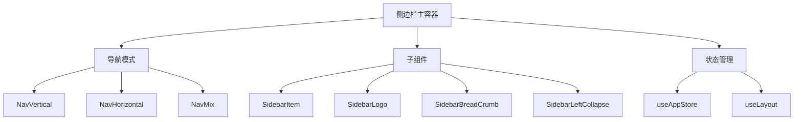
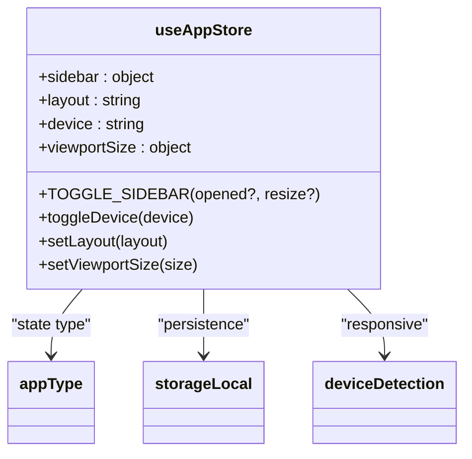
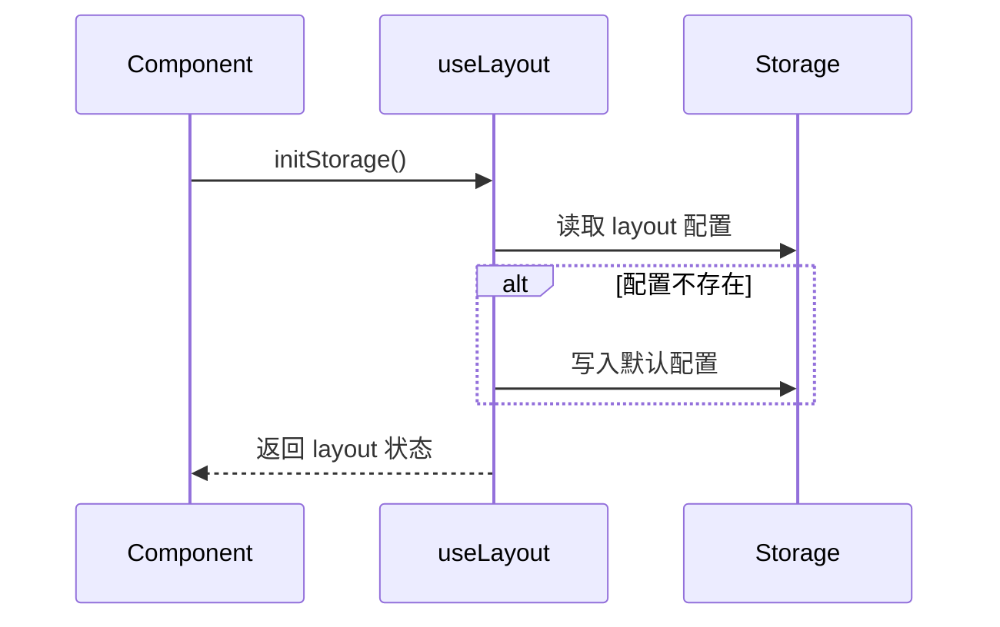

# 侧边栏

<cite>
**本文档中引用的文件**  
- [app.ts](file://web\src\store\modules\app.ts)
- [useLayout.ts](file://web\src\layout\hooks\useLayout.ts)
- [sidebar.scss](file://web\src\style\sidebar.scss)
- [NavVertical.vue](file://web\src\layout\components\lay-sidebar\NavVertical.vue)
- [NavHorizontal.vue](file://web\src\layout\components\lay-sidebar\NavHorizontal.vue)
- [SidebarItem.vue](file://web\src\layout\components\lay-sidebar\components\SidebarItem.vue)
- [SidebarLogo.vue](file://web\src\layout\components\lay-sidebar\components\SidebarLogo.vue)
</cite>

## 目录
1. [简介](#简介)
2. [核心组件结构](#核心组件结构)
3. [导航模式实现机制](#导航模式实现机制)
4. [子组件功能与交互逻辑](#子组件功能与交互逻辑)
5. [折叠/展开动画与响应式布局](#折叠展开动画与响应式布局)
6. [动态路由渲染](#动态路由渲染)
7. [状态管理集成](#状态管理集成)
8. [移动端与桌面端行为差异](#移动端与桌面端行为差异)
9. [自定义样式与扩展指南](#自定义样式与扩展指南)

## 简介
`vue-pure-admin-all` 的侧边栏组件提供灵活的导航布局能力，支持垂直（NavVertical）、水平（NavHorizontal）和混合（NavMix）三种导航模式。该组件通过 Pinia 状态管理实现布局状态持久化，并结合 SCSS 变量系统支持深度样式定制。本文档详细解析其架构设计、交互逻辑与扩展机制。

## 核心组件结构

侧边栏组件体系由多个核心模块构成，形成清晰的层级结构：



**组件来源**  
- [NavVertical.vue](file://web\src\layout\components\lay-sidebar\NavVertical.vue)
- [NavHorizontal.vue](file://web\src\layout\components\lay-sidebar\NavHorizontal.vue)
- [SidebarItem.vue](file://web\src\layout\components\lay-sidebar\components\SidebarItem.vue)
- [SidebarLogo.vue](file://web\src\layout\components\lay-sidebar\components\SidebarLogo.vue)

## 导航模式实现机制

系统支持三种导航布局模式，通过 `body` 元素的 `layout` 属性动态切换：

| 模式 | 描述 | 触发条件 |
|------|------|----------|
| vertical | 垂直侧边栏 | 默认模式，桌面端主布局 |
| horizontal | 水平顶部导航 | 适用于宽屏场景 |
| mix | 混合模式 | 左侧垂直菜单 + 顶部主菜单 |

每种模式通过 SCSS 的 `@mixin merge-style($sideBarWidth)` 统一定义样式规则，并根据 `$sideBarWidth` 参数差异化渲染。例如，`vertical` 模式下侧边栏宽度为 210px，折叠后为 54px。

**Section sources**  
- [sidebar.scss](file://web\src\style\sidebar.scss#L1-L733)

## 子组件功能与交互逻辑

### SidebarItem
负责渲染单个菜单项，支持多级嵌套。通过递归调用实现无限层级的子菜单展示，结合 `el-sub-menu` 和 `el-menu-item` 组件完成交互逻辑。

### SidebarLogo
显示系统 Logo 区域，包含应用名称与图标。在折叠状态下仅显示图标，展开时显示完整 Logo。背景色由 `--pure-theme-sidebar-logo` 变量控制。

### SidebarBreadCrumb
提供当前页面路径导航，增强用户体验。与路由系统深度集成，自动解析当前路由层级。

### 折叠控制组件
- `SidebarLeftCollapse`：控制左侧侧边栏展开/折叠
- `SidebarTopCollapse`：控制顶部导航区域
- `SidebarCenterCollapse`：混合模式下的中心区域控制

**Section sources**  
- [SidebarItem.vue](file://web\src\layout\components\lay-sidebar\components\SidebarItem.vue)
- [SidebarLogo.vue](file://web\src\layout\components\lay-sidebar\components\SidebarLogo.vue)

## 折叠/展开动画与响应式布局

侧边栏的展开与折叠通过 CSS 过渡动画实现，核心属性如下：

```css
.main-container {
  transition: margin-left var(--pure-transition-duration);
}

.sidebar-container {
  transition: width var(--pure-transition-duration);
}
```

动画时长由 `--pure-transition-duration` 变量控制，默认值为 0.3s。

响应式布局通过媒体查询实现：
- 移动端（< 420px）：侧边栏默认隐藏，通过遮罩层触发
- 桌面端（≥ 420px）：支持自由切换三种布局模式

在移动端，折叠状态使用 `transform: translate3d(-$sideBarWidth, 0, 0)` 实现滑动隐藏，并添加 `pointer-events: none` 防止误触。

**Section sources**  
- [sidebar.scss](file://web\src\style\sidebar.scss#L100-L200)

## 动态路由渲染

侧边栏通过 Vue Router 的路由配置动态生成菜单结构。菜单项数据来源于 `router/modules` 目录下的路由定义文件，结合 `meta` 字段控制显示逻辑：

- `meta.title`：菜单标题
- `meta.icon`：菜单图标
- `meta.hidden`：是否隐藏
- `meta.sort`：排序权重

`SidebarItem` 组件递归遍历路由树，生成对应的菜单层级结构，支持无限嵌套。

**Section sources**  
- [NavVertical.vue](file://web\src\layout\components\lay-sidebar\NavVertical.vue)
- [router/modules](file://web\src\router\modules)

## 状态管理集成

侧边栏状态由 Pinia 状态管理器统一维护，核心逻辑位于 `useAppStore` 模块：



**Diagram sources**  
- [app.ts](file://web\src\store\modules\app.ts#L1-L90)

### useLayout 钩子
`useLayout` 钩子封装了布局初始化逻辑，负责从本地存储读取用户偏好设置：



**Diagram sources**  
- [useLayout.ts](file://web\src\layout\hooks\useLayout.ts#L1-L65)

## 移动端与桌面端行为差异

| 行为 | 桌面端 | 移动端 |
|------|--------|--------|
| 初始状态 | 根据配置决定 | 默认折叠 |
| 折叠方式 | 点击图标切换 | 手势滑动或遮罩层点击 |
| 显示层级 | z-index: 1001 | z-index: 2001 |
| 宽度控制 | margin-left | transform |

遮罩层（app-mask）在移动端出现时会覆盖主内容区，点击遮罩可关闭侧边栏，提升触控体验。

**Section sources**  
- [sidebar.scss](file://web\src\style\sidebar.scss#L600-L700)

## 自定义样式与扩展指南

### SCSS 变量覆盖
通过修改以下变量可快速定制主题：

```scss
// 主题颜色
$--pure-theme-menu-bg: #fff;
$--pure-theme-sub-menu-bg: #f5f5f5;
$--pure-theme-menu-text: #303133;

// 过渡动画
--pure-transition-duration: 0.3s;
```

建议在项目级样式文件中重新定义这些变量以实现主题切换。

### 菜单结构扩展
可通过以下方式扩展菜单功能：
1. 在 `router/modules` 中添加新路由模块
2. 为路由添加 `meta` 字段控制显示逻辑
3. 自定义 `SidebarItem` 插槽实现特殊交互
4. 扩展 `useAppStore` 添加新的状态字段

**Section sources**  
- [sidebar.scss](file://web\src\style\sidebar.scss#L1-L733)
- [app.ts](file://web\src\store\modules\app.ts#L1-L90)