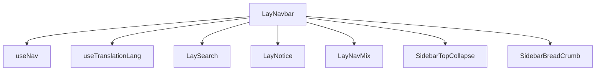
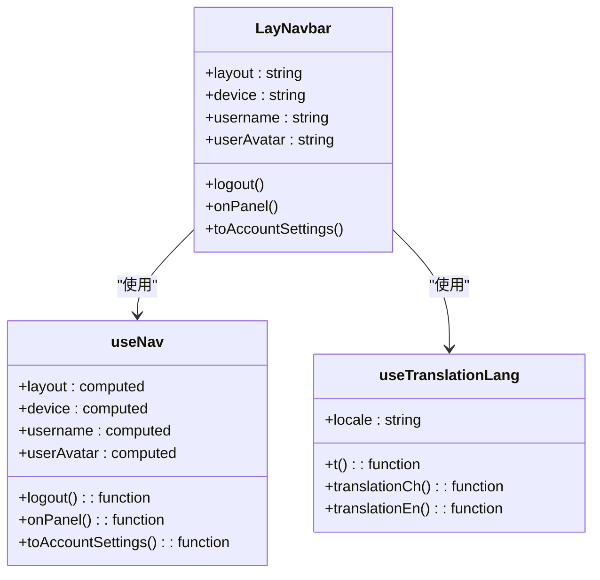
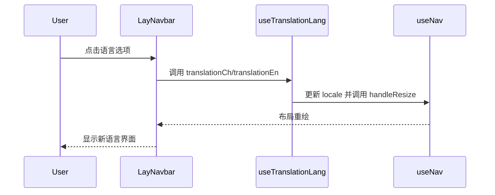
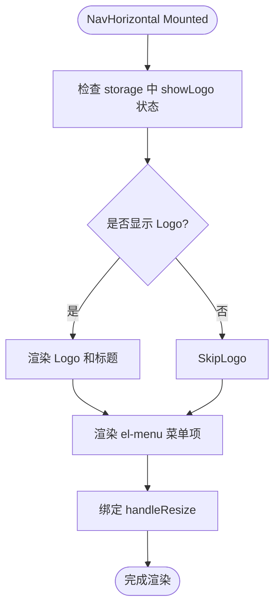
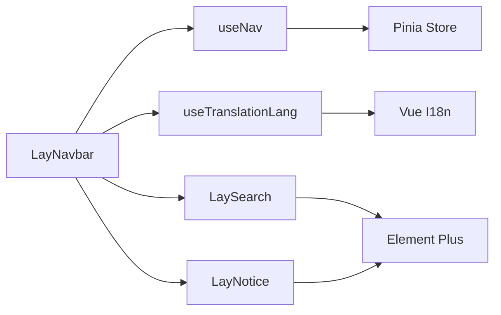

# 导航栏

<cite>
**本文档中引用的文件**  
- [index.vue](file://web/src/layout/components/lay-navbar/index.vue)
- [NavHorizontal.vue](file://web/src/layout/components/lay-sidebar/NavHorizontal.vue)
- [useNav.ts](file://web/src/layout/hooks/useNav.ts)
- [useTranslationLang.ts](file://web/src/layout/hooks/useTranslationLang.ts)
- [SidebarTopCollapse.vue](file://web/src/layout/components/lay-sidebar/components/SidebarTopCollapse.vue)
- [SidebarBreadCrumb.vue](file://web/src/layout/components/lay-sidebar/components/SidebarBreadCrumb.vue)
</cite>

## 目录
1. [简介](#简介)
2. [项目结构](#项目结构)
3. [核心组件](#核心组件)
4. [架构概述](#架构概述)
5. [详细组件分析](#详细组件分析)
6. [依赖分析](#依赖分析)
7. [性能考虑](#性能考虑)
8. [故障排除指南](#故障排除指南)
9. [结论](#结论)

## 简介
`LayNavbar` 组件是 `vue-pure-admin-all` 项目中用于实现顶部导航栏的核心组件，支持多种布局模式（vertical/mix），并集成国际化、主题切换、用户信息展示等功能。该组件在不同设备上具备响应式行为，并与顶部水平菜单（NavHorizontal）协同工作，支持固定头部样式处理。通过插槽机制，开发者可自定义导航栏内容并覆盖默认样式。

## 项目结构
`LayNavbar` 组件位于 `web/src/layout/components/lay-navbar/` 目录下，其主要功能依赖于布局相关的 hooks 和其他子组件。整体结构围绕 `layout` 模块组织，通过 `useNav` 和 `useTranslationLang` 等组合式 API 实现状态管理与逻辑复用。

**Diagram sources**
- [index.vue](file://web/src/layout/components/lay-navbar/index.vue#L1-L200)
- [useNav.ts](file://web/src/layout/hooks/useNav.ts#L1-L180)
- [useTranslationLang.ts](file://web/src/layout/hooks/useTranslationLang.ts#L1-L40)

**Section sources**
- [index.vue](file://web/src/layout/components/lay-navbar/index.vue#L1-L200)

## 核心组件
`LayNavbar` 组件通过条件渲染控制在不同布局模式下的显示内容。在 vertical 布局中，显示面包屑、搜索框、国际化选择器、全屏按钮、通知图标、用户信息及系统设置入口；在 mix 布局中，则嵌入 `LayNavMix` 组件以实现混合导航结构。移动端通过 `SidebarTopCollapse` 实现侧边栏折叠控制。

**Section sources**
- [index.vue](file://web/src/layout/components/lay-navbar/index.vue#L1-L200)
- [useNav.ts](file://web/src/layout/hooks/useNav.ts#L22-L179)

## 架构概述
`LayNavbar` 采用组合式 API 设计，依赖 `useNav` 提供布局状态、用户信息、设备类型等响应式数据，并通过 `useTranslationLang` 实现多语言切换功能。组件通过 `emitter` 事件总线与其他模块通信，如打开系统设置面板或切换路由。

**Diagram sources**
- [index.vue](file://web/src/layout/components/lay-navbar/index.vue#L1-L200)
- [useNav.ts](file://web/src/layout/hooks/useNav.ts#L22-L179)
- [useTranslationLang.ts](file://web/src/layout/hooks/useTranslationLang.ts#L5-L40)

## 详细组件分析

### LayNavbar 结构与渲染逻辑
`LayNavbar` 根据当前布局模式和设备类型动态渲染不同子组件：
- 在 mobile 设备上，显示 `SidebarTopCollapse` 用于控制侧边栏展开/收起。
- 当布局为 vertical 且非 mobile 时，显示 `SidebarBreadCrumb` 面包屑导航。
- 当布局为 mix 时，嵌入 `LayNavMix` 组件实现混合导航。

右侧区域包含搜索、国际化、全屏、通知、用户下拉菜单和系统设置图标，统一采用 `el-dropdown` 和 `navbar-bg-hover` 类实现交互反馈。

#### 国际化集成
通过 `useTranslationLang` 钩子实现语言切换，点击“简体中文”或“English”时分别调用 `translationCh` 和 `translationEn` 方法，更新 `$storage.locale` 并触发 `handleResize` 以适配布局变化。

**Diagram sources**
- [index.vue](file://web/src/layout/components/lay-navbar/index.vue#L1-L200)
- [useTranslationLang.ts](file://web/src/layout/hooks/useTranslationLang.ts#L5-L40)
- [useNav.ts](file://web/src/layout/hooks/useNav.ts#L22-L179)

#### 用户信息与退出登录
用户头像和用户名来自 `useUserStoreHook()`，若未设置昵称则显示用户名。点击用户下拉菜单可跳转至“账号设置”页面或执行退出登录操作，调用 `useUserStoreHook().logOut()` 清除用户状态。

**Section sources**
- [index.vue](file://web/src/layout/components/lay-navbar/index.vue#L1-L200)
- [useNav.ts](file://web/src/layout/hooks/useNav.ts#L22-L179)

### 与顶部水平菜单的协作关系
在 horizontal 布局中，`NavHorizontal.vue` 负责渲染顶部水平菜单栏，包含 logo、主菜单、搜索、国际化、用户信息等。`LayNavbar` 与 `NavHorizontal` 共享相同的右侧功能模块（搜索、国际化、全屏、通知、用户菜单），确保 UI 一致性。

`NavHorizontal` 使用 `usePermissionStoreHook().wholeMenus` 动态生成菜单项，并通过 `emitter.on("logoChange")` 响应 logo 显示状态变化。

**Diagram sources**
- [NavHorizontal.vue](file://web/src/layout/components/lay-sidebar/NavHorizontal.vue#L1-L185)
- [useNav.ts](file://web/src/layout/hooks/useNav.ts#L22-L179)

### 固定头部样式处理
`LayNavbar` 所在容器具有固定高度 `48px`，并通过 `shadow-xs shadow-[rgba(0,21,41,0.08)]` 添加阴影效果。右侧功能区使用 `flex` 布局对齐，确保在不同分辨率下保持水平排列。`vertical-header-right` 设置最小宽度 `280px`，防止内容挤压。

**Section sources**
- [index.vue](file://web/src/layout/components/lay-navbar/index.vue#L1-L200)

### 响应式行为与设备适配
通过 `device` 计算属性判断当前设备类型（mobile/desktop），在 mobile 下仅显示折叠按钮，隐藏面包屑和部分功能图标。利用 `useResponsive` 和本地存储配置实现断点适配，确保移动端操作便捷性。

**Section sources**
- [index.vue](file://web/src/layout/components/lay-navbar/index.vue#L1-L200)
- [useNav.ts](file://web/src/layout/hooks/useNav.ts#L22-L179)

### 插槽使用与样式覆盖
`LayNavbar` 本身未直接暴露插槽，但其子组件如 `LaySearch`、`LayNotice` 支持扩展。开发者可通过覆盖 SCSS 变量或添加自定义类名实现样式定制。例如，修改 `.navbar-bg-hover` 的背景色或调整 `avatarsStyle` 的边距。

建议通过 `scoped` 样式或 BEM 命名规范进行局部覆盖，避免影响全局 UI。

**Section sources**
- [index.vue](file://web/src/layout/components/lay-navbar/index.vue#L1-L200)
- [SidebarTopCollapse.vue](file://web/src/layout/components/lay-sidebar/components/SidebarTopCollapse.vue#L1-L39)
- [SidebarBreadCrumb.vue](file://web/src/layout/components/lay-sidebar/components/SidebarBreadCrumb.vue#L1-L122)

## 依赖分析
`LayNavbar` 依赖多个核心模块：
- `useNav`：提供布局、用户、设备等状态
- `useTranslationLang`：实现多语言切换
- `LaySearch` / `LayNotice`：功能组件复用
- `Pinia` store：管理用户、权限、主题状态
- `Element Plus`：UI 组件库支持

**Diagram sources**
- [index.vue](file://web/src/layout/components/lay-navbar/index.vue#L1-L200)
- [useNav.ts](file://web/src/layout/hooks/useNav.ts#L1-L180)
- [useTranslationLang.ts](file://web/src/layout/hooks/useTranslationLang.ts#L1-L40)

## 性能考虑
- 使用 `computed` 缓存 `layout`、`device`、`username` 等响应式数据，减少重复计算。
- `nextTick` 和 `onMounted` 中延迟执行 `handleResize`，避免初始渲染性能损耗。
- `v-loading` 在 `NavHorizontal` 中用于等待菜单数据加载，提升用户体验。

**Section sources**
- [index.vue](file://web/src/layout/components/lay-navbar/index.vue#L1-L200)
- [NavHorizontal.vue](file://web/src/layout/components/lay-sidebar/NavHorizontal.vue#L1-L185)

## 故障排除指南
- **问题：语言切换后界面未更新**
  - 检查 `$storage.locale` 是否正确写入
  - 确保 `changeTitle` 被正确调用
- **问题：移动端折叠按钮不显示**
  - 确认 `device` 计算属性返回 `mobile`
  - 检查 `pureApp.sidebar.opened` 状态
- **问题：用户头像未加载**
  - 检查 `useUserStoreHook().avatar` 是否存在
  - 默认头像路径为 `@/assets/user.jpg`

**Section sources**
- [index.vue](file://web/src/layout/components/lay-navbar/index.vue#L1-L200)
- [useNav.ts](file://web/src/layout/hooks/useNav.ts#L22-L179)

## 结论
`LayNavbar` 是一个高度可配置、响应式的导航栏组件，适用于多种布局模式。其通过组合式 API 实现逻辑解耦，支持国际化、用户管理、主题切换等企业级功能。结合 `NavHorizontal` 可构建统一的顶部导航体验，适合中后台管理系统使用。